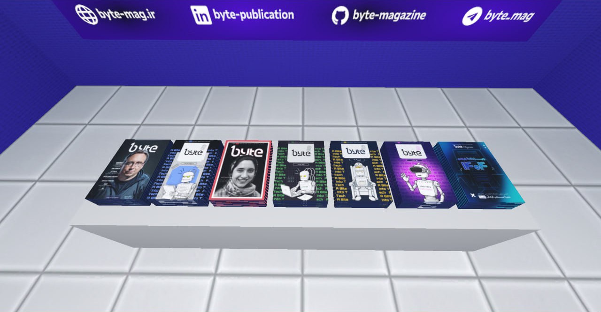
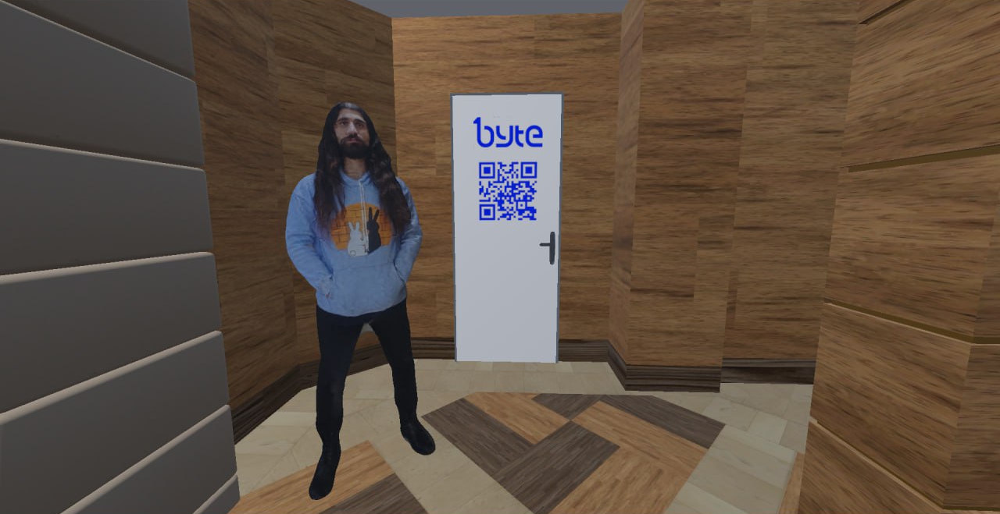
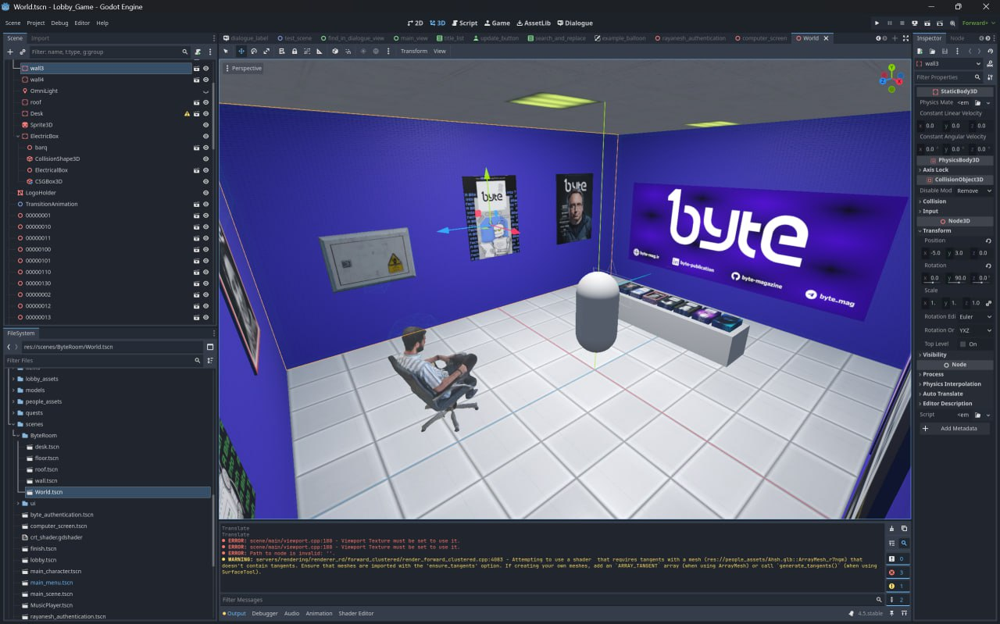
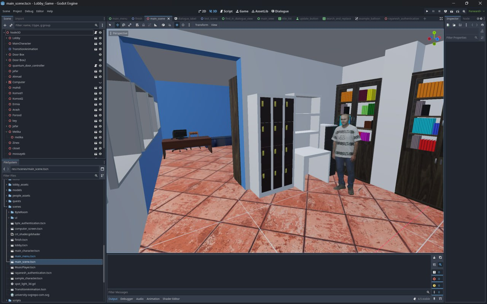

import Tooltip from "@site/src/components/Tooltip";

در برگزاری باگزبازی، به‌عنوان اولین رویداد بازی‌سازی (گیم‌جم) دانشکدهٔ کامپیوتر شریف، توانستیم اندکی مخاطبین خود را با فضای جذاب این حوزه آشنا کنیم. یکی از خروجی‌های این رویداد که با تلاش تیم علمی آماده شد، «بازی دانشکده» بود. ایدهٔ داشتن چنین بازی‌ای، که در آن کل دانشکده را به‌صورت یک مدل سه‌بعدی داشته باشیم، ابتدا در یک جلسهٔ بارش فکری مطرح شد. قرار بود چیزی مشابه لابی یک بازی باشد که در آن، شرکت‌کنندگان می‌توانستند بین بازی‌های گیم‌جم جابجا شوند. چندین گزینه مطرح بود؛ محیط یک غار، یک هتل و در بین آن‌ها، لابی خود دانشکدهٔ کامپیوتر هم یکی از این موارد بود.

با توجه به پیدا کردن یک اپ به نام PolyCam، فکر کردیم ایدهٔ خوبی است که کل لابی را اسکن کنیم. پس از جدی‌تر شدن قضیه، این کار را به محمدمهدی حسینی، یکی از اعضای تیم علمی سپردیم که لابی را بازسازی کند. اما نمی‌دانستیم که او یک بلندرکار قهار است و درخواست ما را چندین لول ارتقاء می‌دهد. او کل لابی دانشکده را در <Tooltip tip="Blender">بلندر</Tooltip> -ابزاری حرفه‌ای برای طراحی سه‌بعدی- طراحی کرد.

    

پس از دیدن یک نمونهٔ اولیه، متوجه شدیم که این ایده چقدر پتانسیل بالایی دارد و تصمیم گرفتیم آن را در قالب یک بازی داستانی ارائه کنیم. پیش‌تر که رفتیم، این پروژه به‌نوعی به یک مینی‌فاز در رویداد تبدیل شد. داستان بازی نیز حاصل دو روز بارش فکری دو نفر از اعضای تیم بود، کنار هم می‌نشستیم و معما طرح می‌کردیم تا به هدف نهایی برسیم. بعد از آن هم ایدهٔ داشتن شخصیت‌های سه‌بعدی واقعی به سرمان زد که باعث شد یک روز کامل از آخر هفته را به اسکن کردن بچه‌های دانشکده بپردازیم.

در نهایت، همهٔ این‌ها به بازی‌ای منجر شد که به اندازهٔ نیم ساعت محتوا دارد، یک بازی داستان‌محور حول شخصیت‌ها و اتفاقات واقعی دانشکده که شما در نقش یک دانشجوی جدید وارد می‌شوید و به‌دنبال کمک به شخصیت‌های داستان هستید. اما این تنها ابتدای راه است، اگر دوست داشتید در ادامه به ما کمک کنید، در تلگرام با من ( [@Ma8hd2i](https://t.me/Ma8hd2i) ) ارتباط بگیرید.

## لینک نسخه‌های بازی

- [نسخهٔ تحت وب](https://dl.bugsbuzzy.ir/games/lobbygame/web/Lobby_Game.html) (امکان کار کردن با تاچ‌پد وجود ندارد)
- [نسخهٔ وب برای دانلود](https://dl.bugsbuzzy.ir/games/lobbygame/web.zip)
- [نسخهٔ ویندوز](https://dl.bugsbuzzy.ir/games/lobbygame/windows.zip)

خوب است از همهٔ افرادی که در طراحی این بازی کمک کردند، تشکر ویژه‌ای بکنم؛ از بین فعالیت‌های تیم علمی، شخصاً بیشتر از همه به این مورد افتخار می‌کنم.

با تشکر از

1. **محمدحسین اسلامی** – که پابه‌پای من در طرح بازی و منطق آن کمک می‌کرد.
2. **محمدمهدی حسینی** – طراح باسلیقهٔ محیط لابی، که جرقهٔ این داستان بود و امکان پیش‌روی را فراهم کرد.
3. **عارف زارع‌زاده** – که در پیاده‌سازی داستان بازی کمک زیادی کرد.
4. **محمدامین عباس‌فر** – که در تست‌ کردن بازی و همچنین برطرف کردن ایرادات همراه ما بود.

و همچنین، تشکری ویژه از تمام کسانی که حاضر شدند به‌عنوان شخصیت‌های ما در بازی حضور داشته باشند.

## گالری تصاویر

    

        
    

    

        
    

    

        
    

    

        
    

    

        
    

    

        
    

    

        
    

