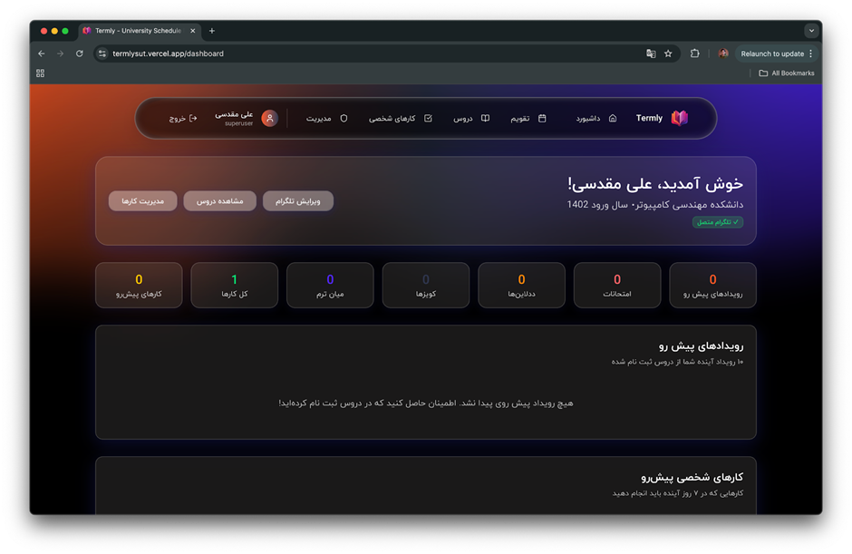
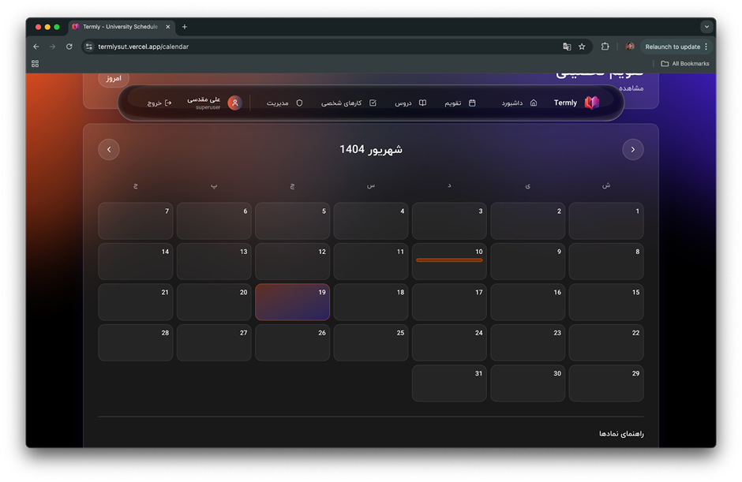

## معرفی و مسئله

در محیط‌های دانشگاهی، پراکندگی اطلاعات مربوط به رویدادهای درسی—از کوییزهای هفتگی تا ددلاین تمرین و پروژه—سبب فراموشی یا هم‌پوشانی کارها می‌شود. ترملی با هدف کاهش این اصطکاک، تقویمی هدف‌مند و قابل شخصی‌سازی ارائه می‌دهد تا دانشجو تنها رویدادهای مرتبط با درس‌های انتخابی خود را ببیند. نتیجه،

تصویری یکپارچه از هفته‌ها و ماه‌های آتی است که با شمارشگر روزهای باقی‌مانده، اولویت‌بندی را ساده می‌کند.

## الگوی استفاده و نقش‌ها
پس از ثبت‌نام مختصر (نام کامل، سال ورود، دانشکده، ایمیل و گذرواژه)، کاربر فهرست درس‌ها را مرور و انتخاب می‌کند؛ سپس در داشبورد، همهٔ رویدادهای مرتبط با درس‌های خود را با تاریخ شمسی و زمان دقیق مشاهده خواهد کرد.

افزون بر نقش دانشجو، سامانه دارای نقش ادمین است: افزودن/ویرایش/حذف رویدادها، مدیریت یادداشت‌های درسی و رسیدگی به گزارش‌های کاربران. نکتهٔ مهم آن‌که ادمین‌ها دانشجو هستند و هر دانشجویی که علاقه‌مند باشد می‌تواند به تیم ادمین بپیوندد تا تقویم درس‌ها را برای استفادهٔ جمعی به‌روز نگه دارد.

## استک فناوری و منطق انتخاب‌ها

- **فرانت‌اند**: Next.js (React, TypeScript) — انتخاب Next.js به دلیل پشتیبانی از رندر سمت‌سرور (SSR) و مسیرهای هیبریدی، زمان واکنش مناسب، و سادگی استقرار است. استفاده از TypeScript کاهش خطا و ارتقای نگهداشت‌پذیری را در پی دارد؛ مزیتی که با بزرگ‌تر شدن کدبیس حائز اهمیت می‌شود.

- **بک‌اند**: Django + Django REST Framework — DRF چارچوبی بالغ برای ساخت APIهای سازگار و مستند فراهم می‌کند. مدل‌سازی دقیق موجودیت‌ها (کاربر، درس، رویداد، گزارش) در جنگو، یکپارچگی داده و اعمال اعتبار‌سنجی را ساده می‌سازد.

- **پایگاه‌داده**: PostgreSQL — با توجه به ماهیت رابطه‌ای داده‌ها (ارتباط چند-به-چند کاربر/درس و یک-به-چند درس/رویداد)، PostgreSQL با تضمین یکپارچگی مرجع و پشتیبانی از پرس‌وجوهای پیچیده انتخابی معقول است.

- **کتابخانه‌های رابط کاربری**: استفاده از مجموعهٔ کامپوننت‌های آماده و استاندارد باعث یکنواختی تجربهٔ کاربری می‌شود و با افزودن لایهٔ ظرافت‌های حرکتی، تعامل‌پذیری بهبود می‌یابد.

## مدل داده و انواع رویداد
دیزاین پیشنهادی شامل جداول کاربر، درس، رویداد و گزارش است. هر رویداد به یک درس متصل است و یکی از انواع exam، deadline، quiz یا midterm را دارد.

نگهداری تاریخ در قالب شمسی (Jalali) و زمانِ جداگانه باعث می‌شود هم نمایش برای کاربر ایرانی دقیق باشد و هم تبدیل‌های زمانی/نمایشی کنترل‌شده باقی بماند. این طراحی مانع از خطاهای مرسوم در محاسبات تاریخ و فیلترگذاری بازه‌ها می‌شود.

## تجربهٔ کاربری و طراحی رابط
رابط ترملی مینیمال و محتوامحور است: داشبورد، فهرست رویدادهای پیش‌ِ رو را به‌همراه شمارشگر روزهای باقی‌مانده و فیلترهای لازم نمایش می‌دهد. ریسپانسیو بودن، استفادهٔ روان در نمایشگرهای کوچک را تضمین می‌کند و حالت تیره/روشن، خوانش‌پذیری را در محیط‌های مختلف بهبود می‌دهد. برای بهبود ادراک کاربر از تغییر وضعیت‌ها (مانند افزوده‌شدن یک رویداد یا تأیید یک گزارش)، از گذارهای حرکتی ملایم بهره گرفته می‌شود تا پیامدِ عمل کاربر واضح و بی‌ابهام باشد.
داشبورد وبسایت برای استفاده راحت شما:

تقویم آموزشی شما با توجه به درس‌هایی که انتخاب می‌کنید و همچنین کارهای شخصی‌ای که به برنامتون اضافه می‌کنید به شکل زیر میشه:

توی این تقویم با hover کردن ماوستون روی هر روزی که رویداد هست می‌تونید اطلاعات مربوط به اون رویداد رو ببینید.

البته که سایت به صورت ریسپانسیو هست و تمام این قابلیت‌ها رو روی گوشیتون هم دارید.

## یکپارچه‌سازی اعلان‌ها با تلگرام
ترملی از طریق یک ربات تلگرام یادآوری‌های سررسیدها، کوییزها و آزمون‌ها را ارسال می‌کند. این رویکرد، اعلان‌ها را از مرورگر مستقل می‌کند و به کاربر اجازه می‌دهد در محیطی آشنا پیگیری کند. افزون بر رویدادهای درسی، کاربر می‌تواند تسک‌های شخصی را نیز ثبت کند تا همان سازوکار یادآوری برای فعالیت‌های غیردانشگاهی نیز کارآمد باشد. که این ربات با آی‌دی termlysut_bot در دسترس می‌باشد.

## فرایندهای مدیریتی و کیفیت داده
دقت و به‌روز بودن داده، نقطهٔ کانونی چنین سامانه‌ای است. در ترملی:
**ورود نیم‌سال**: در ابتدای هر ترم، دادهٔ آزمون‌ها/کوییزها/ددلاین‌ها وارد می‌شود.

**مشارکت دانشجویی**: ادمین‌های دانشجو رویدادها را برای درس‌های خود و دیگران ثبت/تصحیح می‌کنند.

**گزارش کاربر**: هر دانشجو می‌تواند کمبود یا خطا را گزارش کند و ادمین وضعیت رسیدگی را به «در حال بررسی/حل‌شده» تغییر دهد.

## امنیت و حریم خصوصی
گذرواژه‌ها به‌صورت امن نگهداری می‌شوند (هش‌شده) و ارتباطات کاربر/سامانه بر بستر HTTPS توصیه می‌شود.

جداسازی فرانت‌اند و بک‌اند، پیاده‌سازی سیاست CORS و نرخ‌دهی درخواست‌ها (Rate Limiting) را تسهیل می‌کند. برای اعلان‌ها، حداقل‌داده‌ی لازم مبادله می‌شود تا حریم خصوصی کاربر حفظ شود. (در صورت نیاز به ممیزی امنیتی، می‌توان ثبت رویدادها و گزارش‌های سیستمی را به‌صورت ساختاریافته فعال کرد.)

## بازبودن مسیر مشارکت
ترملی توسط دانشجویان مدیریت می‌شود و پذیرای ادمین‌های داوطلب است؛ این مشارکت، چابکی سامانه را افزایش می‌دهد و پوشش درس‌ها را کامل‌تر می‌کند. دانشجویان علاقه‌مند می‌توانند در به‌روزرسانی تقویم درس‌ها، بهبود رابط کاربری یا حتی توسعهٔ ویژگی‌های جدید مشارکت کنند.
در صورتی که علاقه‌مند به مشارکت در ترملی هستید به [به این آیدی](https://t.me/ali0083moi) در تلگرام پیام دهید.

