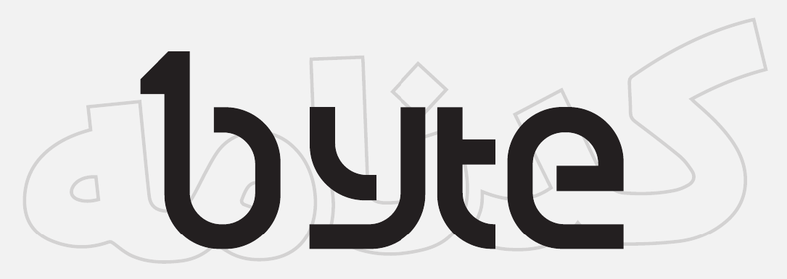

    

سلام!

به نشریه‌ی بایت خوش اومدین.

این متنی که الان دارید می‌خونید، حاصل ماه‌ها تلاش تیم نشریه‌ست تا بتونیم بایت رو به‌عنوان اولین نشریه و جامعه‌ی علمی دانشکده ثبت کنیم. داستان بایت و ایده‌ی این جامعه‌ی علمی (community) دانشجویی، از یکی از درس‌های دانشکده شروع شد. درسی که قطعا همه‌ی ما باهاش خاطره داریم: مبانی برنامه‌نویسی! در ترم پاییز ۹۹ درس مبانی، یک فایل جزوه‌مانند از مطالب مهم درس منتشر می‌شد به اسم «کدنامه» که از اون استقبال زیادی شد؛ چون خیلی مختصر و مفید مطالب درس رو توضیح می‌داد. بعد از اون، هدف کدنامه فراتر رفت.

دومین ترمی که کدنامه نوشته می‌شد، برای درس «برنامه‌سازی پیشرفته» بود که یک تیم مخصوص از تدریس‌یارهای درس، برای آماده‌کردن محتوای اون تلاش می‌کردن. این‌بار، علاوه بر مطالب مرتبط به درس، مطالب فراتر از درس و راجع به توانایی‌های دیباگ، مهندسی نرم‌افزار، کاربرد مفاهیم مختلف درس در کارهای صنعتی و... هم به کدنامه اضافه شد. در ترم‌های بعد از اون، کم‌کم ساختار کدنامه به کلی تغییر کرد و تبدیل شد به جایی برای تبادل و ارائه دانش: در قالب متن، درمورد مطالب فراتر از درس و نکات جذابی که هرکس خودش اون‌ها رو کشف کرده بود و می‌خواست با بقیه در میون بذاره. با طی این فرآیند، هر روز بیشتر و بیشتر جای خالی یک جامعه‌ی علمی و فضایی برای تبادل آزاد دانش درمورد حوزه‌های مختلف علوم کامپیوتر در دانشکده‌مون حس می‌شد. درنهایت، از طریق انجمن علمی دانشکده، پیگیر شدیم که چنین جای خالی‌ای رو پر کنیم! مسیر سختی بود اما از حق نگذریم، همه می‌دونیم که همیشه، «اولین» بودن سخته! با گذر از همه‌ی اتفاقاتی که خیلی فشرده و خلاصه براتون تعریف کردیم، اولین شماره‌ی نشریه‌ی بایت به دستتون رسیده.

ما تازه اول این راه هستیم و کلی اتفاقات جذاب و هیجان‌انگیز پیش روی ماست! اگر شما هم یکی از علاقمندان به انتشار دانش و بحث‌های علمی هستین و دوست دارین چیزی که اخیرا یاد گرفتین رو با بقیه هم درمیون بذارین، شما عضو بایت هستین! خوش اومدین. امیدواریم از بایت لذت ببرین.
