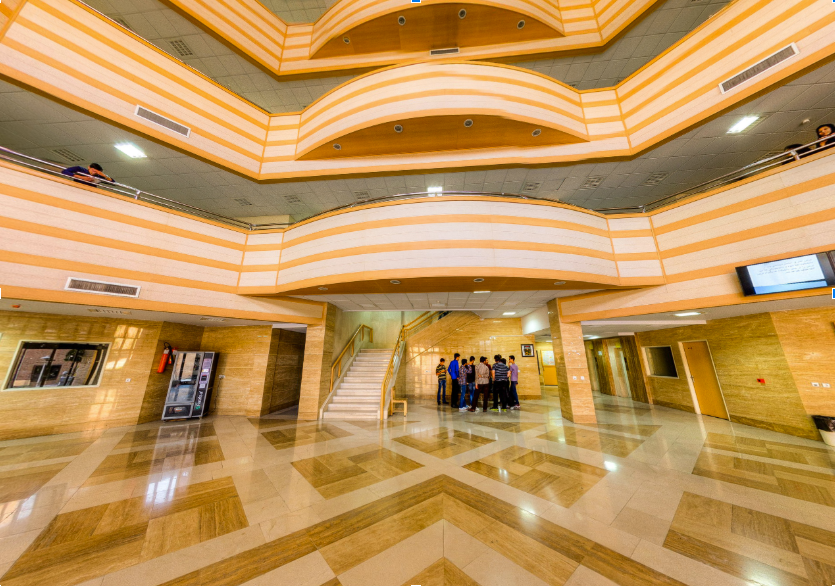
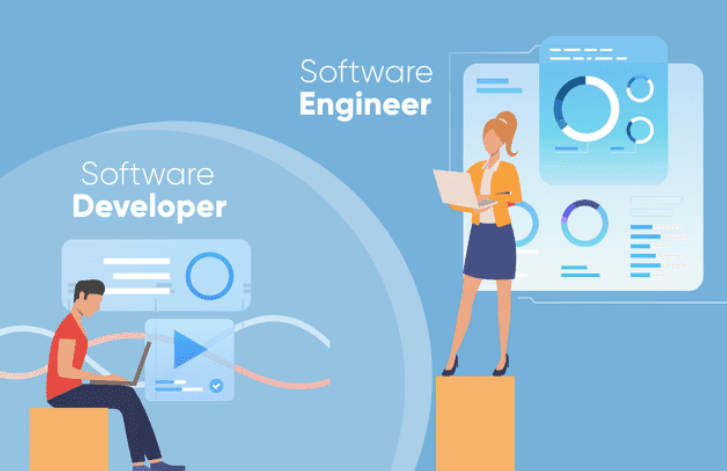
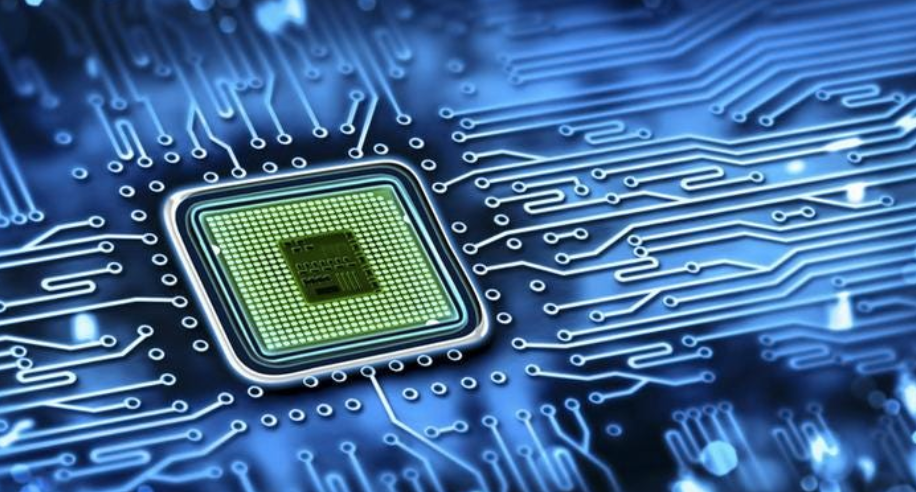
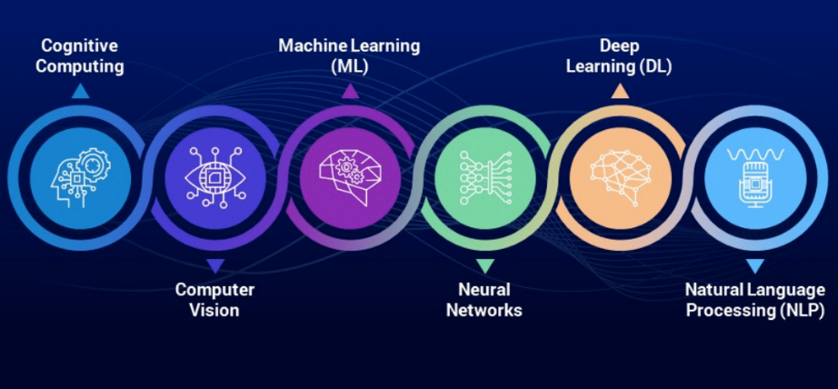

import Tooltip from "@site/src/components/Tooltip";

# معرفی گروه‌های علمی دانشکده

سال قبل، دانشکدهٔ‌‌‌‌ مهندسی کامپیوتر دانشگاه شریف کار خود را با راه‌اندازی رشته‌های کارشناسی «نرم‌افزار» و «سخت‌افزار» شروع کرد. ۲ سال بعد، ورودی‌های کارشناسی ارشد در گرایش‌های «معماری کامپیوتر» و «مهندسی نرم‌افزار» به دانشکده اضافه شدند. از آن زمان تابه‌حال، دانشکده به اقتضای زمان، دستخوش اضافه‌شدن گرایش‌ها و گروه‌های آموزشی متعددی شده‌ است.

  

در حال حاضر در مقطع کارشناسی، با ادغام «نرم‌افزار» و «سخت‌افزار»، رشتهٔ‌‌‌‌ «مهندسی کامپیوتر» ارائه می‌شود. همچنین ۸ گرایش در مقطع ارشد و ۶ گرایش در مقطع دکترا، در قالب ۴ گروه «معماری کامپیوتر»، «مهندسی نرم‌افزار»، «هوش مصنوعی» و «فناوری اطلاعات»، ارائه می‌شود. در ادامهٔ‌‌‌‌ متن به معرفی کوتاهی از این گروه‌ها می‌پردازیم. در شماره‌های بعدی بایت به جزئیات فعالیت‌های علمی اساتید و آزمایشگاه‌ها خواهیم پرداخت.

## مهندسی نرم‌افزار

مهندسی نرم‌افزار شاخه‌ای از مهندسی کامپیوتر است که در مورد طراحی، توسعه، تست (آزمون نرم‌افزار)، نگهداری و مدیریت نرم‌افزار‌های کامپیوتری صحبت می‌کند.

  

### وظیفهٔ‌‌‌‌ من به عنوان یک مهندس نرم‌افزار چیست؟

شما مسئولیت تمام مراحل تولید نرم‌افزار، از

<Tooltip tip="Requirement Analysis">
  تحلیل نیازمندی‌ها
</Tooltip>
تا طراحی ،
<Tooltip tip="Implementation">
  پیاده‌سازی
</Tooltip>
، تست و نگهداری را به عهده دارید! در واقع شما فقط یک برنامه‌نویس نیستید! شما به
عنوان یک مهندس نرم‌افزار، باید برنامه‌ای بنویسید که خوانایی بالا و
<Tooltip tip="Maintainablity">
  قابلیت نگه‌داری
</Tooltip>
داشته باشد. (تفاوت شما با یک برنامه‌نویس معمولی در اینجاست.)

### استادها و آزمایشگاه‌های گروه نرم‌افزار چطوری‌اند؟

اینجا توضیح اجمالی‌ای از زمینهٔ‌‌‌‌ تحقیقاتی چند تا از آزمایشگاه‌های دانشکده را برای‌تان نوشته‌ایم که اگر به زمینهٔ‌‌‌‌ خاصی علاقه دارید، بتوانید بر اساسش تصمیم‌گیری کنید. البته که فعالیت‌های آزمایشگاه‌ها به چیزهایی که نوشته‌ایم محدود نمی‌شوند و این توضیحات را بر اساس

<Tooltip tip="Research Interests">
  علایق پژوهشی
</Tooltip>
اساتید و پرس‌و‌جو از دانشجو‌ها جمع‌آوری کرده‌ایم:

> اگر به حوزهٔ‌‌‌‌ تست نرم‌افزار علاقه دارید، آزمایشگاه دکتر میریان در این زمینه فعالیت می‌کند؛ اگر به حوزهٔ‌‌‌‌

<Tooltip tip="Data Mining">
  داده‌کاوی
</Tooltip>
، گراف و یا نظریهٔ بازی‌ها علاقه‌مند هستید، اساتیدی مثل دکتر فضلی و دکتر ایزدی
در این زمینه‌ها فعالیت دارند؛ اگر حوزه‌های تئوری را بیشتر می‌پسندید، دکتر موقر
در این زمینه آزمایشگاه خوبی دارند؛ دکتر رامسین، در حوزه‌های
<Tooltip tip="Methodology">
  متدولوژی
</Tooltip>
و مهندسی نرم‌افزار فعالیت دارند؛ در نهایت، دانشجو‌های دکتر حبیبی هم در حوزه‌های
مالی و مقداری هم یادگیری ماشین و هوش مصنوعی فعالیت می‌کنند.

## معماری کامپیوتر

معماری کامپیوتر شاخه‌ای از مهندسی کامپیوتر است که به طراحی سیستم‌های کامپیوتری برای اهداف مختلف و

<Tooltip tip="Performance Optimization">
  بهینه‌سازی عملکرد
</Tooltip>
می‌پردازد. به‌کارگیری بهینهٔ‌‌‌‌ سخت‌افزار و استفاده از تکنیک‌های هوشمندانهٔ‌‌‌‌
نرم‌افزاری و الگوریتمی، بخش عمدهٔ‌‌‌‌ این شاخه را شامل می‌شود. البته گروه معماری
کامپیوتر در دانشکدهٔ‌‌‌‌ ما، کمی تعریف گسترده‌تری از معماری کامپیوتر عادی دارد و
شاخه‌های دیگری را هم شامل می‌شود.

  

### چه موضوعات داغی در این شاخه وجود دارند؟

کامپیوتر‌های کوانتومی،

<Tooltip tip="Specialized Hardwares">
  سخت‌افزار‌های ویژه
</Tooltip>
،
<Tooltip tip="Graphics Processing Unit (GPU)">
  پردازنده‌های گرافیکی
</Tooltip>
و
<Tooltip tip="Tensor Processing Unit (TPU)">
  تنسوری
</Tooltip>
،
<Tooltip tip="Neuromorphic Engineering">
  مهندسی نورومورفیک
</Tooltip>
و
<Tooltip tip="Optical Computing">
  رایانش نوری
</Tooltip>
از حیطه‌های فعال و پرجنب‌و‌جوش تحقیقاتی این شاخه‌اند.

### در دانشکده چه خبر است؟

اینجا هم مثل گروه‌های دیگر، توضیح اجمالی‌ای از حیطهٔ‌‌‌‌ تحقیقاتی چندتا از آزمایشگاه‌های دانشکده در این گروه را آورده‌ایم:

> دکتر ایزدی بیشتر در حوزهٔ‌‌‌‌

<Tooltip tip="Distributed Systems">
  سیستم‌های توزیع‌شده
</Tooltip>
کار می‌کنند؛ دکتر حسابی و دکتر اسدی بیشتر در حوزهٔ‌‌‌‌
<Tooltip tip="Storage">
  ذخیره‌سازی
</Tooltip>
اطلاعات فعالیت می‌کنند؛ دکتر سربازی روی
<Tooltip tip="Multi-core Systems">
  سیستم‌های چند هسته‌ای
</Tooltip>
کار می‌کنند؛ دکتر کوهی در زمینه‌های پردازش نوری و کمی هم کامپیوترهای کوانتومی
تحقیق می‌کنند؛ در زمینهٔ‌‌‌‌
<Tooltip tip="Embedded Systems">
  سیستم‌های نهفته
</Tooltip>
هم دکتر انصاری فعالیت می‌کنند.

## فناوری اطلاعات

  

<Tooltip tip="Information Technology">
  فناوری اطلاعات
</Tooltip>
به استفادهٔ‌‌‌‌ کامپیوتر برای ساخت، تحلیل، ذخیره‌سازی، استخراج و تبادل هرگونه
اطلاعات گفته می‌شود. IT در واقع زیرمجموعه‌ای از ICT یا همان Information and
Communication Technology است. شبکه و امنیت از مهم‌ترین مباحث این شاخه تحقیقاتی
هستند.

### از فناوری اطلاعات در دانشکدهٔ‌‌‌‌ خودمان چه خبر؟

دکتر صفایی در زمینهٔ‌‌‌‌

<Tooltip tip="Internet of Things (IOT)">
  اینترنت اشیا
</Tooltip>
کار می‌کنند؛ دکتر امینی و دکتر جلیلی در حوزه‌های مختلف امنیت و شبکه فعالیت
می‌کنند؛ دکتر بیات در زمینهٔ‌‌‌‌ رمزنگاری و 5G به تحقیق مشغول‌اند؛ دکتر خرازی هم
در حیطهٔ‌‌‌‌ سیستم‌عامل فعالیت می‌کنند. لازم به ذکر است که گروه فناوری اطلاعات
با ۴ استاد، کمترین تعداد استاد در هیئت علمی دانشکده را دارد.

## هوش مصنوعی

  

احتمالاً تا‌به‌حال شنیده‌اید که

<Tooltip tip="Artificial Intelligence (AI)">
  هوش مصنوعی
</Tooltip>
چیست؛ اما تعریف دقیق هوش مصنوعی به‌ این شکل است: هوش مصنوعی توانایی ماشین‌ها به
تقلید یا تقویت خرد انسانی گفته می‌شود؛ مثل نتیجه‌گیری یا یادگیری از تجربه.
سیستم‌های هوش مصنوعی اطراف ما روی کار، رفتار، مصرف رسانه، امنیت و … تأثیر
بسزایی دارند. شاید بتوان گفت شناخته‌شده‌ترین زیر شاخهٔ‌‌‌‌ هوش مصنوعی در دنیای
امروز،
<Tooltip tip="Machine Learning (ML)">
  یادگیری ماشین
</Tooltip>
است.

### از هوش مصنوعی کجا استفاده می‌شود؟

استفاده از هوش مصنوعی در صنعت و علم در سال‌های اخیر رشد چشمگیری داشته‌است. از معروف‌ترین کاربردهای هوش مصنوعی می‌توان به

<Tooltip tip="Search Engines">
  موتورهای جست‌و‌جو
</Tooltip>
،
<Tooltip tip="Recommendation System">
  سیستم‌های توصیه‌کننده
</Tooltip>
،
<Tooltip tip="Natural Language Understanding (NLU)">
  فهم زبان‌های طبیعی
</Tooltip>
، ماشین‌های خودران و
<Tooltip tip="Generative AI">
  هوش مصنوعی مولد
</Tooltip>
اشاره کرد.

### <Tooltip tip="Trends">حوزه‌های رایج</Tooltip> هوش مصنوعی چه شکلی‌اند؟

سرعت رشد و پیشرفت هوش مصنوعی بسیار زیاد بوده و زمینه‌های مطرح همواره در حال عوض شدن‌اند. اما از مطرح‌ترین زمینه‌ها می‌توان به موارد زیر اشاره کرد:

- <Tooltip tip="Large Language Models">
    مدل‌های زبانی بزرگ
  </Tooltip>
- <Tooltip tip="Deep Learning">
    یادگیری عمیق
  </Tooltip>
- <Tooltip tip="Computer Vision">
    بینایی رایانه‌ای
  </Tooltip>
- پردازش زبان طبیعی

### وضعیت هوش مصنوعی در دانشکده چگونه است؟

دکتر شریفی زارچی به همراه دکتر مطهری در حوزهٔ‌‌‌‌

<Tooltip tip="Bioinformatics">
  بیوانفورماتیک
</Tooltip>
مشغول به کارند؛ دکتر کسایی بیشتر در زمینهٔ‌‌‌‌ پردازش تصویر فعالیت می‌کنند؛ دکتر
سلیمانی در زمینهٔ‌‌‌‌ یادگیری عمیق فعال هستند؛ در حیطهٔ‌‌‌‌ پردازش زبان طبیعی هم
دکتر بیگی مشغول به فعالیت‌اند؛ دکتر ربیعی هم در حوزهٔ‌‌‌‌
<Tooltip tip="Social Network">
  شبکه‌های اجتماعی
</Tooltip>
فعالیت می‌کنند.
