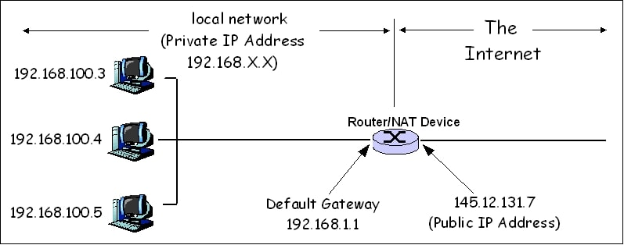

# UDP Hole Punching

_در دنیای امروز، زندگی ما به اینترنت گره خورده است و تقریبا تمامی کار‌هایمان را با اینترنت انجام می‌دهیم: حرف زدن با دوستان، خرید کردن از فروشگاه‌ها، بازی‌های کامپیوتری و … یکی از چالش‌های افرادی که در حوزه‌ی شبکه‌های کامپیوتری کار می‌کنند، کم کردن ترافیک و به طبع کمتر شدن توان پردازشی مورد نیاز است که به کمک آن بتوانند با هزینه‌ی کمتر، به افراد بیشتری سرویس بدهند._

فرض کنید که یک سرویس تماس تصویری و صوتی آنلاین مثل گوگل میت یا اسکایروم دارید. اولین روشی که برای برقراری ارتباط بین دو فرد به ذهن می‌رسد این است که ترافیک مورد نظر به کمک یک سرور به هر فرد فرستاده شود یا به اصطلاح relay یا proxy شود. این کار مسلماً توان مصرفی زیادی را درگیر می‌کند و زمانی که تعداد کاربر‌های ما بالا می‌رود، باید سرور‌های قوی‌تری برای پراکسی کردن داده‌ها قرار دهیم. اما چه می‌شد اگر می‌توانستیم بدون یک سرور میانی دو شخصی که می‌خواهند با هم حرف بزنند را به هم وصل کنیم؟

امروزه بسیاری از سیستم‌عامل‌ها به یک فایروال مجهز هستند. این فایروال‌ها به صورت پیش‌فرض اجازه نمی‌دهند که هیچ کانکشنی از خارج شبکه شما به کامپیوتر شما زده شود. از طرفی دیگر، بسیاری از شبکه‌های خانگی پشت NAT (network address translation) هستند. NATها این اجازه را به کامپیوتر‌های متصل به آن می‌دهند که همگی آن‌ها یک IP مشترک داشته باشند. به عنوان مثال در صورتی که شما با کامپیوتر و گوشی‌ خود که به مودم خودتان وصل هستند در گوگل عبارت "what's my ip" را جست و جو کنید IPهای یکسانی می‌گیرید.

## چرا NAT؟

حال یک قدم عقب‌تر برویم و بررسی کنیم که چرا NAT؟ در دنیای امروزی اینترنت هر شخصی که می‌خواهد با دیگران ارتباط برقرار کند باید یک IP address داشته باشد. احتمالا آن‌ها را دیده‌اید: چهار عدد هستند که با ۳ نقطه از هم جدا شده‌اند. به عنوان مثال 81.31.168.91 IP سرور آموزش دانشگاه است. همچنین برای اینکه در خیلی از سیستم‌ها همزمان چندین اپلیکیشن بتوانند با یک IP ارتباط برقرار کنند یک عدد دیگر به اسم پورت برای هر IP تعریف می‌شود که نشانگر یک برنامه‌ است که می‌تواند درخواست‌های از بیرون را قبول کند اینکه می‌خواهد با بیرون ارتباط برقرار کند. استاندارد IPv4 تنها حدود ۲ میلیارد IP موجود دارد و در حال حاضر بیشتر از ۲ میلیارد وسیله متصل به اینترنت وجود دارد؛ یعنی به وضوح با کمبود تعداد آدرس مواجهیم\! برای همین روشی به اسم NAT معرفی شد که به کمک آن می‌توان به چندین کامپیوتر یک IP را اختصاص داد.

این روش بدین صورت عمل می‌کند که شما باید به یک router (مسیریاب) یک IP بدهید که در اینترنت بتواند با بقیه حرف بزند. این همان IPای است که زمانی که در اینترنت سرچ می‌کنید what's my ip به آن بر می‌خورید. به این آدرس IP،آدرس Public IP می‌گویند. همچنین به هر یک از کامپیوتر‌هایی که به شبکه‌ی داخلی شما وصل هستند یک آدرس Private IP می‌دهد. این IPها به نحوی یک IP مجازی هستند که در دنیای اینترنت به دستگاه خاصی داده نشده‌اند و همیشه برای استفاده‌ی NATها رزرو شده‌اند. به عنوان مثال IPهایی که با 192.168 یا 10 شروع می‌شوند از این دسته IPها هستند. زمانی که یکی از دستگاه‌های متصل به NAT درخواستی برای یک IP خارج از NAT (مثلا سایت گوگل) می‌خواهد بفرستد، دستگاه مجهز به NAT پکت‌هایی که در حال رفت و آمد از سمت گوگل به سمت کامپیوتر و برعکس است را بازنویسی می‌کند، طوری که آدرس فرستنده Public IP باشد. برای دیدن یک شمای کلی از NAT شکل زیر را نگاه کنید.

  

اما همچنان یک مشکل وجود دارد. فرض کنید که دو کامپیوتر که به NAT وصل هستند همزمان از یک پورت بخواهند که به یک سایت واحد متصل شوند. در اینجا نمی‌توان تنها IPها را تغییر داد چرا که درخواست دریافتی از سمت کامپیوتر مقصد معلوم نیست که برای کدام یک از کامپیوتر‌های local network هستند. در اینجا مجبور هستیم که آدرس port را نیز عوض کنیم.

به صورت کلی بسیاری از NATها دقیقا مثل پاراگراف بالا کار می‌کنند. فرض کنید که در ابتدا کامپیوتری با Private IP 10.1.1.5 می‌خواهد که از پورت 12345 یک پکت به پورت 54321 آی‌پی 2.3.4.5 بفرستد. زمانی که این پکت را سیستم‌عامل می‌سازد آدرس مبدا را همان 10.1.1.5 قرار می‌دهد. زمانی که NAT این بسته را دریافت می‌کند 10.1.1.5 و پورت 12345 را به آدرس Public IP و یک پورت رندوم تغییر می‌دهد و سپس بسته به اینترنت فرستاده می‌شود. همزمان NAT در مموری خودش ذخیره می‌کند که در صورتی که یک پکت از 2.3.4.5:54321 آمد آن را برای 10.1.1.5:12345 بفرستد.

نکته‌ای که در اینجا وجود دارد این است که تنها بسته‌های دریافتی از 2.3.4.5:54321 به کامپیوتر مذکور منتقل می‌شوند. پس امکان ندارد که هر کسی در اینترنت بتواند برای کامپیوتر‌هایی که پشت NAT هستند سرخود پکت بفرستد؛ حتما باید در ابتدا کامپیوتری که پشت NAT است با کامپیوتری که می‌خواهد ارتباط را برقرار کند اول یک پکت فرستاده باشد که NAT بداند که پکت‌های ورودی را به کجا ارسال کند. برای همین برقراری ارتباط مستقیم بین دو کامپیوتر که پشت NAT هستند امکان پذیر نیست…

_یا شایدم بشه یه کاری کرد؟_

فرض کنید که شما یک پکت به 1.2.3.4:1000 می‌فرستید. در این حالت NAT به خاطر می‌سپارد که هر چیزی پکتی از 1.2.3.4:1000 باید به کامپیوتر شما فرستاده شود. حال فرض کنید که دقیقا از همان IP و پورت کامپیوتر خودتان یک پکت به 5.6.7.8:2000 می‌فرستیم. حال NAT، همان IP \+ Port قبلی خودتان را به 5.6.7.8:2000 مپ می‌کند. پس اگر یک جوری دو کامپیوتری که پشت NAT هستند بتوانند برای IP و Port خود یک پیام بفرستند، NATهایشان طوری تنظیم می‌شود که می‌توانند با هم به صورت مستقیم و بدون واسطه حرف بزنند\!

به کمک همین موضوع ایده‌ی UDP Hole Punching مطرح شد. دلیل وجود اسم پروتکل UDP در این نام این است که این روش به خاطر stream base بودن TCP بر روی TCP جواب نمی‌دهد. (روش‌هایی برای اعمال این روش بر روی TCP نیز وجود دارد ولی باشد برای یک شماره دیگر\!) در این پروتکل یک سرور دیگر نیز وجود دارد که باید از سمت هر دو کلاینت که می‌خواهد به هم وصل شوند قابل دسترسی باشد. اسم این سرور را STUN می‌نامیم. UDP Hole Punching بدین صورت عمل می‌کند که در ابتدا هر دو peer به STUN می‌گویند که می‌خواهیم با هم ارتباط برقرار کنیم. با این کار NAT هر دو peer به صورتی تنظیم می‌شود که پکت‌ها فقط بتوانند که به سرور STUN برسند و دریافت شوند. سپس STUN به هر کدام از peerها آدرس آن یکی peer را می‌دهد و هر یک از peerها به آن آدرس یک پکت می‌فرستند. با این کار NAT هر کدام طوری تنظیم می‌شود که می‌توانند برای همدیگر پیام بفرستند و در نتیجه دیگر سرور STUN به دردی نمی‌خورد؛ چرا که حال هر دو peer بدون واسطه می‌توانند با هم حرف بزنند.

## خیری بدون شر؟ ...

اما هیچ خیری بدون شر نمی‌آید\! UDP Hole Punching دو مشکل بزرگ دارد. اول از همه اینکه در بعضی نوع از NATها، به اسم Symmetric Nat، روش UDP Hole Punching کار نمی‌کند. در این نوع NATها با عوض شدن آدرس مقصد پورتی که NAT به عنوان پورت مبدا rewrite می‌کند نیز عوض می‌شود و برای همین آدرسی که دست STUN است با آدرسی که به آن یکی peer پیام فرستاده می‌شود فرق دارد. این نوع NAT معمولا در اپراتور‌های تلفن همراه دیده می‌شود. یکی دیگر از مشکلات بزرگ UDP Hole Punching لو رفتن IP هر یک از peerها است. فرض کنید که شما می‌خواهید که IP آدرس یک شخص را پیدا کنید. برای این کار یکی از کار‌هایی که می‌توانید بکنید این است که به کمک یک برنامه‌ی مکالمه‌ی آنلاین مثل تلگرام[^*] به آن شخص زنگ بزنید و با این کار UDP Hole Punching اتفاق می‌افتد و IP شخص مورد نظر بدست می‌آید.

[^*]: البته این موضوع را نیز در نظر بگیرید که تلگرام قابلیت خاموش کردن Peer-to-Peer voice call را دارد و به کمک آن می‌توانید از IP خود محافظت کنید.
