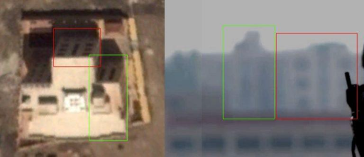
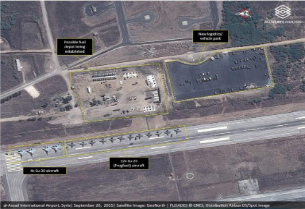

# OSINT: کارآگاهی در وب

## مقدمه‌ای بر OSINT

اوسینت(OSINT) یا Open Source IntTelligence به معنای **جستجوی پیشرفته در منابع اطلاعاتی آزاد** است. این مفهوم به مجموعه‌ای از روش‌ها، تکنیک‌ها و ابزارهایی اشاره دارد که به ما در جمع‌آوری، تحلیل و بررسی اطلاعات کمک می‌کند.

منابع اطلاعاتی‌ای در علم اوسینت استفاده می‌شوند که از منابع عمومی و علنی قابل دسترسی هستند. این منابع معمولاً شامل مواردی از قبیل وب‌سایت‌ها، شبکه‌های اجتماعی، گزارش‌های حکومتی، مقالات علمی، داده‌های عمومی، نقشه‌های جغرافیایی و... می‌شوند.

فرض کنید از شما خواسته می‌شود راجع به مواردی از قبیل "تعداد دانشجوهای ایرانی ساکن کانادا"، "شماره تلفن یک فرد خاص" یا "مکان‌هایی که می‌توان در آن‌ها یک سلبریتی خاص را ملاقات کرد" و مواردی مشابه. برای برخی از این سوال‌ها مانند "تعداد دانشجوهای ایرانی ساکن کانادا"، سرچ کردن داخل گوگل کافی است، اما برای پیدا کردن "مکان‌هایی که می‌توان در آن‌ها یک سلبریتی خاص را ملاقات کرد" سرچ گوگل کافی نیست\! فرض کنید یک تصویر به شما می‌دهند و از شما می‌پرسند که این تصویر مربوط به کدام کشور، کدام شهر و کدام خیابان است؟ حال علم اوسینت معنا پیدا می‌کند و ما باید با استفاده از جست‌و‌جو در منابع اطلاعاتی خود به دنبال جوابی برای این پرسش‌ها باشیم.

    

## تعریف دقیق OSINT

OSINT، به جستجو و تحلیل اطلاعات عمومی و آزاد از منابع عمومی در دنیای دیجیتال می‌پردازد. این نوع اطلاعات از منابعی مانند اینترنت، رسانه‌ها، شبکه‌های اجتماعی و منابع دیگر جمع‌آوری می‌شوند و به عنوان اطلاعات غیرمحرمانه و غیررسمی شناخته می‌شوند. OSINT به تحلیل و تفسیر این اطلاعات به منظور بدست آوردن دیدی جامع‌تر در مورد یک موضوع می‌پردازد.

به زبان دیگر، OSINT می‌تواند مانند یک کارآگاه باشد که به دنبال کشف پاسخ به یک سوال از منابع عمومی می‌گردد. این نوع تحقیق به هر کسی که توانایی استفاده از تکنیک‌های جستجو را داشته باشد، اجازه می‌دهد که به سادگی و با هزینه معقول به اطلاعاتی دسترسی یابد که برای دیگران ارزشمند و گرانبها باشد. در OSINT، تنها به جستجوی اطلاعات عمومی پرداخته می‌شود و فعالیت‌های نفوذی و نقض حریم خصوصی افراد ممنوع می‌باشد.

## کاربردهای OSINT

استفاده‌های OSINT (استخراج اطلاعات متن‌باز) در امور مختلف بسیار گسترده است و در مختلف زمینه‌ها کاربرد دارد. یکی از کاربردهای مهم OSINT در دامنه امنیت سایبری است. سازمان‌ها و تیم‌های امنیتی از OSINT برای مانیتورینگ فعالیت‌های آنلاین، تشخیص تهدیدات سایبری، و اطلاع از آسیب‌پذیری‌های امنیتی در منابع متن‌باز بهره می‌برند. این اطلاعات می‌توانند به آن‌ها کمک کنند تا در مقابل حملات سایبری و نفوذ‌های مخرب مقاومت کنند.

همچنین، OSINT در حوزه جاسوسی صنعتی نقش مهمی ایفا می‌کند. شرکت‌ها و سازمان‌ها می‌توانند از این تکنیک برای جمع‌آوری اطلاعات درباره رقبا، بازارهای جدید، و فرصت‌های تجاری استفاده کنند. این اطلاعات به آن‌ها کمک می‌کند تا تصمیمات بهتری در زمینه استراتژی‌های کسب و کار بگیرند.

در ضمن، OSINT در زمینه رصد رفتار اجتماعی و جمعیت‌شناسی نیز کاربرد دارد. از این تکنیک می‌توان در مطالعات اجتماعی، تحلیل رفتار انسانی در شبکه‌های اجتماعی، و تشخیص الگوهای اجتماعی بهره‌برد. به طور کلی، OSINT به عنوان یک ابزار قدرتمند در تصمیم‌گیری‌ها و تحلیل‌های متعدد در زمینه‌های مختلف مورد استفاده قرار می‌گیرد.

    

## چالش‌ها و مسائل اخلاقی در OSINT

استفاده از OSINT در مطالعات و فعالیت‌های تحقیقاتی با خود مسائل اخلاقی مهمی به همراه دارد. یکی از اصلی‌ترین مسائل اخلاقی مرتبط با OSINT حفظ حریم شخصی و حریم خصوصی افراد است. در تلاش برای جمع‌آوری اطلاعات از منابع عمومی، ممکن است افراد و اطلاعات حساس آن‌ها بدون اجازه به طور غیرمجاز مورد نظر قرار گیرند. این امر به نقض حقوق انسانی و حریم خصوصی افراد منجر می‌شود.

مسئله دیگری که در مورد OSINT به وجود می‌آید، تشویش و تلاش برای تحت فشار قرار دادن افراد یا سازمان‌ها است. با انتشار اطلاعات دقیق یا نادقیق از منابع متن‌باز، ممکن است افراد یا سازمان‌ها به طور نادرست به عنوان مقصر در اتفاقات مشخصی معرفی شوند. این مسائل می‌توانند به نقض حقوق دیگران و آسیب به شخصیت و حریم خصوصی آن‌ها منجر شوند.

به طور کلی، اطلاعات حساسی که از OSINT جمع‌آوری می‌شوند، باید با دقت و احترام به اصول اخلاقی مورد استفاده قرار گیرند. تشخیص بین استفاده مشروع و ناپسند از اطلاعات OSINT امری ضروری است تا حقوق افراد و سازمان‌ها محترمانه حفظ شود.

## ابزارها و تکنیک‌های پرکاربرد در OSINT

 در این بخش تعدادی ابزار و وبسایت کاربردی در راستای OSINT می‌بینیم که می‌تواند به ما در پروژه‌های OSINT کمک کند.

1. [osintframework.com](https://osintframework.com)  
این وب‌سایت تقریباً تمامی ابزارهای مورد نیاز ما در هر زیرشاخه‌ای از OSINT را به صورت طبقه‌بنده شده در اختیار ما قرار می‌دهد.

2. [geohints.com](https://geohints.com/)  
این وب‌سایت به شکل خارق‌العاده‌ای کشورها را بر اساس معیارهای متنوع دسته‌بندی کرده که در OSINT شدیداً مورد استفاده قرار می‌گیرد. به عنوان مثال در یکی از بخش‌ها، کشورها را برحسب شکل چراغ راهنمایی‌ورانندگی طبقه‌بندی کرده است.

3. [shodan.io](https://www.shodan.io/)  
شودان (Shodan) یک موتور جستجو است که به کاربر اجازه می دهد انواع خاصی از رایانه های  (وب کم ها، روتر ها، سرورها و غیره) متصل به اینترنت را با استفاده از فیلترهای مختلف پیدا کند. این موتور جستجو برای متخصصان امنیت و نفوذگران بسیار مفید می‌باشد.فیلترهای اصلی شودان عبارتند از: شهر، کشور، مختصات جغرافیایی، سرور، سیستم‌عامل، پورت و...

اگر قصد تمرین و حل چالش‌های OSINT دارید، می‌توانید از لینک‌های زیر استفاده کنید:

- [medium.com](https://medium.com/)  
اصلی‌ترین منبع برای تمرین و یادگیری OSINT، خواندن Writeupها و Storyهای دیگران در شبکه اجتماعی medium است. روزانه تعداد زیادی Story از پروژه‌های OSINT از متخصصان این حوزه روی medium قرار می‌گیرد که خواندن و بررسی آن‌ها برای علاقه‌مندان به OSINT بسیار مفید است.

- وبلاگ [osintteam.blog](https://osintteam.blog)  
در شبکه اجتماعی medium یکی از بهترین وبلاگ‌ها برای انتشار Writeupها در این حوزه است، خواندن Story پروژه‌های موجود در این وبلاگ را به شما پیشنهاد می‌کنم.

- [twitter.com/Quiztime](https://twitter.com/Quiztime)  
این صفحه‌ی توییتر(x) روزانه تعدادی چالش OSINT توییت می‌کند که خواندن و بررسی آن‌ها می‌تواند به ما در تقویت مهارت‌هایمان کمک کند.

- [www.osintdojo.com](https://www.osintdojo.com/)  
این وب‌سایت علاوه بر آرشیوی از ابزارها و منابع برای جمع‌آوری اطلاعات، تعدادی چالش نیز دارد که شما می‌توانید آن‌هارا حل کنید و تواناهای خود را در OSINT تقویت کنید.

- [ctftime.org](https://ctftime.org)  
در مسابقات CTF غالباً سوالاتی از تیپ پروژه‌های کوچک OSINT مطرح می‌شود. شما می‌توانید سوالاتی با موضوع OSINT که در آرشیو سوال مسابقات CTF وجود دارد را به همراه Writeup آن در این وب‌سایت پیدا کنید.

## نمونه‌هایی از پروژه‌های OSINTیی واقعی

### مکان‌یابی تروریست‌های تونسی در رقه

این هفته، یک فیلم ویدیویی منتشر شده که در آن جهادی‌های تونسی ادعا می‌کنند که آن‌ها مسئول قتل دو سیاستمدار سکولار تونسی در سال 2013 بوده‌اند. این فیلم به نظر می‌آید که در منطقه‌ای که تحت کنترل دولت اسلامی بوده است، تولید شده و از تکنیک‌های مختلف مکان‌یابی جغرافیایی برای تشخیص مکان فیلم‌برداری استفاده شده است. این ویدیو با دقت ویرایش شده و شامل سخنان مردی است که از زوایای مختلفی او فیلم گرفته شده است. در طی 39 ثانیه از این ویدیو، یک پرچم و ساختمان‌هایی در پس‌زمینه دیده می‌شوند:

یکی از نکات جالب در مورد این ویدیو، وجود یک ساختمان جذاب با یک سقف قرمز است که در تصویر پشت پرچم قرار دارد. این ساختمان به طور واضح در ابتدای ویدیو قابل مشاهده است (حدود 28 ثانیه از ابتدای ویدیو)، اما وقتی که چهار مرد در کنار آن نشسته و با دقت بررسی می‌شود، جزئیات بیشتری از این مکان آشکار می‌شود.

از نرم‌افزارهای ساده ویرایش تصاویر مانند Paint.net می‌توان برای ترکیب تصاویر این صحنه استفاده کرد تا همه‌ی ساختمان‌های موجود در پس‌زمینه به وضوح نمایش داده شوند و تصویری با نمای واضح‌تری از این ساختمان به‌دست آورد.

    

بنابراین ما باید به دنبال ساختمانی بلند با سقفی قرمز و پنجره‌هایی مستطیل‌شکل در طبقه‌ی بالا، و حداقل دو طبقه با پنجره‌های قوسی در پایین آن بگردیم.

ما با آغاز از شهر رقه، به بررسی نقشه‌هوایی شهرهای تحت کنترل دولت اسلامی پرداختیم. به سرعت یک ساختمان با سقف بزرگ قرمز را شناسایی کردیم، که به عنوان دانشکده مهندسی عمران شناخته می‌شد، و سپس جستجوی تصاویر پانوراما از این مکان را آغاز کردیم. این اقدام به ما اجازه داد تصاویر پانوراما از این محل را پیدا کرده و آن‌ها را با ساختمانی که در ویدیو دیده بودیم، مقایسه کنیم.

    

در 300 متری غرب این ساختمان، میدانی عمومی با تیرک پرچمی بزرگ قابل رؤیت است، سایه‌ی ایجاد شده توسط این تیرک و خود پرچم در تصویر نقشه‌ی ماهواره‌ایِ زیر دیده می‌شود.

    

در تصویر ترکیبی، می‌توانیم در جنوب غربی ساختمان بالایی یک ساختمان دیگر را مشاهده کنیم. وجود عناصر مشخصی در دو تصویر به ما اجازه می‌دهد تا انطباق‌های واضحی را تشخیص دهیم، از جمله مکان قرارگیری پنجره‌ها در جلوی ساختمان و نیز ساختار بالایی آن ساختمان.

    

درختانی نیز در پشت ساختمان مشاهده می‌شوند، و تمام این عناصر نشان دهنده انطباق بسیار قوی این منطقه با تصاویر ویدیویی هستند که ما دیده‌ایم.

    

همچنین، می‌توان از بالای تصویر به تخمین موقعیت دقیق دوربین پرداخت. زیرا در تصویر، بخش‌های مشخصی از دو ساختمان را در یک خط مستقیم مشاهده می‌کنیم، این امر امکان خط کشی بین این دو نقطه و پیدا کردن مکان تخمینی دوربین را ممکن می‌سازد. در تصویر پایین، یک خط به وسیله علامت‌گذاری با رنگ‌های قرمز و سبز بین مناطق خاصی از ساختمان‌ها کشیده شده است که با موقعیت مشاهده شده در تصویر نقشه‌ی ماهواره‌ای همخوانی دارد.

    

### تعیین محل هواپیمای روسی در سوریه

در چند هفته اخیر، جابجایی نیروهای نظامی روسی به سوی سوریه و تصاویر منتشر شده توسط تحلیل‌های AllSource از فرودگاه بین‌المللی الاسد که نشان‌دهنده ورود هواپیماهای نظامی روسی به این فرودگاه است، توجه بسیاری را جلب کرد.

    

پس از آن عکسی در توییتر منتشر شد که ادعا می‌کرد هواپیماهای بالا را نشان می‌دهد.

حال آیا می‌توان ثابت کرد که این عکس در فرودگاه بین‌المللی الاسد گرفته شده است یا خیر؟ این پرسش را می‌توان به سادگی از طریق Google Earth و تصویر ماهواره‌ای اصلی که توسط تحلیل‌های AllSource گرفته شده است، پاسخ داد.

نخستین سوالی که باید پرسید، این است که دوربین در کجا قرار دارد؟ از عکس مشخص است که هواپیما در سمت چپ تصویر قرار دارد و نوارهای سفید دقیقاً جلوی دوربین قرار دارند. از طریق مقایسه با تصویر ماهواره‌ای، می‌توان به‌سادگی مکان دقیق دوربین را در سمت چپ تصویر تایید کرد، که با رنگ قرمز در تصویر مشخص شده است.

    

درنتیجه، می‌توانیم چهار هواپیمای Su-30M که در تصویر ماهواره‌ای مشاهده می‌شوند و به دوربین نزدیک‌تر هستند، شناسایی کنیم. این هواپیماها با دیگر هواپیماهای مشاهده‌شده در همان تصویر هم‌خوانی دارند و شاید به طور کامل واضح نباشد. همان‌گونه که در زیر نشان داده شده است، در تصویر معین امکان مشاهده نشانه‌های تمایزی در جلوی هواپیماهای Su-30M نیز وجود دارد.

    

با این حال، هرچند هیچ گونه راداری در تصویر تحلیل AllSource دیده نمی‌شود، اما یک رادار در تصویر ماهواره‌ای Google Earth مشخص است که در تصویر مورد بررسی نیز موجود است.

    

درنهایت، از تصویر زمینی در Google Earth استفاده کردیم تا بیابیم که زمین در این منطقه با تصویری که در عکس مشاهده می‌شود هماهنگی دارد یا خیر. این اطلاعات بخاطر وجود تپه‌ها و کوه‌های واضح در پس‌زمینه تصویر Google Earth به ما داده می‌شود.

    

با به‌کارگیری این چند تکنیک ساده مکان‌یابی جغرافیایی، می‌توان به تأیید رسید که این عکس، ورود اخیر نیروهای روسی به فرودگاه بین‌المللی الاسد را نشان می‌دهد.

البته در این پروژه نیازی به استفاده از مواردی از قبلی طول‌و‌عرض جغرافیایی، موقعیت قرارگیری نسبت به خط استوا و... نشد. در پروژه‌های دیگر OSINT از این موارد به صورت حرفه‌ای و عملی استفاده می‌شود.

## منابع

1. [https://www.bellingcat.com](https://www.bellingcat.com/)  
2. [https://medium.com](https://medium.com/)   
3. [https://osint.ir](https://osint.ir/)
