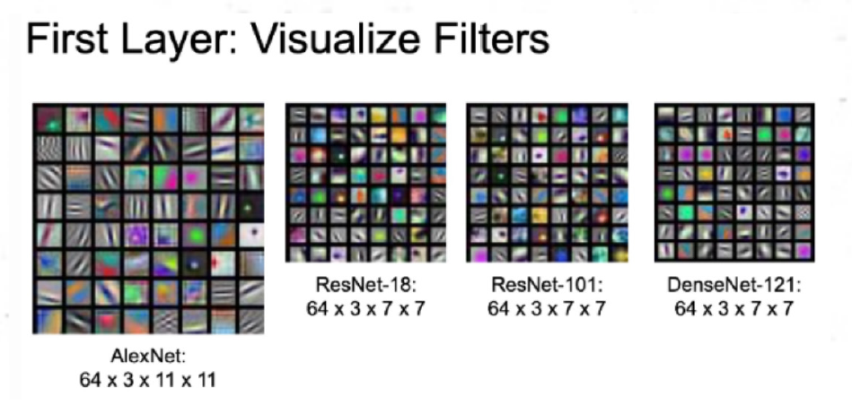
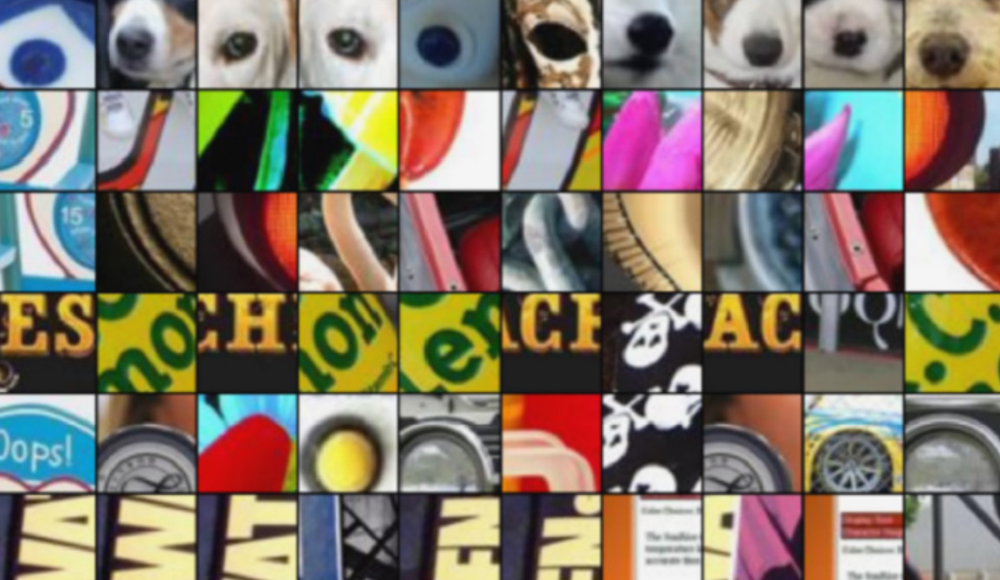
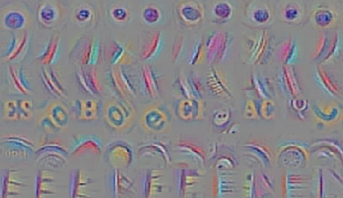

# Explainable AI (XAI)

شاید برای شما هم این سوال پیش آمده باشد که الگوریتم‌های هوش مصنوعی دقیقا بر چه اساسی کار می‌کنند؟ چقدر قابل اطمینان هستند و بر چه مبنایی تصمیم می‌گیرند؟  
امروزه با گسترده شدن کاربرد شبکه‌های عصبی این سوالات بیشتر به وجود می‌آیند. درست است که ما در حوزه‌های بسیاری از مدل‌های یادگیری ماشین استفاده می‌کنیم ولی آیا در مسائل بسیار حساسی مانند تشخیص پزشکی و … هم می‌توانیم به این مدل‌ها اطمینان کنیم؟ علت اصلی عدم اطمینان ما به این مدل‌ها علیرغم دقت بالایشان، ندانستن نحوه تصمیم‌گیری آن‌هاست.

ابزار هوش مصنوعی قابل توضیح (Explainable Artificial Intelligence-XAI) به ما در یافتن پاسخ این سوالات کمک می‌کنند. به نمونه‌های ساده‌ای از این موارد در شبکه‌های عصبی می‌پردازیم.

در شبکه‌های عصبی اگر وزن‌های لایه‌های اول را تصویرسازی کنیم، به اشکال ساده‌ای می‌رسیم که برای تشخیص ویژگی‌های سطح پایین تصویر مانند لبه‌ها، اشکال هندسی ساده و … است ولی اگر لایه‌های عمیق‌تر مدل را تصویر کنیم به تفسیر خاصی از ورودی اولیه مدل نمی‌رسیم و فقط می‌توانیم ورودی آن لایه را تفسیر کنیم. 

    

یک راه برای فهمیدن اینکه مدل به چه پیکسل‌هایی از ورودی حساس است و براساس آنها تصمیم می‌گیرد، به وسیله تغییراتی در ورودی صورت می‌گیرد به این صورت که در تصویر ورودی بلوک‌هایی قرار می‌دهیم  و می‌بینیم که ایجاد آنها چه تاثیری روی خروجی شبکه می‌گذارد برای مثال در تصاویر پایین توزیع احتمالاتی خروجی آخر (احتمال هر دسته) در دسته‌بندی (classification) چگونه تغییر می‌کند.

	

یک روش دیگر در دسته‌بندی، گرفتن مشتق خروجی لایه آخر(امتیاز هر دسته (class score))  نسبت به پیکسل‌های تصویر ورودی می‌باشد. به زبان ساده می‌خواهیم بدانیم تغییرات کدام پیکسل‌ها در تصاویر ورودی تغییر بیشتری روی امتیاز هر دسته ‌می‌گذارد.  
از همین روش می‌توانیم برای فهمیدن اینکه هر نورون در لایه‌های عمیق نسبت به چه ورودی حساس است، استفاده کنیم با این تفاوت که بجای گرفتن مشتق خروجی لایه آخر، مشتق آن نورون را نسبت به پیکسل‌های ورودی می‌سنجیم. 

در شکل‌ پایین در هر ردیف ابتدا ورودی‌هایی را یافته که خروجی یک نورون به ازای آن ورودی‌ها زیاد است و سپس دامنه‌ای از تصویر ورودی که آن نورون دریافت می‌کند (receptive field) را جدا می‌کنیم.

	

سپس با استفاده از روشی که توضیح داده شد مشخص می‌کنیم که نسبت به کدام یک از پیکسل‌ها حساسیت بیشتری دارد.

	

   
به صورت کلی روش‌های تفسیر و توضیح پذیری همچنان محدودیت‌های بسیاری دارند و نیازمند توسعه بیشتر هستند و به همین دلیل از حوزه‎‌های پررونق این دوره به شمار می‌روند.
