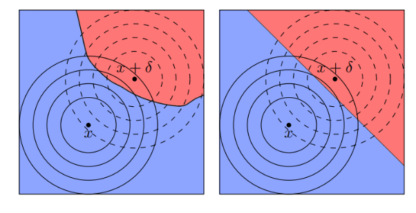

یک مسئله جالب در یادگیری ماشین، **یادگیری ماشین تضمین شده (Certified)** است. این مسئله به ما می‌گوید یک شبکه عصبی که چیزی جز یک Function Approximator نیست، اگر به ازای ورودی $x$ جواب درستی می‌دهد؛ آیا تضمینی برای درستی جواب به ازای $x+\delta$ برای دلتاهای کوچک می‌دهد یا خیر؟ 

در این متن قرار است کار آقای cohen را بررسی کنیم .می‌توانید به این [لینک](https://arxiv.org/abs/1902.02918) نیز برای بررسی دقیق‌تر مراجعه کنید.

از آنجایی که به ازای هر‌ $f(x)$ دلخواه، ما نمی‌توانیم تئوری خاصی بدهیم، یک ایده جالب برای صحبت کردن به صورت کلی انجام می‌دهیم. فرض کنید به ازای هر تابع ورودی دلخواه شما نتیجه آن یا  $f(x)$ را خروجی ندهید و به‌جای آن، به ازای بینهایت نقطه $x+\delta$ کلاسی که بیشترین بار تکرار می شود (احتمال بالاتری دارد) را خروجی دهید. دقت کنید که این رویکرد به ازای هر تابع دلخواهی قابل انجام است.

درواقع ما یک تابع جدید به اسم $g(x)$ می‌سازیم به‌طوری که آن‌را می‌توان به‌صورت  $g(x)=argmax_{c\in Y} P(f(x+\varepsilon)=c)$ تعریف کرد که  $\varepsilon \sim N(0,\sigma^2I)$ می‌آید. در واقع ما تابع را نرم (smooth) کرده‌ایم . در تصویر زیر عملا این smooth کردن را می توانید مشاهده کنید.  

    

تابع جدید ما خواص جالبی دارد. یک خاصیت جالب که cohen et. al آن را ثابت کرد این است که این تابع در یک شعاع، مقاوم (Robust) است؛ به این معنی که اگر در $x$ نتیجه درستی بدهد، در $x+\delta$ هایی که $R>||\delta||$ باشد نیز مقاوم است. شاید برایتان سوال باشد این مقدار $R$ چه چیزی است؟ Cohen et. al اثبات کرده است که این شعاع برابر با   
$$
R=\sigma^2(\phi^{-1}(pA)-\phi^{-1}(pB))
$$

است که در این فرمول $pA$ و $pB$ احتمال دو محتمل‌ترین کلاس‌ها هستند و $\phi^{-1}$ تابع توزیع تجمیعی معکوس توزیع نرمال است. 

برای تخمین زدن احتمال‌های دو کلاس محتمل می‌توان از روش‌های monte carlo و نمونه‌برداری استفاده کرد. در عمل اضافه‌کردن نویز و آموزش‌دادن مدل‌ها با نویز، یک روش موثر برای ساختن مدل‌های robust نسبت به حمله‌ها به شبکه‌های عصبی هستند. (کافی است $g$ را از روی $f$ دلخواه بسازید و به صورت اثبات پذیر می دانیم $g$ مقاوم است)
