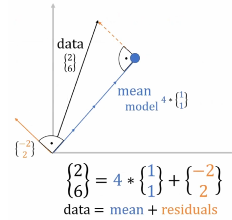

import Tooltip from '@site/src/components/Tooltip';

# اسیر درجهٔ آزادی
# یک‌بار برای همیشه؛ چرا $\frac{1}{n-1}$؟

اگر درس آمار و احتمال رو گذروندید، احتمالاً به رابطۀ
$s^2=\frac{1}{n-1}\sum{(x_i-\bar{X})^2}$
برای تخمین واریانس مجموعه‌ای از داده‌ها برخورده باشید. برای همه در نگاه اول تقسیم بر $n-1$ اتفاقی غیرمنتظره و غیرشهودی به‌نظر می‌رسه. عدۀ خوبی شاید با شنیدن جملۀ *«$n-1$ درجۀ آزادی است»* به‌همراه توضیحاتی غیر‌منسجم و گنگ از طرف استاد به‌راحتی از مسئله عبور  کرده باشند. اما شاید هم سؤالات بی‌جوابی مثل *«درجۀ آزادی یعنی چی؟»*، *«درجۀ آزادی رو چجوری حساب می‌کنن اصلاً؟»*، *«درجۀ آزادی چه ربطی به محاسبۀ واریانس داره؟»* و *«این فرمول عجیب درجۀ آزادی تو 
<Tooltip tip="Chi-Square test">**تست مربع کای**</Tooltip>
و
<Tooltip tip="T test">**تست تی**</Tooltip>
چی میگه؟»* گوشه‌ای از ذهن کنجکاو شما آزارتون می ده.

تحلیل کامل درجۀ آزادی و کاربردهاش، بر‌خلاف ظاهر ساده‌اش پیچیدگی‌های زیادی داره و از حوصلۀ متن خارجه. اما تلاش‌مون رو می‌کنیم که به افکار آشفته‌‌ای که احتمالاً دربارۀ این موضوع پیدا کردید، کمی ساختار بدیم. ابتدا سعی می‌کنیم تعریف دقیق‌تری از درجۀ آزادی ارائه بدیم و سپس برای فهم بیشتر در مورد ارتباط درجۀ آزادی با محاسبۀ واریانس عمیق می‌شیم.

## درجهٔ آزادی چیه؟

*«تعداد داده‌هایی در محاسبۀ نهایی یک آماره، که آزاد هستند تغییر کنند.»*
این تعریف رسمی‌ایه که از درجۀ آزادی یا Degree of Freedom توی آمار ارائه میشه. یک تعریف معادل خوب دیگه‌اش میشه: «تعداد داده‌های مستقلی که برای تخمین آماره استفاده می‌شود». ولی خب اینا اصلاً یعنی چی؟

فرض کنید که من $n$ متغیر‌ تصادفی مستقل رو مشاهده کردم، و بهتون می‌گم که میانگین متغیر‌ها برابر ۰ شده. حالا شما به چندتا از متغیر‌ها نیاز دارید 
تا مقدار کل متغیر‌ها رو متوجه بشید؟

درسته $n-1$ ای! چون با دونستن $n-1$ ای از متغیر‌ها و میانگین، می‌تونید متغیر $n$ اُم رو به شکل یکتا مشخص کنید. پس این‌جا می‌گیم که درجۀ آزادی متغیر‌های من، با داشتن میانگین، برابر $n-1$ هست، چون فقط $n-1$ تا از متغیر‌ها می‌تونن آزادانه تغییر کنند.

به عبارتی $n-1$ تا از متغیرها مستقل هستند، پس می‌گیم که درجۀ آزادی برابر $n-1$ هست. توجه کنید که این اتفاق به‌خاطر داشتن دانش اضافۀ میانگین رخ داد و اگه میانگین متغیر‌ها رو نداشتیم، همۀ متغیر‌ها مستقل می‌شدند. دقت کنید که موقع محاسبۀ واریانس هم اطلاعاتی که داریم، دقیقاً مشابه سناریوی بالاست. 

برای درک بهتر مفهوم، بیاید درجۀ آزادی سیستم مورد استفاده در تست مربع کای رو هم ببینیم.

توی این تست، یک جدول $n$ در $m$ داریم، که جمع مقادیر هر سطر و هر ستون رو در اختیار داریم. حالا به نظرتون با اطلاعاتی که فرض گرفتیم، به چند خونه از جدول برای بازسازی کل جدول نیاز داریم؟ 

با یکم تفکر می‌تونید ببینید که 
$(m-1)\times(n-1)$
خونه از جدول برای بازسازی کل جدول کافیه، که این با درجۀ آزادی‌ای که تو تست مربع کای داشتیم مطابقت داره.

    

یک شهود خوب دیگه اینه که فرض کنید $n$ متغیر به شکل یک بردار تصادفی $n$ بعدی بوده. این بردار توی یک فضای $n$ بعدی می‌تونه هر مقداری بگیره، اما وقتی که میانگین درایه‌ها (یا درواقع نرم-۱ بردار) رو داشته باشید، با یه‌کم جبرخ‌بازی می‌فهمید که این بردار فقط می‌تونه توی یک زیرصفحه‌‌ی $n-1$ بعدی قرار بگیره. پس یه تعبیر دیگه از درجۀ آزادی، بعد فضای دامنۀ این بردار تصادفی از داده‌هاست. از این شهود جلوتر استفاده می‌کنیم.

##  چرا $n$ نه؟

فرض کنید که $n$ تا 
<Tooltip tip="Sample">**نمونه**</Tooltip>
از یک توزیع (مثلاً نرمال با میانگین $\mu$ و واریانس $\sigma^2$) در اختیار داریم. تخمین زدن $\mu$ چالشی برامون نداره و کافیه میانگین نمونه‌ها ($\bar{X}$) رو حساب کنیم. تخمین‌گرمون بایاس نداره.

اما برای تخمین $\sigma^2$ قضیه سخت‌تره. در نگاه اول به‌نظر کافیه که مثل فرمول واریانس، میانگین مربع فاصلۀ سمپل‌ها تا میانگین رو حساب کنیم. اما سوال جالب این‌جاست که کدوم میانگین؟

**میانگین واقعی توزیع ($s^2 = \frac{1}{n}\sum{(x_i-\mu)^2}$)؟**

اگه میانگین واقعی رو داشتیم، بله. این روش جواب می‌داد و تخمین‌گر بدون بایاسی هست. اما ما میانگین واقعی توزیع رو نمی‌دونیم و فقط یک تخمین‌گر ازش داریم که به احتمال زیاد، برابر میانگین واقعی نیست.

**پس، تخمین‌گر میانگین ($s^2 = \frac{1}{n}\sum{(x_i-\bar{X})^2}$)؟**

در نگاه اول شاید منطقی به‌نظر برسه، اما این باعث می‌شه که به نوعی رابطۀ تخمین‌گر خودساخته‌ای از واریانس بسازیم و تخمین‌گرمون بایاس پیدا کنه.

## بایاس از کجا؟

بایاس از اون‌جا میاد که $\mu$ مقادیر مختلفی می‌تونه پیدا کنه، و طبق رابطۀ اصلی واریانس به ازای هر کدوم‌شون واریانس متفاوتی حساب می‌شه. یعنی اگر که واقعاً داشته باشیم $\bar{X} = \mu$ ، همه‌چی ردیفه. اما معمولاً این‌طور نیست. در واقع می‌شه دید که وقتی $\mu$ رو با $X$ جایگزین می‌کنیم، مقدار $s^2$ به کمترین مقدار خودش می‌رسه -یعنی داریم:

$$
\hat{X} = arg\,\underset{\hat{\mu}}{{max}}(\frac{1}{n}\sum{(x_i-\hat{\mu})^2})
$$

پس همواره داریم واریانس رو underestimate می‌کنیم و این باعث ایجاد بایاس رو به پایین می‌شه. جلوتر این رو بهتر نشون می‌بینیم.

## چرا درجهٔ آزادی آره؟

یک روش مرسوم رسیدن به رابطهٔ

$$
s^2 = \bar{X} = arg\,\underset{\hat{\mu}}{{max}}(\frac{1}{n}\sum{(x_i-\hat{\mu})^2})
$$

با استفاده از Bessel's Correction و محاسبۀ Bias هست، که همه‌ش جبریه و ربطی هم به درجۀ آزادی نداره. این‌جا سعی می‌کنیم روشی رو نشون بدیم که بیشتر ارتباطش با درجۀ آزادی ملموس باشه.

فرض کنید که $n$ متغیر تصادفی از توزیعی که می‌خواید واریانس‌شو تخمین بزنید گرفتید. حالا اون‌ها رو به شکل یک بردار $n$ بعدی ببینید. هم‌زمان توی شکل‌های زیر مثالی با ۲ داده (و در نتیجه یک بردار ۲ بعدی) داده شده.

اگر میانگین واقعی توزیع ($\mu$) رو داشتیم، کافی بود که این بردار رو از بردار $\mu \times \mathbf{1}$ کم کنیم (داده‌ها رو mean-centered کنیم)  و به بردار $X-\mu\mathbf{1}$ می‌رسیم. الان می‌تونید ببینید که مربع طول این بردار، $n$ برابر واریانس داده‌ها میشه. پس با محاسبهٔ طول بردار می‌تونیم واریانس رو حساب کنیم.

$$
length(X-\mu\mathbf{1}) = \sqrt{\sum_{i=1}^{n}{(X-\mu\mathbf{1})_{i}^2}}
$$

$$
\sigma^2 = \frac{1}{n} \sum_{i=1}^{n}{(X-\mu\mathbf{1})_i^2}
$$

$$
length(X-\bar{X}\mathbf{1})^2 = n\sigma^2
$$

اما حالا که میانگین رو نداریم، مجبوریم از میانگین $n$ متغیری که داریم ($\bar{X}$)، به‌عنوان تخمین میانگین استفاده کنیم. نکته‌ی جالب اینه که بردار $X-\bar{X}\mathbf{1}$ همیشه بر بردار $\bar{X}\mathbf{1}$ عموده. این رو با بررسی ضرب داخلی این دو بردار یا نگاه به شکل زیر متوجه می‌شید. 

    

پس وقتی بردار حاصل (residuals) همیشه بر بردار $\mathbf{1}$ عموده، همیشه توی یک زیرفضای $n-1$ بعدی قرار داره. تعبیر برداری درجۀ آزادی که معادل کاهش بعد هست رو دقیقاً می‌تونید این‌جا ببینید.

این، یعنی بر‌خلاف حالتی که $\mu$ رو می‌دونستیم و بر اساس داده‌ها واریانس رو برای یک بردار $n$ بعدی حساب می‌کردیم، این‌جا همیشه داریم از روی داده‌ها یک بردار $n-1$ بعدی می‌سازیم. به عبارتی، بردار $n-1$ بعدی residuals، سایۀ بردار $n$ بعدی errors هست. پس برای محاسبۀ واریانس باید مربع طول این بردار رو تقسیم بر بعدش ($n-1$) کنیم.

$$
len(X-\bar{X}\mathbf{1})^2 = (n-1)\sigma^2
$$

پس دیدیم که چجوری داریم با کم کردن تخمین‌مون از میانگین، به جای میانگین واقعی توزیع، ابعاد داده‌هامون رو یکی کاهش می‌دیم و به‌نوعی تخمین‌مون از واریانس توی یک بعد (درجۀ آزادی) کمتر داره انجام میشه. (توی شکل زیر توجه کنید که توی فضای $n$ بعدی، بردار residuals همیشه از mean کوچیک‌تره، که underestimate کردن شیوۀ اشتباه تخمین واریانس رو توجیه می‌کنه.  اما وقتی اونا رو به فضای $n-1$ بعدی پروجکت می‌کنیم،
هر دوشون یک اندازه‌اند.)

    

