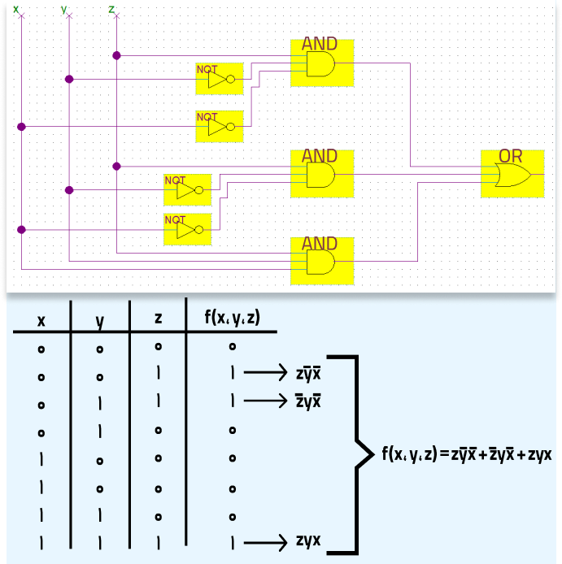

# منطق کامل

در این مقاله ابتدا تعریف منطقی را به همراه تعدادی مثال بیان می‌کنیم و منطق کامل بودن مجموعه‌ای از این توابع را تعریف می‌کنیم. سپس شروطی لازم برای منطق کامل بودن یک مجموعه دلخواه از توابع ارائه می‌دهیم و پس از آن کافی بودن این شروط را ثابت می‌کنیم.

---

## معرفی توابع منطقی

### تعاریف

به‌طور کلی، توابع منطقی دسته‌ای از توابع چند‌متغیره هستند که اگر در ورودی آن‌ها ۰ یا ۱ قرار گیرد، خروجی آن‌ها نیز ۰ یا ۱ خواهد بود. این توابع را این‌گونه نشان می‌دهیم:

$$
(1) \,\, n \in \mathbf{N} \cup \{0\}, f : \{0, 1\}^n \rightarrow \{0, 1\}
$$

از معروف‌ترین این توابع که در ساخت مدارهای منطقی کاربرد دارند، می‌توان به تابع‌های OR ،NOT ،AND اشاره کرد. از این به بعد برای نشان دادن نحوهٔ کار هر تابع، آن را با **جدول درستی** آن نشان می‌دهیم. جدول درستی سه تابع ذکر‌شده را در شکل ۱ می‌بینید. برای مثال، تابع AND تنها در صورتی برابر با ۱ می‌شود که هر دو ورودی آن برابر با ۱ باشند؛ و تابع OR تنها زمانی ۰ می‌شود که هر دو ورودی آن برابر با ۰ باشند.

    

	**شکل (۱)**

**مسئلهٔ ۱**. هر سهٔ این توابع را می‌توان به صورت یک چندجمله‌ای دو‌متغیره از ورودی‌هایشان نمایش داد. برای مثال AND(x, y) = xy. آیا می‌توانید بگویید چندجمله‌ای OR(x, y) چه خواهد بود؟

### آشنایی با جبر بول

برای نشان دادن ترکیب‌های مختلف توابع AND ،OR ،NOT که توابع ابتدایی ما هستند، نمادهایی تعریف می‌کنیم.

$$
(2) \,\, \left\{
\begin{align*}
x + y &:= \text{OR}(x, y) \\
xy = x \times y &:= \text{AND}(x, y) \\
\overline{x} &:= \text{NOT}(x)
\end{align*}
\right.
$$

حال می‌توانیم توابع مختلفی با استفاده از ترکیب این توابع با هم ایجاد کنیم. تعدادی از خواص این توابع را معرفی می‌کنیم که به دلخواه خود می‌توانید آن‌ها را اثبات کنید.

$$
\begin{align}
&1. \,\, (x + y) + z = x + (y + z)\,\,\,\,\,, &x(yz) = (xy)z \\
&2. \,\, z(x + y) = zx + zy \\
&3. \,\, x + x = x\,\,\,\,\,\,, &x \times x = x \\
&4. \,\, \overline{xy} = \overline{x} + \overline{y}\,\,\,\,\,\,\,\,, &\overline{x + y} = \overline{x} \times \overline{y}
\end{align}
$$

این تابع به‌ازای چه ورودی‌هایی برابر با ۱ می‌شود؟

$$
(3) \,\, f(x_1, x_2, x_3) = x_1 x_2 + x_2 x_3
$$

### ساخت همهٔ توابع با توابع ابتدایی

**قضیهٔ ۱**. هر تابع منطقی را می‌توانیم با ترکیب تعدادی از توابع AND ،OR ،NOT بسازیم. در این‌جا به اثبات دقیق این گزاره نمی‌پردازیم؛ اما مثالی از تبدیل تابعی به ترکیبی از توابع ساده‌تر در شکل ۲ می‌زنیم تا خودتان با استفاده از آن، گزاره را در حالت کلی ثابت کنید.

    

	**شکل (۲)**

---

## منطق کامل

### تعریف و مثال

**تعریف ۱**. به مجموعه‌ای از توابع منطقی، منطق کامل گفته می‌شود اگر که بتوان با استفاده از آن توابع و ترکیبشان با یکدیگر، تمام توابع منطقی را تولید کرد.

برای مثال مجموعهٔ توابع $\{AND(x, y), OR(x, y), NOT(x)\}$ منطق کامل بودند، اما OR(x, y) توسط دو تابع دیگر قابل‌ساخت است. داریم:

$$
(4) \,\, OR(x, y) = NOT(AND(NOT(x), NOT(y))), x + y = \bar{(\bar{x} \times \bar{y})}
$$

پس می‌توانیم بگوییم که مجموعهٔ توابع $\{AND(x, y), NOT(x)\}$ نیز منطق کامل هستند. تابع جدیدی معرفی می‌کنیم:

$$
(5) \,\, NAND(x, y) := NOT(AND(x, y))
$$

با استفاده از تابع NAND، می‌توانیم توابع AND و NOT را بسازیم:

$$
\begin{align*}
(6)& \,\, NOT(x) = NAND(x, x) \\
(7)& \,\, AND(x,y) = NAND(NAND(x,y), NAND(x,y))
\end{align*}
$$

و بدین‌ترتیب ثابت کردیم که مجموعهٔ $\{NAND(x, y)\}$ نیز یک منطق کامل است.

**مسئلهٔ ۳**. ثابت کنید مجموعهٔ توابع زیر نیز منطق کامل هستند:
- $\{OR(x,y),NOT(x)\}$
- $\{NOT(OR(x,y))\}$

### ناوردا

**مسئلهٔ ۴**. توابع زیر را در نظر بگیرید:

$$
\begin{align*}
&(8)\,\, &f_1(x,y,z) &= xy+yz \\
&(9)\,\, &f_2(x,y) &= x+y \\
&(10)\,\, &f_3(x) &= 1 
\end{align*}
$$

آیا مجموعهٔ این توابع می‌تواند منطق کامل باشد؟

جواب این مسئله، خیر است. تابعی در نظر بگیرید که اگر تمام ورودی‌هایش ۱ باشد خروجی آن برابر با ۰ باشد. به نظر شما، آیا این سه تابع قادر به ساختن آن خواهند بود؟

$$
\begin{align*}
&(11)\,\, f_1(1,1,1) = 1 + 1 = 1 \\
&(12)\,\, f_2(1,1) = 1 + 0 = 1 \\
&(13)\,\, f_3(1) = 1 
\end{align*}
$$

این سه تابع اگر تمام ورودی‌هایشان برابر ۱ باشد، خروجی‌شان نیز برابر با ۱ خواهد بود. پس هر چقدر این توابع را با هم ترکیب کنیم، تابع ساخته‌شده نیز این خاصیت را خواهد داشت.(چرا؟)

این خاصیت، روی ترکیب توابع **ناوردا** است. اگر که همهٔ توابع مجموعه در این خاصیت صدق کنند، هر ترکیبی از این توابع نیز در این خاصیت صدق می‌کند. در این بخش، ۵ خاصیت معرفی خواهیم کرد که نسبت به ترکیب توابع دارای آن خاصیت، بسته هستند.

1. **حفظ یک**. اگر تمام ورودی‌های تابع برابر با ۱ باشد، خروجی آن نیز ۱ شود.
2. **حفظ صفر**. اگر تمام ورودی‌های تابع برابر با ۰ باشد، خروجی آن نیز ۰ شود.
3. **صعودی بودن**. به ازای هر وضعیتی از ورودی‌های تابع، اگر که یک ۰ را در میان ورودی‌ها به ۱ تبدیل کنیم، خروجی کم نشود؛ یعنی اگر خروجی ۱ بود به ۰ تبدیل نشود.
4. **خود-دوگان**. به ازای هر حالت ورودی‌های تابع، اگر تمام ورودی‌ها را نقیض کنیم (اگر ۰ بود ۱ کنیم و اگر ۱ بود ۰ کنیم)، خروجی تابع نیز نقیض شود.
5. **خطی بودن**. اگر تابع در یکی از شرایط زیر صدق کند، به آن خطی گفته می‌شود:
	- **تابع، برابر XOR تعدادی از متغیرهایش باشد (این تعداد می‌تواند ۰ باشد):**

	$$
	(14) \,\, f(x_1,x_2,\dots,x_n) = XOR(x_{i_1},x_{i_2},\dots,x_{i_m})
	$$

	- **تابع، برابر نقیض XOR تعدادی از متغیرهایش باشد (این تعداد می‌تواند ۰ باشد):**
	
	$$
	(15) \,\, f(x_1,x_2,\dots,x_n) = XOR(x_{i_1},x_{i_2},\dots,x_{i_m},1)
	$$

----

## ساخت همهٔ توابع منطقی با تعدادی تابع

ابتدا با یک مسئلهٔ ساده شروع می‌کنیم.

**مسئلهٔ ۵**. فرض کنید تابع منطقی $f$ عضو کلاس توابع حفظ‌کنندهٔ یک، حفظ‌کنندهٔ صفر و خود-دوگان نباشد. ثابت کنید این تابع منطق کامل است.

**اثبات**. برای اثبات منطق کامل بودن یک تابع، کافی‌ست مجموعه‌ای از توابع را با آن بسازیم که می‌دانیم منطق کامل هستند. برای مثال اگر بتوانیم NOR یا NAND را بسازیم، اثبات کرده‌ایم که تابع ما نیز منطق کامل است.

می‌دانیم که تابع ما خود-دوگان نیست. این گزاره یعنی ورودی‌هایی وجود دارند که اگر همهٔ آن‌ها را نقیض کنیم، تابع نقیض نشود.

$$
(16) \,\, \exists x_1,\dots,x_n \in \{0,1\}; g(x_1,\dots,x_n)=g(\neg x_1,\dots,\neg x_n)
$$

دقت کنید که چون تابع $f$ حفظ‌کنندهٔ صفر و حفظ‌کنندهٔ یک نبود، پس این ورودی، ورودی تمام صفر یا تمام یک نیست.

حالا به تابع‌مان به این نحو ورودی دهید: برای ورودی i ام، اگر xi برابر با یک بود $a$، و در غیر این صورت $b$ را قرار دهید. تابع حاصل یک تابع برحسب $a$ و $b$ مانند $g(a, b)$ است. حالا طبق تعریف، مقادیر $g$ ‌به ازای ورودی‌های مختلف را بررسی می‌کنیم:

$$
\begin{align*}
1.& \,\, g(0,0) = f(0,\dots,0) = 1  \\
2.& \,\, g(1,1) = f(1,\dots,1) = 0  \\
3.& \,\, g(1,0) = g(0,1)
\end{align*}
$$

حالا اگر $g(1, 0) = g(0, 1) = 0$ باشد، در واقع تابع $g$ ‌همان NOR است و در غیر این صورت همان NAND است! پس ما با استفاده از این تابع یک مجموعه از توابع منطق کامل ساختیم، در نتیجه خود $f$ منطق کامل است.

حالا می‌خواهیم به مسئلهٔ اصلی این بخش بپردازیم:

**مسئلهٔ ۶**. اگر $A$ مجموعه‌ای از توابع منطقی باشد، و به ازای هر کدام از کلاس‌های توابع حفظ‌کنندهٔ صفر، حفظ‌کنندهٔ یک، صعودی، خود-دوگان و خطی، تابعی در $A$ وجود داشته باشد که عضو آن کلاس نباشد، آن‌گاه مجموعهٔ $A$ منطق کامل است.

**زیرمسئلهٔ ۱**: اگر $A$ مجموعه‌ای از توابع منطقی باشد و به ازای هر کدام از کلاس‌های توابع حفظ‌کنندهٔ صفر، حفظ‌کنندهٔ یک، صعودی و خود-دوگان، تابعی در $A$ وجود داشته باشد که عضو آن کلاس نباشد، آن‌گاه با این توابع می‌توان صفر، یک و NOT را ساخت.

**حالت ۱:
تابعی مانند $f$ در $A$ وجود داشته باشد که حفظ‌کنندهٔ صفر و حفظ‌کنندهٔ یک نباشد.**

	- **ساخت NOT**: چون تابع $f$ حفظ‌کنندهٔ صفر و حفظ‌کنندهٔ یک نیست، داریم:
	$$
	\left.
	\begin{align*}
	f(0, \dots, 0) &= 1 \\
	f(1, \dots, 1) &= 0
	\end{align*}
	\right\}
	\Rightarrow \forall a \in \{0, 1\}; f(a, \dots, a) = \neg a
	$$

	- **ساخت صفر و یک**: از طرفی تابعی مانند $g$ در $A$ هست که خود-دوگان نباشد، یعنی:
	$$
	\exists x_1, \dots, x_n \in \{0, 1\}; g(x_1, \dots, x_n) = g(\neg x_1, \dots, \neg x_n)
	$$

	حالا به تابع‌مان به این نحو ورودی دهید: برای ورودی $i$ ام، اگر $x_i$ برابر ۱ بود $a$، و در غیر این صورت $\neg a$ را قرار دهید. تابع حاصل یک تابع برحسب $a$ مانند $h(a)$ است. طبق تعریف $h(a) = h(0) = h(1)$. حالا اگر $h(a) = 1$ باشد، آن‌گاه یک را ساختیم و با استفاده از تابع NOT که ساختیم، صفر هم داریم. و اگر $h(a) = 0$ آن‌گاه صفر را ساختیم و با استفاده از تابع NOT که ساختیم، یک هم داریم.

**حالت ۲:
دو تابع مختلف مانند $f$ و $g$ در $A$ وجود داشته باشند كه $f$ حفظ‌کنندهٔ صفر نباشد و حفظ‌کننده یک باشد، و $g$ حفظ‌کنندهٔ یک نباشد، ولی حفظ‌کنندهٔ صفر باشد.**

	- **ساخت صفر و یک**: طبق فرض $f(a, \dots, a) = 1$ و $g(a, \dots, a) = 0$ که یعنی صفر و یک ساخته شده‌اند.

	- **ساخت NOT**: از طرفی تابعی مانند $h$ در $A$ وجود دارد که صعودی نیست. یعنی به ازای یک ورودی، برابر یک است، ولی اگر یکی از ورودی‌های صفر آن را به یک تبدیل کنیم خروجی تابع برابر با صفر می‌شود (بدون کاهش کلیت مسئله فرض می‌کنیم این اتفاق برای ورودی اول می‌افتد). یعنی:
	$$
	(19) \,\, h(0, x_2, \dots, x_n) = 1 \wedge h(1, x_2, \dots, x_n) = 0
	$$
	حالا که صفر و یک را ساخته‌ایم، می‌توانیم به تابع‌مان همان $x_i$های خاص را ورودی دهیم. تابع زیر را در نظر بگیرید:
	$$
	(20) \,\, k(a) = h(a, x_2, \dots, x_n)
	$$
	طبق تعریف داریم:
	$$
	(21) \,\, \left\{
	\begin{align*}
	k(0) &= h(0, x_2, \dots, x_n) = 1 \\
	k(1) &= h(1, x_2, \dots, x_n) = 0
	\end{align*}
	\right.
	$$
	که یعنی این همان تابع NOT است.

**زیرمسئلهٔ ۲**: اگر تابع $f$ خطی نباشد، مجموعهٔ
$\{f, 0, 1, NOT\}$ منطق کامل است. ابتدا یک
تعریف معادل برای خطی بودن یک تابع
می‌آوریم، اما به اثبات آن نمی‌پردازیم.

- **قضیهٔ ۲**. تابع منطقی $f$ خطی است اگر و تنها
اگر ورودی‌های آن به دو دسته افراز شوند.
ورودی‌هایی که مستقل از بقیهٔ ورودی‌ها،
تأثیری در خروجی نمی‌گذارند و ورودی‌هایی
که مستقل از بقیهٔ ورودی‌ها، نقیض کردنشان
منجر به نقیض شدن خروجی تابع می‌شود.

حالا تابع $f$ مطابق فرض خطی نیست. این یعنی
یکی از ورودی‌های $f$ (بدون کاستی از کلیت
مسئله، در نظر می‌گیریم ورودی اول) هست
که نقیض کردن آن به ازای رشته‌ای از سایر
ورودی‌ها تأثیری در خروجی تابع نداشته باشد
و به ازای رشته‌ای دیگر، نقیض کردن آن
خروجی تابع را نیز نقیض کند، یعنی:

$$
(22) \,\, \left\{
\begin{align*}
\exists (x_1, \dots, x_n); f(a, x_1, \dots, x_n) &= f(\neg a, x_1, \dots, x_n) \wedge \\
\exists (y_1, \dots, y_n); f(a, y_1, \dots, y_n) &= \neg f(\neg a, y_1, \dots, y_n)
\end{align*}
\right.
$$

حالا تابع $g(a, b)$ را به این صورت تعریف
می‌کنیم: $a$ را به ورودی اول $f$ بدهید. برای
ورودی $i$ ام $f$، اگر $x_i = y_i$، خود همان عدد را
ورودی می‌دهیم (چون به صفر و یک دسترسی
داریم). اگر $x_i = 1, y_i \neq x_i$، آنگاه $b$ را به عنوان
ورودی می‌دهیم. و اگر $x_i = 0, y_i \neq x_i$، آنگاه $\neg b$ را
ورودی می‌دهیم (چون به NOT دسترسی
داریم).

طبق این تعریف، $g(0, 0) \neq g(1, 0)$ و $g(0, 1) = g(1, 1)$.
این یعنی جدول درستی این تابع در سه تا از
ستون‌ها یکسان و در دیگری متفاوت است
که یعنی تابع $g$ به یکی از صورت‌های
$a+b$، $a+\neg b$، $\neg a+b$، $\neg a+\neg b$، $a.b$، $a.\neg b$، $\neg a.b$، $\neg a.\neg b$
است. با استفادهٔ مناسب از تابع NOT در
ورودی‌های این تابع می‌توان این تابع را به
یکی از توابع $a + b$ یا $a . b$ تبدیل کرد. چون
تابع NOT هم در اختیار داریم، با توابع‌مان یک
مجموعهٔ منطق کامل ساخته‌ایم.

