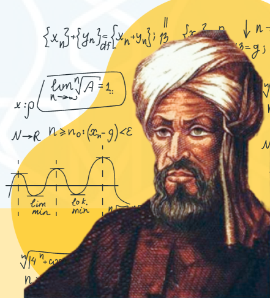
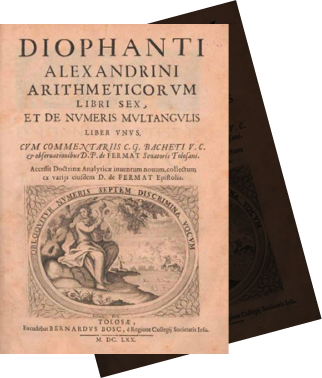
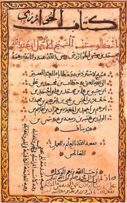

محمد بن موسی خوارزمی، ریاضی‌دان، ستاره‌شناس، فیلسوف، جغرافی‌دان و مورخ شهیر ایرانی در قرن هشتم و نهم میلادی است.

او در زمینۀ جبر، کتابی با عنوان **«حساب الجبر و المقابله»** نوشت که در آن برای اولین بار حل نظام‌مند معادلات خطی و درجۀ دوم ارائه شد. خوارزمی از روش‌های جبری و هندسی برای حل شش نوع معادلۀ استاندارد استفاده کرد. این اثر را می‌توان مشهورترین و مهم‌ترین اثر خوارزمی دانست. این کتاب در حقیقت اولین کتاب نوشته‌شده در زمینۀ جبر در تاریخ است. در نتیجه، خوارزمی با نگارش این کتاب لقب **«پدر جبر»** را از آن خود کرد.

کتاب دیگر او که در مورد انجام محاسبات با اعداد هندو است، در حدود سال ۸۲۵ میلادی نوشته شد. این کتاب را می‌توان اولین کتاب سیستم شماره‌گذاری هند در خاورمیانه و سپس اروپا دانست که در قرن دوازدهم با نام «Algoritmi de numero Indorum» به لاتین ترجمه شد. در این آثار، در نگاه اول ردپای چندانی از ریاضیات پیشرفته مشاهده نمی‌شود، اما با نگاهی عمیق‌تر درمی‌یابیم که مفاهیم مطرح‌شده بسیار انتزاعی و عمیق هستند. او در آثار ریاضیاتی خود مفهوم اعداد طبیعی را معرفی کرد که این مفاهیم همچنان در علم ریاضیات پرکاربرد هستند.

اعداد هندو-عربی برای تاریخ محاسبات مهم هستند، زیرا از سیستم اعشاری با پایۀ ده استفاده می کنند. این سیستم عددی زیربنای فناوری محاسبات مدرن است و انقلابی در ریاضیات بود که هرگونه اعمال محاسباتی پیشرفته را مقدور ساخت. نوشته‌های او نه‌تنها به پیشرفت ریاضیات کمک شایانی کرد، بلکه بر پیشرفت زبان نیز تأثیر گذاشت.

خوارزمی برای حل سوالات، مفهوم الگوریتم‌ها را پایه‌گذاری کرد. وی اولین توضیحات مفصل را برای استفاده از نماد اعشاری برای انجام چهار عمل اساسی (جمع، تفریق، ضرب و تقسیم) و محاسبات اعشاری را ارائه داد. آن‌چه که زندگی پربار خوارزمی را در میان دیگران برجسته می‌سازد، شیوۀ وی برای گسترش هر دانشی بر پایه سنجش، گزینش و ترکیب همۀ یافته‌های موجود در یک ساختار قابل گسترش است؛ تفکر نظام‌مند او برای حل مسائل از طریق ترتیبی از مراحل، مفهوم الگوریتم را ایجاد کرد.

واژۀ «الگوریتم» نیز از نوشته‌های او سرچشمه می‌گیرد که درحقیقت ترجمۀ کلمۀ «algarismo» در زبان پرتغالی است و برگرفته از تلفظ لاتین اسم الخوارزمی است. در واقع، الگوریتم به قوانین مورد استفاده برای انجام محاسبات با استفاده از سیستم عددی هندو-عربی اشاره دارد.

در نتیجه، علاوه بر **«پدر جبر»** از او به عنوان **«پدربزرگ علوم کامپیوتر»** نیز یاد می‌شود.

از آن‌جایی که علم در قرون وسطی در اروپا در خفقان بود و حتی کلیسا استفاده از اعداد غیر یونانی را ممنوع کرده بود، ترجمه‌های علمی او از علم حساب و جبر، چند قرن بعد از درگذشت او به اروپا رسید و سیستم اعداد اعشاری و جبر را به آنان معرفی کرد. آثار او در ریاضیات، منبع اصلی دانش ریاضی قرن‌های آینده در شرق و غرب بود.

اواخر قرن نوزدهم بود که الگوریتم به معنای مجموعه‌ای از قوانین گام‌به‌گام برای حل یک مسئله معرفی شد. در قرن بیستم آلن تورینگ، ریاضیدان و دانشمند کامپیوتر بریتانیایی، از نظر تئوری بررسی کرد که چگونه یک ماشین می‌تواند دستورالعمل‌های الگوریتمی را دنبال کرده و ریاضیات پیچیده را حل کند که پس از خوارزمی یک نقطۀ عطف تاریخی برای علوم کامپیوتر به حساب می‌آید.

