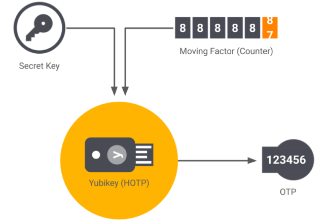
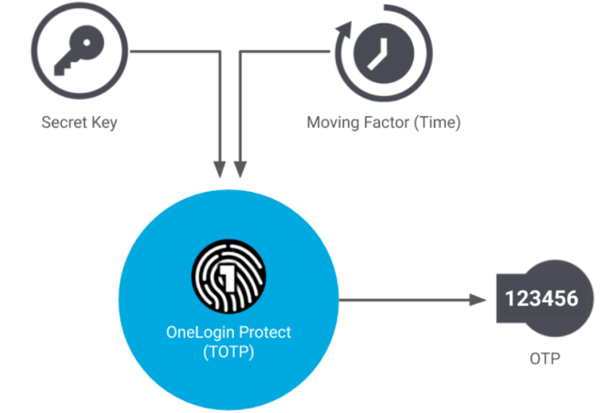

# از شمارنده تا زمان‌بندی؛

# بررسی OTPهای مبتنی بر زمان و شمارنده

امروزه، همۀ ما در دنیای دیجیتال نیاز داریم که امنیت حساب‌های کاربری‌مان تضمین شود. شرکت‌های مختلف، هر یک راهکارهای خاص خود را برای تأمین این امنیت در نظر گرفته‌اند، اما چیزی که بیشتر شرکت‌ها بر سر آن توافق دارند، استفاده از احراز هویت دوعاملی (2FA - Two-Factor Authentication) است که به خط دفاع اصلی ما در برابر هکرها و افرادی تبدیل شده است که رمز عبور حساب‌های ما را در اختیار دارند. احراز هویت دوعاملی روش‌های مختلفی دارد؛ برای مثال، تلگرام از یک گذرواژۀ ثابت برای این منظور استفاده می‌کند. اما رایج‌ترین روش‌های احراز هویت دوعاملی، استفاده از خانوادۀ رمز یک‌بارمصرف (OTP - One-Time Password) است؛ یعنی رمزهای کوتاهی که تنها یک بار و در بازۀ زمانی محدودی قابل استفاده هستند. در این متن قرار است با سه عضو معروف این خانواده آشنا شویم و مزایا و معایب هر یک را بررسی کنیم.

## الگوریتم HOTP: HMAC-Based One-Time Password

این الگوریتم بر مبنای HMAC و یک شمارندۀ مشترک بین کلاینت و سرور Authenticator طراحی شده است. کلمۀ HMAC مخفف Hash-based Message Authentication Code است که یک الگوریتم رمزنگاری برای تضمین اصالت داده‌ها هنگام انتقال آن‌ها به شمار می‌رود. بنابراین، زمانی که از HMAC استفاده می‌کنیم، مطمئن هستیم که داده‌ها واقعاً از سوی فرستندۀ اصلی ارسال شده‌اند و در مسیر انتقال کسی آن‌ها را تغییر نداده است (Integrity). به طور کلی، HMAC از دو عنصر استفاده می‌کند: یک کلید مخفی که بین طرفین تعیین شده و یک تابع هش مانند SHA-256. الگوریتم HMAC به این صورت عمل می‌کند که ابتدا داده را با یک کلید داخلی که از کلید مخفی اولیه مشتق شده ترکیب می‌کند و سپس آن را Hash می‌کند. پس از آن، نتیجۀ به‌دست‌آمده را با یک کلید داخلی دیگر، که آن هم از کلید مخفی اولیه مشتق شده، ترکیب کرده و مجدداً Hash می‌کند و نتیجۀ نهایی را برمی‌گرداند. این نتیجۀ نهایی همان HMAC ماست! اما دلیل استفاده از این ساختار Hash چیست؟ این ساختار باعث می‌شود حتی اگر کسی تابع  Hash ما را شناسایی کند، بدون داشتن کلید مخفی نتواند HMAC را جعل کند.

باید بدانید که HMAC بین کلاینت و سرور هنگام ثبت‌نام تبادل می‌شود و در سیستم کلاینت ذخیره می‌شود.

همچنین، به ازای هر کاربر، در سرور و سیستم کاربر یک شمارنده وجود دارد که با هر بار تولید OTP، این شمارنده یک عدد افزایش می‌یابد. نحوۀ کارکرد این الگوریتم به این صورت است که اپلیکیشن سمت کلاینت و سرور، با استفاده از شمارنده (C) و کد مخفی (K) یک هش SHA تولید می‌کند و آن را به یک تابع Truncate می‌سپارد. تابع Truncate نیز بر اساس قرارداد، شش یا پنج رقم آخر آن را به عنوان OTP شناسایی کرده و بازمی‌گرداند. همچنین، با هر درخواست، شمارنده (C) یک عدد افزایش می‌یابد.

تولید OTP در این روش کاملاً آفلاین است و هیچ نیازی به اینترنت یا همگام‌سازی زمانی ندارد که این موضوع یک مزیت محسوب می‌شود. با این حال، ناهمگام شدن شمارنده در این روش یکی از مشکلات اساسی به شمار می‌رود. فرض کنید کلاینت چندین بار رمز تولید کند اما از آن‌ها استفاده نکند. در این حالت، شمارندۀ کلاینت از شمارندۀ سرور جلوتر خواهد بود و دیگر نمی‌توان از OTPها استفاده کرد. در چنین وضعیتی، نیاز است شمارندۀ کلاینت و سرور مجدداً با هم همگام شوند؛ البته این کار همچنان به دلیل وجود کلید مخفی، امن است، اما تجربۀ کاربری مناسبی ارائه نمی‌دهد.

---

## الگوریتم TOTP: Time-Based One-Time Password

قطعاً تا به حال برایتان پیش آمده‌است که قصد ورود به حساب کاربری گیت‌هاب خود را داشته باشید و پس از وارد کردن رمز عبور، با پیغامی جدید مواجه شوید که از شما می‌خواهد برای حساب خود احراز هویت دوعاملی (2FA) را فعال کنید. 

ناچار می‌شوید یک نرم‌افزار Authenticator روی سیستم یا موبایل خود نصب کنید و سپس یک کد QR که گیت‌هاب به شما داده است را اسکن نمایید. پس از انجام این کار، OTP مربوط به گیت‌هاب نیز به لیست OTPهای آن برنامۀ Authenticator اضافه می‌شود.

در دفعات بعدی که قصد ورود به حساب گیت‌هاب خود را دارید، مجبور خواهید بود یک کد OTP از داخل آن برنامه بردارید و در سایت گیت‌هاب وارد کنید. شاید تا به حال به این نکته توجه نکرده باشید، اما می‌توانید کدهای OTP موجود در برنامۀ Authenticator را بدون اتصال به اینترنت یا دریافت ایمیل و پیامک دریافت کنید! گیت‌هاب برای سیستم 2FA خود از الگوریتم TOTP استفاده می‌کند، که در ادامه با آن آشنا خواهیم شد.

این الگوریتم نسخۀ بهبودیافته‌ای از HOTP است که مشکل ناهمگام شدن شمارنده را با اضافه کردن پارامتر زمان حل کرده است. مانند الگوریتم قبلی، در اینجا هم یک کلید مخفی داریم که هنگام ثبت‌نام بین کلاینت و سرور تبادل می‌شود (همان QR Code که گیت‌هاب به شما ارائه می‌دهد تا آن را اسکن کنید). در این روش، OTP بر اساس کلید مخفی و تعداد بازه‌های زمانی از یک زمان مبدأ مشترک تولید می‌شود. رمزها در بازه‌های زمانی ۳۰ ثانیه‌ای معتبر هستند و پس از آن دیگر اعتبار ندارند. تولید شمارندۀ الگوریتم HMAC در این روش به این صورت است که زمان فعلی یونیکس را بر یک عدد ثابت از پی ‌تعیین‌شده که نشان‌دهندۀ طول عمر OTP است، تقسیم می‌کنیم.

زمان فعلی یونیکس (Unix Timestamp) به عددی گفته می‌شود که نشان می‌دهد از اول ژانویهٔ سال ۱۹۷۰ میلادی (معروف به Epoch) چند ثانیه گذشته است! این زمان‌سنجی در دنیای کامپیوتر بسیار پرکاربرد است و یک روش ساده و دقیق برای ذخیره و مقایسۀ زمان در برنامه‌های مختلف به شمار می‌رود.

استفاده از Unix Timestamp، پیچیدگی همگام‌سازی زمان بین کلاینت و سرور را نیز از بین می‌برد و دیگر نیازی به همگام کردن زمان کلاینت و سرور نیست. باقی فرآیند تولید OTP کاملاً مشابه با الگوریتم HMAC است و می‌توان به صورت کاملاً آفلاین OTP تولید کرد. 

در حال حاضر، شرکت‌های متعددی مانند Github، Microsoft و دیگران از این روش برای پیاده‌سازی 2FA استفاده می‌کنند.

---

## استفاده از Push-OTP و SMS-OTP و Email-OTP

معروف‌ترین و قدیمی‌ترین روش استفاده از  OTP، همین نوع است که همۀ ما روزمره از آن استفاده می‌کنیم. این روش به این صورت عمل می‌کند که یک کد یک‌بارمصرف در سمت سرور تولید شده و از طریق ایمیل، پیامک (SMS) یا Push-Notification به دست کاربر می‌رسد و می‌توان از آن به عنوان احراز هویت دوعاملی (2FA) استفاده کرد. 

از معایب این روش، نیاز به اتصال به اینترنت  یا شبکۀ تلفن همراه است.

این روزها OTP دیگر فقط محدود به TOTP و HOTP نیست، بلکه روش‌های جدیدتری معرفی شده‌اند که هم امنیت بالاتری دارند و هم استفاده از آن‌ها راحت‌تر است. مثلاً کاری که جیمیل در Push-based OTP انجام داده این است که به جای تایپ کردن یک کد شش‌رقمی، فقط کافی است یک اعلان را روی گوشی خود تأیید کنید. Biometric OTP یک قدم جلوتر رفته و از چهره یا اثر انگشت فرد برای ساخت یک رمز مخصوص استفاده می‌کند که جعل آن بسیار  سخت است.

استفاده از QR Code OTP نیز یکی از روش‌های جدید است که تلگرام برای ورود به حساب‌های کاربری از آن بهره می‌برد. این روش به این صورت عمل می‌کند که یک QR Code را با اپلیکیشن مخصوص اسکن می‌کنید و رمز یک‌بارمصرف همان‌جا تولید می‌شود؛ این روش در ورود به تلویزیون‌های هوشمند نیز بسیار کاربرد دارد. در کنار همۀ این‌ها، OTPهایی وجود دارند که مبتنی بر کلیدهای سخت‌افزاری هستند. به عنوان مثال می‌توان به YubiKey اشاره کرد که یک کلید سخت‌افزاری بسیار معروف و ایمن است.
