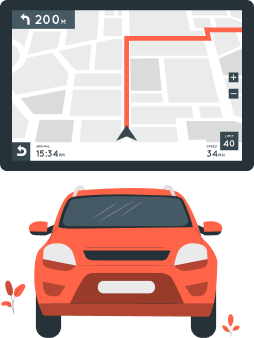

:::tip[آیا می‌دانید]
  <h2 className="card-title">
    ## اولین ویروس، بی‌خطر بود!
  </h2>
  

    در سال ۱۹۷۱، اولین ویروس رایانه‌ای جهان ساخته شد. این ویروس که{' '}
    Creeper داشت، صرفاً به عنوان یک آزمایش طراحی شده بود تا
    ببینند این ویروس چگونه بین رایانه‌ها پخش می‌شود.
  

  

    عملکردش فقط این بود که پیامی نمایش دهد:{' '}
    «من Creeper هستم، اگه می‌تونی منو بگیر!»
  

  

    اولین ویروسی که واقعاً در فضای آزاد منتشر شد، ویروسی به نام{' '}
    Brain بود. این ویروس هم آسیبی نداشت، اما اولین ویروس
    مخصوص رایانه‌های IBM PC به حساب می‌آمد.
  

:::

:::tip[آیا می‌دانید]
  <h2 className="card-title">
    ## تکنولوژی در خودروهای امروزی
  </h2>
  

    

    

      تعداد خطوط کد در یک خودروی معمولی از فیسبوک نیز بیشتر است.
      امروزه خودروها به‌طور فزاینده‌ای به فناوری وابسته شده‌اند، از سامانه‌های
      سرگرمی گرفته تا قابلیت‌های رانندگی خودکار، خودروها با
      فناوری‌های پیشرفته‌ای به بازار عرضه
      می‌شوند.
      بازار خودرو امروزه بیش از هر زمانی به
      فناوری وابسته شده است.
    

  

:::

:::tip[آیا می‌دانید]
  <h2 className="card-title">
    ## CAPTCHA
  </h2>
  

    CAPTCHA مخففی طولانی است.
    این واژه مخفف عبارت:  
    “Completely Automatic Public Turing test to Tell Computers and Humans Apart”  
    به معنای: «آزمون عمومی کاملاً خودکار تورینگ برای تشخیص انسان از رایانه» است.
  

:::

:::tip[آیا می‌دانید]
  <h2 className="card-title">
    ## آیا لوگوی فایرفاکس روباه است؟
  </h2>
  

    

    

      نشان مرورگر فایرفاکس در واقع تصویر روباه نیست! تا حدی هم درست است. بسیاری تصویر می کنند چون نام این مرورگر «Firefox» است، تصویر لوگو نیز باید روباه باشد.
      این تصور هم درست و هم نادرست است؛ و البته تقصیر موزیلاست!
      در حقیقت، حیوان پشمالوی موجود در لوگو در ابتدا یک پاندا قرمز بود. اما با گذر زمان، تیم سازنده مرورگر آن را «روباه» نامیدند.
    

  

:::

:::tip[آیا می‌دانید]
  <h2 className="card-title">
    ## اولین لوگوی اپل
  </h2>
  

    

    

      نخستین لوگوی شرکت اپل چیزی نبود که انتظار دارید. در ابتدا، تصویر آیزاک نیوتن را نشان می‌داد که زیر درختی نشسته بود و سیبی در آستانه افتادن روی سرش قرار داشت.

        لوگو در سال ۱۹۷۶ طراحی شد و عبارتی در حاشیه آن نوشته شده بود: **«نیوتن... ذهنی که تا ابد در دریاهای عجیبِ اندیشه سفر می‌کند... تنها».**
    

  

:::

:::tip[آیا می‌دانید]
  <h2 className="card-title">
    ## استفاده از PlayStation3، نه برای بازی!
  </h2>
  

    

      دولت ایالات متحده از پلی‌استیشن ۳ استفاده می‌کرد اما نه برای بازی. در سال ۲۰۱۰، نیروی هوایی ایالات متحده از ۱۷۶۰ دستگاه پلی‌استیشن ۳ برای ساخت اَبَررایانه برای وزارت دفاع استفاده کرد. دلیل این انتخاب، صرفه جویی در هزینه، انرژی و سازگاری بیشتر آن با محیط زیست بود.
    

  

:::

:::tip[آیا می‌دانید]
  <h2 className="card-title">
    ## کبوتر یا اینترنت؟
  </h2>
  

    

    تا سال ۲۰۱۰، کبوترهای نامه‌بر از اینترنت سریع‌تر بودند!

    در یک آزمایش برای مقایسهٔ سرعت آپلود، یک کبوتر نامه‌بر با یک فلش USB حاوی  ۴ گیگابایت اطلاعات، مسافت ۵۰ مایل (۸۰ کیلومتر) پرواز کرد تا اطلاعات را به شرکت ارائه‌دهندهٔ اینترنت برساند و همان فایل از طریق اینترنت نیز ارسال شد. کبوتر در یک ساعت به مقصد رسید، اما آپلود بیش از دو ساعت طول کشید!
    

  

:::

:::tip[آیا می‌دانید]
  <h2 className="card-title">
    ## صفحه کلید QWERTY یا Dvorak؟
  </h2>
  

    

    

      چیدمان QWERTY صفحه‌کلید در ابتدا برای کاهش سرعت تایپ طراحی شده بود. در دوران ابتدایی ماشین‌تحریر، تایپ سریع باعث گیر کردن دکمه‌ها می‌شد. چیدمان QWERTY با فاصله‌دادن میان حروف پرکاربرد، سرعت تایپ را کاهش می‌داد تا از گیر کردن کلیدها جلوگیری شود.
      
      اگر به‌دنبال یادگیری چیدمانی سریع‌تر هستید، صفحه‌کلید Dvorak برای سرعت بالا طراحی شده است.
    

  

:::

:::tip[آیا می‌دانید]
  <h2 className="card-title">
    ## ساعت آیفون
  </h2>
  

    

    

      در تمامی تبلیغات آیفون، ساعت **۹:۴۱** نمایش داده می‌شود. علت این موضوع آن است که در سال ۲۰۰۷، استیو جابز برای نخستین بار آیفون را در همین ساعت معرفی کرد. ارائه او دقیقاً ۴۱ دقیقه به‌طول انجامید و دقیقاً در ساعت **۹:۴۱** صبح، نخستین تصویر آیفون نمایش داده شد. از آن زمان، اغلب تصاویر تبلیغاتی آیفون با ساعت **۹:۴۱** همراه هستند.
    

  

:::

:::tip[آیا می‌دانید]
  <h2 className="card-title">
    ## گاراژ و شرکت‌های بزرگ
  </h2>
  

    

      بیشتر شرکت‌های موفق امروزی فعالیت خود را از یک گاراژ آغاز کرده‌اند.
      
      جالب است بدانید که افزون بر شرکت اپل، شرکت‌های بزرگ دیگری مانند HP، گوگل و مایکروسافت نیز در ابتدا در یک گاراژ ساده تأسیس شده‌اند.
    

  

:::
