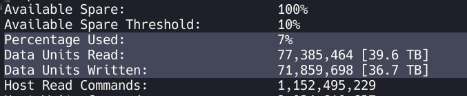

# حافظه‌های بی‌حفاظ

قابل توجه دوستان عزیزو و فنیم یه چیزایی رو توضیح بدم بهتون جالبه.

حافظه‌های ssd طبق نرخ تحمل‌شون قیمت‌گذاری میشن و عملا بعد از یه مدتی خونه‌های حافظه‌شون خورده میشه! (حالا توی درس معماری دکتر اسدی یه سر کوچیکی می‌زنید به این داستان) ssd‌ها بر مبنای تعداد بیت نگهداری شده در هر خونه‌شون دسته‌بندی میشن.

- **SLC : Single Layer Cell**
- **DLC : Double Layer Cell**
- **TLC : Triple Layer Cell**
- **QLC : Quad Level Cell**

این‌ها انواع این نوع حافظه‌ها هستن که به ترتیب از اولی تا پایینی این شکلیه که یک بیت به ازای هر خونه، دو بیت، سه بیت و چهار بیت داده رو توی هر خونه نگهداری می‌کنند.

باتوجه به همین مسئله از بالا به پایین ارزون‌تر و با توجه به مدارات و نرخ نویز افزوده برای تمایز بیت‌ها، از پایین به بالا کارایی و سرعت بالاتر هست و دوام خونه‌ها افزایش پیدا می‌کنه (این افزایش‌ها گاها نمودارهای نمایی داره) حافظه‌های با کیفیت عادی که دست من و شماست معمولا از نوع TLC و معمولی‌ترها از نوع QLC هستن.
کلا این‌طوریه که کارخونه‌ها برای این که دوام حافظه‌شونو با یه عدد بتونن بیان کنن میان میگن در این حافظه کلا در مجموع چقد می‌تونی بنویسی و همون‌طوری که مشاهده می‌کنید، من در طی ۵ سالی که این لپتاپ رو دارم تقریبا ۳۷ ترابایت بهش نوشتم (احتمالا ۲ ۳ ترابایتش به خاطر OS و چند هسته‌ای
باشه :))) )

و همین‌طور این خونه‌ها وقتی خراب میشن، خود حافظه یه سری خونه رو دست نخورده نگه می‌داره تا موقعی که یه خونه خراب میشه ازش استفاده بکنه.

اون ۱۰ درصد و ۷ درصد که اون پایین می‌بینید هم نشون‌دهنده همین مسئله است و خب نکته این‌جاست که وقتی این درصد از ۱ و ۲ رد میشه، کارایی ssd تون هم شروع به افت شدید می‌کنه!

راستی اگه خواستید بلایی که سر حافظه‌تون آوردید رو ببینید می‌تونید از دستور زیر استفاده کنید:

```bash
sudo smartctl -a /dev/nvme0
```

<div style={{ textAlign: "center" }}></div>
