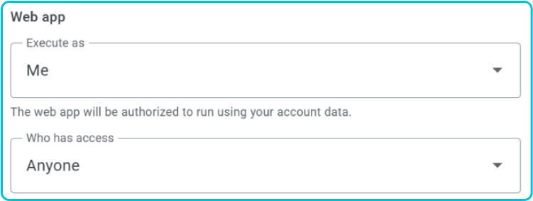
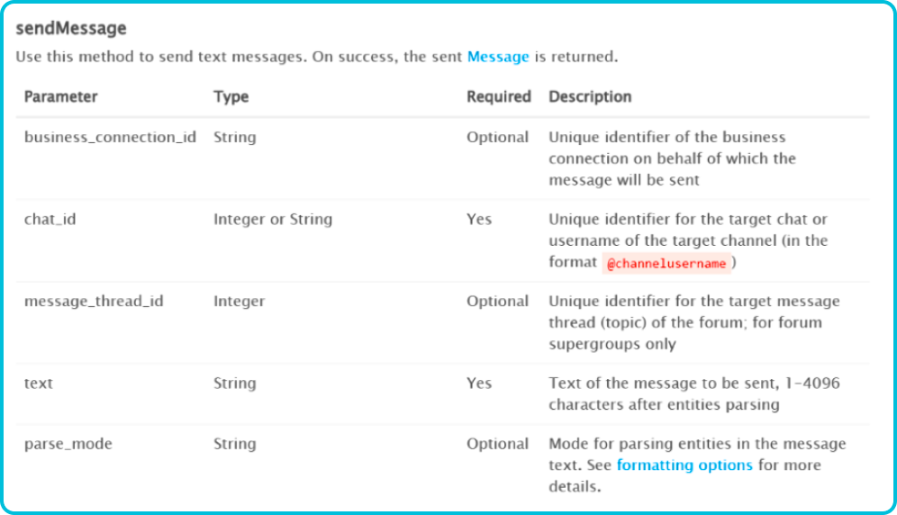

شاید شما هم تا حالا به سرتون زده باشه که بخواین یک ربات تلگرام بسازین، اما با روش‌های ساخت اون زیاد آشنا نباشین. توی این متن می‌خوایم به چند روش برای ساخت ربات تلگرام از جمله روش‌های رایگان اشاره کنیم.

الان احتمالاً اگر از یک بچۀ ۴ ساله هم بپرسیم که یک زبان برنامه‌نویسی معرفی کن، بی‌درنگ به پایتون اشاره می‌کنه. ربات تلگرام هم از این قاعده مستثنی نیست و یکی از دم‌دستی‌ترین روش‌هاش، استفاده از کد پایتون به حساب می‌آد. برای ساخت ربات تلگرام با پایتون می‌تونین از کتابخونه‌های زیادی استفاده کنین که معروف‌ترین‌هاش `python-telegram-bot` ،`telethon` ،`aiogram` و `telebot` هستن.

یکی از نکته‌هایی که جا داره برای `telethon` بهش اشاره کنیم، نیاز به `api_id` و `api_hash` هست. شما می‌تونین با مراجعه به سایت [my.telegram.org](https://my.telegram.org)، بخش مربوط به API Dev tools رو پر کنین و در نهایت `api_id` و `api_hash` رو دریافت کنین، اما این پایان ماجرا نیست! چرا؟ چون احتمالاً از داخل ایران نتونین به این سادگی این کار رو انجام بدین و ممکنه نیاز داشته باشین که شخصی دیگه از کشوری که تلگرام داخلش محدودیتی نداره، این کار رو براتون انجام بده. البته کاربرد این api بسیار فراتر از ربات تلگرام هست و با استفاده از این api می‌تونید به اکانت خودتون هم دسترسی داشته باشین. از اون‌جایی که `api_id` و `api_hash` قابل غیرفعال کردن نیستن، توصیه می‌کنم اگر نیاز داشتید، یک شمارۀ مجازی تهیه کنین و از دوست‌هاتون بخواید که برای اون اکانت api بگیرن.

دربارۀ زدن کدهای پایتون بیشتر توضیح نمی‌دم، چون خیلی منبع براش زیاده. از سورس‌های موجود در اینترنت گرفته تا یار عزیزمون (ChatGPT). حالا که کد پایتون رو زدین، باید اجراش کنین. خودم هم می‌دونم که چشم‌بسته غیب گفتم، ولی خب معمولاً دستگاه خودتون برای این کار جوابگو نیست، چون تا کوچک‌ترین مشکلی در اتصال به اینترنت به وجود بیاد قطع می‌شه. خب حالا چه کاری می‌تونیم کنیم؟ یکی از راه‌های موجود، تهیۀ سرور مجازیه که کد پایتون‌تون رو داخلش اجرا کنید، اما معمولاً برای استفاده‌های جزئی هزینه‌بره. پس انتخاب بهتر چیه؟ یک انتخاب دیگه، تهیۀ همون سرورها، اما به صورت ساعتیه و در نهایت گزینۀ اصفهانی‌مون برای پایتون، سایت [pythonanywhere](https://www.pythonanywhere.com/) هست. این سایت یک‌سری قابلیت مقدماتی رو به‌صورت رایگان ارائه می‌ده که تا حدی شبیه به همون سرور مجازیه، اما یکی از مشکلاتش اینه که احتمالاً کدتون بعد از گذشت زمانی حدود یک روز، متوقف بشه و مجبور بشید دوباره اجراش کنید؛ اما به‌طور کلی گزینۀ جالبی به حساب می‌آد.

نوبتی هم که باشه، نوبت روش اصلی‌ای هست که این‌جا می‌خوایم بهش اشاره کنیم و اون هم سرویس Google Script هست. این سرویس سه مزیت اصلی رو به ما ارائه می‌ده:
- کاملاً رایگانه. همیشه بالاست.
- به سادگی میشه از Google Sheets داخلش استفاده کرد.
- مورد آخر شاید کمی عجیب به نظر برسه، اما معمولاً به کار میاد، چون شما می‌تونین به سادگی داخل داده‌ها تغییر ایجاد کنین و خیلی راحت اون‌ها رو در حالی که بات بالا هست، بخونین.

راستی تا یادم نرفته، زبانش هم تقریباً همون JavaScript هست.

حالا چجوری ازش استفاده کنیم؟ شما اول می‌تونین وارد [sheets.new](https://sheets.new) بشین که یک شیت جدید براتون ساخته بشه. توی پرانتز این رو هم بگم که اگر با این روش آشنا نبودین، به‌طور مشابه می‌تونین وارد [docs.new](https://docs.new) ،[slides.new](https://slides.new) و… هم بشید که یک فایل جدید براتون باز کنه. در گام بعدی کافیه از تب Extensions وارد Apps Script بشین.

توی این محیط شما می‌تونین کدهاتون رو بزنین. برای اجرای تابع‌ها به صورت تکی، کافیه از منوی بالا انتخاب‌شون کنین و دکمۀ Run رو بزنین؛ اما اگر می‌خواین تغییرات‌تون روی خود اون WebApp هم اعمال بشه، باید Deploy کنین. اولین بار کافیه New Deployment بزنین و تنظیماتش رو به‌صورت زیر انتخاب کنین:

<div style={{textAlign: 'center'}}></div>

برای دفعه‌های بعدی هم کافیه توی Manage Deployments، دکمۀ Edit رو بزنین و یک ورژن جدید تعریف کنین. راستی، توی این محیط بهتره که بی‌خیال ورودی گرفتن به صورت دستی بشین :).

----

ما می‌خوایم توی این آموزش به روش پایه‌ای بات رو پیاده‌سازی کنیم و کاری به چیزهای آماده نداشته باشیم. حالا شیوۀ کلی کارمون چیه؟ این ربات ما هر کاری که انجام می‌ده (یا در اصل پیام‌هایی که می‌فرسته)، با fetch کردن یک URL در قالب زیر صورت می‌گیره:

```url
https://api.telegram.org/bot<TOKEN>/<METHOD>
```

حالا ما به سادگی می‌تونیم این URLها رو تشکیل بدیم. برای دریافت توکن که به سادگی می‌تونین وارد [BotFather@](https://t.me/BotFather) بشین و بعد از ساخت ربات‌تون، اون رو دریافت کنین. برای `METHOD` هم، خود مستندات تلگرام، بهترین منبع به حساب می‌آن. بریم با هم یک نمونه تابعش رو پیاده‌سازی کنیم.

<div style={{textAlign: 'center'}}></div>

توی تصویر بالا، بخشی از توضیحات مربوط به تابع `sendMessage` آورده شده. خب همون‌طور که می‌بینین، پارامترهای اجباری اون، `chat_id` و `text` هستن. پس پیاده‌سازی تابع `sendMessage` می‌تونه به این شکل باشه:

```javascript
var TOKEN = 'ENTER_YOUR_TOKEN_HERE';
var TELEGRAM_URL = 'https://api.telegram.org/bot' + TOKEN;

function fetchAndLogUrl(url) {
	var response = UrlFetchApp.fetch(url);
	Logger.log(response.getContentText());
}

function sendMessage(receiverID, textMessage) {
	var url = TELEGRAM_URL + '/sendMessage?' +
		'chat_id=' + receiverID +
		'&text=' + encodeURIComponent(textMessage);
	fetchAndLogUrl(url);
}
```

پس چی‌کار کردیم؟ اول Telegram URL رو تشکیل دادیم. بعد اسم تابع‌مون (`sendMessage`) رو نوشتیم. بعدش علامت سوال گذاشتیم و در ادامه پارامترها رو دونه دونه بهش دادیم. این پارامترها با نماد `&` از هم‌دیگه جدا می‌شن. 
حالا یک سوال اساسی پیش میاد. تلگرام از کجا باید بفهمه اتفاقاتی که سمت ربات می‌افته رو به ما توی این‌جا نشون بده؟ این‌جاست که بحث Webhook می‌آد وسط. ما اول باید یک بار پروژه‌مون رو Deploy کنیم که بتونیم WebApp URL بگیریم ازش. بعد با استفاده از تابع `setWebhook` به تلگرام می‌گیم که هرچی ربات دریافت کرد رو به این WebApp بفرست:

```javascript
function setWebhook() {
	var url = TELEGRAM_URL + "/setWebhook?url=" + WEBAPP_URL;
	fetch(url);
}
```

به‌طور مشابه اگر بخوایم این سرویس رو قطع کنیم، باید از `deleteWebhook` استفاده کنیم. حالا شاید براتون سوال بشه که وقتی WebApp ما پیام رو دریافت کنه، چه تابعی صدا زده میشه؟ این تابع `doPost` هست. شما به‌صورت زیر می‌تونین ازش استفاده کنین:

```javascript
function doPost(e) {
	var contents = JSON.parse(e.postData.contents);
}
```

یک بار که برای خودتون `contents` رو چاپ کنین، متوجه ساختار محتواش می‌شین و دستتون راه می‌افته. مثلاً برای پیدا کردن آیدی عددی فرستنده و محتوای پیام، می‌تونین از متغیرهایی به‌صورت زیر استفاده کنین:

```javascript
var sender_id = contents.message.from.id;
var text = contents.message.text;
```

خب دیگه از این‌جا به بعد دستتون بازه که هر کاری خواستین با رباتتون انجام بدین. قابلیت‌های زیادی هم داخل این سرویس قابل‌استفاده هستن. یک نمونۀ ساده‌ش که احتمالاً به کارتون بیاد، استفاده از **state** برای وضعیت کاربرهاست. مثلاً فرض کنین می‌خواین اول به کاربر بگین اسمش رو بفرسته و بعدش هم بگین فامیلی‌ش رو بفرسته. خب توی چنین شرایطی باید وضعیت کاربر رو هم نگه دارین. مثلاً وضعیت انتظار برای وارد کردن نام خانوادگی. یکی از روش‌ها به این شکله:

```javascript
function handleMessage(chat_id, text) {
	var sender_id = chat_id;
	var content_text = text;
	var userProperties = PropertiesService.getUserProperties();
	var state = userProperties.getProperty(chat_id);

	if (text === '/start') {
		userProperties.setProperty(chat_id, 'started');
		sendMessage(sender_id, START_MESSAGE);
	} else if (state === 'started') {
		userProperties.setProperty(chat_id, 'awaiting_name');
		sendMessage(chat_id, GET_NAME_MESSAGE);
	} else if (state === 'awaiting_name') {
		userProperties.setProperty(chat_id, 'awaiting_last_name');
		sendMessage(chat_id, GET_LAST_NAME_MESSAGE);
	} else if (state === 'awaiting_last_name') {
		userProperties.deleteProperty(chat_id);
		sendMessage(chat_id, SUCCESS);
	}
}
```

اگر یادتون باشه، گفتیم یکی از مزایای این روش، سهولت استفاده از Google Sheets هست. الان می‌خوایم با هم‌دیگه کمی دربارۀ این هم صحبت کنیم. برای این کار همون‌طور که انتظار می‌ره، تابع‌های آمادۀ خیلی خوبی موجودن. ما این‌جا صرفاً به دو تابع مقدماتی برای خوندن و نوشتن اشاره می‌کنیم. یکی از ساده‌ترین روش‌ها برای خوندن، استفاده از قطعه کد زیره. شما با این کد می‌تونین کل محتوای شیت مدنظر رو داخل یک آرایۀ دو بعدی بریزین و از این به بعد صرفاً به چشم یک آرایۀ دو بعدی بهش نگاه کنین. مثلاً می‌تونین روی اون حلقه بزنین و یا کارهای دیگه‌ای بکنین.

```javascript
var spreadSheet = SpreadsheetApp.openById(SPREADSHEET_ID);
var sheet = spreadSheet.getSheetByName(SHEET_NAME);
var data = sheet.getDataRange().getValues();

for (var i = 0; i < data.length; i++) {
	// loop
}
```

برای نوشتن هم یکی از روش‌های ساده می‌تونه به صورت زیر باشه که به طور مستقیم روی یک سلول بنویسین:


```javascript
var cell = sheet.getRange(row + 1, column + 1);
cell.setValue(value);

var row = [Field_A, Field_B, Field_C];
sheet.appendRow(row);
```

بی‌شمار تابع کاربردی دیگه هم هستن که با کمی جست‌وجو، به‌سادگی پیداشون می‌کنین.

یکی دیگه از چیزهایی که ممکنه توی ساخت ربات با این روش نیاز داشته باشین، کار با فایله. توی محیط گوگل اسکریپت، به طور مستقیم نمی‌تونین بارگذاری یا بارگیری فایل رو انجام بدین، اما باز هم یک جایگزین اصفهانی روبه‌روی شماست. شما می‌تونین از استوریج استفاده کنین. به عنوان مثال، بعضی از شرکتا به شما استوریج ۵ گیگی رو به صورت رایگان ارائه می‌دن. شما می‌تونین دانلود و آپلود فایل رو با استوریج انجام بدین.

و بالاخره این آموزش تموم شد. همون‌طور که گفته شد، ما این‌جا صرفاً ساده‌ترین گزینه‌ها رو بررسی کردیم تا با مسیر اولیه آشنا بشین و بعدش متناسب با نیازتون، موارد کاربردی‌تر بیشتری پیدا کنین که از امکانات خاص‌تر بهره‌مند بشین.
