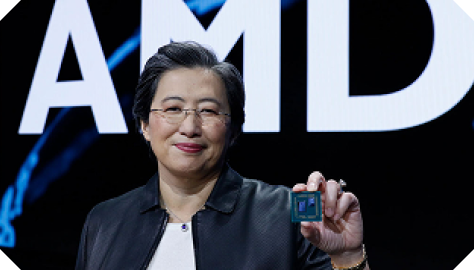
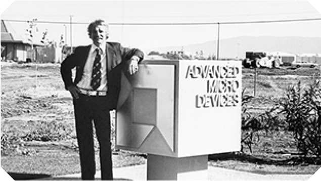
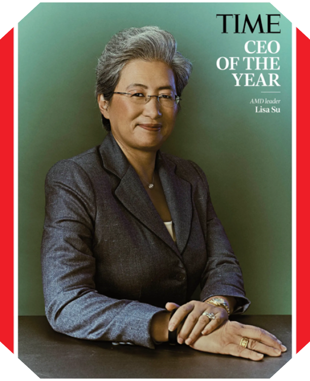

## پردهٔ اول: سیستم‌ها چگونه خود را نابود می‌کنند؟

برای یک کارآفرین اهمیتی ندارد که چرا یک نیاز برای انسان‌ها ایجاد شده‌است، او فقط به دنبال پاسخی برای آن نیاز می‌رود تا منافع مالی و روحی خود را تأمین کند! اما این شرط همان‌قدر که شرطی لازم برای تولد یک کارآفرین است، به همان اندازه شرط لازم برای بقای او است! این شرط در نتیجۀ رعایت یک اصل دنبال می‌شود که در یک جمله خلاصه می‌شود به «هرچه مشتری می‌خواهد» و با یک رویکرد قابل اجراست، و آن نوآوری است!

بزرگ‌ترین نقطۀ قوت یک کارآفرین، ایدۀ نوآورانۀ او نیست، بلکه توان و انگیزۀ او برای اجرایی کردن آن ایده است! اما این نقطۀ قوت، چاقویی است که می‌تواند دسته‌اش را نیز ببرد! گاهی اوقات کارآفرین‌‌ها و به بیان دقیق‌تری استارتاپ‌ آن‌ها، آن‌قدر درگیر کارهای اجرایی می‌شوند که این اصول را فراموش می‌کنند و بدون این‌که بدانند، ناگهان خود را در باتلاق ایده‌هایی که روی آن قسم می‌خوردند، می‌بینند!

داستان ما از این‌جا آغاز می‌شود! جایی پس از شروع، که تمام انرژی خود را آن‌جا خرج کردید! جایی پس از قله، که فکر می‌کنید جاودانه هستید! و در واقع جایی در درۀ نابودی که فکر می‌کنید اتفاقات خارج از اختیار شما هستند! جایی که فقط ذهنیت یک کارآفرین توانست تفاوتی از جنس میلیاردها دلار رقم بزند و شرکتی را که در سطل‌های زبالۀ وال استریت ۲ دلار معامله می‌شد را به ارزش هر سهم بیش از ۱۰۰ دلار برساند!

**داستان یک منجی به نام لیسا سو و نجات‌یافته‌ای به نام AMD!**

## پردهٔ دوم: داستان AMD

AMD در سال ۱۹۶۹ در ایالات متحدۀ آمریکا تأسیس شد و کار خود را با هدف تولید پردازنده‌های ارزان‌ و رقابتی‌ آغاز کرد. این شرکت به مرور زمان با معرفی محصولات خلاقانه و باکیفیت، به یکی از بزرگ‌ترین بازیگران در صنعت پردازش کامپیوتری تبدیل شد. این شرکت فراز و فرودهای زیادی را پشت‌سر گذاشت و اشتباهاتی کرد که در دهۀ ۲۰۱۰ میلادی، شرکت را تا مرز نابودی پیش برد.

    

	**جری سندرز، هم‌بنیان‌گذار AMD**

این شرکت در رقابت با Intel، گاهی اوقات محصولات بهتری ارائه می‌داد، گاهی هم شکست می‌خورد، اما در دوره‌ای گاها کارهایی کردند که فقط اشتباه نبودند بلکه عجیب غریب هم بودند!

سال‌های ابتدایی قرن ۲۱ بود که AMD با تراشه‌های ارزان و قدرتمندش از Intel قوی‌تر ظاهر شده بود، اما سبک مدیریتی حاکم بر این شرکت، آن‌ها را تله‌های ذهنی‌ای گرفتار کرده‌بود که قدرت درک موقعیت فعلی و آیندۀ شرکت را از آنان گرفته بود.

این شرکت آن‌قدر بر رقابت با Intel متمرکز بود که از توسعۀ زیرساخت‌هایش جا مانده بود. زمان زیادی نگذشت که Intel با معرفی پردازنده‌های جدید و سریع‌تر، جایگاه خود را در بازار پس گرفت، حال آن‌که در AMD، مشکلات تولیدی و کیفیتی پردازنده‌ها باعث کاهش سهم بازار این شرکت شد. خریدهای غیرمعقول این شرکت نیز اوضاع را وخیم‌تر کرده‌بود و با بحران‌های مالی آن دهه و تصاحب بازار از سوی Intel، سبد مشکلات AMD کامل شده بود.

## پردهٔ سوم: هرکسی به یک فرشتهٔ نگهبان نیاز دارد!

پیش از آن‌که از اقدامات منجی AMD در این شرکت سخن بگوییم، خوب است یک آشنایی اولیه با او نیز داشته باشیم.

لیسا سو، متولد ۱۹۶۹ در تایوان است که در دو سالگی به همراه خانواده‌اش به نیویورک مهاجرت کرد. پدرش تحلیل‌گر آماری و مادرش حسابدار بود. لیسا در مورد دوران کودکی خود می‌گوید:

> «من مثل بسیاری از کودکان آسیایی تربیت شدم. سخت درس می‌خواندم، سخت کار می‌کردم و مجبور بودم همیشه بهترین باشم. بزرگترین شکست من در چشم پدر و مادرم این بود که دست‌خط چینی‌ام افتضاح بود. همیشه در دست‌خط نمرۀ C می‌گرفتم و این، آن‌ها را دیوانه می‌کرد.»

لیسا در دوران تحصیل در دبیرستان به نظم، پشتکار و داشتن روحیۀ رقابتی مشهور بود و همیشه جزو دانش‌آموزان برتر قرار داشت.

لیسا از نوجوانی به مهندسی برق و یادگیری دربارۀ نیمه‌رساناها و قطعات الکترونیکی علاقۀ زیادی نشان می‌داد و در نهایت بعد از پایان دبیرستان به MIT -برترین دانشگاه مهندسی دنیا- رفت تا در یکی از سخت‌ترین رشته‌ها، یعنی مهندسی برق، تحصیل کند.
لیسا تا مدرک دکترا در این رشته و دانشگاه تحصیل کرد و در مورد آن می‌گوید:

> «شاید تعجب کنید، اما پدر و مادرم ترجیح می‌دادند من پزشک شوم. زمان ما، منزلت پزشکی از هر شغل دیگری بالاتر بود، اما من از دیدن خون اذیت می‌شدم. آخر این شد که دکترا گرفتم که خب فکر می‌کنم جایگزین قابل‌قبولی برای حرفۀ پزشکی باشد.»

لیسا پس از فارغ‌التحصیلی و مدتی کار در یک آزمایشگاه تحقیقاتی به شرکت IBM رفت. وی ۱۳ سال در IBM کار کرد و به‌عنوان مهندس و رهبر یک تیم نقش خود را در این شرکت بزرگ -که در آن دوران در اوج خود قرار داشت- به بهترین شکل ایفا کرد. او به نایب‌رئیس بخش تحقیقات و توسعۀ نیمه‌هادی‌ها ارتقاء یافت و محصولات نوآورانه‌ای را برای IBM بنیان‌گذاری کرد.

لیسا از اولین پژوهش‌گرانی بود که به فناوری سیلیکون روی عایق یا SOI می‌پرداخت، موضوعی که در آن زمان هنوز در مراحل تحقیقاتی اولیه بود. از نمونه نوآوری‌های او جایگزینی اتصالات آلومینیومی -که در آن زمان بیشترین استفاده را در تراشه داشت- با مس بود.

این تغییر با توجه به فرصت‌هایی که به‌وجود می‌آورد، در نوع خود انقلابی در تراشه‌های IBM بود و این شرکت را تبدیل به یک شرکت پیشرو در این حوزه با مزیت‌های رقابتی بالا تبدیل کرد.

سو به عنوان یک مدیر و مهندس، دارای سطحی از دانش و توانایی بود که او را به فردی خاص در حوزۀ کاری تراشه‌ها تبدیل می‌کرد. او از دانش و همچنین تجربۀ کار با افراد بزرگ برخوردار بود. در واقع، سو به عنوان فردی شناخته می‌شود که هم علوم انسانی را خوب درک کرده و هم علوم طبیعی. از دیدگاه لیسا، مدیریت فقط مهارت نیست، بلکه یادگیری و آموزش نقش مهمی را در مدیریت ایفا می‌کنند.

## پردهٔ چهارم: فرشتهٔ نگهبان وارد می‌شود

لیسا سو در سال ۲۰۱۴ و پس از دو سال فعالیت به‌عنوان مدیر ارشد در AMD به عنوان رئیس و مدیر عامل این شرکت منصوب شد. همان‌طور که خواندید، این شرکت در آن زمان اصلا وضعیت مناسبی نداشت و به جز چند بازار محدود که در آن‌ها هم سود چشم‌گیری عایدش نمی‌شد، حرفی برای گفتن در حد و اندازۀ پیشروهای این صنعت نداشت.

در همین وضعیت، لیسا سو مدیر عاملی این شرکت را بر‌عهده گرفت. لیسا مسئولیت شرکتی را بر‌عهده گرفت که عملاً در حال غرق شدن در باتلاق ایده‌ها و تفکرات قدیمی بود، اما او این مسئولیت را این‌گونه تفسیر کرد:

> «من تمام زندگی حرفه‌ای‌ام را در حوزۀ نیمه‌هادی‌ها گذراندم، اما در آمریکا تعداد شرکت‌های بزرگ حوزۀ نیمه‌هادی بسیار کم است. برای همین از این‌که قرار بود مدیر AMD شوم، بسیار هیجان‌زده بودم.»

لیسا عاشق چالش و کارهای دشوار بود، کارهایی که به افرادی جسور با تصمیماتی قاطع نیاز داشتند؛ چالش‌هایی که هر یک به‌تنهایی کمر یک شرکت را خرد می‌کرد؛ در همین‌حال، سو با همان ویژگی‌های شخصیتی‌اش که نمونۀ بارز یک کارآفرین موفق است، وارد میدان شد تا بار دیگر ثابت کند او فقط یک دکتر، مهندس یا حتی مدیر نیست؛ بلکه او یک الهۀ کارآفرینی است!

لیسا در مورد وضعیت AMD در آن زمان می‌گوید:

> «ما با کمتر از یک درصد از سهم بازار شروع کردیم و آن زمان به‌نظر می‌رسید به پیشرفت بزرگی نیاز داشتیم. اما واقعیت این است که موفقیت در حوزۀ فناوری به شرط‌بندی‌های درست بستگی دارد و ما جزو اولین‌هایی بودیم که به سیر تحول محاسبات کامپیوتری در ۱۰ سال آینده فکر کردیم. همین باعث شد پیشرفت چشم‌گیری داشته باشیم.»

سو در روز اول کاری خود در AMD، نامه‌ای برای کارمندانش نوشت که به تنهایی یک کلاس درس کامل برای استارتاپ‌ها بود. سو در مورد این نامه می‌گوید:

> «در آن یادداشت طرحی ساده و سه‌اولویتی برای همۀ موارد بعدی وجود داشت: تمرکز مجدد بر ساخت محصولات عالی، بازسازی روابط عمیق با مشتری و ساده کردن هر کاری که انجام می‌دهیم، زیرا این احساس را داشتم که ما شرکتی کوچک تا متوسط ​​هستیم که مانند یک شرکت واقعاً بزرگ عمل می کنیم. بنابر‌این بخشی از فرهنگی که می‌خواستم بسازم، وضوح، تمرکز و جاه‌طلبی بود، اما همچنان ما باید سریع حرکت کنیم. ما باید چابک باشیم. این دستور ما برای موفقیت است.»

سو فهمید این شرکت در ساخت پردازنده برای محاسبات سنگین آیندۀ روشن‌تری دارد، پس پتانسیل‌های این شرکت را با وجود این‌که هر چرخۀ توسعۀ محصول ۳ تا ۵ سال طول می‌کشد، به همین سمت هدایت کرد. سو برای رابطۀ شرکت با مشتریان خود ارزش زیادی قائل بود و می‌گفت مشتری‌های‌مان باید قانع شوند ما یک نقشۀ جامع فناوری داریم که نیازهای آن‌ها را برطرف می‌کند. او در مورد این سیاست‌های خود می‌گوید:

> «آن روزها مهم‌ترین موضوع برای ما این بود که اول بازارهایی را شناسایی کنیم که آیندۀ خوبی داشتند. این‌که امروز چه کار می‌کنی مهم نیست؛ مردم به کاری که در طول سال‌ها انجام می‌دهی، توجه می‌کنند.»

سو عملاً یک ساختار جدید برای این شرکت ایجاد کرد تا بتواند راهبرد او در چابکی و نوآوری را به بهترین شکل اجرا کند. گویی خونی که در این شرکت جریان داشت، همان خونی بود که در بدن او بود! او هویت AMD را به درستی فهمیده بود و نوآوری‌ها و سیاست‌هایش نیز در همین راستا به نتایج درستی منتهی می‌شد.

> «برای یک شرکت فناوری، تصمیم‌گیری دربارۀ این‌که در چه حوزه‌هایی مهارت زیادی دارد، بسیار مهم است؛ چرا که باید در جایگاه خود بهترین باشی؛ یا رتبۀ اول یا دوم. کاری که باید بکنیم این است که DNA شرکت را تعریف کنیم و آن را تا جای ممکن با محصولاتی که می‌توانیم به بازار عرضه کنیم، بی‌عیب‌ونقص کنیم.» 

سو در واقع یک مبادلۀ اساسی بین فرصت‌ها و تهدیدها در اهداف این شرکت کرد و بر حوزه‌های برتر سرمایه‌گذاری کرد و بعضی بخش‌ها که در ظاهر فرصت‌های خوبی  بودند اما با منافع، هویت و توانایی‌های شرکت در تضاد بودند را کنار گذاشت.

> «اول لازم بود مشتریان‌مان را متقاعد می‌کردیم که به ما اعتماد کنند. روشی که برای این کار انتخاب کردیم، این بود که به آن‌ها می‌گفتیم قرار است دقیقاً چه‌کار کنیم. می‌گفتیم سه سال طول خواهد کشید تا محصول ما برای عرضه آماده شود، اما تا آن موقع ما شما را در جریان تک‌تک مراحل فرایند ساخت قرار می‌دهیم و این دقیقاً کاری بود که کردیم.»

## پردهٔ آخر: امپراطوری سو در قامت AMD

AMD پیش از ورود سو شرکتی بود که در بازار وال استریت به‌عنوان یک زبالۀ تکنولوژی شناخته می‌شد. ساختارهای درون‌سازمانی و مدل کسب وکاری کهنه، تصمیمات اشتباه مدیریتی و ده‌ها دلیل دیگر، این شرکت را در آستانۀ نابودی قرار داده‌بود تا این‌که فرشتۀ نگهبان AMD وارد شد و جانی دوباره به یکی از قدیمی‌ترین شرکت‌های حوزۀ تکنولوژی بخشید.

AMD اکنون بیش از ۲۰ میلیارد دلار در سال درآمد دارد و سهامش بیش از ۱۲۰ دلار می‌ارزد. در بازار تراشه‌های کامپیوتری و گرافیکی حرف زیادی برای گفتن دارد و سال‌های متمادی بعد از ورود سو، هر سال در حال فتح قله‌های جدید است.

لیسا سو نمادی از یک کارآفرین واقعی است. کارآفرینی تبدیل به بخشی از ژن او شده که از روی آن می‌توان ده‌ها کلاس کارآفرینی، مدیریتی و مهندسی برگزار کرد. لیسا در یک کلام، یک فرشتۀ کسب‌و‌کار است.

> «آن‌چه کار را برایم لذت‌بخش می‌کند، این است که فناوری‌ای که روی آن کار می‌کنیم، زندگی میلیاردها نفر را تحت‌تأثیر قرار می‌دهد. اکثر کارهایی که در طول روز انجام می‌دهید، به نوعی از دل یک پردازندۀ AMD عبور می‌کند.»

	

