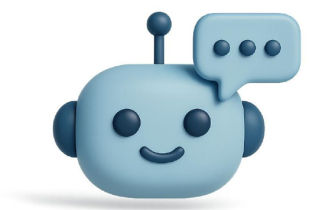

import Admonition from '@theme/Admonition';

<Admonition type="info" icon="" title=''>
### لطفاً یک معرفی اولیه از خودتان، تحصیلات و فعالیت‌های دانشجویی و غیردانشجویی‌تون ارائه می‌دهید
</Admonition>

من لیلا‌سادات علوی هستم، دانشجوی سال آخر کارشناسی ارشد مهندسی نرم‌افزار دانشگاه صنعتی شریف و دورۀ کارشناسی را در دانشگاه صنعتی اصفهان گذراندم.در انجمن علمی دانشکده فعال بودم و رویدادهای زیادی برگزار کردیم. برای مثال، یکی از رویدادهایی که برگزار کردیم، رویدادی شبیه AI Challenge بود که چند سال متوالی برگزار شد. همچنین یک نشریه دانشجویی مشابه بایت داشتیم. کارآموزی را در شرکت مهیمن اصفهان به‌عنوان مهندس نرم‌افزار گذراندم. مدتی نیز در شرکت ترب به‌عنوان مدیر محصول فعالیت داشتم و اکنون مدیر محصول گفتا هستم.

<Admonition type="info" icon="" title=''>
### گفتا چیست و دقیقاً چه کاری انجام می‌دهد؟
</Admonition>

گفتا در اصل قرار است به یک فروشندۀ هوش مصنوعی تبدیل شود. هدف ما این است که فرایند فروش را برای فروشندگان آسان‌تر و اثربخش‌تر کنیم، که ابعاد مختلفی را دربرمی‌گیرد. برای مثال، هدایت خریداران واقعی به سمت فروشندگان، افزایش ارتباط مؤثر با مشتریان، بالا بردن نرخ تبدیل بازدیدکننده به خریدار و پیشنهاد محصولات مناسب به خریداران بر اساس نیازشان.
تمام این فعالیت‌ها را تلاش کرده‌ایم با استفاده از هوش مصنوعی مکالمه‌محور (Conversational AI) انجام دهیم، چرا که این روش هم بسیار رایج شده و هم در مقایسه با روش‌های قبلی عملکرد بهتری دارد.

<Admonition type="info" icon="" title=''>
### چطور ایدۀ گفتا به ذهن شما رسید؟
</Admonition>

راستش ایدۀ اولیه گفتا این چیزی که الان هست نبود. زمانی که GPT-4o معرفی شد و بحث چت‌بات‌ها داغ شده بود، در دانشگاه یک هکاتون حول این قضایا داشت برگزار می‌شد. من بدون ثبت‌نام قبلی در این رویداد شرکت کردم و این موضوع برام جالب شد. ایدۀ اولیه ما این بود که گفتا یک چت‌بات باشد که پیام خریداران را دریافت کند و با درک خودش پاسخ دهد؛ زیرا در دیوار این نیاز را احساس می‌کردیم.
 تحقیقات بازار انجام دادیم و داده‌هایی از فروشندگان جمع‌آوری کردیم و دیدیم بخشی اصلا مکالمات را به خارج از پلتفرم هدایت می‌کنند که به نوعی برای هر دو ایده‌‌‌آل نبود و از طرفی هم سؤالات تکراری را باید ده‌ها بار با کم و زیاد پاسخ می‌دادند اما وقتی وارد کار شدیم، متوجه شدیم که صرفاً داشتن یک چت‌بات کافی نیست و احساس کردیم رسالت گفتا این هست که به افزایش فروش کمک کند. ابتدا گفتا قرار بود اطلاعات آگهی‌ها را دریافت کند و به سؤالات مشتریان پاسخ دهد، اما در ادامه با شناخت بهتر محصول، تصمیم گرفتیم گفتا را گسترش دهیم چون دیدیم این محصول پتانسیل دارد در تجارت الکترونیک بسیار اثرگذار باشد.

<Admonition type="info" icon="" title=''>
### تیم گفتا چطور شکل گرفت؟
</Admonition>

هرکسی که مرا بشناسد می‌داند که چند سالی بود علاقه‌مند به راه‌اندازی استارتاپ بودم، هرچند دقیقاً نمی‌دانستم چرا. دوران کارشناسی به دلیل مشغله‌های درسی و دیگر مسائل فرصت مناسبی نبود، اما در دوران ارشد که فشار درس‌ها کمتر شد، جدی‌تر به این موضوع پرداختم.

با چند نفر دربارۀ هم‌بنیان‌گذاری صحبت کردم. ابتدا ایده‌های مختلفی مانند استفاده از AI برای فیلتر کردن رزومه‌ها داشتیم و حتی روی یکی از پروژه‌ها کمی کار کردیم، اما تیم زیاد به کار متعهد نبود و ادامه‌اش ندادیم. در نهایت با یکی از دوستان قدیمی‌ام صحبت کردم، یک تفاهم‌نامهٔ هم‌بنیان‌گذاری نوشتیم و کار را شروع کردیم. بر خلاف برخی استارتاپ‌ها که ابتدا ایده را ارائه می‌کنند و سپس به دنبال جذب سرمایه می‌روند، ما از همان ابتدا روی فروش محصول تمرکز داشتیم و واقعاً هم فروش خوبی داشتیم.

هدف‌مان این بود که تیمی چند مهارته و چابک داشته باشیم؛ در روزهای اول که دو نفر بودیم، هر کدام در زمینه‌های مختلف از فرانت‌اند تا بک‌اند و مباحث فنی دیگر کار می‌کردیم.

بر این باوریم که محصولات بزرگ نیز با تیم‌های کوچک و چابک رشد کرده‌اند؛ مثل ساختار تیمی مایکروسافت یا تیم کوچک تلگرام.

بر همین اساس، ترجیح دادیم به جای جذب افراد سینیور، افراد جونیور مشتاق به یادگیری را به تیم بیاوریم و خطاهای احتمالی را به عنوان هزینه‌های یادگیری بپذیریم.

تصمیم گرفتیم استارتاپ را به روش Bootstrap (تأمین مالی از منابع شخصی) پیش ببریم، چون باور داشتیم این روش چابکی تیم را حفظ می‌کند و به ما اجازه می‌دهد تصمیمات سریع و مستقل بگیریم.

به قول مارک زاکربرگ، افراد جونیور ارزش بیشتری برای تیم به همراه دارند، چرا که هم علاقهٔ زیادی به یادگیری دارند و هم در مقابل تغییر انعطاف‌پذیرترند؛ در حالی که بسیاری از سینیورها دیدگاه‌های علمی و دانشی تثبیت‌شده‌ای دارند و به سختی می‌توانند خود را با تغییرات وفق دهند. یک نیروی جونیور اگر مرتکب اشتباهی شود، معمولاً تمایل دارد سریعاً آن را یاد بگیرد و اصلاح کند. در حالی که اگر فردی سینیور وارد تیم شود، معمولاً اصرار دارد که نظر خودش اعمال شود. در مقابل، ما ترجیح می‌دادیم اعضای تیم در کار مشارکت فعال داشته باشند.

<Admonition type="info" icon="" title=''>
### شروع یا گسترش استارتاپ بدون جذب سرمایه سخت نیست؟
</Admonition>

از نظر جذب سرمایه نیز ما با جذب سرمایه از سرمایه‌گذاران خطرپذیر (VC) موافق نبودیم. تجربه نشان داده اکثر VCها ارزش افزوده‌ای ایجاد نمی‌کنند و در بسیاری موارد حتی ضرر می‌زنند.

در نگاه ما، زمانی که محصول هنوز به تناسب بازار نرسیده (Product-Market Fit)،     بهتر است سرمایه جذب نشود.VC ها معمولاً فشار زیادی برای ورود سریع‌تر محصول به بازار وارد می‌کنند، در حالی که ممکن است زمان بیشتری برای بلوغ محصول نیاز باشد و چابکی تیم را می‌گیرند.

مثلاً ما الان قصد داریم مدل درآمدی خود را تغییر بدهیم. اگر یک سرمایه‌گذار در تیم ما حضور داشت، مجبور بودم هفته‌های متوالی در جلسات هیئت‌مدیره شرکت کنم و توضیح بدهم که چرا این مدل درآمدی بهتر است؛ چون سرمایه‌گذار معمولاً درکی از جزئیات کسب‌وکار ما ندارد. اما در شرایط فعلی، تیم ما راحت‌تر و چابک‌تر تصمیم می‌گیرد. حتی اگر تصمیم اشتباهی بگیریم، سریعاً آن را می‌پذیریم و اصلاح می‌کنیم. در حالی که یک VC (سرمایه‌گذار خطرپذیر) اولویتش سود و سرمایهٔ خودش است و دائم این پرسش را مطرح می‌کند که «سود و بازگشت سرمایهٔ من کجاست؟»

از طرفی، با رشد هوش مصنوعی، امروزه اکثر تیم‌های جدید استارتاپ خود را به صورت Bootstrap (با سرمایه شخصی) راه‌اندازی می‌کنند و با یک تیم کوچک کار را آغاز می‌کنند. در گذشته، برای تأسیس پروژه‌هایی مثل کافه‌بازار، نیاز بود تعداد زیادی نیروی سینیور درگیر توسعه، طراحی و مدیریت کسب‌وکار شوند؛ و وقتی کسب‌وکار کمی اسکیل می‌شد، مدیریت آن بسیار سخت بود. اما اکنون کدنویسی برای کسانی که دید مهندسی دارند، بسیار آسان‌تر شده و به نظرم بسیاری از استارتاپ‌ها به این سمت حرکت خواهند کرد. در نتیجه، نقش VCها در محصولات نرم‌افزاری کم‌رنگ‌تر خواهد شد؛ گرچه در استارتاپ‌هایی که با حمل‌ونقل و لجستیک سروکار دارند، همچنان به سرمایه‌گذاری‌های بزرگ نیاز است.

هزینهٔ توسعه و چند مهارتی شدن نیروها هم کاهش یافته‌است. از نظر بازاریابی هم من معتقدم که یک محصول خوب خودش بهترین تبلیغ برای خودش است. محصول باکیفیت به‌صورت دهان‌به‌دهان شناخته می‌شود، اما محصولی که کیفیت متوسطی دارد یا محصول دوم یک بازار باشد، برای جا افتادن نیاز به تلاش بازاریابی بیشتری دارد.

مدل‌های بازاریابی مختلفی وجود دارد و مدل ما هم بیشتر بر همین مبناست؛ به همین دلیل، در مجموع نیازی به سرمایه‌گذاری VC ندیدیم و با وجود سختی‌ها، تصمیم گرفتیم به روش Bootstrap پیش برویم. در نهایت هم توصیهٔ اکیدم به استارتاپ‌ها این است که در مرحله MVP اصلاً به سراغ جذب سرمایه نروند. بهتر است ابتدا در بازار جایگاه خود را تثبیت کنند و سپس جذب سرمایه را از یک Angel Investor آغاز کنند و بعد به سمت VC بروند، چرا که VCها معمولاً کنترل زیادی روی تیم اعمال می‌کنند و چابکی تیم را کاهش می‌دهند.

<Admonition type="info" icon="" title=''>
### گفتا چه اثری بر بازار گذاشته است؟
</Admonition>

محصول ما پس از عرضه تأثیر قابل‌توجهی گذاشت. به حدی که پس از معرفی گفتا، دیوار نیز به سمت راه‌اندازی دستیار خرید حرکت کرد.
هدف اصلی ما ایجاد اثرگذاری بود و  خوشبختانه
احساس می‌کنیم به این هدف دست یافته‌ایم و باعث شده‌ایم ایده‌های نوآورانهٔ بیشتری در این حوزه شکل بگیرد.

<Admonition type="info" icon="" title=''>
### در مورد چالش‌های فنی و روند توسعهٔ محصول گفتا توضیح می‌دهید؟
</Admonition>

به نظر من کدنویسی نسبت به ده سال پیش بسیار آسان‌تر شده و چالش‌های فنی کم‌رنگ‌تر شده‌اند.

چالش اصلی ما بیشتر در حوزۀ محصول و کار با مدل‌های زبانی بزرگ (LLM) بود.باید فکر می‌کردیم چگونه این فناوری جدید را طوری به دست کاربر برسانیم که برایش قابل‌فهم و جذاب باشد.بسیاری از کاربران نحوۀ درست استفاده از پرامپت‌ها را نمی‌دانستند، بنابراین دامنۀ پرامپت‌ها را محدود کردیم تا کاربران عامی هم بتوانند به راحتی از محصول استفاده کنند.در محصول ما UX اهمیت بسیار بیشتری پیدا کرده و چالش اصلی این است که به کاربر بفهمانیم این اطلاعات از کجا می‌آید و چگونه باید از محصول استفاده کند تا بیشترین بازدهی را از قابلیت‌های LLM محصول بتوانند دریافت کنند.

امروزه بیشتر چالش‌ها از مسائل فنی به سمت چالش‌های محصولی (Product Challenges) حرکت کرده‌اند. چون فناوری‌هایی مثل LLM (مدل‌های زبانی بزرگ) بسیاری از قابلیت‌ها را آنلاک کرده‌اند و دست ما را باز گذاشته‌اند. اما مسئله این‌جاست که استفادهٔ درست از این ابزارها نیاز به آموزش و مهارت دارد.

مثلاً خود مشتری‌ها دقیقاً نمی‌دانند یک LLM چه کارهایی می‌تواند انجام دهد. یا در زمینه‌های کسب‌وکاری، خیلی وقت‌ها مفاهیم ساده‌ای مثل Cross-sell برایشان ناشناخته است؛ در حالی که در عمل، همین رفتار را دارند.

ما باید ابتدا به مشتریان بفهمانیم که با استفاده از محصول ما، می‌توانند چنین کارهایی را ساده‌تر و هوشمندتر انجام دهند. بنابراین طراحی یک تجربه کاربری (UX) خوب اهمیت زیادی پیدا می‌کند؛ به طوری که فاصلۀ بین درک جامعه و رشد تکنولوژی را کمتر کنیم و کاربر به راحتی متوجه شود چه کاری انجام می‌دهد و چه ارزشی دریافت می‌کند.

<Admonition type="info" icon="" title=''>
### مدیریت تیم در گفتا چگونه انجام می‌شود؟
</Admonition>

به نظر من مهم‌ترین عامل موفقیت یک استارتاپ تیم آن است؛ ایده‌ها و محصول را بسیاری می‌توانند ارائه دهند، اما ساختن تیمی با انگیزه، همدلی و تاب‌آوری در برابر بحران‌ها کار آسانی نیست و باید تیمی را تشکیل دهید که بتوانند اختلاف نظرها را باهم حل کنند و در شرایط مختلف تمرکز کافی روی محصول داشته باشند.

ما سعی کردیم انعطاف‌پذیری (Flexibility) را برای تیم بیشتر کنیم، چون به‌خصوص اول کار، خیلی چیزها رفاقتی پیش می‌رفت. مثلاً یک تسک تعریف می‌شد، یک نفر می‌گفت «باشه من می‌زنم»، ولی بعداً گفتیم یه‌کم سبک مدیریتی را بهتر کنیم و  برای همین استندآپ روزانه گذاشتیم و کم‌کم باگ‌های دیگر هم حل کردیم و به مرور ساختار مدیریتی تیم را پخته‌تر کردیم.

دقیقاً به همین خاطر است که نیروی جونیور از این لحاظ بهتر است. چون مثلاً بچه‌ها راحت فیدبک می‌دادند که فلان مشکل وجود داشت. این بازخوردها به ما کمک کرد روندها را اصلاح کنیم.

ما از همان اول سراغ استخدام اسکرام‌مستر نرفتیم. سبک کاری ما این‌طور بود که از فکر و نظر خود بچه‌ها استفاده کنیم. مخصوصاً الان که با دهه هشتادی‌ها کار می‌کنیم، این فضاهای تعاملی و انعطاف‌پذیر خیلی اهمیت دارد. چون واقعیت این است که بچه‌های این نسل، به‌خصوص  بچه‌های شریف، همیشه یک گزینۀ بهتر برای کار کردن دارند؛ برای همین باید یک تمایز واقعی ایجاد کرد که باعث شود بچه‌ها حس رضایت و انگیزه برای کار را داشته باشند.

<Admonition type="info" icon="" title=''>
### برای آیندۀ گفتا چه برنامه‌ای دارید؟
</Admonition>

ما یک بک‌لاگ بزرگ از ایده‌ها داریم و هنوز مشخص نیست کدام مسیر را انتخاب خواهیم کرد، اما فیلتر نوآوری در این انتخاب برایمان اهمیت زیادی دارد.

در صورت رشد تیم، برنامه داریم ساختار شرکت را به تیم‌های کوچک‌تر و مستقل تقسیم کنیم تا هر تیم مسئولیت محصول خود را بر عهده داشته باشد و با تیم‌های دیگر در تعامل باشند.

فعلاً  تمرکزمان بر توسعۀ محصول فعلی است، اما در آینده دوست داریم پروداکت‌لاین‌های
جدیدی راه‌اندازی کنیم.

همچنین علاقه به حضور در بازارهای بین‌المللی داریم، اما به دلیل رقابت شدید در این حوزه‌ای که کار می‌کنیم، بازارهای جهانی برای استارتاپ‌های کوچک خطرات زیادی دارند و فعلاً تصمیم داریم در بازار داخلی تمرکز کنیم تا به ثبات بیشتری برسیم.

