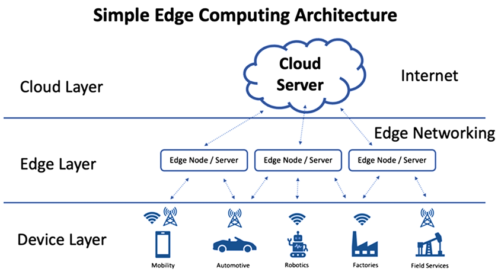

import Tooltip from '@site/src/components/Tooltip';

# سقوط از لبه‌های محاسباتی

## قدرت محاسباتی همه‌جا هست

طبق تحقیقاتی که در سال ۲۰۲۲ صورت گرفت، حدود ۵۵ میلیارد دستگاه هوشمند در جهان وجود دارد و پیش‌بینی شده‌است این آمار تا سال ۲۰۲۵ به ۱۵۰ میلیارد دستگاه برسد. ایـــن دســـتـگـــاه‌هــــا شــــامـــل یـــخـــچـــال‌هـــا، تلویزیون‌ها، چراغ‌ها، پریز‌ها و… می‌شوند و جالب است بدانید که همگی آن‌ها قدرت محاسباتی فراتر از نیازشان دارند! این موضوع به‌دلیل پیشرفت قابل‌توجه صنعت محاسبات الکترونیک و ارزان بودن آن است؛ به‌عبارتی، هزینهٔ طراحی پردازنده‌ای دقیقاً مطابق نیاز این دستگاه‌ها بسیار بیشتر از این است که از یک پردازندهٔ موجود، ولی قوی‌تر استفاده شود. تمام این‌ها، قدرت محاسباتی‌ای است که بدون استفاده مانده‌است.

## محاسبات لبه

<Tooltip tip="Edge Computing">**محاسبات لبه**</Tooltip>
به تعبیری علم به‌کارگیری همین قدرت محاسباتی است. در این زمینه، تلاش بر این است که از قدرت پردازشی آن‌ها استفاده کنیم. تعریف دقیق‌تر این است که «تا حد امکان، پردازش داده‌ها را به محل تولید آن‌ها نزدیک کنیم». امروزه داده‌های زیادی در
<Tooltip tip="Data Centers">**مراکز داده**</Tooltip>
وجود دارند که از آن‌ها برای آنالیزهای جمعی و آموزش مدل‌های هوش مصنوعی استفاده می‌شود، اما داده‌ها در جای دیگری تولید می‌شوند. در واقع خودمان هستیم که داده‌ها را تولید می‌کنیم؛ در مکان‌هایی که کاری انجام می‌دهیم، در محیط‌های عملیاتی‌مان. محیط‌هایی همچون هتل‌ها، رستوران‌ها، کافی‌شاپ‌ها، فرودگاه‌ها و… به‌دلیل حضور تجهیزات دیجیتال، امکان فراهم کردن ظرفیت پردازشی محلی را دارند. این ظرفیت پردازشی می‌تواند از دو جنس باشد:

- ۱. <Tooltip tip="Edge Server">**سرور لبه**</Tooltip>: این دستگاه به‌طور خاص برای پردازش طراحی شده‌است؛ مانند <Tooltip tip="Rack">**رَک**</Tooltip> یا کامپیوتر شخصی.
- ۲. <Tooltip tip="Edge Device">**دستگاه لبه**</Tooltip>: دستگاهی که به‌هدف دیگری طراحی شده‌است، ولی از قدرت پردازشی نیز برخوردار است؛ مانند یخچال و دوربین مداربسته. برای مثال، یک خودروی متوسط بیش از ۵۰ پردازنده بر روی خود دارد.

## محاسبات ابری

محاسبات لبه در پاسخ به نیازی مطرح شد که
<Tooltip tip="Cloud Computing">**محاسبات ابری**</Tooltip>
به آن برخورده بود. در سال‌های اخیر، محاسبات ابری بسیار محبوبیت پیدا کرده‌است. در این روش، داده‌هایی که نیاز به پردازش سنگین دارند به یک محیط ابری ارسال می‌شوند، پردازش در آن محیط صورت می‌گیرد و نتایج بازگردانده می‌شوند. یک مثال معروف آن، Kaggle است که قابلیت انجام پردازش‌های سنگین مربوط به مدل‌های هوش مصنوعی را دارد؛ اما هرچه بیشتر پیش می‌رویم، داده‌های مورد نیاز برای پردازش بیشتر می‌شوند، تا حدی که پهنای باند زیادی برای ارسال این داده‌ها اشغال می‌شود. برای مثال، یک دوربین مداربسته را در نظر بگیرید. این دوربین نیاز دارد تا به‌طور مداوم مقدار زیادی از
<Tooltip tip={"Network Bandwidth"}>**پهنای باند شبکه**</Tooltip>
را مصرف کند و همچنین منابع پردازشی و ذخیره‌سازی زیادی از سرور را به خود اختصاص دهد. چیزی که محاسبات لبه پیشنهاد می‌کند این است که یک دستگاه لبه در کنار این دوربین قرار بگیرد تا محاسباتی را انجام دهد. به‌عنوان مثال بتواند تنها اطلاعات چهرهٔ اشخاص را ارسال کند، یا با بهره‌گیری از یک مدل هوش مصنوعی، تنها در صورت تشخیص یک اتفاق مشکوک تصاویر را ارسال کند. این ایده‌ای است که محاسبات لبه بر روی آن بنا شده‌است.

## نمونه‌ای از کاربرد محاسبات لبه

برای مثال یک گلخانه را در نظر بگیرید. اگر در این گلخانه چند گیاه وجود داشته باشد که برای هر کدام
<Tooltip tip={"Sensor"}>**حسگر**</Tooltip>
رطوبت خاک قرار دهیم، برای استفاده از این اطلاعات و به‌کارگیری آن‌ها دو راهکار می‌توان در پیش گرفت. راهکار اول این است که تمامی داده‌های اندازه‌گیری‌شده مستقیماً به سرور فرستاده شوند تا پردازش شوند و در زمان مناسب فرمان‌های کنترلی گلخانه ارسال شود، و یا راهکار دوم که با محاسبات لبه سر و کار دارد این است که هر گلدان، خودش وضعیت خودش را پایش کند و به‌جای ارسال تمامی اطلاعات رطوبتی، تنها زمانی که گلدان نیاز به آب داشت یک پیام به سرور ارسال کند.

    

## مشکلات محاسبات لبه

	محاسبات لبه می‌تواند ابزاری بسیار قدرتمند باشد، اما مشکلاتی در این زمینه وجود دارند که به ما امکان استفاده از این ابزار به‌راحتی را نمی‌دهند. در ادامه برخی از این مشکلات را دقیق‌تر مرور می‌کنیم.

    

### کنترل و مدیریت

همان‌طور که گفته شد، تعداد دستگاه‌هایی که قدرت پردازشی دارند به‌شدت رو به افزایش است و تعداد فعلی آن‌ها نیز کم نیست! یکی از مشکلاتی که محاسبات لبه با آن روبه‌رو است، کنترل و هماهنگی این تعداد دستگاه است. در واقع باید از تکنیک‌هایی استفاده شود که نیازی به نسبت دادن وظیفه به تمام این دستگاه‌های محاسباتی توسط یک مسئول وجود نداشته باشد.

### امنیت

یکی دیگر از مشکلات اساسی محاسبات لبه، امنیت آن است. محاسبات لبه عملاً مشابه اینترنت در مراحل ابتدایی خود است. سپردن پردازش داده به دستگاه‌های لبه و انتقال نتایج که گفته‌ شد، بر پایهٔ اعتماد بنا شده‌است. شرطی که روز به روز، وجودش بیشتر زیر سؤال می‌رود. برای همین نیاز است تا از محیط محاسباتی در برابر این تهدیدها محافظت شود. چگونه اطمینان حاصل کنیم که دستگاه لبه دستکاری نشده‌است؟ چگونه مطمئن باشیم وظایف و محاسباتش را به درستی انجام می‌دهد؟ یا از دیدگاهی دیگر، چگونه مطمئن شویم داده‌هایی که برای محاسبه بر روی این دستگاه‌ها قرار می‌گیرند، به‌منظور اهداف دیگری استفاده نشوند؟ تمام این سؤالات، مواردی هستند که در مبحث امنیت محاسبات لبه باید به آن‌ها پرداخته شود.

### پهنای‌ باند شبکه

افزایش تعداد دستگاه‌های لبه منجر به تولید حجم عظیمی از داده‌‌ها می‌شود. محدودیت پهنای باند می‌تواند انتقال داده‌های محلی به فضای ابری را با تأخیر و هزینهٔ بالا مواجه کند. مثلاً در خودروهای خودران، سنسورها تا ۴۰ ترابایت در ساعت، داده تولید می‌کنند که عبور این حجم از اطلاعات بسیار پرهزینه است.

### انباشت داده

ذخیره‌سازی داده‌های تولیدشده در سطح دستگاه لبه با محدودیت مواجه است. بدون مدیریت مؤثر مانند فشرده‌سازی یا پالایش، این داده‌ها منجر به اشباع حافظه و افزایش هزینه‌ها می‌شوند.

### محاسبات توزیع‌شده

در محاسبات لبه، هماهنگی و تقسیم وظایف باید بدون سرور مرکزی انجام شود. ترکیب دستگاه‌های مختلف با سخت‌افزارها و پروتکل‌های متفاوت، ایجاد محیط توزیع‌شده‌ای هماهنگ و کارا را دشوار می‌سازد.

### تأخیر

یکی از اهداف اصلی محاسبات لبه کاهش زمان پاسخ است. با این حال، هنگام اتصال نامطمئن یا بار پردازشی زیاد، تأخیرها افزایش یافته و کاربردهایی مانند خودروهای خودران یا واقعیت افزوده را به خطر می‌اندازد.

### مقیاس‌پذیری

وقتی تعداد دستگاه‌های لبه افزایش یابد، نه صرفاً سخت‌افزار، ‌بلکه نیروی انسانی، امنیت، مدیریت و هماهنگی نیاز به مقیاس دارند. تنوع محیط‌ها و ناهماهنگی منابع، مدیریت گسترده و مقیاس‌پذیر را دشوار می‌کند.

### پشتیبان‌گیری

چون دستگاه‌های لبه اغلب وضعیت آنلاین مداوم ندارند، ضروری است که از داده‌ها پشتیبان‌گیری شود. بدون مکانیزم‌های پشتیبان و تکرار، احتمال از دست رفتن داده‌ها یا اشباع حافظه در زمان قطع ارتباط وجود دارد.

## به یاد آسمان‌ها

این متن به یادبود هم‌دانشکده‌ای عزیزمان، مهندس یاسمین باکوئی -که در حملات رژیم صهیونیستی ایشان را از دست دادیم-، نوشته شده‌است. ایشان در مقطع کارشناسی ارشد، بر روی تشخیص و پیشگیری از وقوع اشکال در محاسبات لبه کار می‌کردند و در حال تکمیل تز خود بودند.

> **روحشان شاد و یادشان گرامی.**

    

