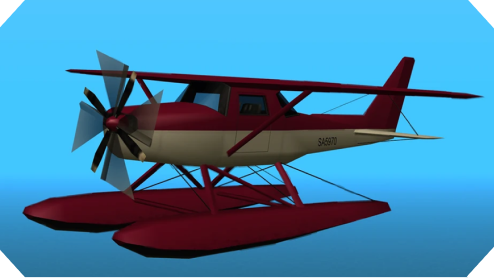
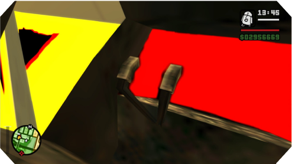
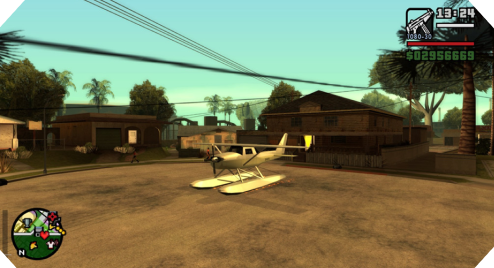
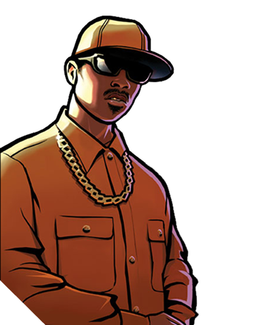
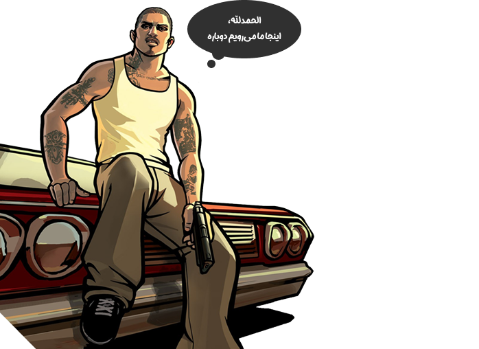

import Tooltip from "@site/src/components/Tooltip";

# چگونه آپدیت ویندوز GTA: SA را خراب کرد؟

در یک روز زیبای زمستانی، مایکروسافت تصمیم گرفت که آپدیت 24H2 را برای تمامی کامپیوترهایی که ویندوز ۱۱ دارند منتشر کند. این آپدیت پشتیبانی از HDR، امکان باز کردن فایل‌های 7z و tar در Windows Explorer، دستور sudo در powershell و بهینه شدن مصرف باتری را به این سیستم‌عامل اضافه کرده بود. اما این آپدیت یک مشکل برای گیمر‌هایی که همچنان بازی نوستالژیک و محبوب Grand Theft Auto: San Andreas را بازی می‌کنند، به‌وجود آورد: هواپیمای آب‌نشین skimmer دیگر ساخته نمی‌شد. این مشکل به حدی بود که بازیکنان حتی نمی‌توانستند این هواپیما را به کمک

<Tooltip tip="cheat code">
  <span>**کد تقلب**</span>
</Tooltip>
در بازی بسازند.

<div style={{ textAlign: "center" }}></div>

در این حین، برنامه‌نویس ماد Silent Patch -که یک ماد برای بهبود سری بازی‌های GTA III، GTA: VC و GTA: SA بر روی سیستم‌های جدید است- دست به کار شد که مشکل اصلی را پیدا و رفع کند. او قبلاً در Silent Patch با مشکلاتی نظیر سیاه شدن صفحه به‌هنگام خروج از ساختمان‌ها،

<Tooltip tip="memory leak">
  <span>**نشتی حافظه‌های**</span>
</Tooltip>
مربوط به عکس گرفتن و مشکلات مربوط به چندمانیتوری دست‌و‌پنجه نرم کرده بود. برای
این کار، او در ابتدا به کمک دو ماشین مجازی که یکی نسخهٔ‌ 23H2 و دیگری نسخهٔ 24H2
ویندوز ۱۱ بود، بررسی کرد که آیا واقعاً مشکل نسخهٔ ویندوز است یا خیر و او بعد از
استفاده از ماشین‌های مجازی مطمئن شد که ویندوز یک مشکلی برای بازی ایجاد کرده‌است؛
چرا که بر روی نسخهٔ 23H2 ویندوز ۱۱ این مشکل وجود نداشت و هواپیمای skimmer هم در
قسمت‌های مختلف نقشه وجود داشت و هم می‌توانست آن را به کمک کدهای تقلب بسازد.

او در ابتدا سعی کرد که در نسخهٔ بدون ماد بازی، هواپیمای skimmer را بسازد و CJ را داخل هواپیما قرار دهد. زمانی که او این کار را انجام داد، CJ به ارتفاع ۱۰۳۰ متری سطح زمین پرتاب شد که مطمئناً ارتفاع درستی برای هواپیما نیست. همچنین زمانی که او ماد Silent Patch را اجرا کرد CJ به بالا پرتاب نشد، بلکه بازی فریز شد و در نهایت کرش کرد.

<div style={{ textAlign: "center" }}></div>

سپس او شروع به دیباگ کردن بازی کرد که متوجه شود که مشکل چیست. در ابتدا او در تابعی که هواپیما را در محیط بازی قرار می‌دهد، یک break point گذاشت و متوجه شد که زمانی که بازی می‌خواهد سرعت چرخش پره‌های هواپیما را حساب کند ارتفاع هواپیما عددی در اردر 1030 است که منطقی نیست. پس دو احتمال وجود دارد:

1. بازی به صورت اشتباهی هواپیما را در یک ارتفاع خیلی زیاد می‌سازد.
2. هواپیما واقعاً بر روی سطح زمین ساخته می‌شود ولی به دلیلی در آسمان پرتاب می‌شود.

در ادامهٔ بررسی‌هایش او متوجه شد که تابعی به نام `CreateCarForScript` وجود دارد که وظیفهٔ آن ساختن یک وسیلهٔ نقلیه در نقطهٔ خاصی از نقشه است. در این تابع، خطی به صورت زیر وجود دارد:

```C
posZ += newVehicle->GetDistanceFromCentreOfMassToBaseOfModel();
```

همان طور که مشخص است این تکه کد، ارتفاع وسیلهٔ نقلیه را نسبت به مرکز ثقل آن افزایش می‌دهد. سپس او با بررسی داخل تابع `GetDistanceFromCentreOfMassToBaseOfModel`  متوجه شد که در bouding box این هواپیما این مقادیر وجود دارند:

```
- *(RwBBox**)0x00B2AC48   RwBBox *
  - sup    RwV3d
      x    -5.39924574     float
      y    -6.77431822     float
      z    -4.30747210e+33 float
  - inf    RwV3d
      x    5.42313004 float
      y    4.02343750 float
      z    1.87021971 float
```

در بازی‌ها bouding box به مکعبی گفته می‌شود که کل یک شئ درون بازی را در بر می‌گیرد. همان طور که مشخص است مقدار محور عمودی این هواپیما خیلی عدد درستی نیست. اما این موضوع عجیب است چرا که این عدد نه اولین عدد این

<Tooltip tip="structure">
  <span>**ساختار**</span>
</Tooltip>
است و نه آخرین عدد و اعداد کنار آن هم دست نخورده باقی‌مانده‌اند. پس یک نوع
memory corruption عجیب داریم که فقط وسط یک ساختار را دست می‌زند. با بررسی بیشتر
و چک کردن هر تکه کد که مقدار این bouding box را عوض می‌کند، او متوجه شد که در
ابتدا که هواپیما داده‌هایش را از دیسک لود می‌کند، مقدار ارتفاع bouding box (همان
z) درست است ولی بعد از مدتی خراب می‌شود. با بررسی بیشتر می‌توان متوجه شد که
تابعی به نام `SetupSuspensionLines` وجود دارد که مسئولیت مقداردهی اولیه فنربندی
هر وسیلهٔ نقلیه را دارد. در این تابع کدی به صورت زیر وجود دارد:

```C
colModel->bbox.sup.z = pSuspensionLines[0].p1.z;
```

مقدار bbox.sup.z همان مقدار محور z مربوط به bounding box است. از آنجایی که این مقدار زمان اجرا غلط است، پس می‌توان نتیجه گرفت که مقدار `pSuspensionLines[0].p1.z` به کل اشتباه است. این مقدار از فایلی به نام `vehicles.ide` خوانده می‌شود که اطلاعات چرخ‌های هر وسیله نقلیهٔ بازی را در خودش دارد. در صورتی که خط مربوط به هواپیمای skimmer را مشاهده کنیم اطلاعات زیر را می‌بینیم:

```C
460,skimmer,skimmer,plane,SEAPLANE,SKIMMER,null,ignore,
5,   0,   0
```

اما در صورتی که خط مربوط به یک هواپیمای دیگر مانند rustler را نگاه کنیم، متوجه می‌شویم که در آخر این خط چندین پارامتر دیگر نیز وجود دارند:

```C
476, rustler, rustler, plane, RUSTLER, RUSTLER, rustler,
ignore, 10, 0, 0, -1, 0.6, 0.3, -1
```

پارامترهای آخر خط که در هواپیمای skimmer وجود ندارند، مربوط به اندازهٔ چرخ‌های هر هواپیما هستند. نکته‌ای که وجود دارد این است که قایق‌ها این پارامترها را ندارند؛ چرا که قایق‌ها چرخ ندارند. در این‌جا هم از آن‌جایی که skimmer چرخ ندارد و یک هواپیمای آب‌نشین محسوب می‌شود، این پارامتر‌ها کلاً وجود ندارند! همچنین در بازی GTA: Vice City هواپیمای skimmer واقعاً به‌عنوان یک قایق در دیتای بازی وجود داشت، ولی در بازی GTA: San Andreas این هواپیما از قایق تبدیل به هواپیما شده‌است! اما از شانس بد برنامه‌نویسان rockstar و از آن‌جایی که skimmer یک هواپیماست که چرخ ندارد، خالی گذاشتن فیلد‌های مربوط به چرخ‌ها باعث شده‌است که در کد بازی

<Tooltip tip="undefined behavior">
  <span>**رفتار نامشخص**</span>
</Tooltip>
رخ دهد و مقدار bounding box اشتباه شود که باعث می‌شود هواپیما در ارتفاع خیلی
زیاد ساخته شود. در صورتی که مقادیر مربوط به چرخ‌های یک هواپیما‌ی دیگر را به
skimmer بدهیم، می‌بینیم که skimmer دوباره به بازی بر می‌گردد و بدون هیچ مشکلی
می‌توان با آن پرواز کرد!

<div style={{ textAlign: "center" }}></div>

اما یک سؤال مهم دیگر در این‌جا وجود دارد: چرا این باگ زمانی خودش را نشان داد که ویندوز ۱۱ نسخهٔ 24H2 خودش را منتشر کرد و در ۲۱ سال گذشته خودش را نشان نداده بود؟ برای این کار باید در ابتدا کدی که مربوط به خواندن اطلاعات چرخ‌ها از فایل `vehicles.ide` است را نگاه کنیم. این کد به‌صورت زیر است:

```C
void CFileLoader::LoadVehicleObject(const char* line){
  int objID = -1;
  char modelName[24];
  char texName[24];
  char type[8];
  char handlingID[16];
  char gameName[32];
  char anims[16];
  char vehClass[16];
  int frq;
  int flags;
  int comprules;
  int wheelModelID; // Uninitialized!
  float frontWheelScale, rearWheelScale; // Uninitialized!
  int wheelUpgradeClass = -1; // Funny enough, this one IS initialized
  sscanf(line, "%d %s %s %s %s %s %s %s %d %d %x %d %f %f %d",
            &objID, modelName, texName, type, handlingID, gameName,
            anims, vehClass, &frq, &flags, &comprules, &wheelModelID,
            &frontWheelScale, &rearWheelScale, &wheelUpgradeClass);

// More processing here...
}
```

همان‌طور که مشخص است، متغیرهای `frontWheelScale` و `rearWheelScale` مقداردهی اولیه نشده‌اند و از آن‌جا که از تابع `sscanf` برای خواندن این اعداد استفاده می‌شود، در صورتی که عددی در رشته وجود نداشته باشد مقدار متغیر پاس‌داده‌شده به `sscanf` نیز عوض نمی‌شود. اما هنوز این سؤال مطرح است که چرا فقط در آخرین نسخهٔ ویندوز ۱۱ این اعداد به صورتی مقداردهی می‌شوند که بازی نمی‌تواند هواپیمای skimmer را بسازد. به‌عنوان یک فرض اولیه می‌توان به این موضوع فکر کرد که شاید ویندوز کتابخانهٔ `libc` که شامل توابعی مانند `printf` و `fopen` و `sscanf` است را طوری عوض‌ کرده‌است که باعث بشود این تغییر اتفاق بیفتد، اما نکته‌ای که وجود دارد این است که GTA: SA یک برنامهٔ statically linked است و از کتابخانهٔ `libc` خود سیستم‌عامل استفاده نمی‌کند؛ بلکه کتابخانهٔ libc مربوط به خودش را دارد که بین نسخه‌های مختلف ویندوز تغییر نمی‌کند. پس مشکل از جای دیگری است. در ادامه، اگر نگاه کنیم که چه تابعی `LoadVehicleObject` را صدا می‌‌زند به تابع زیر می‌رسیم:

```C
void CFileLoader::LoadObjectTypes(const char* filename){
  // Open the file...
  while ((line = fgets(file)) != NULL){
    // Parse the section indicators...
    switch (section){
      // Different sections...
    case SECTION_CARS:
      LoadVehicleObject(line);
      break;
    }
  }
}
```

همان‌طور که مشاهده می‌کنید، در یک حلقه هر خط از فایل خوانده می‌شود و سپس تابع `LoadVehicleObject` صدا زده می‌شود. این کد و نحوهٔ صدا شدن توابع باعث می‌شود که متغیرهای `frontWheelScale` و `rearWheelScale` از اجرای تابع قبلی به این تابع منتقل شوند. دلیل این موضوع این است که زمانی که یک تابع تمام می‌شود، مقادیر داخل استک آن پاک (صفر) نمی‌شوند و صرفاً stack pointer جا‌به‌جا می‌شود. این موضوع باعث می‌شود که اگر دوباره همان تابع را فوراً بعد از تمام شدن آن صدا کنیم، تمامی متغیر‌های آن تابع مقدار اولیهٔ متغیر‌های فراخوانی قبلی تابع را داشته باشند. اما مشخص است که اگر تابع دیگری بین این دو فراخوانی اجرا شود، استک به‌جا‌ماندهٔ تابع اول را overwrite می‌کند. در بازی GTA نیز بین هر صدا زدن تابع `LoadVehicleObject` یک‌ بار تابع `fgets` صدا زده می‌شود. پس می‌توان حدس زد که در نسخه‌های قبلی ویندوز تابع `fgets` استفادهٔ زیادی از استک نداشته و به همین دلیل مقدار `frontWheelScale` و `rearWheelScale` از فراخوانی قبلی تابع به جا می‌مانند. به همین منظور در صورتی که مقدار این دو متغیر را در نسخه‌های قبلی ویندوز نگاه کنید، به عدد 0.7 می‌رسید، چرا که دقیقاً در خط قبلی فایل  که خوانده‌ شده‌است، اطلاعات مربوط به ماشین Top Fun وجود دارد که `rearWheelScale` آن برابر 0.7 است! پس قطعاً این عدد از فراخوانی قبلی به جا مانده‌است.

<div style={{ textAlign: "left" }}></div>

حال باید بررسی کنیم که در نسخهٔ 24H4 ویندوز چه اتفاقی می‌افتد که این عدد خراب می‌شود. برای این کار می‌توان یک hardware breakpoint بر روی متغیر درون استک قرار داد تا زمانی که آن نوشته می‌شود، دیباگر برنامه را متوقف کند. زمانی که این کار را می‌کنیم، متوجه می‌شویم که دیباگر در فراخوانی تابع `LeaveCriticalSection` که یک تابع مخصوص سیستم‌عامل است، متوقف می‌شود. این بدین معناست که پیاده‌سازی `LeaveCriticalSection` در ویندوز ۱۱ نسخهٔ 24H4 طوری عوض‌ شده‌است که از استک بیشتری استفاده می‌کند و در نتیجه متغیرهایی که از فراخوانی قبلی تابع در استک به جا مانده‌اند، overwrite می‌شوند. می‌توانید نحوهٔ صدا زده شدن توابع را در ادامه مشاهده کنید:

```
> ntdll.dll!_RtlpAbFindLockEntry@4()	Unknown
  ntdll.dll!_RtlAbPostRelease@8()	Unknown
  ntdll.dll!_RtlLeaveCriticalSection@4()	Unknown
  gta_sa.exe!fgets()	Unknown
```

شاید جالب باشد اگر بدانید که GTA: SA تنها بازی‌ای نیست که این مشکل گریبان‌گیرش شده‌است. بلکه بازی قدیمی Sid Meier's Alpha Centauri نیز (دقیقاً به همین دلیل که در نسخه‌های جدیدتر ویندوز `LeaveCriticalSection` فضای بیشتری از استک را اشغال می‌کند) کرش می‌کند! در نهایت نیز یک پیشنهادی که می‌توانم به شما بکنم این است که حتماً حتماً حواستان به رفتارهای نامشخص از این قبیل باشد و حتماً در صورتی که کامپایلر به شما

<Tooltip tip="warning">
  <span>**اخطار**</span>
</Tooltip>
داد، این اخطار را نادیده نگیرید و به حرف آن گوش کنید!

> [منبع](https://cookieplmonster.github.io/2025/04/23/gta-san-andreas-win11-24h2-bug)

<div style={{ textAlign: "left" }}></div>
