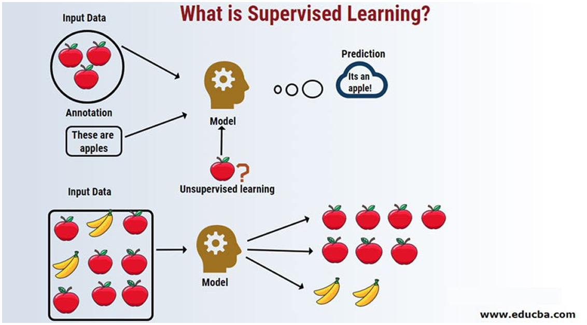
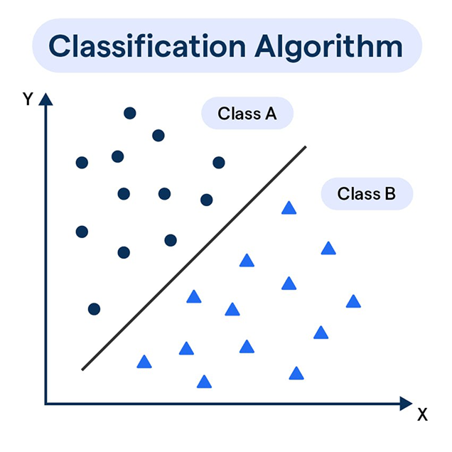

import Tooltip from '@site/src/components/Tooltip';

#  یادگیری ماشین

    ## یادگیری ماشین
    

عوامل یادگیر این قابلیت را دارند که با یادگیری از تجربیات خود، عملکرد خود را در طول زمان بهبود بخشند.

آن‌ها شامل مؤلفه‌هایی برای یادگیری و عملکرد هستند که به آن‌ها امکان می دهد با موقعیت‌های جدید سازگار شوند و تصمیم‌گیری خود را بهبود بخشند.

در یادگیری ماشین هدف این است که رایانه‌ها و سامانه‌ها بتوانند به‌تدریج و با افزایش داده‌ها کارایی بهتری در انجام وظیفۀ مورد نظر پیدا کنند.

الگوریتم‌های یادگیری ماشین بر سه نوع هستند:
- <Tooltip tip="Reinforcement Learning">**یادگیری تقویتی**</Tooltip>

- <Tooltip tip="Unsupervised Learning">**یادگیری نظارت نشده**</Tooltip>

- <Tooltip tip="Supervised Learning">**یادگیری نظارت شده**</Tooltip>

### یادگیری تقویتی
یادگیری تقویتی را می‌توان به‌عنوان یک حلقهٔ متشکل از اجزای زیر در نظر گرفت:

- <Tooltip tip="Agent">**عامل**</Tooltip>: یادگیرنده یا تصمیم‌گیرنده‌ای که براساس مشاهده‌های خود اقداماتی را انجام می‌دهد.

- <Tooltip tip="Environment">**محیط**</Tooltip>: سیستم یا زمینۀ خارجی که عامل در آن عمل می‌کند.

- <Tooltip tip="State">**حالت**</Tooltip>: پیکربندی یا نمایش فعلی محیط در یک زمان معین.

- <Tooltip tip="Action">**اقدام**</Tooltip>: تصمیم یا انتخابی که عامل در پاسخ به یک حالت اتخاذ می‌کند.

- <Tooltip tip="Reward">**پاداش**</Tooltip>: سیگنال بازخوردی که خوبی یا مطلوبیت عمل عامل را ارزیابی می‌کند.

- <Tooltip tip="Policy">**سیاست**</Tooltip>: استراتژی یا رویکردی که عامل برای انتخاب اقدامات براساس حالت‌های مشاهده‌شده به‌کار می‌گیرد.

بیایید مثال واقعی یادگیری حرف زدن  یک نوزاد را با هم بررسی کنیم:

در ابتدا، یک نوزاد صداهای مختلف را آزمایش می‌کند. نوزاد مطمئن نیست که کدام

صداها پاسخ مراقبین را برانگیزد، هنگامی که کودک کلمهٔ قابل‌تشخیصی را می‌گوید، مراقبان با لبخند، تشویق و تمجید کلامی، پاسخ مثبت می‌دهند. این پاداش‌ها کودک را تشویق می‌کند که به تمرین و یادگیری کلمات جدید ادامه دهد. نوزاد ممکن است وقتی درک نمی‌شود، با لحظاتی از ناامیدی مواجه شود (تنبیه).

حال که نوزاد یک شبکهٔ معنایی (کلمات معنادار) از کلمات به‌دست آورده، شروع به ترکیب کلمات برای تشکیل جملات اساسی می کند (به‌عنوان مثال «شیر می‌خوام»).

نوزاد تعاملات و بازخوردهای اجتماعی پیچیده‌تری را تجربه می کند. والدین با گفتن ترکیبات درست، آن ترکیبات را در ذهن نوزاد وارد می‌کنند و همین‌طور رفته‌رفته کودک تقویت می‌شود و سخنان پیچیده‌تری می‌گوید. جالب است به این توجه کنید که کودک در ادامه بدون دانستن واقعی دستور زبان می‌تواند بر اساس مثال‌های اطرافیانشجمله هایی با گرامر درست تولید کند.

###  یادگیری نظارت نشده
درک این مورد برای ما بسیار سخت است؛ مگر می‌شود بدون این‌که دادۀ برچسب‌داری داشته باشیم، بفهمیم دادۀ جدیدی که به ما می‌دهند چیست؟

در این حالت الگوها را منحصراً از داده‌های بدون برچسب یاد می‌گیرند. در چنین رویکردی، یک مدل یادگیری ماشین سعی می‌کند هر شباهت، تفاوت، الگو و ساختار در داده‌ها را به‌تنهایی پیدا کند و هیچ مداخلۀ انسانی قبلی لازم نیست؛  برای مثال، بدون این‌که کسی اطلاعاتی از دادۀ بعدی به شما بدهد، می‌توانید عدد بعدی را حدس بزنید.

۲، ۴، ۶، ۸ و...

اما شناخت این الگوها در مغز بسیار سخت است و در واقع کار روانشناس‌ها پیدا کردن این الگوهای فکری بد و درست کردن آن‌ها از طریق یادگیری نظارت‌شده است.

### یادگیری نظارت شده

یادگیری نظارت‌شده نوعی از یادگیری ماشین است که در آن یک الگوریتم کامپیوتری می‌آموزد که بر اساس داده‌های برچـــسب‌گـــذاری‌شــــده پیــــش‌بیـــنی یا تصمیم‌گـــــیری کند. داده‌هـــــــای برچسب‌گذاری‌شده از متغیرهای ورودی شناخته‌شدۀ قبلی (یا همان ویژگی‌‌ها) و متغیرهای خروجی (یا همان برچسب‌ها) تشکیل شده‌اند.

با تجزیه و تحلیل الگوها و روابط بین متغیرهای ورودی و خروجی در داده‌های برچسب‌دار، الگوریتم یاد می‌گیرد که پیش‌بینی کند. برای مثال تشخیص این که شما لبخند می‌زنید یا نه، با استفاده از این روش انجام می‌شود. بیایید نمونه‌ای از نحوۀ یادگیری الفبا به کودکان (D ،C ،B ، A) را از طریق
یادگیری نظارت‌شده بررسی کنیم. کودکان شکل الفبا را می‌بینند؛ این‌جا دیگر پاداشی نیست و فقط  نوعی از تنبیه را داریم، مادر یا معلم شکل حرف A  را به کودک نشان می‌دهد و هم‌زمان به او می‌گوید A (صدای A)، حال کودک یک تصویر از A دیده است؛ پس از دیدن همۀ حروف، به کودکان فرصت‌های متعددی داده می‌شود تا حروف را  تشخیص دهند.

تبدیل یک عکس به یک حرف در واقع برچسب دادن به عکس است و ما برای تشخیص این حروف باید ده‌ها عکس با برچسب A ببینیم تا بتوانیم حرف A را تشخیص دهیم.

    

این فرایند برای ما ملموس نیست، اما محاسباتی که مغز برای انجام این کار انجام می‌دهد، بسیار پیچیده و زیاد هستند (ممکن است هر بار یک میلیارد عدد در یک میلیارد عدد ضرب شوند). تبدیل یک عکس به صدا هم فرایندی هست که ما در کلاس با دیدن عکس و صدای آن ( برچسب) آموخته‌ایم.

برای جمع‌بندی، چون اقتصاد موضوعی‌ست که جذابیت زیادی دارد، پس مثال اقتصادی می‌زنم؛ فرض کنید می‌خواهید مدلی بسازید که قیمت خانه‌ها در تهران را بر اساس ویژگی‌های مختلف آن‌ها پیش‌بینی کند. 

داده‌های مربوط به خانه‌های فروخته‌شده در تهران را جمع‌آوری کنید. این داده‌ها شامل ویژگی‌های مختلف هر خانه و قیمت فروش آن‌ها هستند.

برای این کار می‌توانیم سایت دیوار را بگردیم و تمامی داده‌ها را جمع‌آوری کنیم. حالا از همان سایت دیوار، خانهٔ جدیدی در تهران پیدا می‌کنیم که قیمت ندارد. اکنون می‌خواهیم ببینیم که چگونه می‌توان یک قیمت تقریبی برای این خانه پیدا کرد.

در یک منطقه معمولاً قیمت خانه‌ها بر حسب متراژ بالا رفته و برای ساده‌سازی از بقیهٔ ویژگی ها صرف‌نظر می‌کنیم. برای مثال، یک خانۀ ۴۰ متری، ۱۰ میلیارد؛ یک خانهٔ ۶۰ متری، ۱۵ میلیارد و همین‌طور بالا می‌رود. این روند در ذهن ما منطقی‌ست، اما به‌دست آوردن شیب دقیق بالا رفتن قیمت با متراژ باید بر حسب داده‌ها انجامشود و ما در واقع باید بهترین خطی که می‌تواند این شیب را داشته باشد پیدا ‌کنیم. به نظر شما ملاک ما برای پیدا کردن این خط چیست؟ منطقی نیست بگوییم هر چه متراژ بیشتر، قیمت بیشتر؛ ما باید بگوییم به ازای هر متر خانه، قیمت خانه تقریباً چقدر اضافه می‌شود.

(دقت کنید که این عدد در یک ساختمان خاص نیست و در ساختمان‌های مختلف با قیمت‌های مختلف به‌ازای متراژ است.)

یکی از ملاک‌هایی که ما در یادگیری نظارت‌شده به‌کار می‌بریم، فاصلهٔ همۀ نقاط از خط است؛ یعنی ما ابتدا یک خط فرضی اولیه  را طوری تغییر دهیم که فاصلۀ خط تا نقاط کمترین مقدار ممکن شود؛ ابتدا یک خط رسم می‌کنیم؛ حالا دو تصمیم می‌توانیم بگیریم؛ این‌که آن را ساعتگرد بچرخانیم یا پاد‌ساعتگرد و بعد از محاسبات می‌بینیم که پادساعتگرد انتخاب بهتری‌ست؛ کمی می‌چرخانیم و دوباره محاسبه می‌کنیم و این‌کار را آن‌قدر ادامه می‌دهیم که دیگر چرخش ما موجب بهبود نشود. این روش یک روش به‌روز‌رسانی مرحله‌به‌مرحله است، ولی راه‌هایی وجود دارند که نخواهیم مرحله‌به‌مرحله پیش برویم و بتوانیم با فرایند

مشتق گرفتن خط اصلی را پیدا کنیم.
حال اگر ویژگی‌های دیگر را نیز در نظر بگیریم، به همان میزان بُعد اضافه می‌شود و این نقاط در فضا در بعدهای مختف از هم دور می‌شوند و باید دقت شود که تأثیر سال ساخت با تأثیر متراژ شیب یکسانی ندارد.

پس ما باید به هر یک از این داده‌ها یک ضریب بدهیم که به آن میزان، تأثیر هر یک از این ویژگی‌ها محاسبه شود. برای مسائل مختلف نیز یادگیری همین‌گونه است.

دستۀ دیگر از یادگیری نظارت‌شده به <Tooltip tip="Classification">**طبقه بندی**</Tooltip> معروف است. در این روش برچسب داده‌ها، داده‌ها را به دو یا چند دسته تقسیم می‌کنند و هدف ما یادگرفتن مرز بین داده هابا توجه به ویژگی‌های داده است؛ برای مثال، تقسیم ایمیل‌ها به دو دستۀ اسپم (مزاحم-تبلیغاتی) یا غیراسپم؛ یا  همان مثال تشخیص حروف الفبا؛ یا تشخیص چهرۀ افراد با توجه به تصاویری که از آن‌ها داریم.

    

اما چالش این‌جاست که در خیلی از مسائل دنیای واقعی ما از یک نقطه شروع نمی‌کنیم؛ برای مثال در همین بحث طبقه‌بندی، ما یک عکس ورودی می‌دهیم و هر عکس هزاران پیکسل دارد که آن عکس را ساخته‌اند و ما طبق همۀ این هزار پیکسل باید تصمیم بگیریم و اگر بخواهیم از یک گوشۀ تصویر شروع کنیم و جلو برویم و تصمیم بگیریم، کار بسیار سخت و چه‌بسا ناممکن می‌شود و باید میلیارد‌ها درخت را بسازیم.

حال بیایید ببینیم دانشمندان چگونه از نورون مغزی ایده گرفته‌اند تا بتوانند شبکه‌هایی بسازند که این کار طبقه‌بندی را انجام دهند.

ادامۀ این متن در مورد شبکه‌های عصبی را می‌توانید در
[کانال تلگرام مرحوم عرفان اسدی](https://t.me/computationalpsychology)
مطالعه کنید.

