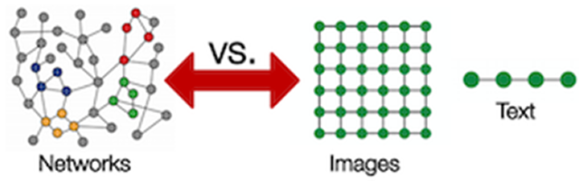

import Tooltip from "@site/src/components/Tooltip";

# نگاه دیگری برای یادگیری از داده‌ها

در دنیای هوش مصنوعی، معمولاً با داده‌هایی روبه‌رو هستیم که در قالب جدول، تصویر یا متن سازمان‌دهی شده‌اند. اما اطلاعات ما همیشه این‌قدر ساختارمند نیستند. مولکول‌ها، شبکه‌های اجتماعی یا گراف‌های استنادی؛ این‌ها داده‌هایی هستند که در قالب ساختارهای پیچیده و درهم‌تنیده قرار دارند. این نوع داده‌ها به‌علت وجود روابط غیر اقلیدسی و نبود روابط هندسی منظم (مانند ترتیب چپ به راست یا روابط فضایی، مثل تصاویر یا جملات) قابل‌استفاده در شبکه‌هایی مانند شبکه‌های چندلایهٔ پرسپترون یا شبکه‌های پیچشی (کانولوشن) و شبکه‌های عصبی برگشتی نیستند. به‌عبارتی این شبکه‌ها با فرض روابط اقلیدسی کار می‌کنند و برای یادگیری مدل از این نوع داده‌ها، به ابزاری قدرتمند نیاز داریم که بتواند این نوع از اطلاعات را به‌خوبی پردازش کند و آن، چیزی نیست جز

<Tooltip tip="Graph Neural Network (GNN)">
  **شبکه های عصبی گرافی**
</Tooltip>
.

## داده‌ساختار گراف

هر گراف از

<Tooltip tip="Node">
  **گره‌ها**
</Tooltip>
(یا رئوس) و
<Tooltip tip="Edge">
  **یال‌ها**
</Tooltip>
(یا لبه‌ها) تشکیل شده‌است. تصور کنید اتم‌ها گره‌های یک گراف باشند و پیوندهای
شیمیایی، یال‌های آن. یا در یک شبکهٔ اجتماعی، افراد گره‌های گراف و روابط دوستی
میان آن‌ها یال‌های گراف باشند. نکتهٔ مهم این است که هر گره و یال می‌تواند دارای

<Tooltip tip="Feature">
  **ویژگی‌هایی**
</Tooltip>
باشد. مثلاً یک گره ممکن است نشان‌دهندهٔ یک اتم کربن باشد؛ با ویژگی‌هایی مثل «عدد
اتمی: ۶» یا «الکترونگاتیوی: ۲٫۵۵». این ویژگی‌های گره‌ها، یال‌ها و ساختار گراف
می‌توانند نقطهٔ شروع الگوریتم‌های
<Tooltip tip="Learning">
  **یادگیری**
</Tooltip>
شبکه‌های عصبی گرافی باشند.

## چرا شبکه‌های عصبی معمولی کارایی ندارند؟

مدل‌های سنتی

<Tooltip tip="Deep Learning">
  **یادگیری عمیق**
</Tooltip>
انتظار دارند ورودی‌ها بر پایهٔ یک فضای هندسی منظم باشند (مثل یک تصویر ۲۸×۲۸
پیکسلی یا یک جملهٔ همین نوشته!)، ولی گراف‌ها در ساختار، بسیار متنوع هستند، آن‌ها
می‌توانند به هر شکل پیچیده‌ای باشند (شکل ۱).


بدتر این‌که گراف‌ها غیر اقلیدسی هستند؛ یعنی نمی‌توان برایشان ترتیب طبیعی مثل ترتیب چپ به راست تعیین کرد. برای یادگیری مدل این نوع داده‌ها به شبکه‌ای نیاز داریم که بتواند بدون از بین بردن روابط غیر اقلیدسی از این داده‌ها یاد بگیرد. در این‌جا شبکه های عصبی گرافی وارد می‌شوند و با توجه به روابط بین گره‌ها، ویژگی‌های گره‌ها یا یال‌ها و ساختار گراف، شروع به یادگیری گراف می‌کنند.

    

    شکل ۱: مقایسهٔ داده‌های ساختارمند -مانند تصاویر و جملات- با داده‌های گرافی بدون ساختار

## شبکه‌های عصبی گرافی چگونه از اطلاعات یاد می‌گیرند؟

در قلب شبکه‌های عصبی گرافی فرآیندی به نام

<Tooltip tip="Message Passing">
  **انتشار پیام**
</Tooltip>
قرار دارد؛ هر گره، اطلاعاتی به نام پیام را از همسایگانش دریافت کرده و به آن‌ها
ارسال می‌کند. این پیام‌ها بر اساس ویژگی‌های گره‌ها یا ویژگی‌های یال‌ها یا ساختار
گراف ساخته می‌شوند. سپس گره‌ها یا یال‌ها این پیام‌ها را تجمیع کرده و وضعیت خود
را به‌روزرسانی می‌کنند. مثلاً یک اتم اکسیژن می‌تواند از هیدروژن‌های متصل به خود
اطلاعات بگیرد. این فرایند در چندین مرحله انجام می‌شود تا هر گره یا یال اطلاعاتی
غنی و مبتنی بر همسایگان خود را به‌دست آورد.

## یک مثال ملموس: پیش‌بینی سمی بودن یک مولکول

فرض کنید می‌خواهیم میزان سمی بودن یک مولکول را پیش‌بینی کنیم. این مولکول‌ها را به‌صورت گراف نمایش می‌دهیم: اتم‌ها گره‌‌های گراف‌اند، با ویژگی‌هایی مثل جرم اتمی یا هیبریداسیون؛ که این ویژگی‌ها به‌صورت
بردار

<Tooltip tip="Embedding">
  **تعبیه**
</Tooltip>
نمایش داده می‌شوند و پیوندهای کوالانسی، یال‌‌های گراف‌اند؛ با ویژگی‌هایی مثل نوع
پیوند (پیوند یگانه یا دوگانه). شبکه‌ی‌ عصبی گرافی با بردار تعبیهٔ ویژگی‌های
اتم‌ها شروع به یادگیری می‌کنند. ابتدا هر گره، بردارهای تعبیهٔ
 گره‌های همسایگان
خود را با بردار تعبیهٔ خودش جمع می‌کند و این بردار حاصل‌شده را با بردار تعبیهٔ
خودش جایگزین می‌کند؛ فرایندی که انتشار پیام نام دارد. البته برای مسئله‌هایی
مانند پیش‌بینی یال بین دو گره می‌توان از بردارهای تعبیهٔ یال‌ها استفاده کرد. سپس
با انجام چندبارهٔ فرایند انتشار پیام، اتم‌ها اطلاعاتشان را با یکدیگر به اشتراک
می‌گذارند. در نهایت مدل نیز می‌تواند بردارهای تعبیهٔ به‌روزشدهٔ گره‌ها را با هم
ترکیب کند (مثل عمل میانگین‌گیری بین هر ویژگی بردارها) و به برداری از کل ساختار
گراف برسد که می‌تواند برای پیش‌بینی «سمی» یا «غیرسمی» بودن در الگوریتم‌های
دسته‌بندی یادگیری ماشین به‌عنوان ورودی استفاده شود.

## نگاهی دقیق‌تر به ویژگی‌های گره‌ها

ویژگی‌های گره همان دانشی است که شبکه‌های عصبی گرافی در ابتدا در اختیار دارند. در مولکول‌ها این ویژگی‌ها ممکن است شامل عدد اتمی یا ظرفیت پیوندی باشند. یال‌ها هم می‌توانند ویژگی‌هایی مثل نوع پیوند (تکی/دوتایی) داشته باشند. این ویژگی‌ها به‌صورت بردارهای عددی نمایش داده می‌شوند. با پیشروی انتشار پیام، بردار بازنمایی هر گره از همسایه‌های خود آگاه می‌شود؛ یعنی نه‌تنها خود را می‌شناسد، بلکه نقش خود در کل ساختار گراف را نیز درک می‌کند.

## ریاضی در پشت صحنه

 فرمول پایه‌ای برای به‌روزرسانی هر گرهٔ v به صورت زیر است:

$$
h_v^{(k)} = \text{UPDATE}^{(k)} \Big( h_v^{(k-1)}, \text{AGGREGATE}^{(k)} \big( \{ h_u^{(k-1)} : u \in N(v) \} \big) \Big)
$$

در این‌جا
$h_v^{(k)}$
بازنمایی گره در لایهٔ k است و

$N(v)$
همسایگان آن. تابع AGGREGATE پیام‌ها را جمع‌آوری می‌کند (مثلاً با میانگین‌گیری یا جمع) و تابع UPDATE یک شبکهٔ چندلایهٔ پرسپترون (از لحاظ تئوری می‌توانیم از هر شبکه مشتق‌پذیر استفاده کنیم) است. این شبکه بردار به‌روز‌رسانی‌شدهٔ هر گره را (X) به صورت ترکیب خطی وزن‌دار با وزن‌هایی برای

هر ستون بردار
$(AX + B)$
در می‌آورد که با برگشت گرادیان این وزن‌ها به‌روزرسانی می‌شوند. این رابطهٔ بازگشتی اجازه می‌دهد که شبکه‌های عصبی گرافی، دانشی چندمرحله‌ای از ساختار گراف را به‌دست آورند.
شبکه‌های عصبی گرافی به مفاهیم تئوری محدود نمی‌شوند، آن‌ها در بسیاری از حوزه‌های عملی و دنیای واقعی مورد استفاده قرار می‌گیرند. به‌عنوان مثال در AlphaFold -یک پیش‌بینی‌کنندهٔ ساختار پروتئین انقلابی- شبکه‌های عصبی گرافی به مدل‌سازی نحوهٔ تعامل اسیدهای آمینه کمک می‌کنند. در شبکه‌های اجتماعی، پلتفرم‌هایی مانند فیس‌بوک و لینکدین از شبکه‌های عصبی گرافی برای پیشنهاد اضافه کردن افراد به‌عنوان دوست یا شناسایی
حساب‌های جعلی استفاده می‌کنند. حتی موتور جست‌و‌جوی گوگل نیز برای درک بهتر روابط صفحات وب، از شبکه‌های عصبی گرافی استفاده می‌کند.

## چالش‌ها و مسیر آینده

با وجود قدرت بالا، شبکه‌های عصبی گرافی با چالش‌هایی نیز روبه‌رو هستند؛ آن‌ها می‌توانند برای گراف‌های خیلی بزرگ هزینهٔ پردازشی بالایی داشته باشند و عملکردشان به نحوهٔ تعریف گراف بسیار وابسته است. به‌طور مثال می‌توان به سؤالاتی چون «چه چیزی همسایه محسوب می‌شود؟» و «چه ویژگی‌هایی مهم‌ترند؟» اشاره کرد. پژوهشگران مشغول کار روی افزایش


<Tooltip tip="Scalability">
  **مقیاس‌پذیری**
</Tooltip>
، مکانیزم‌های
<Tooltip tip="Attention">
  **توجه**
</Tooltip>
و قابلیت
<Tooltip tip="Interpretability">
  **تفسیرپذیری**
</Tooltip>
هستند، تا شبکه‌های عصبی گرافی را بهتر و قابل‌فهم‌تر کنند.


## چرا این موضوع برای شما اهمیت دارد؟

چه دانشجوی زیست‌شناسی باشید و به کشف دارو علاقه‌مند باشید، چه دانشجوی علوم کامپیوتر باشید و در حال یادگیری مدل‌های جدید؛ شبکه‌های عصبی گرافی افق جدیدی در هوش مصنوعی می‌گشایند. زیرا آن‌ها داده‌ها را نه به‌صورت مسطح و ساده، بلکه پیچیده، متصل و پویا می‌بینند و امکان یادگیری مدل از  داده‌های غیر اقلیدسی را فراهم می‌کنند، و شاید همین توانایی باشد که راه را برای کشفیات علمی آینده باز می‌کند.


> [منبع](https://neptune.ai/blog/graph-neural-network-and-some-of-gnn-applications)
