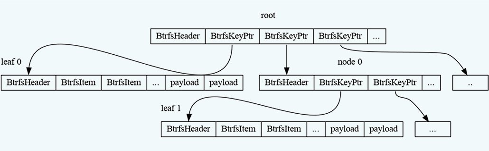

import Tooltip from '@site/src/components/Tooltip';

# فایل‌سیستمی بدون محدودیت تعداد inode

<Tooltip tip="File System">**فایل‌سیستم**</Tooltip>
 یک ساختار مدیریت داده است که وظیفهٔ سازمان‌دهی، ذخیره‌سازی و مدیریت داده‌ها روی حافظه‌های ذخیره‌سازی مانند HDD SSD، حافظه‌های جانبی و… را بر عهده دارد. فایل‌سیستم تعیین می‌کند که چگونه داده‌ها به صورت فایل‌ها و
<><Tooltip tip="Directory">**دایرکتوری**</Tooltip></>
‌ها ذخیره شده و چگونه می‌توان به آن‌ها دسترسی داشت. هر فایل‌سیستم دارای ساختار مشخصی برای نام‌گذاری فایل‌ها، مدیریت فضا، سطح دسترسی کاربران و نگهداری
<Tooltip tip="Metadata">**فراداده**</Tooltip>
(مانند تاریخ ایجاد یا اندازهٔ فایل) است. انواع مختلفی از فایل‌سیستم‌ها وجود دارند که هر کدام برای نیازها و پلتفرم‌های خاصی طراحی شده‌اند؛ مانند FAT32 ،NTFS ،ext4 و غیره. انتخاب فایل‌سیستم مناسب می‌تواند بر عملکرد، امنیت و قابلیت اطمینان سیستم تأثیر چشم‌گیری داشته باشد.

در دنیای سیستم‌های عامل، به‌خصوص در سیستم‌های عامل مبتی‌بر
<Tooltip tip="Unix-Based">**یونیکس**</Tooltip>
و
<Tooltip tip="Unix-Like">**شبه‌یونیکسی**</Tooltip>
مانند لینوکس، مفهوم inode یکی از اصولی‌ترین و مهم‌ترین مفاهیم در مدیریت فایل‌هاست. به زبان ساده inode ساختاری است که اطلاعات مربوط به هر فایل یا دایرکتوری را در خود ذخیره می‌کند. این اطلاعات، همان فرادادهٔ فایل است که شامل مواردی مانند مالک فایل، گروه مالک، مجوزهای دسترسی، اندازهٔ فایل، زمان‌های مختلف مرتبط با فایل (مثل زمان ایجاد، آخرین دسترسی و آخرین تغییر) و مهم‌تر از همه، اشاره‌گرهایی به محل واقعی بلوک‌های دادهٔ فایل بر روی دیسک است. باید توجه داشت که داده‌های اصلی فایل، به صورت مستقیم در inode ذخیره نمی‌شوند؛ بلکه inode به آدرس‌هایی اشاره می‌کند که داده‌ها در آن‌ها قرار دارند.

در لینوکس، فایل‌سیستم ext4 یکی از پرکاربردترین و محبوب‌ترین گزینه‌هاست. در ext4 تعداد inode‌ها هنگام ایجاد فایل‌سیستم تعیین می‌شود و این تعداد ثابت باقی می‌ماند. به این معنا که اگر تعداد inode‌ها تمام شود، دیگر نمی‌توان فایل جدیدی ایجاد کرد؛ حتی اگر فضای فیزیکی کافی روی دیسک موجود باشد. این موضوع به خصوص در سیستم‌هایی که تعداد زیادی فایل کوچک دارند، می‌تواند به یک محدودیت جدی تبدیل شود.

از سوی دیگر، در ویندوز، فایل‌سیستم NTFS به عنوان فایل‌سیستم پیش‌فرض، ساختارهای پیشرفته‌تری برای مدیریت فایل‌ها دارد.

فایل‌سیستم NTFS علاوه‌بر مدیریت امنیتی و پشتیبانی از مجوزهای دسترسی پیشرفته،  قابلیت‌هایی مثل فشرده‌سازی فایل‌ها، رمزنگاری و قابلیت‌های journaling (ثبت تغییرات) را نیز ارائه می‌دهد. هرچند مفهوم inode به آن شکل در NTFS وجود ندارد؛ اما ساختارهای مشابهی برای نگهداری فرادادهٔ فایل‌ها در آن تعریف شده‌است. همچنین فایل‌سیستم‌هایی مانند FAT32 و exFAT که بیشتر در حافظه‌های قابل‌حمل کاربرد دارند، محدودیت‌هایی در حداکثر اندازهٔ فایل و تعداد کل فایل‌ها دارند و به‌هیچ عنوان برای استفاده در سیستم‌های پیچیده و با تعداد زیاد فایل مناسب نیستند.

با افزایش پیچیدگی و نیازهای مدرن در ذخیره‌سازی داده‌ها، فایل‌سیستم‌های جدیدی توسعه یافته‌اند که بتوانند محدودیت‌های فایل‌سیستم‌های سنتی را برطرف کنند. یکی از این موارد، Btrfs                                    (B-tree file system) است. ساختار کلی این فایل‌سیستم در تصویر زیر مشهود است؛ این فایل‌سیستم در لینوکس به عنوان یک گزینهٔ پیشرفته و مدرن مطرح شده‌است. مهم‌ترین ویژگی Btrfs، مدیریت پویا و غیرمحدود inodeهاست.

فایل‌سیستم Btrfs نسبت به فایل‌سیستم‌هایی مانند ext3 و ext4، ساختار کاملاً متفاوتی دارد و inodeها را به صورت پویا و در قالب یک ساختار داده‌ای مبتنی بر B-tree مدیریت می‌کند. هر inode در Btrfs به‌عنوان یک رکورد مستقل در درخت B-tree ذخیره می‌شود و تعداد inodeها به‌صورت خودکار و بر اساس نیاز افزایش می‌یابد. این بدین معناست که برخلاف ext4، هیچ آرایهٔ ثابت و محدودیت عددی برای inodeها در Btrfs وجود ندارد.

علاوه‌بر این، Btrfs از مکانیزم Copy-on-Write بهره می‌برد؛ بدین‌معنی که هنگام تغییر داده‌ها یا فراداده (شامل inode)، نسخهٔ جدیدی از آن‌ها ایجاد می‌شود؛ و نسخهٔ قبلی تا زمانی که تغییرات به‌صورت کامل اعمال و وضعیت پایدار نشده‌است، حذف نمی‌شود.  این رفتار، اگرچه ممکن است در نگاه اول هدررفت فضا به‌نظر برسد، اما مزایای مهمی دارد؛ تاریخچه‌ای از نسخه‌های پیشین فایل‌ها باقی می‌ماند که امکان تهیهٔ سریع snapshot و بازگشت به وضعیت‌های قبلی را بدون هزینهٔ اضافه فراهم می‌کند.

    

در Btrfs، به ازای هر بلوک داده، مقدار checksum (مثل CRC32) نگهداری می‌شود تا صحت داده‌ها بررسی شود. این کار، باعث افزایش اطمینان در برابر خرابی‌های داده می‌شود. همچنین ساختار درختی Btrfs به آن اجازه می‌دهد تا عملیات جست‌و‌جو، درج و حذف inodeها را به صورت بسیار کارآمد انجام دهد؛ و مدیریت فایل‌ها را در مقیاس وسیع به‌خوبی پشتیبانی کند. این ویژگی‌ها باعث شده‌است که Btrfs نه‌تنها محدودیت inode سنتی را حذف کند، بلکه قابلیت‌هایی مانند checksum برای تشخیص و اصلاح خطاها، فشرده‌سازی داده‌ها و مدیریت RAID داخلی را نیز ارائه دهد که ext4 فاقد آن‌هاست.

هرچند Btrfs ویژگی‌های برجسته‌ای دارد، اما با چالش‌هایی نیز همراه است. Btrfs به دلیل ساختار پیچیده‌تر و امکانات گسترده‌تر نسبت به ext4، نیازمند منابع سیستمی بیشتری است و مدیریت آن به تخصص و دانش فنی بیشتری نیاز دارد. همچنین در سال‌های ابتدایی توسعهٔ Btrfs، به‌خاطر برخی مشکلات پایداری، مورد انتقاد قرار گرفته بود؛ هرچند اکنون به مراتب پایدارتر شده و در توزیع‌های مطرح لینوکس، به‌عنوان گزینۀ پیش‌فرض برای فایل‌سیستم برخی از توزیع‌های لینوکس به‌کار گرفته می‌شود. با این‌ حال، در مقایسه با ext4 که سال‌ها مورد آزمون قرار گرفته و بسیار پایدار است، هنوز در برخی سناریوهای خاص، احتمال مواجهه با خطاهای پیچیده در Btrfs وجود دارد که باید مدیریت شود.

از این رو، من هم از این فایل‌سیستم استفاده می‌کنم که
<Tooltip tip="Fedora">**فدورا**</Tooltip>
از نسخهٔ ۳۳ و بالاتر، تصمیم گرفت آن را به‌عنوان فایل‌سیستم پیش‌فرض خود برگزیند. ویژگی‌ای که بیش از همه من را مجذوب خود کرد، قابلیت subvolume است. از آن‌جا که برای مسیرهای
<Tooltip tip="root">**ریشه**</Tooltip>
(`/`) و
<Tooltip tip="home">**خانه**</Tooltip>
(`\u2066/home\u2069`) همواره می‌بایست دو پارتیشن جداگانه ایجاد می‌شد و تخصیص حافظهٔ مناسب برای هر یک، خود چالشی دشوار محسوب می‌شد، با بهره‌گیری از این قابلیت می‌توان یک پارتیشن کلی ایجاد کرد و دو subvolume برای `\u2066/\u2069` و `\u2066home/\u2069` ساخت؛ که تا زمانی که فضای کلی partition به اتمام نرسیده‌است، هر دو می‌توانند از آن فضا استفاده کنند.

در نهایت، inode به‌عنوان یک ساختار کلیدی در مدیریت فایل‌ها، نقش مهمی در کارکرد فایل‌سیستم‌ها ایفا می‌کند. فایل‌سیستم‌های سنتی مانند ext4، محدودیت‌های سخت‌گیرانه‌ای در تعداد inodeها دارند که می‌تواند در سیستم‌های دارای تعداد زیاد فایل کوچک، به‌عنوان یک
<Tooltip tip="bottleneck">**گلوگاه**</Tooltip>
مطرح شود. سیستم‌های جدیدتری مانند Btrfs، این محدودیت‌ها را با مدیریت پویا و پیشرفتهٔ inodeها رفع کرده و امکاناتی فراتر از یک فایل‌سیستم سنتی ارائه می‌دهند. انتخاب بین این سیستم‌ها بستگی به نیازهای خاص هر محیط و میزان تخصص مدیریتی دارد؛ اما قطعاً Btrfs با قابلیت‌های نوین خود یکی از پیشگامان تحول        فایل‌سیستم‌ها در اکوسیستم لینوکس محسوب می‌شود.

    

