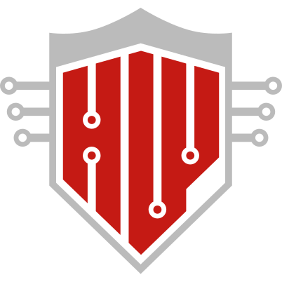
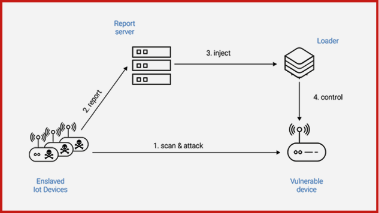
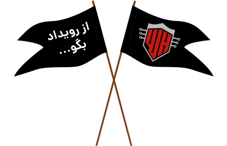

import Tooltip from "@site/src/components/Tooltip";

# داستان نبرد سخت

بخش علمی هاردوار نیز مانند تمامی رویدادهای دیگر، سختی‌های خودش را دارد. از سؤالات گرفته تا داوری، توزیع قطعات و حتی محاسبهٔ امتیازات، هر کدام اندازهٔ یک مسئولیت جداگانه، به انرژی نیاز داشتند. اما چیزی که این هاردوار را با دفعات قبلی متمایز می‌کرد، حجم تغییراتی بود که در روند مسابقه به‌وجود آورد. تغییراتی مانند فروشگاه، سؤالات انتخابی و تعداد بالای داوران برای نمره‌دهی، همگی تغییراتی بودند که طبق بازخورد‌هایی که از سال‌های پیش به ما رسیده بود، عملیاتی شدند. با تمام این‌ها، چیزی که خیلی برایمان مهم بود، کیفیت سؤالات بود. پشت تک‌تک سؤالات فکر شده بود و هر کدام قصد داشتند شما را با یک بخش از جهان وسیع سخت‌افزار آشنا کنند.

ما در هاردوار امسال، تلاشمان بر این بود که سؤالات بیشترین تنوع ممکن را داشته باشند. شروع کار ما از دی‌ماه بود. یادم می‌آید اولین جلسه‌ای که برگزار کردیم، دو شب قبل از ICPC بود و تعداد زیادی (حدود ۲۴ تا) سؤال علمی آماده کرده بودیم که به نسبت هاردوارهای قبلی، عدد بسیار بزرگی بود. هاردوار، هرساله یک مسیر مشخص با حداکثر ۴ بخش -که نیاز به داوری حضوری داشتند- برای همه ترسیم می‌کرد؛ ولی ما قصد داشتیم ناممکن را ممکن کنیم. جالب است بدانید که از سمت ادوار هم مدام به ما گفته می‌شد که این حجم از لود علمی، قابل‌تحمل نیست؛ و تنها راه‌حل، کم کردن سؤالات است.

جا دارد اشاره کنم که من اوایل کار برای سازمان‌دهی ایده‌ها، یک کانال تلگرامی ایجاد کردم تا ایده‌ها را داخل آن قرار دهم. البته به جز روز اول، چیز دیگری در آن کانال ارسال نشد؛ اما موردی که بسیار برایم جذاب است، این بود که که یک‌سری افراد، این کانال را قبل از مسابقه پیدا کردند؛ که همت این دوستان واقعاً ستودنی بود.

در ذهن ما، سؤالات داخل چندین دستهٔ اصلی قرار داشتند. سؤالات معمایی، امنیت و شبکه، رباتیک، هوش مصنوعی و برنامه‌نویسی که هر کدام در ادامه توضیح داده خواهند شد. این سؤالات چندین‌بار دچار تغییر و بازبینی شدند؛ چرا که هرچه جلوتر می‌رفتیم و قطعات را تست می‌کردیم، بیشتر متوجه سختی یا امکان‌پذیر نبودن سؤال می‌شدیم.
از جملهٔ این تغییرات، می‌توان به اضافه شدن یک سؤال برنامه‌ریزی‌نشده در بخش دوم روز اول، زیر و رو شدن یکی از المان‌های بازی و تبدیل آن به سؤال معدن، اضافه شدن قابلیت بازگرداندن قطعه‌ها و… اشاره کرد.

## سوالات معمایی

این دسته از سؤالات، حال‌وهوایی مانند سؤالات رویداد وارم‌آپ داشتند؛ البته با چاشنی سخت‌افزار. مطمئنم برایتان سؤال شده که حالا این سؤالات معمایی ما کجاست؟ در جواب به این سؤال، با تأسف می‌گویم که هیچ‌کدام از سؤالات معمایی، به موقع آماده نشدند :). خیلی به دوستانی که برای این سؤال‌ها وقت می‌گذاشتند افتخار می‌کردم. از یک‌شنبهٔ قبل از رویداد، کارشان را شروع کرده بودند و واقعاً داشتند در طراحی سؤالات پیش می‌رفتند؛ ولی مشکلات پیش‌بینی‌نشده‌ای سر راه‌شان قرار گرفت. مشکلاتی در حد پریدن فیوز پریزهای کلاس ۲۰۲. قرار بود با این سؤالات، کمی از زیبایی‌های فیلد سخت‌افزار را به شما نشان دهیم؛ که به امید خدا در دورهٔ بعدی در خدمتتان خواهیم بود! با این سؤالات قصد داشتیم با استفاده از انواع قطعات سخت‌افزاری، جرقهٔ خلاقیتی در شما بزنیم و همچنین دست شما را گرم کنیم که ببینید چه کارهایی را می‌توانید با این قطعات انجام دهید!

## سؤالات امنیت و شبکه

بخش امنیت و شبکه، سؤالات Capture The Flag -یا به اختصار CTF- مانند سؤال «کلاغ سیاه» یا «دامبلدور» و سؤالات DigiSpark یعنی «حملهٔ بدون دست»، «کارآگاه» و «AGCC» را شامل می‌شود. هدف اصلی این سؤالات، آشنا شدن با ضعف این سیستم‌هاست. دستگاه‌های Internet of Things -یا به اختصار IoT-، یکی از بزرگترین هدف‌ها برای هکرها هستند. به‌دلیل جدید بودن و در دسترس نبودن، اکثراً ملاحظات امنیتی در آن‌ها لحاظ نمی‌شود و همین موضوع، آن‌ها را بسیار خطرناک می‌کند.

به‌عنوان مثال، یکی از حملات معروف منع سرویس در سال ۲۰۱۶ با نام Mirai، با بهره‌گیری از دوربین‌ها، مودم‌های شبکه و سایر تجهیزات اینترنت‌اشیاء (IoT) اجرا شد. این حمله توانست ترافیکی با حجمی بیش از یک ترابیت بر ثانیه به سمت سرویس‌دهندگانی مانند OVH -یکی از بزرگ‌ترین شرکت‌های میزبانی وب در اروپا- ارسال کند. حتی گزارش‌هایی مبنی بر تلاش برای حمله به کل شبکهٔ یک کشور نیز منتشر شده‌‌است. چیزی که به این حمله قدرت داده بود، ضعف‌های امنیتی موجود در همین دستگاه‌ها بود. فرایند تحت سلطه گرفتن این دستگاه‌ها به این صورت بود که ابتدا دستگاه‌های آلوده در شبکه، به دنبال دستگاه‌های جدیدی می‌گشتند، سپس مشخصات آن دستگاه را به سرور گزارش می‌دادند، سرور نیز با وارد کردن یک کد مخرب در ثابت‌افزار این دستگاه، آن را تحت سلطهٔ خود در می‌آورد.

حال، هدف اصلی سؤالات «حملهٔ بدون دست» و «کارآگاه» همین بود که بتوانید به کمک ابزارهایی که در دست دارید، کنترل یک دستگاه را به‌دست آورید. سؤالات CTF، بیشتر از این نظر حائز اهمیت بودند که هنگامی که یک حمله رخ می‌دهد، در اکثر مواقع، فرد یا ارگان هدف حمله چیزی جز یک سیستم آلوده در اختیار ندارد و نیاز است تا با مهندسی معکوس و تکنیک‌های دیگر بتوانید آسیب‌پذیری را پیدا کرده و آن را برطرف کنید. سوال OTA نیز که مخفف Over The Air update هست، شما را با یک مکانیزم دفاعی دربرابر حملات ثابت‌افزار آشنا می‌کرد. سؤال MimeDogs نیز مهارت شما برای مقابله با قابلیت‌های یک سیستم را می‌سنجید و سؤال AGCC یا Air Gap Covert Channel نیز از مسائل پرکاربرد امنیتی بود که به پیدا کردن راه‌هایی برای انتقال اطلاعات بین دو دستگاه که یک فاصلهٔ فیزیکی آن‌ها را از یکدیگر جدا کرده است، اشاره داشت که یک موضوع بسیار کاربردی است.
سوال UART نیز، طریقهٔ مواجههٔ شما با یک مسئلهٔ مبهم را نشان می‌داد که چگونه می‌توانید یک راه‌حل بهینه برای مسئله پیدا کنید.

## سؤالات رباتیک

از مجموعهٔ سؤالات رباتیک، تنها دو سؤال موفق شدند که به روز مسابقه برسند! این‌گونه سؤالات مکانیکی، اولین بار بود که امتحان می‌شدند. (البته کاشف به عمل آمد که به موازات ما، مسابقات رباتیک دانش‌آموزی نیز در سالن جباری در حال برگزاری بود). این سؤالات برای خودمان هم خیلی جدید بودند. بچه‌های تیم علمی از هفتهٔ قبل از رویداد در تلاش بودند که رباتی بسازند که بتواند روی چرخ‌هایش راه برود و همین تسک، از ما دو شبانه‌روز زمان برد. هدف از این سؤالات، این بود که با چالش‌های بیشتری از جنس برق و کنترل روبه‌رو شوید.
سؤال «دستهٔ بازی»، قصد داشت دید اولیه‌ای به شما بدهد که کار با قطعات سخت‌افزاری چه مشکلات و معضلاتی دارد. پس از آن،
سؤال «سلام WALL-E» بود؛ این تنها سؤالی بود که
شما را موظف به ساخت یک شیء
مکانیکی می‌کرد و ترکیب زیبای
این دو دنیا با یک‌دیگر بود.
در انتها نیز، سؤال «ماز» قرار
داشت؛ در
تیم رویداد
حقیقتاً فکر
نمی‌کردیم کسی
تصمیم به حل این
سؤال بگیرد و به
حل آن برسد! که البته
یک تیم به این نقطه رسید.
هدف از سؤال در ابتدا تجربهٔ
ساخت یک دستگاه
مانند moon rover بود که شما را
به طور هم‌زمان با چالش انتقال اطلاعات
و کنترل مواجه کند.

## سؤالات هوش مصنوعی

سؤالات هوش مصنوعی نیز دستهٔ دیگری از سؤالات هستند؛
ایدهٔ اولیه پیدایش این بخش، الهام گرفته از یکی از سؤالات
دورهٔ قبل بود که البته شک و تردید زیادی نیز نسبت به آن وجود داشت. سؤال مذکور در دورهٔ قبل، به کابوس بچه‌ها تبدیل شده بود و تمامی تیم‌ها را گیر انداخته بود؛ بچه‌هایی که عموماً ترم ۲ یا ۴ بودند، وادار به حل سؤالی در مباحث ML شدند؛ که از قضا مدل آن نیز مدل ساده‌ای نبود.
قوی‌ترین انگیزهٔ «انتخابی شدن» سؤالات هاردوار امسال همین بود که دیگر چنین اتفاقی رخ ندهد! ولی در عین حال، بتوانیم شما را با استفاده‌های هوش مصنوعی در سخت‌افزار آشنا کنیم.
سؤال «حاکم نامرئی»، تنها سؤال حاضر از این گروه بود و هدف از آن، آشنا شدن با یک کاربرد

<Tooltip tip="Machine learning">
  **یادگیری ماشین**
</Tooltip>
در سخت‌افزار بود، البته سعی کردیم که این بار، کسی با تجربهٔ تلخی که از سؤال هوش
مصنوعی پارسال داشتیم، روبه‌رو نشود.

## سؤالات برنامه‌نویسی

ما در سؤالات برنامه‌نویسی نیز با چالش روبه‌رو شدیم. اما این چالش برعکس بقیهٔ زمینه‌ها بود؛ هرچه ما سر سؤالات دیگر وقت می‌گذاشتیم و به سختی زیاد آن‌ها پی می‌بردیم، سؤالات برنامه‌نویسی برعکس بودند و وقتی این سؤالات ریلیز شدند، دیدیم که به‌سادگی توسط شرکت‌کنندگان حل می‌شوند! سؤالاتی که قرار بود صرفاً حل یکی از آن‌ها، چهار ساعت وقت بگیرد، همه‌ در کمتر از ۴۰ دقیقه توسط بعضی شرکت‌کنندگان حل شدند . البته به جز سؤال «بازی چند نفره» که
برای حل نکردن طراحی شده بود! اما همچنان یک‌سری افراد
بودند که چالش را پذیرفتند و سربلند از آن بیرون آمدند.
هدف از این سؤالات، بیشتر آشنا
شدن با خود ESP بود و این ‌که
چگونه می‌توان برای ساخت وسایل
کوچک از آن‌ها استفاده کرد.
این بود داستانی از تلاش ما برای آشنا
کردن شما با
زمینهٔ شیرین
سخت‌افزار! اگر
بخواهم هدف
خود از هد علمی
شدن در این رویداد
را در یک جمله خلاصه
کنم، آشنا کردن
شما با کارهایی‌ است
که می‌توانید به دست خودتان
انجام دهید و با استفاده از این
دستگاه‌ها، لامپ اتاقتان را
هوشمند کنید، یک ماشین کنترلی
بسازید؛ یا خیلی چیزهای دیگر؛ ببینید
که اسباب‌بازی‌هایی که در بچگی عاشق
آن‌ها بودید را چقدر ساده می‌توانید خودتان
بسازید و یک زمینه برای استفاده از خلاقیت خود
پیدا کنید.

