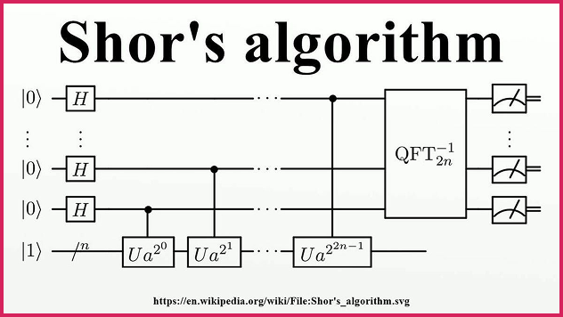
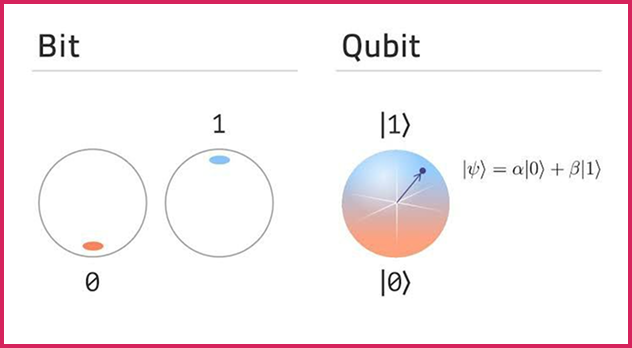

import Tooltip from "@site/src/components/Tooltip";

# رایانش و ارتباطات کوانتومی؛ انقلابی در دنیای فناوری

در دنیای فناوری‌های نوظهور، مفاهیم کوانتومی از جملهٔ مباحثی هستند که آیندهٔ محاسبات و ارتباطات را دگرگون خواهند کرد. این حوزه را می‌توان به‌طور کلی به چند شاخهٔ اصلی تقسیم کرد:

<Tooltip tip="Quantum Computing">
  **۱. رایانش کوانتومی**
</Tooltip>
\
<Tooltip tip="Quantum Communication">
  **۲. ارتباطات کوانتومی**
</Tooltip>
\
<Tooltip tip="Quantum Simulation">
  **۳. شبیه‌سازی کوانتومی**
</Tooltip>
\
<Tooltip tip="Quantum Sensing">
  **۴. حسگرهای کوانتومی**
</Tooltip>

در این مقاله، تمرکز ما بر دو حوزهٔ مهم رایانش کوانتومی و ارتباطات کوانتومی است. ابتدا با معرفی ارتباطات کوانتومی به‌عنوان شاخه‌ای مستقل که با هدف انتقال ایمن اطلاعات ایجاد شده، آغاز می‌کنیم و سپس سری به دنیای هیجان‌انگیز رایانش کوانتومی، دلایل نیاز به آن، الگوریتم‌های خاص کوانتومی و پیامدهای آن در رمزنگاری خواهیم زد. همچنین نگاهی به رمزنگاری پساکوانتومی (که راهکار مقابله با تهدیدهای رایانش کوانتومی در فضای امنیت سایبری است) خواهیم داشت.

## ارتباطات کوانتومی: انتقالی ایمن و غیرقابل‌نفوذ

ارتباطات کوانتومی در نگاه اول ممکن است شبیه به اینترنت یا مخابرات کلاسیک به‌نظر برسد، اما ماهیت و ساختار آن کاملاً متفاوت است. این فناوری بر پایهٔ اصول مکانیک کوانتومی، مثل «درهم‌تنیدگی» و «اصل عدم قطعیت هایزنبرگ» شکل گرفته‌است.

در این‌جا، اطلاعات به‌صورت <Tooltip tip="Qubit">**کیوبیت**</Tooltip>
منتقل می‌شوند؛ واحدی که برخلاف بیت کلاسیک، می‌تواند هم‌زمان در وضعیت صفر و یک باشد.
اما جذاب‌ترین ویژگی ارتباطات کوانتومی، امنیت آن است. به لطف اصول کوانتومی مثل «درهم‌تنیدگی کوانتومی»، اگر فردی تلاش کند به اطلاعات دسترسی پیدا کند یا شنود انجام دهد، سیستم فوراً متوجه شده و ارتباط قطع شده یا تغییر می‌کند.

همین ویژگی باعث شده رمزنگاری کوانتومی به‌عنوان امن‌ترین روش‌ انتقال داده در نظر گرفته شود. ارتباطات کوانتومی بیشتر در شبکه‌های ایمن و توسعهٔ اینترنت کوانتومی مطرح است، که از لحاظ اهداف، فناوری‌ها و کاربردها کاملاً از رایانش کوانتومی مجزاست.

## رایانش کوانتومی: استفاده از اصول کوانتومی برای افزایش توان پردازشی

رایانش کوانتومی با هدف حل مسائل پیچیده‌ای توسعه یافته که رایانه‌های کلاسیک در آن‌ها ناکارآمد هستند. تفاوت اصلی رایانهٔ کوانتومی با کلاسیک، در نحوهٔ نمایش و پردازش اطلاعات است.

در رایانش کلاسیک، اطلاعات با استفاده از بیت‌ها نمایش داده می‌شوند که فقط می‌توانند در یکی از دو حالت صفر یا یک باشند. اما در رایانش کوانتومی، واحد اطلاعاتی به‌نام کیوبیت تعریف می‌شود. یک کیوبیت می‌تواند به‌طور هم‌زمان در ترکیبی از صفر و یک قرار گیرد. به این پدیده «برهم‌نهی» می‌گویند.

رایانه‌های کوانتومی با استفاده از روش‌های احتمالاتی می‌توانند برخی الگوریتم‌ها را سریع‌تر کنند. همین موضوع دلیل اصلی قدرت فوق‌العادهٔ آن‌ها در حل برخی مسائل خاص است؛ مثلاً در تحلیل کلان‌داده‌ها، مدل‌سازی مولکولی یا بهینه‌سازی.

در حالی‌که ویژگی‌هایی مانند درهم‌تنیدگی نیز در طراحی و کارایی سیستم‌های کوانتومی نقش دارند؛ در بسیاری از الگوریتم‌های اولیه، به‌ویژه الگوریتم‌هایی مانند <Tooltip tip="Shor's Algorithm">**الگوریتم شور**</Tooltip>
، این برهم‌نهی است که به‌عنوان موتور اصلی محاسبه به‌کار می‌رود.

## کیوبیت‌ها چه هستند؟

کیوبیت، مخفف «کوانتوم بیت»، واحد پایهٔ اطلاعات در رایانش کوانتومی است. اما برخلاف بیت کلاسیک که فقط می‌تواند صفر یا یک باشد، یک کیوبیت می‌تواند هم‌زمان صفر و یک باشد. این حالت به‌صورت ریاضی با ترکیبی از دو بردار پایه نمایش داده می‌شود:

$$
|\psi\rangle = \alpha |0\rangle + \beta |1\rangle
$$

که در آن،
$$ \alpha $$
و
$$ \beta $$
ضرایب مختلط هستند و تعیین می‌کنند با چه احتمالی نتیجهٔ صفر یا یک دیده می‌شود.

در عمل، کیوبیت می‌تواند روی اجزای فیزیکی مختلفی پیاده‌سازی شود، مثل اسپین الکترون، قطبش فوتون، یا مدارهای ابررسانا. کنترل دقیق این کیوبیت‌ها و حفظ پایدار آن‌ها در برابر نویز محیطی، چالش بزرگ
مهندسی در ساخت رایانه‌های کوانتومی است.

در واقع هر کیوبیت شبیه یک بیت احتمالاتی است که با یک احتمال صفر و با یک احتمال مقدار یک دارد و ما الگوریتم‌های خود را با پیاده‌سازی عملگرهای منطقی بر روی کیوبیت‌ها اجرا می‌کنیم.

## چرا به رایانش کوانتومی نیاز داریم؟

در دهه‌های گذشته، پیشرفت رایانه‌ها بر اساس <Tooltip tip="Moore's Law">**قانون مور**</Tooltip>
پیش رفته‌است: هر دو سال، تعداد ترانزیستورها در یک تراشه دو برابر می‌شود. اما این روند به محدودیت‌های فیزیکی نزدیک شده‌است. نمی‌توان ترانزیستورها را بی‌نهایت کوچک کرد، چون در مقیاس نانومتر، اثرات کوانتومی خودبه‌خود پدیدار می‌شوند و اختلال ایجاد می‌کنند.

از سوی دیگر، برخی مسائل ذاتاً پیچیده هستند و حتی با قوی‌ترین رایانه‌های کلاسیک، حل آن‌ها زمان بسیار زیادی می‌برد. مثل شبیه‌سازی دقیق مولکول‌ها در شیمی کوانتومی یا حل مسائل بهینه‌سازی پیچیده. اما حل این مسائل به کمک رایانه‌های کوانتومی و استفاده از اصل برهم‌نهی در زمانی معقول ممکن است.

## الگوریتم‌های کوانتومی و تاثیر آن‌ها بر رمزنگاری

یکی از مشهورترین الگوریتم‌های کوانتومی، الگوریتم شور است که می‌تواند عددهای بزرگ را به‌سرعت به عوامل اول تجزیه کند. این مسئله، برای رمزنگاری اهمیت زیادی دارد.

## تهدید رایانش کوانتومی برای رمزنگاری کلاسیک

یکی از بزرگ‌ترین تهدیدهای رایانش کوانتومی متوجه حوزهٔ رمزنگاری است، به‌ویژه رمزنگاری‌هایی مثل RSA که امروزه به‌شکل گسترده‌ای در اینترنت، بانک‌ها، امضای دیجیتال و بسیاری از سیستم‌های امنیتی استفاده می‌شوند.

الگوریتم RSA بر پایهٔ سختی تجزیهٔ عددهای بزرگ به عوامل اول ساخته شده‌است. به بیان ساده، اگر دو عدد اول بزرگ را در هم ضرب کنیم، به‌دست آوردن حاصل آن بسیار ساده است؛ اما اگر فقط حاصل‌ضرب را داشته باشیم، بازگشت به آن دو عدد اول (یعنی تجزیه) با رایانه‌های کلاسیک به‌شدت زمان‌بر و دشوار است. زمان‌بر بودن تجزیۀ اعداد، همان مسئله‌ای است که RSA را ایمن می‌کند.

در رایانش کلاسیک، سریع‌ترین الگوریتم‌های تجزیهٔ اعداد در بهترین حالت دارای پیچیدگی زیرنمایی بر حسب اندازۀ عدد ورودی هستند (دقت کنید n در این‌جا اندازۀ عدد ورودی است، یعنی مثلاً تعداد بیت‌های آن). این یعنی زمان لازم برای شکستن کلید با اندازهٔ ۲۰۴۸ بیت، ممکن است هزاران سال طول بکشد.

اما رایانه‌های کوانتومی با بهره‌گیری از الگوریتم شور می‌توانند همین کار را با پیچیدگی زمانی چندجمله‌ای انجام دهند.

به‌طور خاص، برای عددی به طول n بیت، در زمان O(n^3)  قابل اجراست (در برخی پیاده‌سازی‌ها حتی سریع‌تر). این یعنی برخلاف الگوریتم کلاسیک، بزرگترین کلیدها در زمانی معقول (مثلاً چند دقیقه) گشوده خواهند شد.

  این اختلاف زمانی عظیم باعث می‌شود که RSA ،ECC و بسیاری از رمزنگاری‌های رایج دیگر در برابر حملات کوانتومی آسیب‌پذیر شوند. حتی سیستم‌هایی که امروز ایمن هستند، ممکن است در آینده با ضبط و ذخیره‌سازی داده و تحلیل آن در عصر کوانتومی، دچار نشت اطلاعات شوند (ذخیره‌سازی و رمزگشایی در آینده – store now, decrypt later).

## رمزنگاری پساکوانتومی؛ راهی مستقل از تجزیه

برای مقابله با تهدیدهای کوانتومی، شاخه‌ای به‌نام «رمزنگاری پساکوانتومی» به‌وجود آمده‌است. در این روش ما به دنبال روش‌های رمزنگاری‌ای هستیم که برخلاف استانداردهای موجود به تجزیۀ اعداد متکی نباشند. رمزنگاری‌هایی که حتی با الگوریتم‌های کوانتومی هم در زمان معقول گشوده نشوند.

برخی از مهم‌ترین رویکردها در این حوزه عبارتند از:

- رمزنگاری مبتنی بر مشبکه‌ها
- رمزنگاری مبتنی بر چندجمله‌ای‌ چندمتغیره
- رمزنگاری مبتنی بر کدهای تصحیح خطا

این الگوریتم‌ها از نظر محاسباتی، در برابر رایانه‌های کلاسیک و کوانتومی مقاوم طراحی شده‌اند. در همین راستا، سازمان‌هایی مانند NIST (سازمان ملی استاندارد و تکنولوژی ایالات متحدهٔ‌ آمریکا) در حال تدوین و استانداردسازی مجموعه‌ای از الگوریتم‌های پساکوانتومی برای جایگزینی RSA و ECC هستند.

با این‌که رمزنگاری پسا‌کوانتومی راهکاری موقت برای تأمین امنیت ارتباطات خواهد بود، اما با توجه به نوظهور بودن الگوریتم‌های کوانتومی هنوز با قطعیت مشخص نیست که آیا واقعاً کامپیوترهای کوانتومی از رمزگشایی این نوع رمزنگاری‌ها در زمان معقول عاجز هستند یا نه. به بیان دیگر ممکن است به زودی برای رمزگشایی برخی از این روش‌ها الگوریتم‌های کوانتومی یافت شوند.

## حرف آخر: رمزنگاری؛ تنها یک برگ از دفتر کوانتوم

رایانش کوانتومی با استفاده از اصول مکانیک کوانتومی به ما در حل مسائلی که تا پیش از این غیرقابل‌حل به نظر می‌رسیدند کمک می‌کنند.  حل مسائل هم‌ارز با تجزیۀ اعداد و رمزگشایی از کلیدهای RSA، تنها بخش کوچکی از ماجراست. رایانش کوانتومی احتمالاً حوزه‌هایی مثل یادگیری ماشین و هوش مصنوعی را متحول خواهد کرد و با توجه به نوظهور بودن رایانش کوانتومی مشخص نیست که دیگر چه حوزه‌هایی را درگیر خود خواهد کرد.

چه بخواهیم، چه نه، دوران رایانش کلاسیک به نقطهٔ اشباع نزدیک شده و رایانش کوانتومی در حال ورود به صحنه است. از یک طرف، رایانه‌های کوانتومی قدرت پردازش بی‌سابقه‌ای دارند و از طرف دیگر، ارتباطات کوانتومی راهی تازه برای انتقال امن اطلاعات فراهم می‌کند. هرچند هنوز چالش‌های مهندسی زیادی باقی مانده، اما آینده، بی‌شک به رنگ کوانتوم خواهد بود.

:::tip[دانستنی]

یکی از بزرگ‌ترین تهدیدهایی که با ظهور رایانش کوانتومی مطرح شده، حملهٔ موسوم به «ذخیره کن و بعداً رمزگشایی کن» است. مهاجم امروزه داده‌های رمزنگاری‌شدهٔ حساس (مثلاً تراکنش‌های مالی، مکاتبات دولتی و به‌خصوص تراکنش‌های رمز ارزها) را جمع‌آوری و ذخیره می‌کند، حتی اگر فعلاً نتواند آن‌ها را رمزگشایی کند.

در آینده، وقتی رایانه‌های کوانتومی قدرتمند به‌طور کامل عملیاتی شوند و بتوانند الگوریتم‌هایی مثل شور را اجرا کنند، مهاجم می‌تواند به‌سرعت این داده‌های ذخیره‌شده را رمزگشایی کند. به این ترتیب، اطلاعاتی که سال‌ها ایمن به‌نظر می‌رسیدند، ناگهان افشا خواهند شد. زمانی که کامپیوترهای کوانتومی بتوانند سیستم‌های رمزنگاری امروزی را بشکنند، Q-Day یا آخرت کوانتومی رخ خواهد داد.

این حمله به‌ویژه در حوزه‌هایی مثل امنیت ملی و امنیت دارایی‌های دیجیتال بسیار خطرناک است. به‌طور خاص در حوزۀ رمز ارزها مهاجمان از هم‌اکنون تراکنش‌های رمزنگاری‌شده را ذخیره می‌کنند تا در آینده، با کمک سخت‌افزارهای کوانتومی بتوانند به کلیدهای خصوصی و دارایی‌های موجود در آن‌ها دست یابند. به همین دلیل، حتی اگر رایانه‌های کوانتومی در حال حاضر به‌طور گسترده در دسترس نباشند، مهاجمان انگیزهٔ کافی برای ذخیرهٔ داده‌ها را دارند. این مسئله سازمان‌ها را مجبور می‌کند که از همین امروز به سمت الگوریتم‌های مقاوم در برابر کوانتوم (رمزنگاری پساکوانتومی) حرکت کنند تا از افشای آینده جلوگیری کنند.

:::
