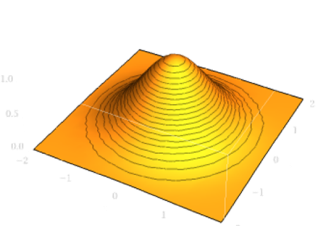
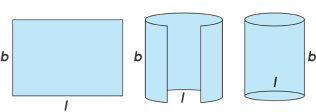

فرض کنید در حال صحبت با شخصی که خیلی ریاضی بلد نیست، هستید؛ به او درمورد قانون اعداد بزرگ و توزیع نرمال توضیح داده و به این‌که توزیع نرمال می‌تواند توصیف‌کنندهٔ خیلی چیزها در طبیعت باشد اشاره می‌کنید. مثلاً به او می‌گویید که قد افراد در یک منطقهٔ جغرافیایی از توزیع نرمال پیروی می‌کند. این موضوع برای آن شخص باید خیلی عجیب باشد؛ توزیعی که اکثر چیزهای طبیعی را توصیف می‌کند، باورنکردنی به نظر می‌آید. سپس فرض کنید به آن شخص فرمول تابع چگالی احتمال (PDF) توزیع نرمال را نشان داده و اجزایش را توضیح می‌دهید:

$$
f(x) = \frac{1}{\sigma\sqrt{2\pi}} e^{-\frac{(x-\mu)^2}{2\sigma^2}}
$$

وقتی آن شخص، عدد $\pi$ که نسبت محیط دایره به قطرش است را در این فرمول می‌بیند، قطعاً فکر می‌کند که دارید سر‌به‌سرش می‌گذارید! توزیع نرمال چه ربطی به محیط دایره دارد؟

این‌که عدد پی در توزیع نرمال وجود دارد چیزی است که در ابتدا احتمالاً برای ما عجیب بوده و بعد از مدتی بدون گرفتن دلیل قانع کننده‌ای این موضوع را پذیرفته‌ایم. اگر هم دنبال دلیل وجودش رفته‌ایم، احتمالاً به ما گفته‌اند دلیلش این است که انتگرال $e^{-x^2}$ روی $\mathbb{R}$ برابر است با $\sigma\sqrt{2\pi}$ و به‌صورت ریاضیاتی آن را نشان داده‌اند.

اما این توضیحات شاید برای بعضی قانع‌کننده نباشد یا شهود لازم برای درک این موضوع را فراهم نکند. اگر بخواهیم روی این موضوع دقیق شویم، باید سه سوال را جواب بدهیم تا این موضوع برای شخصی که نخستین بار است این موضوع را می‌بیند، قانع‌کننده باشد:

1. انتگرال $e^{-x^2}$ چه ارتباطی با دایره و محیطش دارد؟ 
2. اصلاً چرا این‌که $e^{-x^2}$ با دایره ارتباط دارد طبیعی است؟
3. چرا قانون اعداد بزرگ ما را به تابع نمایی $e^{-x^2}$ می‌رساند؟

در این متن سعی می‌کنیم به دو سؤال اول جواب بدهیم.

انتگرال $e^{-x^2}$ را چگونه می‌توان حساب کرد؟ در ریاضی ۱ خوانده‌ایم که انتگرال و مشتق به نوعی برعکس هم‌دیگر هستند، پس اولین راهی که برای محاسبهٔ آن ممکن است به ذهن‌مان برسد، پیدا کردن تابعی‌ست که مشتقش $e^{-x^2}$ باشد. اما مشکلی که وجود دارد، این است که انتگرال $e^{-x^2}$ جواب تحلیلی ندارد. یعنی نمی‌توان آن را بر حسب توابعی که می‌شناسیم، مانند توابع مثلثاتی، لگاریتم و… بیان کرد. پس سوالی که پیش می‌آید این است که اصلاً چگونه می‌توان $\int_{-\infty}^{+\infty} e^{-x^2} dx$ را حساب کرد؟ برای این کار، تکنیکی استفاده می‌کنیم که برای کسانی که اولین بار است آن را می‌بینند، خیلی عجیب به نظر می‌رسد؛ انتگرال را به یک بعد بالاتر می‌بریم. یعنی سعی می‌کنیم $\int_{-\infty}^{+\infty} \int_{-\infty}^{+\infty} e^{-(x^2+y^2)} dx dy$ را حساب کنیم. واضح است که داریم:

$$
\int_{-\infty}^{+\infty} \int_{-\infty}^{+\infty} e^{-(x^2+y^2)} dx dy = \int_{-\infty}^{+\infty} \int_{-\infty}^{+\infty} e^{-x^2} e^{-y^2} dx dy
$$

$$
= \int_{-\infty}^{+\infty} e^{-x^2} \left(\int_{-\infty}^{+\infty} e^{-y^2} dy\right) dx = \left(\int_{-\infty}^{+\infty} e^{-y^2} dy\right) \left(\int_{-\infty}^{+\infty} e^{-x^2} dx\right)
$$

$$
= \left(\int_{-\infty}^{+\infty} e^{-x^2} dx\right)^2
$$

پس اگر $\int_{-\infty}^{+\infty} \int_{-\infty}^{+\infty} e^{-(x^2+y^2)} dx dy$ را حساب کنیم، با یک رادیکال گرفتن می‌توانیم به خواستهٔ سوال برسیم. اگر ریاضی ۲ را به یاد داشته باشید، می‌توانید خیلی راحت با تغییر متغیر به دستگاه مختصات قطبی این انتگرال را حساب کنید. ما هم از یک روش مشابه برای به‌دست آوردن جواب این انتگرال استفاده می‌کنیم، اما بدون استفاده از تکینیک‌های انتگرال دوگانه و کاملاً به صورت هندسی و شهودی.

برای محاسبۀ $\int_{-\infty}^{+\infty} e^{-(x^2+y^2)} dx dy$ اول باید بفهمیم چه چیزی است. چون انتگرال را هم در راستای $x$ و هم در راستای $y$ روی کل $\mathbb{R}$ می‌گیریم و به این معنی است که می‌خواهیم کل حجم زیرنمودار $z = e^{-(x^2+y^2)}$ را با این انتگرال محاسبه کنیم. نمودار این تابع به این شکل است:

اگر دقت کنیم، می‌بینیم نقاطی که در راستای $x$ و $y$ فاصلهٔ یکسانی از مبدأ دارند، ارتفاع یکسانی هم دارند. این منطقی است، چون اگر فاصله از مبدأ را $r$ در نظر بگیریم، طبق قضیهٔ فیثاغورس داریم $r^2 = x^2 + y^2$، پس ارتفاع آن نقاط برابر است با $e^{-r^2}$. پس این نقاط ارتفاع یکسانی دارند و در نتیجه، یک استوانه را تشکیل می‌دهند. حال، برای اینکه حجم زیر این سطح را حساب کنیم، یک پوستهٔ خیلی نازک استوانه‌ای (به ضخامت $\Delta r$) و به مرکز محور $z$ در نظر می‌گیریم و سعی می‌کنیم حجم آن را به‌دست بیاوریم. فرض می‌کنیم شعاع داخلی این استوانه $r$ هست، پس ارتفاعش در بازهٔ $e^{-r^2}$ و $e^{-(r+\Delta r)^2}$ قرار می‌گیرد. ما می‌توانیم ارتفاعش را ثابت گرفته و فرض کنیم مساوی با $e^{-r^2}$ است. این فرض ما با کوچک‌تر شدن $\Delta r$ دقیق‌تر می‌شود، پس در حد $\Delta r \to 0$ این فرض ما دقیق است (این حرف ما از لحاظ ریاضیاتی دقیق نیست، اما چون هدف ما داشتن شهود به این مسئله است، آن را درست در نظر می‌گیریم). همچنین اگر $\Delta r$ را خیلی کوچک در نظر بگیریم، می‌توان آن استوانه را طوری بُرید تا به شکل یک صفحهٔ نازک مستطیلی در بیاید:

پس ما حجم این استوانهٔ نازک را با این مستطیل تخمین می‌زنیم. واضح است که هرچه
$\Delta r$ کوچک‌تر باشد، این تخمین دقیق‌تر است. در شکل بالا، $b = e^{-r ^ 2}$ و
$l = 2\pi r$ هستند. پس حجم این پوستهٔ استوانه‌ای برابر است با $2\pi r e^{-r ^ 2}
\Delta r$.

اگر نمودار را به این استوانه‌های خیلی نازک تقسیم کنیم و ضخامت هر استوانه را $dr$ در نظر بگیریم، حجم کل زیر نمودار برابر با جمع حجم کل این استوانه‌هاست:

$$
\int_0^{\infty} 2\pi r e^{-r^2} dr = \int_0^{\infty} \pi e^{-x} dx
$$

$$
= -\pi[e^{-r^2}]_0^{\infty} = 0 - (-\pi e^0) = \pi
$$

$$
\Rightarrow \int_{-\infty}^{\infty} e^{-x^2} dx = \sqrt{\pi}
$$

حال توانستیم ببینیم که اصلاً عدد پی از کجا در این انتگرال پیدایش شد. اما راستش را بگوییم، احتمالاً خیلی قانع‌کننده نباشد. اول از همه این‌که ما در محاسبهٔ انتگرال ظاهراً بدون هیچ دلیلی مسئله را از یک تابع تک متغیره به یک تابع دومتغیره تبدیل کردیم. مشکل دوم هم این است که حتی اگر بپذیریم انتگرال $ e^{-(x^2+y^2)} $ روی $ \mathbb{R}^2 $ مساوی با عدد پی می‌شود، این‌که چرا مسئلهٔ اولیه را یک بعد بالاتر بردیم تا به این تابع برسیم، به‌اندازۀ وجود عدد پی در توزیع نرمال عجیب به نظر می‌رسد.

برای این‌که این موضوع و همچنین تابع $e^{-(x^2+y^2)}$ کمی طبیعی‌تر به نظر برسند، نشان می‌دهیم که اگر روی کل توزیع‌های احتمالی دومتغیره و پیوسته، دو شرط خیلی ساده و طبیعی بگذاریم، به همین تابع می‌رسیم، و نه هیچ تابع دیگری.

فرض کنید یک تابع چگالی احتمال را می‌خواهید پیدا کنید که این دو خاصیت را داشته باشد:

1. این تابع فقط به فاصله از مبدأ وابسته باشد؛ به زبان هندسی یعنی می‌توانید محور مختصات را حول مبدأ دوران بدهید، بدون این‌که توزیع تغییری کند. به زبان ریاضی:

   $$
   f(x,y) = A(\sqrt{x^2+y^2})
   $$

   که $A$ یک تابع تک متغیره است. همچنین بدون این‌که جامعیت مسئله از بین برود، فرض می‌کنیم؛ $A(-x) = A(x)$. این فرض مشکلی به‌وجود نمی‌آورد، چون تابع $A$ فقط برای ورودی‌های نامنفی برای ما اهمیت دارد و صرفاً برای ساده شدن محاسبات در ادامه، این فرض را می‌کنیم.

2. مقدار $x$ و $y$ در این توزیع از هم مستقل باشند. یعنی اگر یک نمونه از این توزیع بگیریم، دانستن مقدار $x$ این نقطه هیچ اطلاعاتی از مقدار $y$ این نقطه به ما ندهد. به زبان ریاضی:
   $$
   f(x,y) = B(x)C(y)
   $$

همچنین فرض می‌کنیم $f(x,y)$ پیوسته است، چون توابعی که در طبیعت پیدا می‌شوند، اکثراً پیوسته هستند (یادآوری می‌کنیم که هدف ما پیدا کردن ارتباط $e^{-(x^2+y^2)}$ و به همراهش عدد پی با توزیع‌های آماری حاکم بر طبیعت است). 
حال نشان می‌دهیم $e^{-(x^2+y^2)}$ تنها تابع پیوسته‌ای است که آن دو شرط بالا را دارد. 
از شرط دوم می‌دانیم که $f(x,y)=B(x)C(y)$. 
حال این توابع را به ازای ورودی‌های متفاوت بررسی می‌کنیم:

$$
f(0,y) = B(0)C(y) = A(|y|) = A(y) \\
f(x,0) = B(x)C(0) = A(|x|) = A(x) \\
\Rightarrow f(x,0) = A(x) = f(0,x) = B(x)C(0) = B(0)C(x) \\
\Rightarrow \frac{B(x)}{C(x)} = \frac{B(0)}{C(0)} = constant
$$

پس توابع $B$ و $C$ توابع یکسانی هستند و فقط ضریب ثابت متفاوتی پشت‌شان است. ما برای سادگی می‌توانیم فرض کنیم که توابع دقیقاً یکسانی هستند؛ زیرا طبق تعریف‌شان، فقط لازم است که عبارت $f(x,y)=B(x)C(x)$ برقرار باشد، و این معادله می‌تواند طوری تعریف شود که این ضریب پشت $B$ و $C$ یکسان باشد. همچنین در معادلات بالا، ما نشان دادیم که $f(x,0)=A(x)=B(x)B(0)$ ، پس $A$ و $B$ نیز توابع یکسانی هستند و فقط ضریب پشت‌شان متفاوت است.

حال برای این‌که محاسبات ما راحت‌تر باشد، فرض می‌کنیم $B(0)=1$ است. اگر این فرض ما برقرار نباشد، تنها اتفاقی که رخ می‌دهد این است که تابعی که به‌دست می‌آوریم به یک ضریب ثابت اضافه‌تر در پشتش نیاز دارد و می‌توان این ضریب اضافه‌تر را با نرمالایز کردن تابع به‌دست آورد. پس می‌توانیم بگوییم که $A$ و $B$ توابع یکسانی هستند و در نتیجه:

$$
f(x,y) = A(x)A(y) = A(\sqrt{x^2+y^2}) = A(r)
$$

حال ما تابع $h(x^2) = A(x)$ را تعریف می‌کنیم. واضح است که دامنهٔ $h$، اعداد نامنفی است. دقت کنید که خاصیت بالا (که برای $A$ بود)، تبدیل به این خاصیت برای تابع $h$ می‌شود:

$$
h(a+b) = h(a)h(b)
$$

به راحتی می‌توان نشان داد که این خاصیت $h$ برای هر تعداد عدد برقرار است. یعنی:

$$
h(x_1 + x_2 + ... + x_n) = h(x_1)h(x_2)...h(x_n)
$$

پس به ازای اعداد طبیعی داریم $h(n) = h(1)^n$. می‌توان نشان‌ داد که به ازای هر عدد گویای نامنفی مثل $\frac{p}{q}$ داریم:

$$
h(p) = h(\frac{p}{q})^q = h(1)^p \Rightarrow h(\frac{p}{q}) = h(1)^{\frac{p}{q}}
$$

اگر بخواهیم تابع $h$ پیوسته باشد، لازم است که این خاصیت برای اعداد گنگ هم برقرار باشد. پس به‌صورت کلی‌تر با تعریف $c=h(1)$ داریم:

$$
h(x) = c^x = (e^{\ln(c)})^x = e^{x \ln(c)}
$$

پس لازم است که $h(x)$ به فرم $e^{tx}$ باشد، پس $A(x)$ به فرم $e^{tx^2}$ است، و در نتیجه داریم:

$$
f(x,y) = e^{t(x^2+y^2)}
$$

پس دیدیم که تابع $e^{-(x^2+y^2)}$ خیلی تابع عجیبی نیست و این خانواده از توابع، تنها توزیع پیوسته‌ای است که دو شرط خیلی معمولی را هم‌زمان دارد. پس حضور این تابع در توزیع‌های احتمالی‌ای که در طبیعت دیده می‌شوند خیلی موضوع عجیبی نیست. همچنین دیدیم که در انتگرال $e^{-(x^2+y^2)}$ چطور عدد پی پیدا شد. پس این‌که نسبت محیط دایره به قطرش در توزیع‌های احتمالی حاکم بر طبیعت وجود دارد، نباید خیلی موضوعی عجیب و باورنکردنی باشد.
