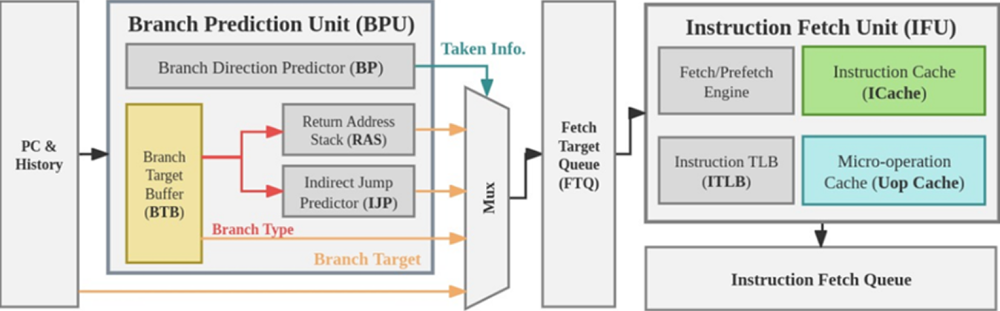
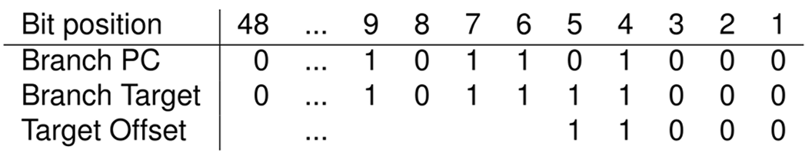
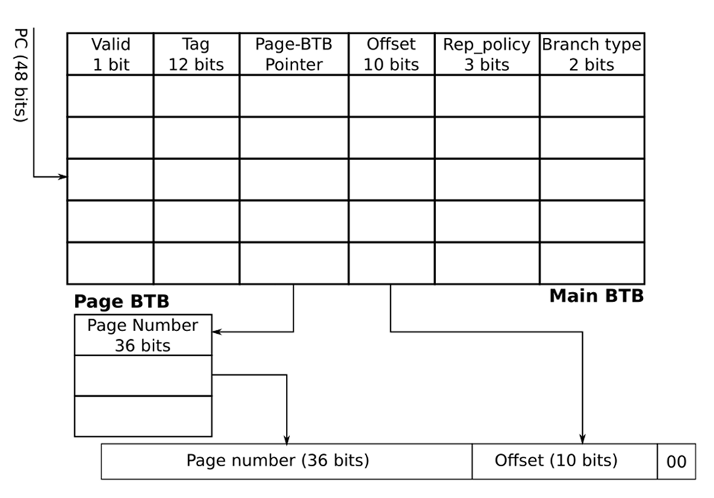
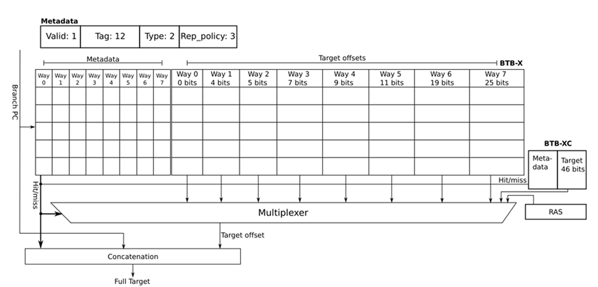

import Tooltip from '@site/src/components/Tooltip';

برنامه‌های کاربردی دنیای واقعی دربرگیرندهٔ <Tooltip tip="Data center applications">**برنامه‌های مرکز داده‌ها**</Tooltip> شامل حجم عظیمی از <Tooltip tip="Instructions">**دستورات**</Tooltip> هستند. این حجم زیاد از دستورات، شامل تعداد قابل‌توجهی <Tooltip tip="Branch instruction">**دستورات انشعاب**</Tooltip> هستند که موجب می‌شود <Tooltip tip="Miss">**عدم برخورد**</Tooltip> در <Tooltip tip="I-Cache">**حافظۀ نهان دستورات**</Tooltip> بالا برود.

:::tip[یادآوری]

### حافظۀ نهان یا Cache چیست؟

حافظۀ نهان یک حافظۀ موقتی است که داده‌های پرکاربردی که در یک بازهٔ زمانی (به این نزدیکی زمانی دسترسی‌ها، محلیت زمانی یا Temporal locality می‌گویند) یا در یک بازهٔ مکانی (از حیث قرارگیری در حافظه، به این نزدیکی، Spatial locality می‌گویند) را در خود نگه می‌دارد تا نیاز به دسترسی کندتر 	و طولانی‌تر به حافظهٔ اصلی (RAM) را کمتر کند و سرعت اجرای دستورات بالاتر برود.

:::

برای غلبه بر این میزان بالای عدم برخورد در حافظۀ نهان دستورات، راه‌حل‌های متنوعی ارائه شده‌است که یکی از این راه‌ها <Tooltip tip="Fetch Directed Instruction Prefetching">**FDIP**</Tooltip> است. این واحد در پردازنده‌ها، با <Tooltip tip="Prefetching">**پیش‌واکشی**</Tooltip> دستورهای آينده، آن‌ها را به حافظۀ نهان دستورات برده تا در زمان اجرای واقعی آماده باشند. نکتهٔ حائز اهمیت در پیش‌واکشی دستورات، توجه به <Tooltip tip="Conditional Branch">**دستورات انشعاب شرطی**</Tooltip> و <Tooltip tip="Unconditional Branch">**غیرشرطی**</Tooltip> است.

برای دستورات شرطی، طبعاً بخشی تحت‌عنوان <Tooltip tip="Branch Predictor">**پیش‌بینی‌کنندهٔ انشعاب**</Tooltip> نیاز داریم که بتواند <Tooltip tip="Taken">**رخ‌دادن**</Tooltip> یا <Tooltip tip="Not Taken">**ندادن**</Tooltip> دستور انشعاب شرطی را پیش‌بینی کند. این پیش‌بینی می‌تواند به انتخاب دستورات و آدرس‌های درست در پیش‌واکشی کمک کند، به گونه‌ای که پیش‌بینی اشتباه می‌تواند مجموعهٔ دستورات اشتباهی را وارد حافظۀ نهان دستورات کند و موجب آلودگی حافظۀ نهان شود.

همچنین در هر دو نوع دستورات انشعاب شرطی و غیرشرطی، نیاز است مقصد انشعاب برای پیش‌واکشی مشخص باشد تا بدانیم که پس از این دستور پرش، به چه آدرسی می‌رویم. به واحدی که مقصد (احتمالی) دستورات انشعاب را در خود نگهداری می‌کند، <Tooltip tip="Branch Target Buffer (BTB)">**بافر مقصد انشعاب**</Tooltip> می‌گویند.

همان‌طور که مشخص است، توانایی پیش‌واکشی FDIP کاملاً وابسته به دقت BTB است. از آن‌جا که ظرفیت BTB محدود است و نمی‌توان مقصد تمام دستورات انشعاب را در آن ذخیره کرد، شاهد عدم برخورد در BTB خواهیم بود. افزودن حجم BTB یک پردازنده، در هنگام طراحی پردازنده‌ها دچار محدودیت است، زیرا میزان <Tooltip tip="Static Random-Access Memory">**حافظهٔ ایستا**</Tooltip> روی تراشه محدود است؛ که این حافظه به‌عنوان حافظهٔ نهان دستورات و داده‌ها و همچنین BTB استفاده می‌شود.

در زمانی که این متن نوشته می‌شود، پردازنده با بیشترین اندازهٔ BTB در بازار، IBM z15 است که دارای یک BTB دولایه، شامل <Tooltip tip="L1 (Level 1)">**لایهٔ اول**</Tooltip> و <Tooltip tip="L2 (Level 2)">**لایهٔ دوم**</Tooltip> است. شاید در نگاه اول 144K مدخل برای BTB پردازنده کافی به نظر برسد که شاید این‌طور هم هست! اما باید توجه شود که قیمت این <Tooltip tip="Mainframe">**بزرگ‌رایانه**</Tooltip> شرکت IBM هم بسیار چشم‌گیر است!

در سیستم‌های رایج و ارزان‌تر اندازهٔ BTB در حدود زیر ۱۰k مدخل است که شاید برای برنامه‌های چند مگابایتی (یا گیگابایتی) حال حاضر، کافی نباشد. پیش از بیان روش‌هایی برای عملکرد بهتر BTB و <Tooltip tip="Hit">**برخورد**</Tooltip> بیشتر، به ساختار کلی BTB و FDIP اشاره می‌کنم.

همان‌طور که در تصویر ۱ مشخص است، <Tooltip tip="History">**تاریخچۀ دستورات**</Tooltip> و <Tooltip tip="Program Counter">**PC**</Tooltip> وارد <Tooltip tip="Branch Prediction Unit (BPU)">**واحد پیش‌بینی انشعاب**</Tooltip> می‌شود که BTB در این واحد قرار دارد.

    

    

برای دستوراتی نظیر call و return ها از <Tooltip tip="Return Address Stack">**پشتهٔ آدرس بازگشت**</Tooltip> استفاده می‌‌شود و همچنین برای پرش‌هایی که مقصد آن‌ها از <Tooltip tip="Register">**ثبات‌ها**</Tooltip> یا حافظه خوانده می‌شود (که اصطلاحاً به آن‌ها پرش غیرمستقیم می‌گوییم)، از <Tooltip tip="Indirect Jump Predictor">**IJP**</Tooltip> استفاده می‌شود که خود این بخش، برای پیش‌بینی مقصد از <Tooltip tip="Target Cache">**حافظۀ نهان مقصد**</Tooltip> یا <Tooltip tip="Path History">**تاریخچۀ مسیر**</Tooltip> بهره می‌برد.

این اطلاعات به همراه اطلاعات BTB و نتیجهٔ پیش‌بینی دستور انشعاب به یک <Tooltip tip="Multiplexer">**مالتی‌پلکسر**</Tooltip> وارد شده و نتیجهٔ نهایی به‌عنوان آدرس بعدی برای پیش‌واکشی وارد <Tooltip tip="Fetch Target Queue (FTQ)">**صف مقصد واکشی**</Tooltip> می‌شود.

در نهایت این آدرس به <Tooltip tip="Instruction Fetch Unit (IFU)">**واحد واکشی دستور**</Tooltip> وارد شده تا واکشی/پیش‌واکشی صورت گیرد.

## ساختار کلی BTB؛ بافر مقصد انشعاب چه چیزهایی را نگه می‌دارد؟

BTB اطلاعاتی دربارهٔ دستورات انشعابی که حداقل یک‌بار واکشی شده‌اند نگه می‌دارد که شامل نوع دستور انشعاب (<Tooltip tip="Direct jump">**پرش مستقیم**</Tooltip>، <Tooltip tip="Indirect jump">**پرش غیر مستقیم**</Tooltip>، call، return و …)، <Tooltip tip="Branch Target Instruction">**مقصد دستور انشعاب**</Tooltip>، <Tooltip tip="Tag">**بیت‌های برچسب**</Tooltip> که نقشی مشابه بیت‌های برچسب در حافظه‌های نهان را ایفا می‌کنند و برخی اطلاعات دیگر مانند <Tooltip tip="Replacement Policy">**سیاست جایگزینی**</Tooltip> است. دسترسی به BTB درست مانند حافظهٔ نهان است. بنابراین پیش‌بینی می‌شود که مانند حافظه‌های نهان، از سیاست‌های جایگزینی برای قراردادن دستور انشعاب جدید، در صورت پر بودن جایگاه‌های مناسب برای ذخیره‌سازی آن دستور انشعاب در BTB استفاده کنیم.

## در زمینهٔ بهبود عملکرد BTB چه کار‌هایی انجام شده‌است؟

یکی از مواردی که برای بهبود نرخ برخورد در BTBها انجام شده‌است، ابداع <Tooltip tip="Algorithms">**الگوریتم‌ها**</Tooltip> و سیاست‌های جایگزینی است. برخی از این سیاست‌های جایگزینی با استفاده از تاریخچۀ دستورات گذشته، میزان اهمیت دستورات انشعاب را با روابطی که ارائه می‌دهند، محاسبه کرده و در هنگام جایگزینی، دستورات انشعاب با اهمیت کمتر (آن‌هایی که کمتر دسترسی می‌خورند) را از BTB خارج کرده و دستور جدید را جایگزین می‌کنند.

همچنین عده‌ای با پیاده‌سازی <Tooltip tip="Belady's anomaly algorithm">**الگوریتم بهینهٔ Belady**</Tooltip> بر روی تاریخچهٔ دستورات گذشته، قصد دارند عملکردی <Tooltip tip="Sub-optimal">**نیمه‌بهینه**</Tooltip> داشته باشند. برای مطالعهٔ بیشتر دربارۀ جزئیات این روش، به مقالهٔ Thermometer مراجعه کنید.

علاوه بر ارائۀ سیاست‌های جایگزینی نوین، روش‌های دیگری نظیر تغییر ساختار کلی BTBها می‌تواند مؤثر باشد. برای مثال، یکی از اقدامات انجام‌شده در این زمینه، چندلایه کردن BTBهاست. همانند حافظۀ نهان چندلایه (شامل <Tooltip tip="L1 (Level 1)">**L1**</Tooltip> و <Tooltip tip="L2 (Level 2)">**L2**</Tooltip>) یا <Tooltip tip="multi-level paging">**صفحه‌بندی چندسطحی**</Tooltip>، امکان پیاده‌سازی BTB چندلایه نیز وجود دارد.

در این روش، یک <Tooltip tip="Main BTB">**BTB اولیه**</Tooltip> داریم که offset آدرس مقصد دستور انشعاب را مشخص می‌کند و شمارۀ صفحۀ آدرس مقصد، توسط یک Page BTB تعیین می‌شود. بدین صورت که یک اشاره‌گر از مدخل مربوطه در BTB اولیه به یک سطر در Page BTB وجود دارد که شمارۀ صفحهٔ مربوط به آدرس مقصد را نگهداری می‌کند. حتی امکان پیاده‌سازی این ساختار با بیش از دو لایه نیز وجود دارد. اما از آن‌جا که دسترسی چندلایه احتمالاً زمان بیشتری نسبت به دسترسی به یک لایه صرف می‌کند، این روش باید با در نظر گرفتن <Tooltip tip="Overhead">**سربار**</Tooltip> ناشی از افزایش زمان دسترسی و همچنین قابلیت استفادۀ بهینه از حافظۀ on-chip SRAM برای BTB پردازنده و ذخیره‌سازی تعداد بیشتری دستور انشعاب، به‌عنوان یک <Tooltip tip="Trade-Off">**مبادله**</Tooltip> انتخاب شود.

(یادآوری: SRAM که عمدتاً برای حافظۀ نهان سیستم‌ها استفاده می‌شود، از <Tooltip tip="DRAM (Dynamic Random-Access Memory)">**DRAM**</Tooltip> مورد استفاده در حافظۀ اصلی سریع‌تر است، اما هزینهٔ بالاتری نیز دارد.)

روش دیگر برای تغییر ساختار BTB، استفاده از <Tooltip tip="Set-Associative">**BTBهای مجموعه-انجمنی**</Tooltip> است. پیش از پرداختن به این موضوع، به تصویر ۳ توجه کنید.

    

    

    

همان‌طور که مشاهده می‌شود، فرض کردیم که یک سیستم با <Tooltip tip="Byte-Addressable">**آدرس‌دهی بایت‌به‌بایت**</Tooltip> داریم که فضای آدرس‌دهی آن، شامل آدرس‌های ۴۸ بیتی است. دستورات این سیستم‌، <Tooltip tip="4-Byte-Aligned">**مضرب ۴ بایت**</Tooltip> هستند و این یعنی دو بیت سمت راست آدرس آن‌ها صفر است.

همان‌طور که در این مثال مشاهده می‌شود، آدرس مقصد دستور انشعاب در بیت‌های ۶ تا ۴۸ با آدرس خود دستور انشعاب یکسان است و این یعنی در صورت داشتن Branch PC نیازی به نگهداری ۴۳ بیت پرارزش نیست. همچنین دو بیت کم‌ارزش نیز همیشه صفر هستند. بنابراین شاید صرفاً نگه‌داشتن بیت‌های ۳ تا ۵ برای مقصد دستور انشعاب کافی باشد.

این ایده ناشی از یک قاعدهٔ کلی در مهندسی نرم‌افزار امروزی است: توابع کوچک محبوب‌تراند! و این موجب می‌شود که آدرس مقاصد دستور انشعاب، عموماً به آدرس خود دستور انشعاب نزدیک باشد و صرفاً در تعدادی بیت کم‌ارزش متفاوت باشد. بنابراین نیازی به نگهداری کل آدرس مقصد نیست.

طبق این موضوع، می‌توان از BTBهای مجموعه-انجمی با اندازهٔ <Tooltip tip="Way">**راه‌های**</Tooltip> متفاوت استفاده کرد، که هر دستور انشعاب را در راه با اندازهٔ مناسب قرار می‌دهیم.‌ برای مثال ممکن است فاصلهٔ مقصد یک دستور انشعاب از خود دستور، به اندازه‌ای باشد که صرفاً ۱۸ بیت offset (به جز دو بیت کم‌ارزش که همیشه برابر صفر هستند) کافی باشد، در این صورت این دستور انشعاب می‌تواند در راه‌های با شمارهٔ ۶ و ۷ قرار گیرد.

برای اطلاع بیشتر از روش ارائه‌شده در مقالهٔ مربوطه، به مقالهٔ BTB-X مراجعه کنید!

---

## ادامه راه

شاید به نظر برسد که میزان ایده‌ها و نوآوری‌های انجام‌شده بر روی BTBها به اندازه‌ای بوده که نیاز فعلی پردازنده‌ها و <Tooltip tip="Workloads">**بارکاری‌ها**</Tooltip> را برطرف کند، اما با توجه به رشد روزافزون برنامه‌های کاربردی اجراشده بر روی مرکزهای داده‌، توجه به استفاده از تکنیک‌های جدید برای بهبود عملکرد BTB همچنان ضروری به نظر می‌رسد. بنابراین پژوهشگران همچنان به دنبال راهکارهای جدید برای بهبود عملکرد BTB خواهند بود و این موضوع، می‌تواند زمینهٔ پژوهشی خوبی برای علاقه‌مندان به معماری کامپیوتر باشد!

---
### منابع

- Thermometer: Profile-Guided BTB Replacement for Data CenterApplications

- A Storage-Effective BTB Organization for Servers