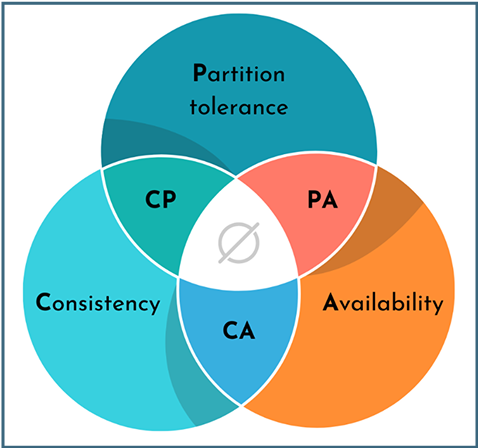
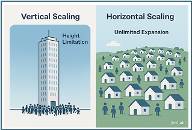

# سیستم‌های توزیع‌شده: هنر طراحی غیرممکن

در هر ثانیه، نتفلیکس ۱۵ هزار ساعت ویدیو نمایش می‌دهد. اینستاگرام روزانه ۹۵ میلیون عکس پردازش می‌کند. وقتی روی دکمهٔ جست‌وجوی گوگل کلیک می‌کنید،‌ بیش از هزار کامپیوتر در سراسر جهان با یکدیگر مسابقه می‌دهند تا در کسری از ثانیه پاسخ شما را پیدا کنند.

تا حالا به این فکر کرده‌اید که چطور همهٔ این‌ها، بدون هیچ مشکلی انجام می‌شوند؟ این دقیقاً دنیای سیستم‌های توزیع‌شده است.

اگر تا الان فکر می‌کردید پروژهٔ «برنامه‌نویسی پیشرفته» چالش بزرگی بود، خبر بد این است که تازه ماجرا شروع شده است. چون حالا می‌خواهیم دربارهٔ سیستم‌هایی صحبت کنیم که روی هزاران دستگاه پراکنده، در قاره‌های مختلف کار می‌کنند، هرگز خاموش نمی‌شوند و باید با خراب شدن قطعات و سیستم‌ها کنار بیایند و همهٔ این‌ها در حالی‌ست که میلیاردها کاربر منتظر پاسخ فوری هستند.

## یک مهمانی برای یک میلیون نفر

بهترین راه برای درک این موضوع یک مثال است. تصور کنید می‌خواهید مهمانی برگزار کنید؛ اما نه یک مهمانی معمولی -مهمانی برای یک میلیون نفر که در شهرهای مختلف زندگی می‌کنند. حالا تصور کنید همه باید هم‌زمان دربارهٔ یک موضوع صحبت کنند، اما هر لحظه ممکن است بعضی از آن‌ها ناپدید شوند یا اتصال‌شان قطع شود و مهم‌تر از همه، این مهمانی هرگز تمام نمی‌شود.

خیلی پیچیده به نظر می‌رسد، نه؟ اما این دقیقاً همان کاری است که سیستم‌های توزیع‌شده هر روز انجام می‌دهند و جالب این‌جاست که نه‌تنها این کار ممکن است، بلکه به‌قدری روان اتفاق می‌افتد که ما حتی متوجه آن نمی‌شویم.

## انتخاب‌های سخت

اما این ماجرا یک قانون طلایی دارد که همه چیز را تغییر می‌دهد: CAP Theorem.
Eric Brewer  در سال ۲۰۰۰ ثابت کرد که در هر سیستم توزیع‌شده، شما فقط می‌توانید دو مورد از سه ویژگی زیر را انتخاب کنید:

1. یکپارچگی
همهٔ گره‌ها در یک لحظه، یک نمای یکسان از داده دارند. یعنی اگر روی گره A چیزی write کنید، فوراً از گره B هم همان مقدار read می‌شود.
2. دسترس‌پذیری
سیستم همیشه به درخواست‌ها پاسخ می‌دهد (البته نه لزوماً با آخرین داده). حتی اگر بخش‌هایی از شبکه از کار بیفتند.
3. تحمل پارتیشن
وقتی ارتباط شبکهٔ بین گره‌ها قطع می‌شود، سیستم همچنان کار می‌کند.

    

اما در دنیای واقعی و سیستم‌های توزیع‌شده، قطع شدن ارتباط بین گره‌ها اجتناب‌ناپذیر است. شبکه حتماً گاهی مشکل پیدا می‌کند، پس عملاً شما باید بین ترکیب‌های CP و PA یکی را انتخاب کنید.

## چرا دیتابیس‌های قدیمی کافی نیستند؟

یکی از مهم‌ترین چالش‌ها در طراحی سیستم‌های بزرگ، انتخاب کردن نوع مقیاس‌پذیری است. دو  رویکرد اصلی داریم:

1. مقیاس‌پذیری عمودی
2. مقیاس‌پذیری افقی

مقیاس‌پذیری عمودی به معنای تقویت یک سیستم واحد از طریق افزودن منابع سخت‌افزاری مانند حافظه۱ و پردازنده۲ است -مانند این‌که یک آسمان‌خراش بسازیم و هر زمان که نیاز داشتیم، یک طبقه به آن اضافه کنیم. این روش در ابتدا منطقی به‌نظر می‌رسد، اما با افزایش تعداد کاربران به محدودیت‌هایی برمی‌خوریم. زیرا هر سیستم تنها تا اندازهٔ مشخصی می‌تواند منابع بیشتری
دریافت کند و افزودن این منابع معمولاً با هزینه‌هایی تصاعدی همراه است.

در مقابل آن، مقیاس‌پذیری افقی یعنی این که سیستم را بین چند گره پخش کنیم -مثل ساختن یک شهر با هزاران خانهٔ کوچک. بدین‌شکل که هر زمان جمعیت بیشتر شود، فقط کافی‌است که خانه‌های بیشتری اضافه کنیم. ساده، قابل‌توسعه و پایدار.

    

حالا برگردیم سراغ دیتابیس‌هایی که همه با آن‌ها آشنا هستیم: دیتابیس‌های رابطه‌ای نظیر MySQL و PostgreSQL.
این دیتابیس‌ها دقیقاً مانند آسمان‌خراش‌ هستند. برای تعداد کمی از کاربران مناسب هستند، اما وقتی تعداد کاربران افزایش یابد به مشکل می‌خورند. تقریباً مقیاس‌پذیری افقی ممکن نیست، چون طراحی متمرکزی دارند و معمولاً مدل CA را انتخاب کرده‌اند -یعنی داده‌ٔ دقیق و همیشه در دسترس، ولی فقط وقتی که شبکه بدون مشکل باشد. و این یعنی در سیستم‌های توزیع‌شده، نمی‌توان روی آن‌ها حساب باز کرد.

## دیتابیس‌هایی که قوانین را تغییر دادند!

این‌جاست که پای پایگاه‌های داده‌ای مانند MongoDB و Cassandra به میان می‌آید. آن‌ها گفتند: «قوانین قدیمی کافی نیستند، باید جور دیگری فکر کنیم.»
اما این تغییر رویکرد بدون هزینه نیست. دیگر نمی‌توانید بی‌دردسر و بدون برنامه‌ریزی دقیق، جدول طراحی کنید. باید مانند یک شطرنج‌باز چند حرکت جلوتر را ببینید: کاربران چه سؤالاتی خواهند پرسید؟ داده‌ها چگونه پراکنده می‌شوند؟ وقتی سیستم مقیاس می‌گیرد، چه چالش‌هایی پیش می‌آید؟

MongoDB یک پایگاه‌دادهٔ مستندمحور است؛ به‌جای جدول‌های سنتی، داده‌ها در قالب اسناد JSON مانندی ذخیره می‌شوند. این ساختار، انعطاف زیادی در ذخیره‌سازی انواع داده‌ها فراهم می‌کند و برای سامانه‌هایی با داده‌های متنوع و پویا بسیار مناسب است.

در مقابل، Cassandra برای مدیریت حجم عظیمی از داده‌های توزیع‌شده طراحی شده‌است. این سیستم ابتدا در شرکت فیسبوک توسعه یافت و سپس به Apache واگذار شد. Cassandra از مدل ستونی گسترده استفاده می‌کند و به گونه‌ای طراحی شده که بتواند در مقیاس‌های بالا، عملکردی پایدار و سریع داشته باشد.

برای مثال، در Cassandra مفهومی به‌نام Join وجود ندارد؛ ابتدا ممکن است عجیب به‌نظر برسد، اما کاملاً منطقی است: وقتی داده‌ها روی ده‌ها یا صدها سرور پراکنده شده‌اند، انجام عملیات Join بسیار پیچیده و کند خواهد بود.

## پذیرش زیبایی نبود قطعیت

فرض کنید از Cassandra استفاده می‌کنید. برخلاف پایگاه‌داده‌های سنتی، Cassandra معماری‌ای مبتنی بر گره‌های مستقل دارد؛ یعنی داده‌ها میان چندین گره که ممکن است در نقاط مختلف دنیا قرار داشته باشند، توزیع می‌شوند. هر گره بخشی از داده‌ها را نگه می‌دارد و به صورت مستقل می‌تواند پاسخ‌گو باشد.

Cassandra مدل PA را در مثلث CAP انتخاب کرده است -یعنی شما می‌پذیرید که گاهی اطلاعات کمی قدیمی باشند، اما در عوض سیستم همیشه در دسترس خواهد بود و هیچ‌گاه از کار نمی‌افتد.

مثلاً تصور کنید ویدیویی را در یوتیوب لایک می‌کنید: شمارنده فوراً یک واحد افزایش می‌یابد، اما اگر صفحه را بلافاصله رفرش کنید، ممکن است عدد کمی متفاوت باشد، چون همهٔ گره‌ها هنوز به‌روزرسانی نشده‌اند. چند ثانیه بعد، همه به یک عدد مشترک می‌رسند -ولی در این میان، یوتیوب هرگز نمی‌گوید «منتظر بمانید، مشغول هماهنگ‌سازی لایک‌ها هستم.»

این انتخاب زیبایی خاصی دارد. شما در حال طراحی سیستمی هستید که با واقعیت دنیای فیزیکی کنار آمده -جایی که زمان می‌برد تا اطلاعات منتقل شوند، سرورها گاهی خراب می‌شوند و حالت ایده‌آل وجود ندارد.

## دعوت به ماجراجویی

سیستم‌های توزیع‌شده یکی از چالش‌برانگیزترین حوزه‌های علوم کامپیوتر هستند، اما همین پیچیدگی است که آن‌ها را جذاب می‌کند. هر مسئله‌ای که حل می‌کنید و هر تصمیمی که می‌گیرید، تأثیر مستقیمی روی عملکرد و تجربهٔ کاربران واقعی دارد.

از طراحی دیتابیس‌های غول‌پیکر گرفته تا مدیریت ترافیک میلیاردی، این حوزه مملو از مسائل جالب و حل‌نشده است. اگر به دنبال چالش‌های فنی واقعی هستید، مطالعه و کار روی سیستم‌های توزیع‌شده می‌تواند آغاز یک مسیر هیجان‌انگیز باشد.

برای شروع این مسیر، منابع زیر را پیشنهاد می‌کنم که می‌توانند دید عمیق‌تری از مفاهیم، معماری‌ها و راه‌حل‌های دنیای واقعی به شما بدهند:

- کتاب Designing Data-Intensive Applications نوشتهٔ Martin Kleppmann
> یکی از بهترین منابع برای درک معماری سیستم‌های مدرن، CAP، دیتابیس‌ها و مفاهیم کلیدی این حوزه.

- مستندات  [The Cassandra Documentation](https://cassandra.apache.org/doc/latest/)
> مستندات رسمی Cassandra که شامل آموزش‌ها، مفاهیم کلیدی و راهنمای نصب و استفاده است.

- وب‌سایت [MongoDB University](https://university.mongodb.com)
> دوره‌های رایگان آموزشی از سوی تیم MongoDB برای آشنایی با مفاهیم پایگاه‌‌های دادهٔ غیررابطه‌ای.

- مجموعهٔ سخنرانی‌های [Distributed Systems](https://pdos.csail.mit.edu/6.824) از دانشگاه MIT
> اگر به دنبال منابع آکادمیک هستید، این دوره یکی از بهترین‌هاست.

امیدوارم این منابع نقطهٔ شروع خوبی برای ماجراجویی شما در دنیای سیستم‌های توزیع‌شده باشند.