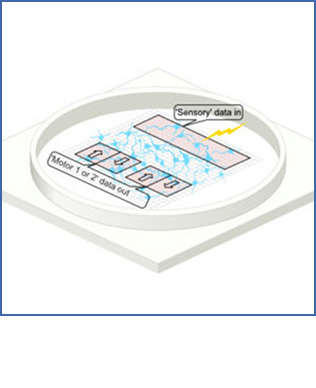
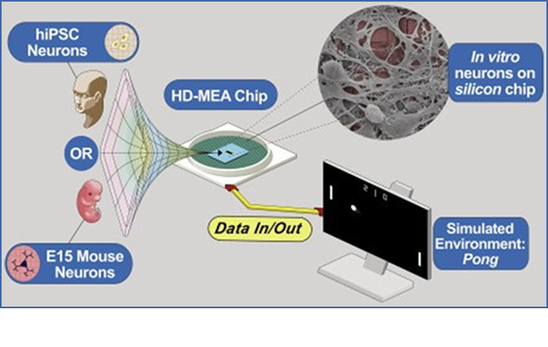
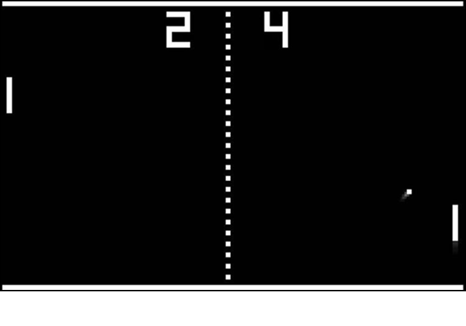
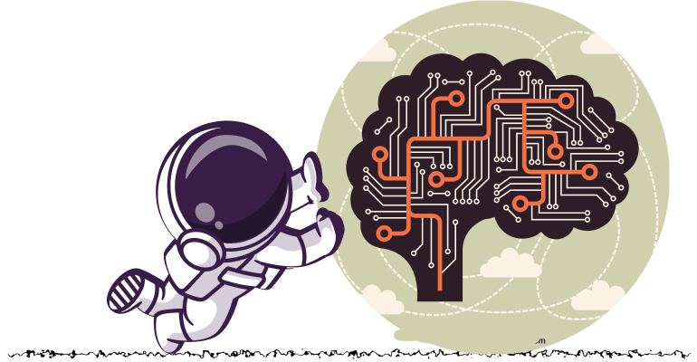

import Tooltip from "@site/src/components/Tooltip";

# هنگامی که نورون و سیلیکون به هم می‌رسند!

## مقدمه

سوژهٔ این نوشتار با تیتر «ملاقات نورون و سیلیکون»، در واقع تلاشی است در جهت تلفیق سامانه‌های زیستی و سخت‌افزاری. تلاشی که نتیجهٔ نهایی آن می‌تواند ما را برای دستیابی به اهداف بسیاری یاری کند؛ اهدافی مانند: استفاده از این سامانه‌ها در زمینهٔ هوش مصنوعی، درک بهتر از نحوهٔ کارکردهای شناختی و عصبی پیچیدهٔ ما، پیشی گرفتن از محدودیت‌هایی که ساختارهای سیلیکونی سنتی ایجاد می‌کنند و بسیاری از کاربردهای دیگر.

همهٔ این کاربردها نشان‌دهندۀ گریزهای متنوع این سوژه به شاخه‌هایی از قبیل

<Tooltip tip="Biocomputing">
  **زیست-رایانش**
</Tooltip>
،
<Tooltip tip="AI">
  **هوش مصنوعی**
</Tooltip>
،
<Tooltip tip="Neuroscience">
  **علوم اعصاب**
</Tooltip>
،
<Tooltip tip="Biological Engineering">
  **مهندسی زیستی**
</Tooltip>
و
<Tooltip tip="Neuromorphic Computing">
  **محاسبات عصبی**
</Tooltip>
هستند که نشان‌دهندهٔ گسترهٔ علمی وسیعی است که درگیر این فناوری نوظهور و جذاب
است. شاید یکی از دلایل جذابیت بالای این موضوع، پرسشی عمیق باشد که اگر ما برای
دستیابی به هوش، به‌جای استفاده از ساختارهایی صرفاً سیلیکونی، به سراغ نورون‌ها
(که اتفاقاً واحدهای سازندهٔ مغز ما و منشأ تمام پیچیدگی‌های شناختی ما هستند)
برویم؛ آیا همچنان می‌توان آن را هوش مصنوعی نامید، یا این‌که می‌توان به آن هوش
طبیعی گفت؟!

اتفاقاً، کاربردی که در این نوشتار هم آن را به‌عنوان موضوع اصلی قرار دادم، هوش و یادگیری است. از نظر تئوری، به احتمال بالایی، ما به <Tooltip tip="Synthetic Biological Intelligence (SBI)">**هوش زیستی ساختگی**</Tooltip>
جامع، قبل از <Tooltip tip="Artificial General Intelligence (AGI)">**هوش جامع مصنوعی**</Tooltip> دست خواهیم یافت.

انگیزهٔ اصلی من برای نوشتن این متن، بعد از آشنایی با کارهای Cortical Labs -که یکی از شرکت‌های پیش‌گام در حوزۀ تکنولوژی زیستی مستقر در ملبورن استرالیاست- به وجود آمد. به همین خاطر، در ادامه، برای بیان کردن نمونه‌ها و برخی مفاهیم تخصصی‌تر از پروژه‌ها و مقاله‌های همین شرکت بهره برده‌ام.

## سلول‌های مغز بر روی بشقاب

شبکه‌های عصبی در ما (و دیگر موجودات) و سیستم‌های الکترونیکی، هر دو،

از سیگنال‌های الکتریکی برای جا‌به‌جایی داده‌ها  از بخشی به بخش دیگر استفاده می‌کنند. در واقع، در مغز و بدن ما، یون‌ها هستند که به‌عنوان میراث تکاملی ما بر پایهٔ کربن، وظیفهٔ این جا‌به‌جایی را از یک سلول به سلول دیگر دارند. ژن‌هایی که مسئول ارتباطات الکتریکی سلول‌های عصبی هستند، برای اولین بار در اجداد کهن دریایی ما فرگشت یافته‌اند که وجود این یون‌ها را به خوبی توجیه می‌کند.

منظور از «بر پایهٔ کربن بودن» در جمله‌های قبلی، وجود و نقش چشم‌گیر عنصر کربن و ترکیبات آن در تمام گونه‌های زیستی‌ای است که در زمین مشاهده شده‌اند. در مقابل، سامانه‌های سخت‌افزاری، بر پایهٔ عنصر سیلیسیم ساخته شده‌اند و این الکترون‌های آزاد هستند که در آن‌ها نقش انتقال اطلاعات را بازی می‌کنند. شاید جالب باشد که بدانید در نظر گرفتن فرگشت بر پایهٔ سیلیسیم از نظر تئوری ممکن است؛ البته که در واقعیت با موانع بسیاری رو‌به‌روست و تا به حال مشاهده نشده‌است.

برخی تحقیقات بیان می کنند که تحقق فرگشت سیلیسیمی، نیاز به نقطهٔ شروع بسیار متفاوت‌تری نسبت به دریاهای زمین دارد. در هر حال، همین «زبان مشترک» یا پالس‌های الکتریکی که در این سامانه‌ها دیده می شود، برای ساختن پلی بین سخت‌افزار‌های ساختگی کامپیوتری و نورون‌های زیستی کافی است.

در این پل، نقش سخت‌افزاری را <Tooltip tip="Microelectrode Array (MEA)">**آرایه‌های میکروالکترودی**</Tooltip>
۸ که برای اندازه‌گیری فعالیت الکتریکی سلول‌های عصبی و انتقال سیگنال‌های الکتریکی به آن‌ها استفاده می‌شوند، بازی می‌کنند. نورون‌ها نیز بر روی یک <Tooltip tip="Petri dish">**یک پتری دیش**</Tooltip>
کشت داده می‌شوند.

با استفاده از همین چینش ساده، می‌توان به <Tooltip tip="Cloudflare">**سامانه‌ای حلقه‌باز**</Tooltip>
دست یافت که در آن خروجی نورون‌ها تأثیری بر روی ورودی آن‌ها ندارد. در صورتی که اگر این حلقه را ببندیم، به گونه‌ای که خروجی‌های نورون همزمان بر روی ورودی‌های آن تأثیرگذار باشند، فوراً متوجه توانایی‌هایی این سیستم برای هوشمندسازی می‌شویم که ما را دچار پرسش‌هایی خواهد کرد. «آیا می توانیم به این نورون ها یاد بدهیم که در قبال ورودی‌ها به‌طور مشخصی رفتار کنند؟» یا این‌که «آیا می‌توانیم به آن‌ها بیاموزیم که تحریکی را پیش‌بینی کنند که هنوز اتفاق نیفتاده، یا پاسخی جدید و متفاوت تولید کنند؟»

در نهایت این پرسش‌ها ما را به سوی

مسئلهٔ بنیادین هوش سوق می‌دهند.

## 

## هوش

هوش، مفهوم شگفت‌انگیزی است که از دیرباز مورد پرسش بشریت بوده‌است. پرسشی که امروزه هم تقریباً جوابی نهایی به آن داده نشده‌است و همچنان از عوامل کشمکش بین برخی از فلاسفه و متخصصین علوم اعصاب است. نقل قولی معروف از Emerson M. Pugh، پژوهشگر آمریکایی، وجود دارد که می‌گوید: «اگر مغز انسان آن‌قدر ساده می‌بود که می‌توانستیم آن را بفهمیم، آن‌گاه ما آن‌قدر ساده می‌بودیم که نمی‌توانستیم!». به نظر می‌رسد که استفاده از روش‌های تکنولوژی زیستی و زیست-رایانش، ما را بیش‌تر از همیشه به درک مفهوم هوش و چگونگی کارکرد آن امیدوار کرده‌است.

همان‌طور که پیش‌تر هم گفته شد، بنا بر بهینگی ذاتی و تکاملی سیستم‌های زیستی، هوش زیستی سنتزی جامع احتمالاً زودتر از هوش جامع مصنوعی از راه خواهد رسید. البته که تلاش برای فهم چگونگی کارکرد هوش حیوانی و انسانی که ساختار چندلایه‌ای دارند، کار بسیار پیچیده‌ای است و شاید ایزوله کردن تک‌تک این فرایندها برای بررسی آن‌ها به‌راحتی ممکن نباشد.

یکی از پژوهش‌های جالب در همین زمینه، یادگیری سامانهٔ DishBrain (همان ساختاری که بالاتر راجع به آن صحبت شد) برای انجام بازی پونگ است. جالب است که بدانید در این پژوهش از دو نوع نورون متعلق به انسان و همچنین جوندگانی مانند موش استفاده شد

و همان‌طور که احتمالاً حدس می‌زنید، سلول‌های انسانی عملکرد بهتری داشتند.

##  بازی پونگ

بسیاری از شما با بازی پونگ آشنایی دارید. پونگ به‌عنوان یکی از اولین بازی‌های ویدیویی، یک بازی آرکیدی و ساده به شمار می‌رود که شامل دو تخته و یک توپ است. برای انجام این پژوهش، بازی به شکل ساده‌تر شبیه‌سازی شده و تنها یک تخته دارد که باید جا‌به‌جا شود و توپ هر دفعه به صورت تصادفی به سمت آن پرتاب می‌شود.

آرایهٔ الکترودی‌ای که در این آزمایش‌ها استفاده شده، هشت الکترود بسیار ریز دارد که می‌توان گفت وظیفهٔ «نوشتن» و «خواندن» بر نورون‌ها را به عهده دارند. اما چگونه به این سیستم ورودی داده می‌شود؟ یا به بیان دیگر، نورون‌ها از کجا می‌فهمند که توپ در هر لحظه کجا قرار دارد؟ برای ورودی دادن، هر الکترود نمایندهٔ نواری به عرض یک هشتم عرض کل صفحه خواهد بود (این نوارها در حقیقت هشت مستطیل بلند افقی هستند که روی هم قرار گرفته‌اند) و همزمان اگر توپ در آن نوار باشد، پالس می‌زند.

با این کار می‌توان مختصات y توپ را در هر لحظه به سیستم ورودی داد و نقشه‌ای با ساختار خام توپوگرافی از توپ ایجاد کرد. شاید این کار کمی ساده به نظر برسد، اما در مغزهای واقعی هم ناحیه‌هایی که به آن‌ها sensory map گفته می‌شود (مثلاً برای بینایی یا لامسه) از ساختارهای توپوگرافی کاملاً مشابهی استفاده می‌کنند. از آن‌جایی که تخته تنها در راستای y حرکت می‌کند می‌توان حس کرد که مؤلفۀ x برای ما آوردهٔ مکانی خاصی ندارد. در نتیجه لازم نیست نگران داده نشدن این مؤلفه به مدل باشیم.

حالا نوبت به اعمال تصمیم نورون‌ها بر روی محیط شبیه‌ساز می‌رسد. برای این‌که بالا بردن و پایین آوردن تخته معنی پیدا کند، می‌توانیم الکترودها را به دو گروه تقسیم کنیم و آن ها را «ناحیهٔ یک» و «ناحیهٔ دو» بنامیم. یکی از آن‌ها «موتور» بالا بردن و دیگری «موتور» پایین آوردن تخته خواهد بود. در نهایت الکترودها در هر لحظه فعالیت‌های کشت‌های نورونی را رصد می کنند و تخته را به همان سمتی حرکت می‌دهند که نورون‌های ناحیهٔ آن شلیک بیشتری داشته‌اند. این کار، همان دریافت پاسخ نورون‌ها خواهد بود.

تنها چیزی که باقی می‌ماند، در نظر گرفتن یک پاداش یا تنبیه مناسب برای نورون‌ها در صورت برخورد کردن یا نکردن توپ با تخته است. برای این کار به اصلی مهم در عصب‌شناسی و علوم شناختی به نام اصل انرژی آزاد۱ تکیه می‌شود. این اصل بیان می‌کند که
همهٔ سامانه‌های زیستی از جمله مغز و خود نورون‌ها تلاش می‌کنند که «انرژی آزاد» خود را کمینه کنند تا بقای خود را تضمین کنند و با محیط اطراف‌شان هماهنگ شوند. ساده‌تر این است که بگوییم در این‌جا بیشتر بودن «انرژی آزاد» با غیرمنتظره بودن ورودی نورون‌ها ارتباط مستقیم دارد و این یعنی نورون‌ها از دریافت ورودی‌های غیرمنتظره گریزان هستند.

برای همین هم به‌عنوان پاداش برای گرفتن توپ، به آن‌ها پالس‌های یکنواخت و بدون نویز داده می‌شود. در صورتی که توپ از دست برود، الکترودها پالس‌های غیرمنتظره و نویزدار تولید می‌کنند.
حال اگر در مورد مکانیزم تنبیه و پاداش در مغز ما و تفاوت آن با DishBrain کنجکاو باشید، باید گفت که این سامانه ساده‌تر از آن عمل می‌کند که بخواهد با فرایندهای مغزی مقایسه شود، اما هر دوی این سامانه‌ها در برخی از جنبه‌های بنیادین مانند یکدیگر
هستند. مغز ما با داشتن تعداد نورون‌های بسیار بیشتر، وجود تنظیم‌کننده‌های عصبی مانند دوپامین، دارا بودن عناصری همچون حافظهٔ بلندمدت و وجود ادراکات مختلف در بدن، در یادگیری، بسیار پیچیده‌تر عمل می‌کند.

با این حال، اصل انرژی آزاد، همچنان به‌عنوان قاعده‌ای بنیادین در مغز نیز رعایت می‌شود؛ بدین معنی که نورون‌های مغز در هر لحظه پیش‌بینی‌ای از ورودی آیندهٔ خود دارند و اگر این ورودی با پیش‌بینی آن‌ها تفاوت زیادی داشته باشد، سعی می‌کنند خود را اصلاح کنند. به عبارتی، مغز همواره تلاش می‌کند حالت بعدی هر اتفاق را به‌درستی پیش‌بینی کند، فرایندی که موجب یادگیری در ما می‌شود. البته این آزمایش ریزه‌کاری‌های بسیاری برای دقیق بودن نتایج نهایی دارد. به‌عنوان مثال، برای این‌که مطمئن باشند هندسهٔ نواحی انتخاب‌شده، سوگیری‌ای در یادگیری ایجاد نمی‌کند، آزمایش را هر دفعه
با نواحی موتوری متفاوتی اجرا می‌کنند.

همچنین حالت‌های کنترل مختلفی برای این‌که تضمین کنیم نتیجهٔ نهایی سامانه به دلیل تلاش خود نورون‌هاست، در نظر گرفته می‌شوند. در آخر می‌بینیم که نورون‌ها به‌صورت حقیقی در طی زمان یاد می‌گیرند که چگونه رفتار کنند تا بهترین نتیجه را داشته باشند! اگر بازه‌های زمانی ۵ دقیقهٔ اول و ۱۵ دقیقهٔ آخر آزمایش را در نظر بگیریم، افزایش معناداری در تعداد توپ‌هایی که پشت سر هم توسط آن‌ها به درستی دریافت شده مشاهده می‌شود. جالب است بدانید که در ابتدای آزمایش، نورون‌های موشی بهتر از نورون‌های انسانی عمل کردند، ولی در نهایت نورون‌های انسانی با اختلاف نسبتاً کمی توانستند مشخص کنند که سریع‌تر و بهتر عمل می‌کنند.

---

## چرا؟

اما پس از همهٔ این صحبت‌ها، چرا ما باید واقعاً به سوی سیستم‌های هیبریدِ زیستی هوشمند قدم برداریم؟ اگر برخی از دلایل ریز و درشتی که تا به این‌جای کار بیان شد را نادیده بگیریم، یکی از مهم‌ترین انگیزه‌ها برای این کار می‌تواند مصرف بهینهٔ انرژی باشد.

امروزه اجرای الگوریتم‌های یادگیری ماشین به مقدار قابل‌توجهی (تا میلیون‌ها وات) توان نیاز دارد، در حالی‌که سیستم‌های عصبی زیستی می‌توانند در آب قند به کار خود بپردازند! برای روشن‌تر شدن، میزان انرژی مورد نیاز در انتقال‌های سیناپسی و طبیعی از مرتبهٔ پیکوژول است ولی همین میزان در همتاهای مصنوعی و سیلیکونی آن‌ها از مرتبهٔ نانوژول است. مصرف بالای برق به آسیب‌های جبران‌ناپذیر زیست‌محیطی منجر می‌شود. همچنین این میزان از مصرف انرژی تقریباً دسترسی گستردهٔ مصرف‌‌کنندگان به این فناوری را در سطح شخصی غیرممکن می‌‌سازد.

انگیزه‌های بسیار دیگری نیز وجود دارند، یکی دیگر از آن‌ها توانایی رشد و یادگیری سریع هوش زیستی با تعداد نمونه‌های محدودتر در قیاس با نیاز الگوریتم‌های فعلی یادگیری ماشین است. سامانه‌های زیستی انعطاف‌پذیری بالاتری دارند و در سناریوهای پیچیده خوش‌فکر‌تر عمل می‌کنند، چیزی که چندان واضح در مدل‌های امروزی دیده نمی‌شود. در نهایت همهٔ این تلاش‌ها ممکن است بتوانند به پرسش‌های اساسی و فلسفی ما در مورد هوش زیستی پاسخ بدهند. البته که این سامانه‌ها خالی از عیب نیستند.

یکی از مشکلات اصلی‌ای که فعالان این حوزه اکنون با آن دست‌و‌پنجه نرم می‌کنند، تلاش برای زنده نگه داشتن نورون‌هاست. کشت‌های
نورونی، حتی اگر در بهترین شرایط هم نگهداری شوند، کم‌تر از یک سال زنده می‌مانند که شرایط را سخت می‌کند. این سیستم‌ها مقیاس‌پذیری پایین‌تری هم دارند.
برخی از مزایا و معایبی که در این بخش بیان شدند، هر کدام منحصر به یکی از سامانه‌های زیستی و یا سیلیکونی بودند که معمولاً هم در تقابل با یکدیگر قرار داشتند. همین امر، منجر می شود که اگر این سیستم‌ها به‌درستی در چیدمان با یکدیگر قرار بگیرند، بتوانند ایرادهای یکدیگر را جبران کنند.

---

## پایان

پژوهش بازی پونگ که از آن به‌عنوان نمونه‌ای بنیادین در این نوشتار استفاده کردم، آن‌قدر هم جدید نیست و مربوط به سه تا چهار سال پیش است. اگر همین حالا به وب‌سایت Cortical Labs سری بزنید، می‌بینید که این شرکت از اولین کامپیوتر زیستی خود به نام CL1 و حتی فضای ابری ویژه‌ای رونمایی کرده‌است! همهٔ این‌ها نمونه‌های حاضری هستند که احتمالات بی‌شماری را که در مسیر این حوزه وجود دارند، برای ما روشن‌تر می‌سازند.

در نهایت، دنبال کردن پژوهش‌های مربوطه و حتی متصور شدن آیندهٔ این سیستم‌های هیبرید زیستی (که تا حد زیادی به فیلم‌های علمی-تخیلی شباهت دارد!) می‌تواند برای افراد علاقه‌مند به حوزه‌های هوش مصنوعی و کامپیوتر به همراه کمی چاشنی از زیست و عصب‌شناسی بسیار جذاب باشد و آن‌ها را به فکر وادارد. 



