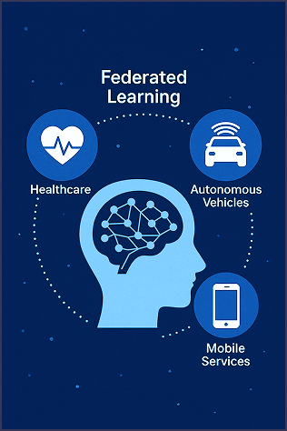

import Tooltip from '@site/src/components/Tooltip';

# وقتی داده‌ها مهاجرت نمی‌کنند: روایت یادگیری فدرال

##  مقدمه

###  یادگیری تقویتی یا Reinforcement Learning

در سال‌های اخیر، هوش مصنوعی با رشد سریع خود، نقش مهمی در تحلیل داده‌های واقعی ایفا می‌کند. یکی از رویکردهای نوین در این زمینه، یادگیری فدرال۱ است؛ مدلی که به‌جای جمع‌آوری داده‌ها در یک سرور مرکزی، آموزش را به‌صورت توزیع‌شده میان دستگاه‌های مختلف انجام می‌دهد.

در FL، هر دستگاه مدل را با داده‌های محلی خود آموزش می‌دهد و به‌طور دوره‌ای پارامترها را با سرور مرکزی همگام می‌سازد. این رویکرد نه‌تنها از توان محاسباتی توزیع‌شده بهره می‌برد، بلکه افق‌های جدیدی برای توسعهٔ سیستم‌های هوشمند فراهم می‌کند.
در ادامهٔ این نوشتار، مفاهیم پایه، معماری‌های رایج، مزایا و روش‌های بهبود عملکرد در FL بررسی خواهند شد.


## تاریخچه

ایده‌ٔ اصلی یادگیری فدرال، یعنی آموزش مدل‌های یادگیری ماشین به‌صورت توزیع‌شده و بدون انتقال داده‌ها، ریشه در دهه‌های گذشته و تحقیقات سیستم‌های توزیع‌شده دارد. اما مفهوم «یادگیری فدرال» به‌عنوان یک حوزۀ مستقل و مشخص، برای نخستین‌بار در سال ۲۰۱۶ توسط محققان شرکت گوگل معرفی شد.

در مقاله‌ای با عنوان «Communication-Efficient Learning of Deep Networks from Decentralized Data»، الگوریتم معروف میانگین‌گیری مشارکتی۲ معرفی شد. این الگوریتم، امکان آموزش مدل‌های یادگیری عمیق۳ را با استفاده از داده‌های پراکنده روی هزاران دستگاه (مانند گوشی‌های هوشمند) فراهم می‌کند.

از آن زمان، یادگیری فدرال به‌سرعت مورد توجه جامعۀ تحقیقاتی قرار گرفت و در حوزه‌هایی مانند بینایی ماشین۴، پردازش زبان طبیعی۵، سلامت، اینترنت اشیاء۶ و صنایع مالی۷به‌کار گرفته شد.

## مزایای یادگیری فدرال

یادگیری فدرال مدل‌ها را مستقیماً روی دستگاه‌های مختلف آموزش می‌دهد. در این شیوه، داده‌ها در محل تولید خود باقی می‌مانند و مدل‌ها به‌صورت توزیع‌شده روی دستگاه‌های مختلف آموزش می‌بینند. این روش مزایای مهمی دارد:

### یادگیری پیوسته و به‌روز

مدل‌ها می‌توانند به‌صورت مداوم و بی‌درنگ از داده‌های جدید روی دستگاه‌ها یاد بگیرند، بدون نیاز به جمع‌آوری مجدد داده‌ها.

### کاهش وابستگی به ارتباط دائم با سرور

با انجام بیشتر محاسبات در سمت کلاینت، نیاز به ارسال حجم بالای داده به سرور کاهش یافته و کارایی در شرایط شبکۀ محدود افزایش می‌یابد.

### استفاده از قدرت پردازش به‌صورت توزیع‌شده

یادگیری فدرال با استفاده از منابع پردازشی دستگاه‌های متعدد (مانند گوشی‌ها یا سنسورها) به شکلی مؤثر، مقیاس‌پذیری را افزایش می‌دهد.

### پشتیبانی از داده‌های ناهمگون

در بسیاری از کاربردها، داده‌های کاربران متنوع و غیرهمگن۸‌اند. یادگیری فدرال به‌خوبی می‌تواند با این تنوع داده سازگار شود.

## اجزای کلیدی و فناوری های پشتیبان اینترنت اشیاء صنعتی

یادگیری فدرال یک فرایند مشارکتی بین سرور مرکزی و مجموعه‌ای از کلاینت‌ها (مانند گوشی‌های هوشمند یا رایانه‌های شخصی) است که بدون انتقال داده‌های خام، یک مدل یادگیری را به‌صورت توزیع‌شده آموزش می‌دهند. این فرایند شامل مراحل زیر است:

1. ارسال مدل اولیه به کلاینت‌ها: سرور مرکزی یک مدل پایه شامل وزن‌ها و پارامترهای اولیه را به کلاینت‌های منتخب ارسال می‌کند.
2. آموزش محلی مدل در هر کلاینت: کلاینت‌ها مدل دریافتی را با استفاده از داده‌های محلی خود آموزش می‌دهند. این مرحله معمولاً طی چند دور۹ انجام می‌شود.
3. بازگرداندن پارامترهای به‌روزشده به سرور: پس از آموزش، هر کلاینت تنها پارامترهای به‌روزشده را به سرور بازمی‌گرداند. داده‌های خام کاربران هرگز ارسال نمی‌شوند.
4. تجمیع پارامترها و ساخت مدل جدید: سرور با استفاده از روش‌هایی مانند FedAvg، پارامترهای دریافتی را ترکیب کرده و یک مدل به‌روزرسانی‌شده می‌سازد. این مدل جدید سپس به کلاینت‌ها ارسال می‌شود.
5. تکرار چرخه تا رسیدن به دقت مطلوب: مراحل بالا به‌طور تکراری انجام می‌شوند تا زمانی که مدل نهایی از نظر دقت و عملکرد به سطح مطلوب برسد. در شکل زیر نیز مراحل اصلی نمایش داده شده‌اند.


<div style={{textAlign: 'center'}}>
    
</div>

## مثال عملی: یادگیری فدرال در عمل

بیایید یک مثال ساده اما واقع‌بینانه از یادگیری فدرال را با استفاده از فریم‌ورک Flower بررسی کنیم. این مثال، که از یک دورۀ آموزشی DeepLearning.AI در زمینۀ FL اقتباس شده‌است، نشان می‌دهد چگونه چندین کلاینت می‌توانند بدون اشتراک‌گذاری داده‌های خام، به‌صورت مشارکتی یک مدل را آموزش دهند.

در این‌جا از دیتاست کلاسیک MNIST استفاده می‌کنیم، آن را بین کلاینت‌های مجازی تقسیم می‌کنیم و چند دور آموزش فدرال با الگوریتم FedAvg را اجرا خواهیم کرد.

### گام ۱: بارگذاری کتابخانه‌ها

```python
from flwr.client import NumPyClient, ClientApp
from flwr.common import ndarrays_to_parameters, Context
from flwr.server import ServerApp, ServerConfig, ServerAppComponents
from flwr.server.strategy import FedAvg
from flwr.simulation import run_simulation
from utils2 import *
```

### گام ۲: آماده‌سازی دیتاست MNIST

```python
trainset = datasets.MNIST("./MNIST_data/", download=True, train=True, transform=transform)

total_length = len(trainset)
split_size = total_length // 3
torch.manual_seed(42)
part1, part2, part3 = random_split(trainset, [split_size] * 3)

part1 = exclude_digits(part1, excluded_digits=[1, 3, 7])
part2 = exclude_digits(part2, excluded_digits=[2, 5, 8])
part3 = exclude_digits(part3, excluded_digits=[4, 6, 9])

train_sets = [part1, part2, part3]
```

ما داده‌های آموزشی را بین سه کلاینت تقسیم می‌کنیم. به هر کلاینت یک زیرمجموعۀ غیرهم‌پوشان۱ از ارقام اختصاص داده می‌شود تا داده‌های غیر IID (یعنی داده‌های مستقل و یکسان توزیع‌نشده) شبیه‌سازی شود –چیزی که در بسیاری از سناریوهای واقعی یادگیری فدرال رایج است. سپس داده‌های تست را آماده می‌کنیم:

```python
testset = datasets.MNIST("./MNIST_data/", download=True, train=False, transform=transform)
testset_137 = include_digits(testset, [1, 3, 7])
testset_258 = include_digits(testset, [2, 5, 8])
testset_469 = include_digits(testset, [4, 6, 9])
```

### گام ۳: تعریف هندلرهای پارامترهای مدل

```python
def set_weights(net, parameters):
    params_dict = zip(net.state_dict().keys(), parameters)
    state_dict = OrderedDict({k: torch.tensor(v) for k, v in params_dict})
    net.load_state_dict(state_dict, strict=True)

def get_weights(net):
    return [val.cpu().numpy() for _, val in net.state_dict().items()]
```

این توابع وزن‌های مدل PyTorch را به آرایه‌های NumPy و برعکس تبدیل می‌کنند، تا فریم‌ورک Flower بتواند آن‌ها را در طول دورهای یادگیری فدرال رد و بدل کند.

### گام ۴: تعریف کلاینت Flower

```python
class FlowerClient(NumPyClient):
    def __init__(self, net, trainset, testset):
        self.net = net
        self.trainset = trainset
        self.testset = testset

    def fit(self, parameters, config):
        set_weights(self.net, parameters)
        train_model(self.net, self.trainset)
        return get_weights(self.net), len(self.trainset), {}

    def evaluate(self, parameters, config):
        set_weights(self.net, parameters)
        loss, accuracy = evaluate_model(self.net, self.testset)
        return loss, len(self.testset), {"accuracy": accuracy}
```

هر کلاینت آموزش و ارزیابی محلی را انجام می‌دهد و سپس وزن‌های به‌روزشده را بازمی‌گرداند. مدیریت ارتباطات در پشت صحنه توسط Flower انجام می‌شود.


### گام ۵: تعریف تابع مقدار‌دهی اولیهٔ کلاینت

```python
def client_fn(context: Context):
    net = SimpleModel()
    partition_id = int(conntext.node_config["partition-id"])
    return FlowerClient(net, train_sets[partition_id, testset]).to_client()
```

این تابع یک کلاینت جدید برای شبیه‌سازی ایجاد می‌کند و به هر کلاینت یک بخش مشخص از داده‌ها را اختصاص می‌دهد.

### گام ۶: تابع ارزیابی در سمت سرور

```python
def evaluate(server_round, parameters, config):
    net = SimpleModel()
    set_weights(net, parameters)
    _, accuracy = evaluate_model(net, testset)
    _, acc137 = evaluate_model(net, testset_137)
    _, acc258 = evaluate_model(net, testset_258)
    _, acc469 = evaluate_model(net, testset_469)

    log(INFO, "Accuracy (All): %.4f", accuracy)
    log(INFO, "Accuracy [1,3,7]: %.4f", acc137)
    log(INFO, "Accuracy [2,5,8]: %.4f", acc258)
    log(INFO, "Accuracy [4,6,9]: %.4f", acc469)

    if server_round == 3:
        cm = compute_confusion_matrix(net, testset)
        plot_confusion_matrix(cm, "Final Global Model")
```

این تابع مدل سراسری را پس از هر دور ارزیابی می‌کند و معیارهای عملکرد را به‌صورت جزئی برای زیرمجموعه‌های ارقام ثبت می‌کند.

### گام ۷: پیکربندی استراتژی FedAvg

```python
net = SimpleModel()
params = ndarrays_to_parameters(get_weights(net))

def server_fn(context: Context):
    strategy = FedAvg(
        fraction_fit=1.0,
        fraction_evaluate=0.0,
        initial_parameters=params,
        evaluate_fn=evaluate,
    )
    config = ServerConfig(num_rounds=3)
    return ServerAppComponents(strategy=strategy, config=config)
```

در این‌جا از FedAvg استفاده می‌کنیم که رایج‌ترین استراتژی در یادگیری فدرال است.

این روش وزن‌های همهٔ کلاینت‌ها را میانگین‌گیری می‌کند تا مدل سراسری به‌روزرسانی شود.


## گام ۸: اجرای شبیه‌سازی

```python
server = ServerApp(server_fn=server_fn)
client = ClientApp(client_fn=client_fn)

run_simulation(
    server_app=server,
    client_app=client,
    num_supernodes=3,
    backend_config=backend_setup,
)
```

## معماری‌های متداول در یادگیری فدرال

یادگیری فدرال (FL) به‌عنوان رویکردی نوین در آموزش مدل‌های یادگیری ماشین روی داده‌های توزیع‌شده، دارای معماری‌های مختلفی است که متناسب با نوع سیستم، نوع داده و سطح کنترل طراحی می‌شوند. در ادامه، سه معماری رایج در این حوزه را معرفی می‌کنیم:

-  معماری متمرکز۱
در این ساختار، یک سرور مرکزی وظیفۀ هماهنگی کل فرآیند یادگیری را بر عهده دارد. ابتدا مدل پایه را به کلاینت‌ها (مانند گوشی‌ها یا لبه‌های شبکه) ارسال می‌کند، سپس پارامترهای آموزش‌دیده را جمع‌آوری کرده و آن‌ها را ترکیب می‌کند. این معماری، ساده و محبوب‌ترین نوع در کاربردهای صنعتی است، اما به سرور مرکزی وابسته است و آسیب‌پذیری نقطهٔ تکی شکست۲ دارد.

- معماری غیرمتمرکز۳
در این رویکرد، هیچ سرور مرکزی‌ای وجود ندارد. کلاینت‌ها به‌صورت مستقیم با یکدیگر ارتباط برقرار می‌کنند و پارامترهای مدل را با هم به اشتراک می‌گذارند. این معماری معمولاً با ساختارهایی مانند شبکه‌های همتا به همتا۴ یا گراف ارتباطی پیاده‌سازی می‌شود. این معماری برای محیط‌هایی با اعتماد کمتر یا ساختار توزیع‌شده‌تر مناسب است، اما مدیریت و همگرایی مدل در آن چالش‌برانگیزتر است.

- معماری ترکیبی۵
ایدۀ این معماری، استفاده از چندین سطح پردازشی است. برای مثال، ابتدا مدل‌ها در سطح دستگاه‌ها آموزش می‌بینند، سپس به گره‌های۶ میانی (مانند گیت‌وی‌ها۷ یا سرورهای لبه) منتقل می‌شوند و در نهایت خروجی آن‌ها به سرور مرکزی فرستاده می‌شود. این مدل بین بهره‌وری، مقیاس‌پذیری و پایداری تعادل برقرار می‌کند و برای شبکه‌های بزرگ یا محیط‌های چندلایه۸  مناسب است.

## تنظیمات پشت صحنه: نقش پارامترها و ابرپارامترها۹ در یادگیری فدرال

در یادگیری فدرال، پارامترهای مدل مانند وزن‌ها و بایاس‌ها به‌صورت محلی روی داده‌های هر کلاینت آموزش دیده و سپس برای تجمیع به سرور مرکزی ارسال می‌شوند، بدون آن‌که نیاز به انتقال داده‌های خام باشد. برخلاف یادگیری متمرکز، یادگیری فدرال با چالش‌هایی مانند ناهمگونی داده‌ها روبه‌روست که نیازمند الگوریتم‌های خاصی مانند FedProx ،FedAvg یا FedNova برای تجمیع مؤثر پارامترهاست. همگرایی این پارامترها و وزن‌دهی به کلاینت‌ها نقشی کلیدی در دقت و تعمیم‌پذیری مدل جهانی دارد.

در کنار آن، ابرپارامترها مانند نرخ یادگیری، تعداد دورهای محلی، اندازهٔ دسته۱۰ و تعداد کلاینت‌های فعال، باید پیش از آموزش تعیین شوند. این مقادیر تأثیری مستقیم بر کیفیت یادگیری، میزان بیش‌برازش۱۱ محلی، سرعت همگرایی و مصرف منابع دارند. همچنین، نحوهٔ انتخاب

کلاینت‌ها و تناوب ارتباطات بین کلاینت و سرور بر بهره‌وری انرژی و پهنای باند مؤثر است. در نتیجه، تنظیم بهینۀ ابرپارامترها برای پایداری، مقیاس‌پذیری و دقت نهایی مدل در یادگیری فدرال ضروری است.

## نقش ارتباطات شبکه 

در یادگیری فدرال، ارتباطات شبکه نقشی اساسی در عملکرد و پایداری سیستم ایفا می‌کنند. برخلاف روش‌های متمرکز که داده‌ها به سرور منتقل می‌شوند، در یادگیری فدرال فقط پارامترهای مدل یا گرادیان‌ها میان کلاینت و سرور جابه‌جا می‌شوند. این ویژگی، گرچه حریم خصوصی را حفظ می‌کند، اما سیستم را وابسته به زیرساخت ارتباطی قابل‌اعتماد می‌سازد.
عواملی مانند پهنای باند، تأخیر شبکه، فرکانس تبادل پارامترها و ناهمگنی کانال‌های ارتباطی می‌توانند بر کیفیت آموزش تأثیر بگذارند. مثلاً ارتباط ضعیف برخی کلاینت‌ها ممکن است باعث تأخیر یا از دست رفتن به‌روزرسانی‌ها شود که در نتیجۀ آن، فرآیند تجمیع مدل مختل می‌شود.
برای حل این چالش‌ها، از راهکارهایی مانند انتخاب تطبیقی کلاینت‌ها، فشرده‌سازی پارامترها و آموزش ناهمگام۱ استفاده می‌شود. همچنین، الگوریتم‌هایی مانند FedAvgM و FedBuff برای مدیریت شرایط ناپایدار شبکه طراحی شده‌اند.
در نتیجه، موفقیت در یادگیری فدرال تنها به الگوریتم‌های یادگیری وابسته نیست، بلکه به طراحی هوشمندانۀ شبکه و مدیریت ارتباطات بین کلاینت‌ها و سرور نیز بستگی دارد.


## از Gboard تا خودروهای خودران

یادگیری فدرال کاربردهای گسترده‌ای در دنیای واقعی دارد، از جمله در صفحه‌کلید هوشمند گوگل۲؛ که با آموزش مدل‌ها به‌صورت محلی روی دستگاه‌های کاربران و ارسال فقط به‌روزرسانی‌های مدل به سرور، هم عملکرد بهتری ارائه می‌دهد و هم حریم خصوصی حفظ می‌شود.
در خودروهای خودران، یادگیری فدرال به مدل‌ها اجازه می‌دهد تا با داده‌های محیطی مثل تصاویر و سنسورها به‌صورت توزیع‌شده آموزش ببینند و تجربهٔ رانندگی را به اشتراک بگذارند، بدون نیاز به انتقال حجم بالای داده‌ها. این روش مصرف پهنای باند را کاهش داده و مدل‌ها را بهتر با شرایط واقعی جاده سازگار می‌کند.
در حوزۀ سلامت دیجیتال، FL به بیمارستان‌ها،
مراکز تصویربرداری و دستگاه‌های پوشیدنی امکان می‌دهد مدل‌های تشخیص و پیش‌بینی پزشکی را روی داده‌های محلی و حساس بیماران آموزش دهند و بدون انتقال دادهٔ خام، این مدل‌ها را با مدل مرکزی تلفیق کنند.

این فرایند موجب افزایش دقت تشخیص، پوشش گسترده‌تر داده‌های متنوع و رعایت قوانین حفاظت از داده‌ها مانند HIPAA و GDPR می‌شود.

## از توسعه تا استقرار: فریم‌ورک‌های مدرن یادگیری فدرال در یک نگاه

یادگیری فدرال با چالش‌های ذاتی مانند هماهنگی پیچیده بین چندین گره محاسباتی، مدیریت داده‌های ناهمگون و تضمین مقیاس‌پذیری، نیازمند فریم‌ورک‌های نرم‌افزاری تخصصی است که توسعه، ارزیابی و پیاده‌سازی الگوریتم‌ها را تسهیل کنند.
در سال‌های اخیر، چندین فریم‌ورک متن‌باز پیشرفته معرفی شده‌اند که هر یک ویژگی‌ها و امکانات منحصربه‌فردی در حوزۀ آموزش توزیع‌شده را فراهم می‌آورند.

- TensorFlow Federated
به‌عنوان شاخص‌ترین پلتفرم توسعهٔ یادگیری فدرال، ساختاری ماژولار مبتنی بر TensorFlow ارائه می‌کند که ضمن بهره‌گیری از APIهای سطح بالا، امکان شبیه‌سازی فرایندهای آموزش توزیع‌شده، تجمیع وزن‌ها و مدیریت چرخۀ زندگی مدل را فراهم می‌سازد. TFF به‌ویژه برای پژوهشگران و مهندسانی که به دنبال توسعهٔ مدل‌های مقیاس‌پذیر و بهینه در محیط‌های واقعی هستند، ابزاری قدرتمند به شمار می‌آید.


- PySyft
در نقطۀ مقابل، فریم‌ورکی پیشرفته بر بستر PyTorch است که علاوه‌بر پشتیبانی از یادگیری فدرال، به‌صورت تخصصی بر حفظ حریم خصوصی تمرکز دارد.این فریم‌ورک با فراهم کردن تکنیک‌هایی نظیر محاسبات چندجانبۀ امن۳ و یادگیری تفاضلی۴، گزینه‌ای ایده‌آل برای پروژه‌هایی با الزامات امنیتی و قانونی پیچیده است.

- Flower
فریم‌ورک متن‌باز Flower به‌دلیل معماری سبک، سازگاری با کتابخانه‌هایی مانند PyTorch ،Tensorflow و JAX، و تمرکز بر انعطاف‌پذیری و توسعه‌پذیری، به‌سرعت به انتخاب اول برای پیاده‌سازی سیستم‌های یادگیری فدرال در مقیاس صنعتی تبدیل شده‌است. این ابزار امکان اجرای مدل‌های توزیع‌شده در محیط‌های چندگرهی با الگوریتم‌های مختلف تجمیع را فراهم می‌سازد.

همچــــنین فریـــم‌ورک‌هـــــایی مـــــانند PaddleFL ،FedML و LEAF نیز با قابلیت‌هایی نظیر شبیه‌سازی شرایط واقعی، مدیریت داده‌های ناهمگون و ساده‌سازی توسعه، نقش مهمی در پیشبرد تحقیقات و کاربردهای یادگیری فدرال دارند. انتخاب میان آن‌ها به نیاز پروژه، زبان برنامه‌نویسی و محیط اجرایی بستگی دارد.


## جمع‌بندی

یادگیری فدرال به‌عنوان رویکردی نوین در هوش مصنوعی، با آموزش مدل‌ها روی داده‌های محلی و بدون جابه‌جایی اطلاعات خام، توانسته‌است همزمان به دو دغدغۀ اساسی، یعنی حفظ حریم خصوصی و مقیاس‌پذیری، پاسخ دهد و در حوزه‌هایی مانند سلامت دیجیتال، خودروهای خودران و سرویس‌های موبایلی به‌کار گرفته شود. این روش با بهره‌گیری از قدرت محاسباتی توزیع‌شده و سازگاری با داده‌های ناهمگون، جایگاه ویژه‌ای یافته‌است؛ هرچند که چالش‌هایی نظیر هم‌گرایی مدل، ناهمگونی شدید داده‌ها و محدودیت‌های ارتباطی همچنان پابرجاست. آیندۀ این حوزه در گرو توسعۀ الگوریتم‌های مقاوم‌تر، کاهش هزینه‌های ارتباطی، بهره‌گیری از معماری‌های ترکیبی و به‌کارگیری فناوری‌های امنیتی پیشرفته، همچون حریم خصوصی تفاضلی۵ و رمزنگاری۶ است. یادگیری فدرال دیگر صرفاً یک تکنیک نیست، بلکه به ستون فقرات هوش مصنوعی توزیع‌شده بدل می‌شود؛ مسیری که نوید همکاری گستردۀ دستگاه‌ها بدون نقض محرمانگی داده‌ها را می‌دهد.

<div style={{textAlign: 'center'}}>
    
</div>
