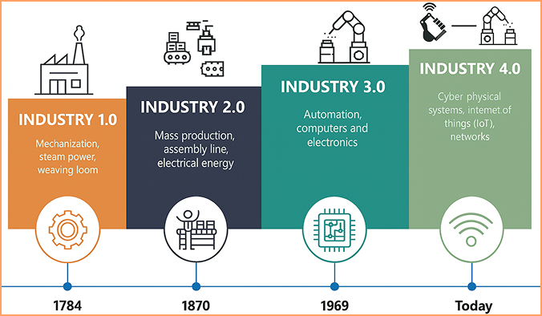

import Tooltip from '@site/src/components/Tooltip';

# کارخانه‌ای با مغز دیجیتال

در دنیای امروز صنعت، رقابت اصلی نه صرفاً در توانایی بالا بردن نرخ تولید، بلکه در میزان بهره‌گیری صنایع از فناوری‌های نوین است. یکی از جذاب‌ترین این فناوری‌ها، اینترنت اشیاء صنعتی (۱IIOT) است که از پایه‌های انقلاب صنعتی چهارم۲ محسوب می‌شود. 

در این رویکرد، هدف صرفاً خودکارسازی۳ نیست، بلکه حرکت به‌سوی هوشمندسازی۴ کل زنجیرهٔ تولید است.

در چنین فضایی، دیگر نمی‌توان صنعت را صرفاً مجموعه‌ای از ماشین‌آلات و خطوط تولید دانست، بلکه هر واحد صنعتی به یک سامانۀ پیچیدۀ هوشمند تبدیل شده‌است که بر پایۀ داده، تحلیل و بهینه‌سازی فعالیت می‌کند. بنابراین، شناخت دقیق اجزاء این اکوسیستم و نحوۀ عملکرد آن، برای دانشجویان و متخصصان آیندۀ صنعت، نه یک انتخاب، بلکه یک ضرورت علمی و حرفه‌ای محسوب می‌شود.

## کاربرد‌های عملی IIoT در کارخانه‌های پیشرفته و صنایع بزرگ

اینترنت اشیاء صنعتی صرفاً یک واژهٔ تئوری نیست، بلکه به یک ابزار قدرتمند برای افزایش کیفیت محصول، ارتقاء ایمنی و کاهش هزینه‌های عملیاتی در دنیای واقعی صنعت تبدیل شده‌است.

برای مثال، شرکت Toray Plastics در ژاپن که تولیدکنندۀ فیلم‌های پلیمری پیشرفته برای کاربردهای غذایی است، با استفاده از تکنولوژی GE Plant Applications، داده‌های بی‌درنگ را از دستگاه‌های لبه۵ جمع‌آوری کرده و آنالیز می‌کند. این سیستم به اپراتورها اجازه می‌دهد تا خطاهای تولیدی را در همان لحظه تشخیص داده و ضایعات محصول را کاهش دهند.

در حوزهٔ انرژی، شرکت GE Digital با توسعهٔ سامانهٔ مدیریت عملکرد دارایی‌ها۶، از IIoT برای پیش‌بینی خرابی تجهیزات و انجام تعمیرات پیش‌گیرانه در نیروگاه‌ها استفاده می‌کند. در این سامانه با استفاده از اطلاعات صدها حسگر نصب‌شده بر تجهیزات و تحلیل داده‌ها، می‌توان زمان دقیق نیاز به تعمیر یا تعویض قطعه را پیش‌بینی کرد و از توقف‌های پرهزینه جلوگیری کرد.

در بخش پالایش و صنایع سنگین هم نمونه‌های موفقی در دنیا مشاهده می‌شوند. پالایشگاه Ergon Refining در ایالات متحده، با استفاده از حسگرهای صوتی بی‌سیم در شیرهای بخار، توانسته عملکرد غیرعادی شیرها را شناسایی کند و در کمتر از پنج ماه، هزینهٔ پیاده‌سازی این فناوری را جبران کند و علاوه‌بر آن، سالانه میلیون‌ها دلار صرفه‌جویی اقتصادی داشته باشد.

## اینترنت اشیاء صنعتی چیست؟

اینترنت اشیاء صنعتی، به شبکه‌ای هوشمند از حسگرها، ابزارهای دقیق، تجهیزات کنترلی و نرم‌افزارها گفته می‌شود که به‌منظور جمع‌آوری، پردازش و تحلیل داده‌ها در محیط‌های صنعتی به‌کار گرفته می‌شوند. در صنایع شیمیایی، این فناوری نقشی حیاتی در پایش بی‌درنگ پارامترهای فرایندی مانند دما، فشار، جریان، سطح مایع، ترکیب شیمیایی، رطوبت و ارتعاشات مکانیکی و حتی افزایش ایمنی عملیاتی و بهینه‌سازی بهره‌برداری از واحدهای تولیدی دارد.

برخلاف اینترنت اشیاء عمومی۷ که بیشتر در کاربردهای روزمره مانند خانه‌های هوشمند یا دستگاه‌های پوشیدنی استفاده می‌شود، IIoT با تمرکز بر محیط‌های صنعتی پیچیده، حساس و پرریسک مانند پالایشگاه‌ها، واحدهای پتروشیمی و کارخانه‌های تولید مواد شیمیایی طراحی شده‌است. این تفاوت‌ها، خود را در الزامات فنی مانند پایداری سیستم، امنیت سایبری، قابلیت اطمینان و سرعت پاسخ‌دهی نشان می‌دهند.

برای مثال، در یک رآکتور شیمیایی پیوسته۸، استفاده از حسگرهای دمایی و فشاری متصل به شبکهٔ IIoT می‌تواند به سیستم کنترل اجازه دهد تا تغییرات جزئی در شرایط واکنش را شناسایی کرده و به‌صورت خودکار، عملگرهایی مانند شیرها یا مبدل‌های حرارتی را تنظیم کند. این سطح از کنترل هوشمند، نه‌تنها باعث بهبود کیفیت محصول و کاهش ضایعات می‌شود، بلکه نقش مهمی در پیشگیری از حوادث ایفا می‌کند.

در صنایع شیمیایی که ماهیت فرایندها عمدتاً

پیوسته، خطرناک و وابسته به کنترل دقیق است، اینترنت اشیاء صنعتی به‌عنوان یک ابزار انقلابی برای خودکارسازی پیشرفته، پیش‌بینی خرابی‌ها و تصمیم‌گیری مبتنی بر داده‌های بی‌درنگ شناخته می‌شود.

## اجزاء کلیدی و فناوری‌های پشتیبان اینترنت اشیاء صنعتی

اکوسیستم منسجم اجزاء سخت‌افزاری و نرم‌افزاری برای عملکرد درست اینترنت اشیاء صنعتی در محیط‌های پیچیده‌ای مثل واحدهای تولید مواد شیمیایی، دارویی یا حتی پتروشیمی بسیار حیاتی است. اجزاء کلیدی این اکوسیستم عبارتند از:

### حسگرهای هوشمند۹

در صنایع شیمیایی، حسگرهایی برای پایش دما، فشار، PH، ترکیب شیمیایی و حتی میزان خوردگی تجهیزات به‌کار می‌روند. حسگرهای نسل جدید با قابلیت کالیبراسیون خودکار و تشخیص خطا به سیستم اجازه می‌دهند تا در صورت بروز انحراف، به سرعت و قبل از وقوع حادثه به مهندس فرایند هشدار دهند.

### درگاه‌های ارتباطی صنعتی۱۰
داده‌ها از طریق درگاه‌هایی امن و مقاوم، از حسگرها به سمت پلتفرم‌های ابری یا سرورهای داخــــــلی منتقل می‌شوند. این انتقال می‌توانــــــد با پروتـــــکل‌هایی مـــــــانند MQTT ،OPC UA یا Modbus TCP صورت گیرد که برای صنایع حساس طراحی شده‌اند.

### رایانش لبه۱۱

در بسیاری از فرایندهای شیمیایی، زمان پاسخ باید در حد میلی‌ثانیه باشد. به همین دلیل، تحلیل اولیۀ داده‌ها در لبه و نزدیک به دستگاه‌ها انجام می‌شود تا سیستم بتواند بدون تأخیر به تغییرات واکنش نشان دهد؛ تغییراتی مانند تنظیم فوری دبی جریان در زمان وجود واکنش‌گرهای حساس داخل سامانه.

### پلتفرم‌های تحلیلی ابری۱
پلتفرم‌هایی مانند GE-Predix و Siemens-MindSphere و ABB-Ability امکان تحلیل داده‌های انبوه، تشخیص الگوها، پیش‌بینی خرابی‌ها و بهینه‌سازی کلی عملکرد را فراهم می‌کنند. این پلتفرم‌ها نقش مهمی در کاهش مصرف انرژی و حفظ کیفیت بالای محصول دارند. اتلاف انرژی و کاهش نوسانات کیفیت محصول از بزرگترین چالش‌های مهندسان فرایند در طراحی فرایندهای شیمیایی است.

### امنیت سایبری صنعتی۲

حفاظت از داده‌ها در واحدهای صنعتی بزرگ مانند کارخانه‌های مهم صنعتی، پالایشگاه‌ها و پتروشیمی‌ها از مهم‌ترین مباحث اینترنت اشیاء صنعتی است. استفاده از فایروال‌های۳‌ صنعتی، رمزگذاری داده‌ها و سیستم‌های شناسایی تهدیدات نیز از اجزاء حیاتی زیرساخت IIoT محسوب می‌شوند.

## مهم‌ترین چالش‌ها و موانع پیاده‌سازی IIoT

### ناسازگاری با سیستم‌های قدیمی۴

بیشتر واحدهای شیمیایی موجود از تجهیزات کنترلی سنتی، PLCهای قدیمی و نرم‌افزارهای محدودکننده استفاده می‌کنند. ادغام این سیستم‌ها با زیرساخت‌های جدید IIoT، نیازمند بازطراحی معماری کنترلی و سرمایه‌گذاری قابل‌توجه است.

### مقاومت سازمانی و فرهنگی

در برخی شرکت‌ها، کارکنان عملیات یا مهندسان باتجربه، به دلایل گوناگون مانند ترس از جایگزینی نیروی انسانی یا ناآشنایی با فناوری‌های جدید در برابر هوشمندسازی واحد مقاومت می‌کنند. غلبه بر این مقاومت نیازمند آموزش هدفمند و مشارکت فعال منابع انسانی است.

###  امنیت سایبری در محیط‌های بحرانی

اتصال تجهیزات حساس شیمیایی به شبکه‌های صنعتی، اگر بدون راهکارهای امنیتی مناسب انجام شود، می‌تواند منجر به افشای اطلاعات فرایندی، اخلال در عملیات یا
حتی تهدیدهای فیزیکی خطرناک شود. پیاده‌سازی فایروال‌های صنعتی، پروتکل‌های رمزنگاری و مدیریت دسترسی باید به‌عنوان یک اولویت دیده شوند، نه یک گزینهٔ جانبی و انتخابی.

### هزینه‌های اولیه و عدم بازگشت سریع سرمایه

در بسیاری از واحدهای شیمیایی، مدیران مالی یا ارشد، انتظار بازگشت سریع سرمایه۵ دارند؛ در حالی‌که مزایای IIoT معمولاً در میان‌مدت یا بلندمدت آشکار می‌شوند، مانند کاهش خرابی تجهیزات یا بهینه‌سازی مصرف انرژی.

    

###  پیچیدگی تحلیل داده و نیاز به نیروی متخصص

صرف داشتن داده کافی نیست! تحلیل صحیح، مصورسازی کاربردی و استخراج الگوهای معنادار از داده‌های بزرگ فرایندی، نیاز به تیم‌هایی با مهارت ترکیبی در مهندسی شیمی، داده‌کاوی و هوش مصنوعی دارند؛ نیروهایی که در بسیاری از شرکت‌ها هنوز به‌صورت ساختاریافته وجود ندارند.

## آینده‌ای در حال شکل‌گیری

اینترنت اشیاء صنعتی، صرفا یک ابزار نیست؛ بلکه دست‌رنج نسلی از مهندسان خواهد بود که با درک عمیق فرایندهای شیمیایی و تسلط بر داده، صنایع شیمیایی را به سطحی از هوشمندی می‌رسانند که تا گذشتهٔ نه‌چندان دور، صرفاً در حد پیش‌بینی و ایده‌پردازی مطرح بود. این آینده، توسط نسل تازهٔ مهندسان در حال ساخت است.
