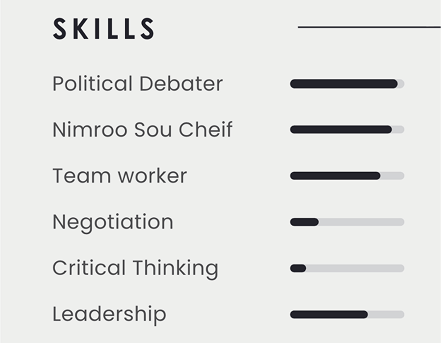
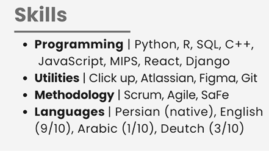
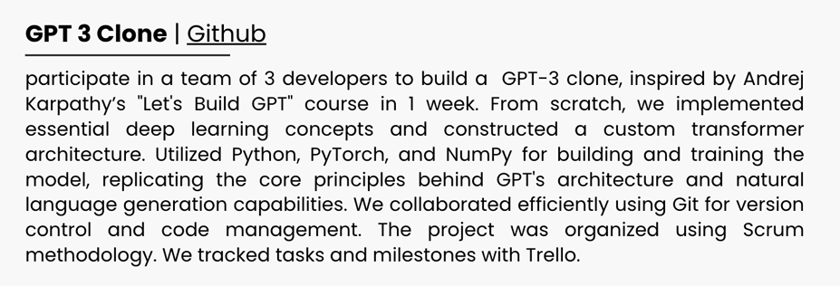

import Tooltip from "@site/src/components/Tooltip";

سلام. تبریک می‌گویم بابت قبولی شما در رشتۀ مهندسی کامپیوتر دانشگاه شریف. همان‌طور که کنکور و المپیاد را پشت‌سر گذاشته‌اید، در ادامۀ زندگی نیز با موانع مختلف برای ورود به عرصه‌هایی مانند صنعت روبه‌رو خواهید شد. در این متن، کوشیده‌ام تجربیاتم را به‌عنوان کسی که هم در جایگاه کارجو و هم در جایگاه کارفرما، در تعدادی از شرکت‌های بزرگ ایران و یک شرکت خارجی فعالیت داشته‌است، برای شما بنویسم. در ادامه، با توجه به دستور سردبیر دل‌ها (آقای آرش)، لازم است که متن را رسمی بنویسم، اما آن را خیلی جدی نگیرید! :) هرگونه سؤال یا نیاز به کمک داشتید نیز می‌توانید از طریق آیدی من در تلگرام (
[@m_mosayebi](https://t.me/m_mosayebi)
) با بنده در ارتباط باشید.

زندگی مراحل زیادی دارد. تا پیش از ورود به جامعۀ به قول بزرگ‌ترها «پر از گرگ»، سیستم به‌گونه‌ای عمل می‌کند که نتیجۀ حاصل، تا حد امکان با میزان تلاش شما رابطۀ مستقیمی داشته باشد. برای مثال، در کنکور یا آزمون‌های المپیاد، منابع استاندارد شده‌اند؛ آزمون‌ها در زمان مشخصی برگزار می‌شوند و به‌طور کلی، عدالت، رکنی مهم و حساس در این فرایند است. اما روزگار همواره عادل نیست و پس از اتمام دوران خوش‌رنگ‌و‌لعاب آموزش‌و‌پرورش، دریچۀ سیستم‌های استانداردساز، رفته‌رفته بسته شده و ارتباط مستقیم تلاش با نتیجه، ذره‌ذره محو می‌شود. اولین مرحله و نقطۀ عطف ورود به این دنیای تاریک، «رزومه» است. مراحل زندگی مانند زنجیری به هم متصل‌اند و هر زنجیر تنها به اندازۀ ضعیف‌ترین حلقه‌اش مقاوم است. در این متن، به توصیف چگونگی نگارش رزومه، به‌عنوان اولین مواجهۀ شما با دنیای نه‌چندان عادلانۀ بیرون، می‌پردازیم. بیان می‌کنیم که چگونه خود را برای ورود هرچه بهتر به این دنیای جدید آماده کنید. باشد تا رزومه، ضعیف‌ترین تکۀ زنجیرۀ مراحل زندگی شما نباشد.

رزومه، یک ارائۀ درست و تا حد امکان کوتاه از توانایی‌ها، دستاورد‌ها و تجربیات شما در همۀ زمینه‌ها تا به امروز است. این ارائه بایستی تا حد ممکن خوانا، ساده و عمل‌گرا باشد. پیش از هر چیز، توصیه می‌کنم در صورتی‌که قصد اقدام برای شرکت‌های فناوری در حوزۀ مهندسی کامپیوتر را دارید، رزومهٔ خود را به زبان انگلیسی بنویسید. این کار، علاوه‌بر تطابق بهتر با سیستم‌های خودکار بررسی رزومه، معمولاً در نگاه بررسی‌کنندگان رزومه، حرفه‌ای‌تر به نظر می‌رسند. در ادامه با فرض این‌که شما یک دانشجوی سال اول یا دوم دانشگاه بدون هیچ تجربه‌‌ای در صنعت هستید، به بیان بخش‌های مختلف رزومه می‌پردازیم.

## هدر یا سربرگ

اولین بخشی که توجه بررسی‌کنندۀ رزومه را به خود جلب می‌کند، <Tooltip tip="Header">سربرگ</Tooltip> رزومۀ شماست. در این بخش، معمولاً نام کامل خود را به همراه عنوان موقعیت شغلی موردنظرتان می‌نویسید. توصیه می‌شود تصویری ساده و حرفه‌ای از خود نیز در این بخش قرار دهید تا بررسی‌کننده بتواند ارتباط بهتری با شما برقرار کند. استفاده از رنگ‌های متداول و مطمئن (مانند آبی تیره یا مشکی) در این بخش می‌تواند مفید باشد. سربرگ، تنها بخشی از رزومۀ شماست که ظاهر آن تا کمی اهمیت دارد. برای مثال، سربرگ رزومۀ اینجانب در ادامه آورده شده است.

شما می‌توانید راه‌های ارتباطی خود را نیز در این بخش یا در بخشی جداگانه بگنجانید. راه‌های ارتباطی شامل ایمیل، شمارۀ تماس، آدرس پروفایل <Tooltip tip="Linkedin">لینکدین</Tooltip> (شبکۀ اجتماعی تخصصی حوزه‌های شغلی)، آدرس پروفایل <Tooltip tip="GitHub">گیت‌هاب</Tooltip> (پلتفرمی برای به‌اشتراک‌گذاری کد و تعامل میان توسعه‌دهندگان) و محل سکونت شما می‌شود. در صورت رضایت از رزومۀ شما، بررسی‌کننده با شما تماس خواهد گرفت. حتماً شمارۀ تماس قابل‌دسترسی را درج کنید. همچنین، محل سکونت شما در اغلب موارد باید با محل استقرار شرکت مورد نظر یکسان یا نزدیک باشد. بیشتر شرکت‌های فعال در حوزۀ مهندسی کامپیوتر در تهران مستقر هستند. خوابگاه‌های دانشگاه شریف، در صورتی که حداقل یک واحد درسی داشته باشید، به شما خدمات‌دهی می‌کنند. امکان اخذ واحد درسی در دورۀ تابستان نیز وجود دارد.

    

 

## دربارهٔ من

در این بخش، در متنی بسیار کوتاه، به بیان انگیزۀ خود برای ورود به این حوزۀ شغلی و علاقهٔ خود به آن بپردازید. می‌توانید مختصری نیز از ویژگی‌های شخصیتی خود بگویید. همچنین، بیان هدف‌تان از این کار و ترسیم جایگاه حرفه‌ای خود در چند سال آینده می‌تواند تأثیرگذار باشد.

از نظر شخصی بنده، این بخش هیچ اطلاعات مفیدی به بررسی‌کنندۀ رزومه اضافه نمی‌کند. با این حال، بسیاری از متخصصان مطرح حوزۀ منابع انسانی و فرایند استخدام بر این باورند که وجود این بخش می‌تواند به برقراری ارتباط بهتر بین شما و بررسی‌کننده کمک کند و نوشتن آن را مفید می‌دانند.

## سوابق تحصیلی

به‌عنوان شخصی که هیچ تجربه‌ای در صنعت ندارد، این بخش مهم‌ترین وزنۀ رزومۀ شماست. در این بخش نام دانشگاه، رشتۀ تحصیلی، سال ورود و معدل خود را بنویسید. در ادامه، می‌توانید همین اطلاعات را برای مقطع دبیرستان نیز بنویسید. شریفی بودن برای بسیاری از شرکت‌ها مهم‌ترین نکتۀ رزومۀ شما خواهد بود، پس تا حد ممکن این بخش را در رزومۀ خود پررنگ کنید. این اهمیت برای برخی از شرکت‌ها تا حدی است که قوانین معمول استخدامی خود را برای شریفی‌ها اعمال نمی‌کنند. به خاطر دارم در مصاحبه‌ام با یکی از شرکت‌های بزرگ مالی کشور، مصاحبه‌کننده صریحاً ذکر کرد که «دانشجویان کارشناسی را نمی‌گیریم مگر این‌که شریفی باشند».

## توانایی‌ها

در این بخش به بیان تیتروار توانایی‌های خود بپردازید. این موارد شامل زبان‌ها و فریم‌ورک‌های برنامه‌نویسی‌ (مانند پایتون، C و…)، ابزارهای خاص (فرضاً Jira ،Figma و…)، روش‌های مدیریت پروژه (Scrum ،Agile و…) و زبان‌های گفتاری (فرضاً انگلیسی، آلمانی و…) است. لازم نیست توانایی خودتان در زمینۀ پخت نیمرو، مهارت بی‌نقص‌تان در بحث‌های سیاسی با اقوام و یا قدرت بالای خود در کار تیمی را در این بخش بیاورید، چرا که اهمیتی برای خواننده نداشته و به وی کمکی در راستای تصمیم‌گیری نمی‌کند. مشکل متداول بعدی در این بخش، استفاده از گرافیک برای نشان دادن میزان تسلط است. این مورد علاوه‌‌بر این‌که توسط سیستم‌های بررسی رزومه، پشتیبانی نمی‌شود، بلکه تمرکز را از نقاط قوت اصلی شما دور می‌کند. امکان بی‌راه رفتن در این بخش بسیار بالاست، پس مستقیم و سرراست توانایی‌های خود را بگویید و وارد بخش بعد شوید.

مثال بد:

    

مثال خوب:

    

 
## کتاب‌ها و دوره‌های مرتبط

در این بخش، لازم است دوره‌ها (اعم از دوره‌های درون‌دانشگاهی و برون‌دانشگاهی) و کتاب‌های مرتبط با حوزۀ شغلی موردنظر را فهرست کنید.

در دوره‌های درون‌دانشگاهی، دروسی مانند برنامه‌نویسی مقدماتی و پیشرفته، دروس الگوریتمی، آمار و احتمال، جبر خطی، هوش مصنوعی و مواردی از این دست، با توجه به موقعیت شغلی‌ای که برای آن اقدام می‌کنید، می‌توانند گزینه‌های مناسبی برای ذکر باشند. شما می‌توانید نام استاد و نمرۀ کسب‌شده در این دروس را نیز درج کنید.

ذکر نام دوره‌های مطرح خارج از دانشگاه نیز در این بخش توصیه می‌شود. معمولاً امکان یادگیری زبان‌های برنامه‌نویسی متداول در صنعت، صرفاً در محیط دانشگاه فراهم نیست و مشاهدۀ دوره‌های آنلاین در پلتفرم‌هایی مانند یوتیوب و دیگر منابع، برای ورود به بازار کار ضروری است. فهرست کردن کتاب‌های مرتبط و معروف در حوزۀ تخصصی شما نیز می‌تواند تأثیر مثبتی بر بررسی‌کنندۀ رزومه بگذارد. برای نمونه، در حوزۀ کاری بنده، کتاب معروفی با عنوان «INSPIRED» وجود دارد که پیش از مصاحبه آن را مطالعه کرده بودم. تقریباً بیش از نیمی از مصاحبه‌کنندگان به این موضوع اشاره کردند و من را برای مطالعۀ این کتاب تحسین نمودند.

## دستاوردها و مدارک

در این بخش، می‌توانید مواردی مانند رتبۀ درخشان کنکور، مدال رنگین المپیاد، مدارج وزین ورزشی، قهرمانی‌تان در مسابقات بین‌کوچه‌ای شنا و… را به رخ بکشید. معمولاً مصاحبه‌کننده با گفتن یک «احسنت، من هم هم‌سن شما بودم، فلان دستاورد را داشتم» به این بخش اشاره می‌کند.

## پروژه‌ها

به‌طور معمول، مهم‌ترین بخش رزومۀ یک فرد، تجربیات پیشین او در موقعیت‌های شغلی مشابه است. در صورتی که این بخش وجود نداشته باشد (فرضی که این متن بر اساس آن آغاز شد)، پروژه‌های او به کلیدی‌ترین بخش تبدیل می‌شوند. لازم است تا پیش از اقدام برای موقعیت شغلی مربوطه، تعداد قابل‌توجهی پروژۀ مرتبط را پیاده‌سازی کنید تا جای خالیِ نداشتن تجربه را پر نمایید.
اولین مسیر برای پیاده‌سازی این پروژه‌ها، درس‌های پروژه‌محور یا دارای تمرین‌های حجیم در دانشکده است. علاوه‌بر درس «برنامه‌نویسی پیشرفته» (که احتمالاً یکی از چالش‌برانگیزترین پروژه‌های دوران تحصیل شما خواهد بود)، دروسی مانند مبانی برنامه‌نویسی، الگوریتم و موارد مشابه، دارای پروژه‌ها و تمرین‌های گسترده‌ای هستند که گنجاندن آن‌ها در رزومه برای شما سودمند خواهد بود. مسیر دوم و کاربردی‌تر، پروژه‌های موجود در سطح اینترنت هستند. شما می‌توانید این پروژه‌ها را در یوتیوب، وبسایت‌های معتبر و سایر منابع بیابید. کافی است نام زبان یا فریم‌ورک برنامه‌نویسی موردنظر خود را به همراه کلیدواژۀ «Project» (طبیعتاً به انگلیسی) جست‌وجو کنید تا با انبوهی از ویدیوها روبه‌رو شوید که نه‌تنها چارچوب یک پروژه را با آن زبان یا فریم‌ورک تعریف می‌کنند، بلکه کد کامل پروژه را نیز به‌صورت زنده نوشته و در اختیار شما قرار می‌دهند. بهترین راه برای یادگیری عمیق مفاهیم برنامه‌نویسی و تقویت رزومه، استفادۀ صحیح از این ویدیوهاست. توصیه می‌کنم ابتدا چارچوب و پروژۀ تعریف‌شده در این ویدیوها را درک کنید و سپس، یک بار بدون کمک ویدیو، اقدام به پیاده‌سازی آن نمایید. پس از آن، در مرحلۀ دوم، گام‌به‌گام همراه ویدیو پیش بروید و کد پروژه را دوباره بنویسید. مستقل از مسیر انتخاب شده، کدهای پروژه‌ها را در حساب گیت‌هاب خود قرار دهید. در رزومه، ابتدا نام پروژه را ذکر کرده و لینک مربوط به آن در گیت‌هاب را در کنار نام درج کنید. سپس، در حد یک پاراگراف، به توضیح مواردی چون ابزارها و فناوری‌های به‌کاررفته، مفاهیم کلیدی پیاده‌سازی‌شده، اعضای تیم (در صورت انجام کار گروهی)، مدت زمان اجرای پروژه و همچنین ارجاع به منبع الهام‌بخش (در صورت تمایل) بپردازید. به‌شدت توصیه می‌کنم این بخش را جدی بگیرید و حداقل ۴ پروژه، شامل ۲ پروژهٔ دانشگاهی و ۲ پروژهٔ موجود در اینترنت را در رزومهٔ خود قرار دهید.

    

 

## قالب‌بندی و دیگر موارد

لازم دانستم بخشی را نیز به مباحث بصری رزومه اختصاص دهم. متأسفانه با رواج ابزارهایی مانند Canva، افراد گمان می‌کنند که زیبایی رزومه و المان‌های بصری، تأثیری در پذیرش بهتر آن دارد. بر اساس تجربۀ تقریباً پنج‌سالۀ اینجانب در تعامل با تیم‌های منابع انسانی و فرایند جذب، المان‌های بصری و طراحی پیچیدۀ رزومه، تقریباً هیچ تأثیر مثبتی در جلب نظر خواننده نداشته و حتی در مواردی، با کاهش تمرکز بر نکات مثبت و ایجاد اثر منفی همراه بوده‌است. شرکت‌های فناوری، روزانه صدها رزومه دریافت می‌کنند و میانگین زمان بررسی هر رزومه تنها هفت ثانیه است. این هفت ثانیه را صرف چه  محتوایی می‌کنید؟ زیبایی بصری یا اثبات تطابق با موقعیت شغلی؟ بر اساس تحقیقاتی که اخیراً بر روی ۱۲۵۰۰۰ رزومه انجام شده‌است، ذکر دو نکتۀ کلیدی را ضروری می‌دانم. با ورود به فضای صنعت، نام شبکۀ اجتماعی لینکدین را بسیار خواهید شنید. لینکدین پلتفرمی است که افراد تجربیات کاری خود را در آن به‌اشتراک می‌گذارند و گاهی نیز دربارۀ موفقیت‌های بزرگ خود در عرصه‌های مختلف پست می‌گذارند. تحقیقات نشان داده‌اند که داشتن یک پروفایل خوب در لینکدین می‌تواند تا ۷۱ درصد احتمال موفقیت شما را در یافتن شغل افزایش دهد. نکتۀ کلیدی‌تر این تحقیقات اما این است که داشتن یک پروفایل ضعیف می‌تواند شانس شما را کاهش دهد و در این شرایط، نداشتن حساب کاربری، انتخاب صحیح‌تری است.
همچنین در همین تحقیقات، اثبات شد که رزومه‌هایی که تعداد کلمهٔ آن‌ها بین ۴۷۵ تا ۶۰۰ است، شانس بیشتری نسبت به دیگر رزومه‌ها برای قبولی دارند.

    

 

## <Tooltip tip="Referral">ریفرال</Tooltip>

نکته‌ای عجیب در فرآیند جذب شرکت‌ها، به‌ویژه شرکت‌های بزرگ، پدیدۀ ریفرال است. ریفرال به این معناست که یکی از آشنایان یا دوستان شما، شما را به تیم جذب شرکت معرفی کند تا رزومهٔ شما در اولویت بررسی قرار گیرد و حتی در مواردی، بدون بررسی رزومه مستقیماً به مرحلهٔ مصاحبه راه یابد. به نوعی می‌توان ریفرال را تعریف جدید و ساختاریافته‌ای از مفهوم «آشنا‌بازی» یا «پارتی‌بازی» دانست. متأسفانه آمار نیز از تأثیر این روش پشتیبانی می‌کند و ظاهراً عملکرد و ماندگاری افرادی که از این طریق جذب می‌شوند، به‌طور چشم‌گیری بیشتر است. خوشبختانه، افراد بسیار زیادی در دانشکدۀ کامپیوتر دانشگاه شریف (از جمله، اینجانب) با شرکت‌های فناوری، ارتباطات خوبی برقرار کرده‌اند. در همین راستا، تأکید می‌کنم که پیش از ارسال رزومه برای شرکت مورد نظر، هم‌دانشکده‌ای‌هایی را که در حال حاضر یا در گذشته در شرکت مقصد مشغول به کار بوده‌ یا هستند، بیابید و از آن‌ها درخواست ریفرال کنید. این درخواست معمولاً با موافقت روبه‌رو می‌شود؛ چرا که فرد معرف، در صورت پذیرش شما، پاداش مناسبی دریافت خواهد کرد.

## کلام پایانی

در این مطلب، به بررسی ساختار یک رزومه پرداختیم. در صورتی که اشکال و یا مشورتی در این زمینه داشتید، خوش‌حال می‌شوم کمکی هر چند کوچک به شما عزیزان بنمایم. همچنین تلاش می‌کنم که در شماره‌های آتی، مطلبی نیز به نحوۀ آمادگی برای مصاحبه تهیه کنم تا نگاهی به فرایند کامل جذب داشته باشیم.