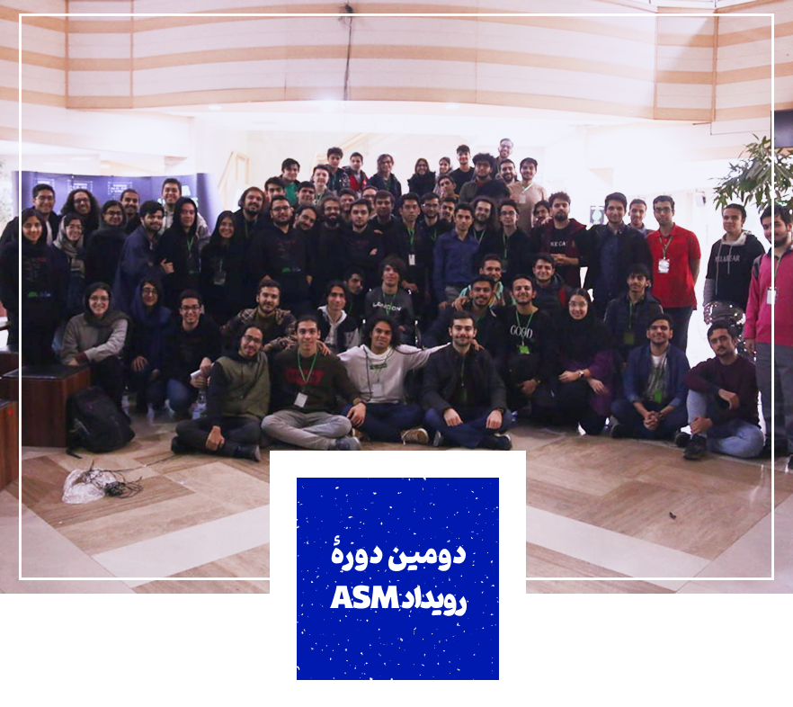
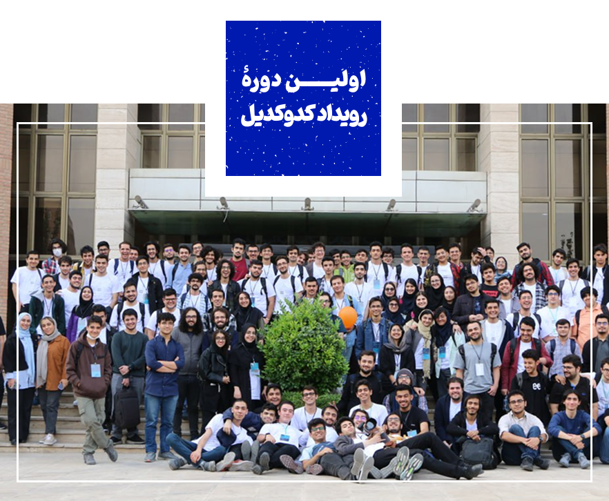
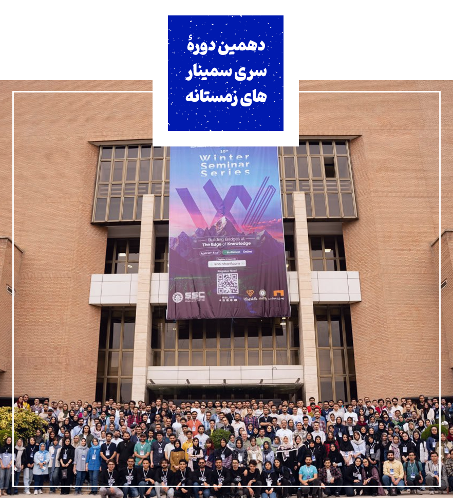

import Tooltip from "@site/src/components/Tooltip";

روزهای نخست ورودم به دانشکده برایم یک شوک واقعی بود. تا پیش از آن، مانند رودی بودم که مسیرش از پیش تعیین شده بود؛ درس می‌خواندی، امتحان می‌دادی، نمره می‌گرفتی و تمام. اما این‌جا، دانشگاه، دریایی بود با موج‌هایی از هر سو.

می‌دیدم اطرافم پر است از افرادی که هر یک در دنیای خود غرق هستند. برخی، از همان بدو ورود، در پی کسب علم، ارتباط خود را با اساتید تقویت کرده و شب و روز را به دنبال انجام تحقیق و پژوهش در آزمایشگاه‌ها سر می‌کردند. برخی دیگر نیز همزمان وارد بازار کار شده بودند و میان کار پاره‌وقت و کلاس‌های دانشگاه در نوسان بودند.

در سوی دیگر، تشکل‌ها و کانون‌های فرهنگی با تمام قدرت فعال بودند؛ گروه کوه، هیئت، انجمن اسلامی، کانون شعرخوانی، گروه خیریهٔ فردای سبز... هر کس دنیای خاص خود را داشت.

تا این‌که روزی در لابی دانشکدۀ کامپیوتر، گوشه‌ای از فضا نظرم را جلب کرد: اتاقی آبی‌رنگ با نوری ملایم؛ آکواریوم! لباس‌های آویخته از دیوارش مرا به فکر فرو برد. رنگ و بوی نسل گذشته‌ای که در آن‌جا فعال بودند را داشت.

نمی‌خواستم دانشجویی تک‌بعدی باشم؛ نه صرفاً درسی، نه صرفاً کاری. دلم می‌خواست کشف کنم، تجربه کنم و ببینم چه فرصت‌هایی پیش رویم قرار دارند. فرم استف یکی از رویدادها را دیدم و آن را پر کردم. همان شد آغاز ماجراجویی دانشجویی‌ام.

استف شدن پنجرهٔ تازه‌ای به رویم گشود. با افراد جدیدی آشنا می‌شدم و تجربه‌هایی نو به دست می‌آوردم. متوجه شدم که به این نوع فعالیت‌ها علاقه‌مندم و در کار اجرایی توانایی دارم. شب‌های منتهی به رویداد، با وجود خستگی زیاد، سرشار از انگیزه و انرژی بودم.

نخستین تجربه‌ام در جشن عید رقم خورد، اما نقطهٔ عطف مسیرم رویداد ICPC 2023 بود؛ جایی که با افراد زیادی آشنا شدم و دریافتم که کار تیمی تا چه اندازه برایم جذاب است. پس از آن در HardWar 2023 شرکت کردم و سپس در نخستین دورهٔ کدوکدیل حضور یافتم. جشن ورودی دانشجویان ۱۴۰۲ را نیز به‌عنوان مسئول اجرایی اصلی برگزار کردیم؛ تجربه‌ای شیرین و رضایت‌بخش.

بعد از شرکت در  اولین دورهٔ ASM به تیم مارکتینگ نهمین دورهٔ WSS پیوستم، رویدادی بزرگ و پر از چالش که افق جدیدی از فعالیت دانشجویی را به من نشان داد. هر چه گذشت، نقش‌هایم متنوع‌تر شدند و در رویدادهایی همچون HardWar ،ICPC و Codocodile فعال بودم. از انجام کارهای فنی تا جذب اسپانسر، هر تجربه‌ای دیدگاه‌ها و چالش‌های جدیدی برایم به همراه داشت.

  

 

با گذشت زمان، مسئول مالی انجمن علمی شدم. تلاش کردم نظم بیشتری به امور مالی ببخشم، ارتباط میان انجمن و رویدادها را شفاف‌تر و مؤثرتر کنم. این مسیر به‌تدریج هموارتر شد و نتایج آن اکنون مشهود است.

اما بدون تردید، جدی‌ترین و پرفشارترین تجربه‌ام، دبیری دهمین دورهٔ WSS بود. فرایند انتخابم برای این سمت، خود، ماجرایی جداگانه داشت، اما پس از برگزیده شدن، احساس می‌کردم این‌بار من باید تجربه می‌شدم، نه این‌که تجربه کنم. اکنون مسئول میراثی ده‌ساله شده بودم. باید تیم تشکیل می‌دادم، تمامی بخش‌ها از فنی، مارکتینگ و علمی تا اسپانسرینگ و اجرایی را هدایت می‌کردم، تنش‌ها را مدیریت می‌کردم، پیش‌بینی و برنامه‌ریزی می‌کردم.

اما واقعیت این است که هیچ کاری دقیقاً طبق برنامه پیش نمی‌رود. بحران‌ها، فرسودگی ذهنی، جلسات فشرده، فشار مالی و صدها تجربهٔ آموزنده در مسیر قرار گرفتند. لحظاتی بودند که احساس می‌کردم دیگر توان ادامه ندارم، اما کنار هم ایستادیم. زمین خوردیم، اما برخاستیم؛ با هم.

  

 

با پیمودن این مسیر، دیدم که چقدر صبرم بیشتر و نگاهم به فعالیت دانشجویی چقدر عمیق‌تر شده. چرا که حالا تجربۀ هر سه نقش را داشتم: استف، عضو انجمن و دبیر.

در نهایت، فعالیت دانشجویی، بستری برای رشد من بود. همزمان آموختم، خندیدم، استرس کشیدم و قوی‌تر شدم.

در دل همین رویدادها، نبض زندهٔ دانشگاه را حس کردم. اکنون که به گذشته نگاه می‌کنم، می‌بینم فعالیت دانشجویی چیزی فراتر از چند کار اجرایی یا جلسات و پیگیری‌ها بود؛ نوعی سبک زندگی بود. باید بخشی از وقت ارزشمند خود را، با وجود دغدغه‌های درسی و کاری، به آن اختصاص می‌دادم. اما در ازای آن، چیزهایی آموختم که در هیچ کلاس درسی تدریس نمی‌شوند.

در دل این تجربه‌ها، لایه‌های پنهان شخصیت خود را کشف کردم. دیدم که می‌توانم تیم بسازم، از پس چالش‌های واقعی برآیم، با افراد گوناگون در تعامل باشم، بحران‌ها را مدیریت کنم و در شرایط سخت، تصمیم‌های درست بگیرم. فهمیدم که در زندگی نیز همیشه مسیر مشخصی پیش رو نیست؛ گاهی باید در دل دریایی پرتلاطم، راه خود را بیابی.

  

 
