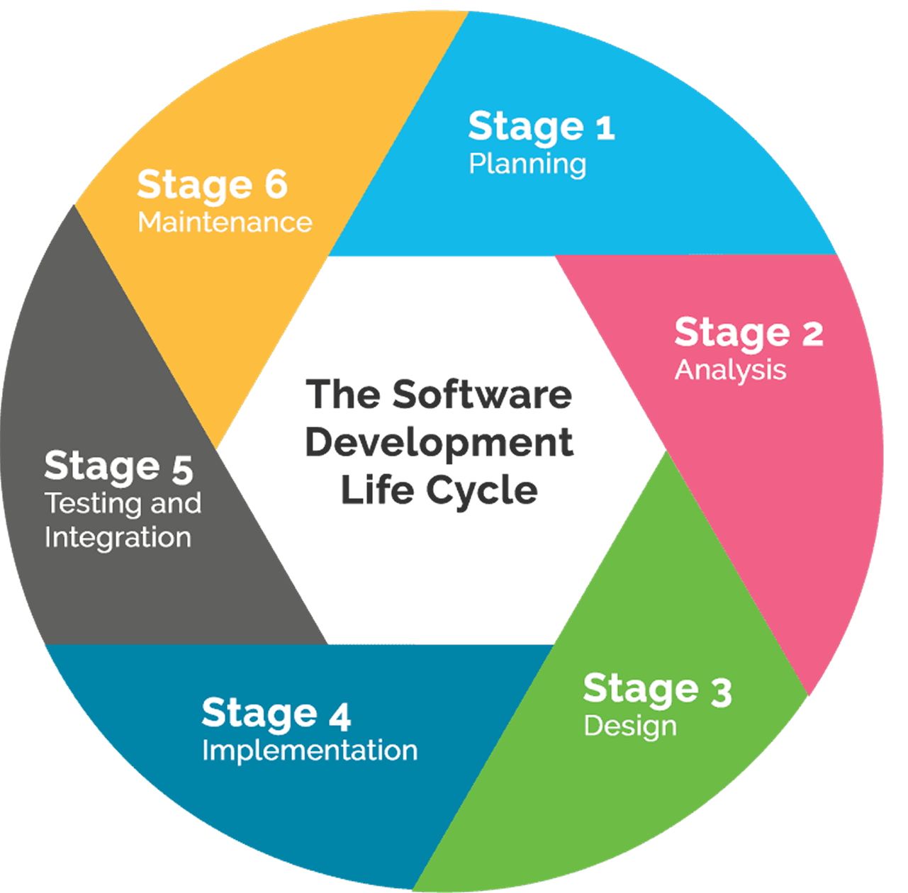

import Tooltip from "@site/src/components/Tooltip";

# معرفی گرایش نرم‌افزار

گرایش نرم‌افزار در رشته‌ٔ مهندسی کامپیوتر احتمالاً یکی از آن گرایش‌هایی‌ است که زیاد اسمش را شنیده‌اید. در گذشته‌های نه‌چندان دور -که هنوز گرایش‌ها از مقطع کارشناسی حذف نشده‌ بودند- اکثر افرادی که رتبهٔ زیر ۱۰۰ کنکور داشتند، انتخاب اول‌شان نرم‌افزار شریف بود. به‌طور خلاصه، گرایش نرم‌افزار شامل مهارت‌هایی مانند تحلیل و طراحی سیستم‌های نرم‌افزاری، بینش الگوریتمی برای حل مسائل مختلف، آشنایی با فرایندهای مختلف توسعهٔ نرم‌افزار و مهارت‌های برنامه‌نویسی می‌شود.

## حوزه‌های مختلف نرم‌افزار

گرایش نرم‌افزار شامل سه زیرگرایش است:
- الگوریتم‌ها و محاسبات
- سیستم‌های نرم‌افزاری
- مهندسی نرم‌افزار

### زیرگرایش الگوریتم و محاسبات شامل دروس زیر است:
- ساختمان‌های گسسته
- ساختمان داده و الگوریتم
- طراحی الگوریتم‌ها
- نظریهٔ زبان‌ها و ماشین‌ها
- نظریهٔ بازی‌ها

### زیرگرایش سیستم‌های نرم‌افزاری شامل دروس زیر است:
- سیستم‌های عامل
- طراحی کامپایلرها
- طراحی زبان‌های برنامه‌سازی
- شبیه‌سازی کامپیوتری
- برنامه‌سازی وب
- برنامه‌سازی موبایل

### زیرگرایش مهندسی نرم‌افزار نیز شامل دروسزیر  است:
- طراحی پایگاه داده‌ها
- تحلیل و طراحی سیستم‌ها
- مهندسی نرم‌افزار
- طراحی شیء‌گرای سیستم‌ها
- ایجاد چابک نرم‌افزار
- آزمون نرم‌افزار

## توانمندی‌ها و مهارت‌ها

بعد از طی کردن مسیر گرایش نرم‌افزار، شما می‌توانید معماری و ساختار یک نرم‌افزار را به‌خوبی طراحی و تحلیل کنید. همچنین در مسیر توسعه به مواردی نظیر چرخهٔ عمر و چرخهٔ توسعهٔ برنامه، توجه ویژه‌ای دارید. چرا که در درس‌های مربوط به شاخهٔ نرم‌افزار، شما در مورد متدولوژی‌های مختلف ایجاد و توسعهٔ نرم‌افزار مطالعه خواهید کرد. علاوه‌بر موارد بالا، آزمون و تضمین کیفیت نرم‌افزار هم دارای اهمیت بسیاری است، چرا که باید در هر مرحله از توسعهٔ یک نرم‌افزار، آن را آزمود و از ایرادات ناشی از تغییرات جدید آن آگاه شد.

## بازار کار و آیندهٔ شغلی

نرم‌افزار یکی از بازارهای پرسود و رو به رشد فناوری در ایران و جهان است. تقاضا برای مهندسین نرم‌افزار به‌دلیل نیاز روزافزون صنایع و کسب‌و‌کارها به سیستم‌ها و اپلیکیشن‌های مختلف، همواره رو به رشد است و روز به روز بیشتر می‌شود. از مزایای شغل برنامه‌نویسی در ایران و جهان، امکان دورکاری، درآمد بالا و امنیت شغلی زیاد است    -البته که با رشد هوش مصنوعی در سال‌های اخیر، این مورد کمی مورد بحث است.- در این حوزه، زمان لازم برای ورود به بازار کار هم بسیار کم است، به‌طور متوسط ۶۳ درصد از دانشجویانی که همزمان با تحصیل در بازار کار هم فعال بوده‌اند، از پایان سال دوم تحصیلی وارد بازار کار شده‌اند و این آمار برای سال سوم، به عدد ۸۴ درصد افزایش می‌یابد! اگر به این آمار در باقی رشته‌های مهندسی و غیرمهندسی دقت کنید، متوجه اختلاف زیاد آن‌ها با رشتهٔ مهندسی کامپیوتر می‌شوید.

## پژوهش در نرم‌افزار

پژوهش‌های حول نرم‌افزار در دانشکده بیشتر روی موضوعاتی نظیر تحلیل و بهینه‌سازی نرم‌افزار،  تضمین کیفیت و تست نرم‌افزار، سیستم‌های توزیع‌شده، محاسبات ابری و مهندسی نرم‌افزار مبتنی بر هوش مصنوعی متمرکز است. در آزمایشگاه‌های اساتید دانشکده، بر روی این موضوعات کار می‌شود و سالانه مقاله‌های متعددی حول این موضوعات منتشر می‌شوند. در سطح جهانی ‌‌‌‌‌‌‌‌‌‌‌‌‌‌‌‌‌‌‌نیز بر حوزه‌های نوینی مانند یادگیری    ‌‌‌‌‌‌‌‌‌‌‌‌‌‌‌‌‌‌‌‌‌‌‌‌‌‌‌‌‌‌‌‌‌‌‌‌‌‌‌‌‌‌‌‌‌‌‌‌‌‌‌‌‌‌‌‌‌‌‌‌‌‌‌‌‌‌‌‌ماشین برای خودکارسازی توسعه نرم‌افزار، ‌‌‌‌‌‌‌‌‌‌‌‌‌‌‌‌‌‌‌‌‌‌‌‌‌‌‌‌‌‌‌‌‌‌‌‌‌‌‌‌‌‌‌‌‌‌‌‌‌‌‌‌‌‌‌‌‌‌‌‌‌‌‌‌‌‌‌‌‌‌‌‌‌‌‌‌‌‌‌‌‌‌‌‌‌‌‌‌‌‌‌‌‌‌‌‌‌‌‌مهندسی نرم‌افزار مبتنی بر داده و... کار ‌‌‌‌‌‌‌‌‌‌‌‌‌‌‌‌‌‌‌‌‌‌‌‌‌‌‌‌‌‌‌‌‌‌‌‌‌‌‌‌‌‌‌‌‌‌‌‌‌‌‌‌‌‌‌‌‌‌‌‌‌‌‌‌‌‌‌‌‌‌‌‌‌‌‌‌‌‌‌‌‌‌‌‌‌‌‌‌‌‌‌‌‌‌‌‌‌‌‌‌‌‌‌‌‌‌‌‌‌‌‌‌‌‌‌‌‌‌‌‌‌می‌شود. در دانشکده، دانشجویان حتی ‌‌‌‌‌‌‌‌‌‌‌‌‌‌‌‌‌‌‌‌‌‌‌‌‌‌‌‌‌‌‌‌‌‌‌‌‌‌‌‌‌‌‌‌‌‌‌‌‌‌‌‌‌‌‌‌‌‌‌‌‌‌‌‌‌‌‌‌‌‌‌‌‌‌‌‌‌‌‌‌‌‌‌‌‌‌‌‌‌‌‌‌‌‌‌‌‌‌‌‌‌‌‌‌‌‌‌‌‌‌‌‌‌‌‌‌‌‌‌‌‌‌‌‌‌از مقطع کارشناسی فرصت ‌‌‌‌‌‌‌‌‌‌‌‌‌‌‌‌‌‌‌‌‌‌‌‌‌‌‌‌‌‌‌‌‌‌‌‌‌‌‌‌‌‌‌‌‌‌‌‌‌‌‌‌‌‌‌‌‌‌‌‌‌‌‌‌‌‌‌‌‌‌‌‌‌‌‌‌‌‌‌‌‌‌‌‌‌‌‌‌‌‌‌‌‌‌‌‌‌‌‌‌‌‌‌‌‌‌‌‌‌‌‌‌‌‌‌‌‌‌‌‌‌‌‌‌‌‌‌‌مشارکت در پروژه‌های پژوهشی را  ‌‌‌‌‌‌‌‌‌‌‌‌‌‌‌‌‌‌‌‌‌‌‌‌‌‌‌‌‌‌‌‌‌‌‌‌‌‌‌‌‌‌‌‌‌‌‌‌‌‌‌‌‌‌‌‌‌‌‌‌‌‌‌‌‌‌‌‌‌‌‌‌‌‌‌‌‌‌‌‌‌‌‌‌‌‌‌‌‌‌‌‌‌‌‌‌‌‌‌‌‌‌‌‌‌‌‌‌‌‌‌‌‌‌‌‌دارند. پژوهش‌های این حوزه در کنار ‌‌‌‌‌‌‌‌‌‌‌‌‌‌‌‌‌‌‌‌‌‌‌‌‌‌‌‌‌‌‌‌‌‌‌‌‌‌‌‌‌‌‌‌‌‌‌‌‌‌‌‌‌‌‌‌‌‌‌‌‌‌‌‌‌‌‌‌‌‌‌‌‌‌‌‌‌‌‌‌‌‌‌‌‌‌‌‌‌‌‌‌‌‌‌‌‌‌‌جنبه‌های تئوری، به‌شدت کاربردی‌اند؛ ‌‌‌‌‌‌‌‌‌‌‌‌‌‌‌‌‌‌‌‌‌‌‌‌‌‌‌‌‌‌‌‌‌‌‌‌‌‌‌‌‌‌‌‌‌‌‌‌‌‌‌‌‌‌‌‌‌‌‌‌‌‌‌‌‌‌‌‌‌نتایج آن‌ها در طراحی ابزارهای تست خودکار، بهینه‌سازی عملکرد سیستم‌هایی با مقیاس بزرگ و حتی توسعهٔ پلتفرم‌های نرم‌افزاری صنعتی به‌کار می‌روند. در مجموع پژوهش در مهندسی نرم‌افزار، ترکیبی ازخلاقیت، منطق و نوآوری است. دانشجویانی که به تحقیق در این حوزه علاقه دارند، می‌توانند نقش مهمی در آیندهٔ فناوری و کیفیت نرم‌افزارها ایفا کنند.

## معرفی اساتید دانشکده
در دانشکده گروهی از اساتید برجسته در حوزهٔ مهندسی نرم‌افزار فعالیت دارند که مسئولیت تدریس و هدایت پژوهش‌های این گرایش را بر عهده گرفته‌اند. از جملهٔ این اساتید می‌توان به دکتر رامان رامسین در حوزهٔ متدولوژی و
<Tooltip tip="Model-Driven Design">طراحی مدل‌رانه</Tooltip>،
 دکتر جعفر حبیبی در حوزهٔ مهندسی و معماری نرم‌افزار، دکتر عباس حیدرنوری در حوزهٔ هوش‌‌مصنوعی در مهندسی نرم‌افزار، دکتر سید محسن میریان در حوزهٔ تست و فرمال، دکتر محمد ایزدی در حوزهٔ الگوریتم و نظریهٔ بازی‌ها، دکتر محمدامین فضلی در حوزهٔ نظریه‌ بازی‌ها و داده‌کاوی، دکتر حمید ضرابی‌زاده در حوزهٔ الگوریتم و دکتر محمدعلی آبام در حوزهٔ الگوریتم اشاره کرد. این مجموعه از اساتید با تجربهٔ علمی و آموزشی گسترده، هستهٔ اصلی گروه نرم‌افزار دانشکده را تشکیل می‌دهند و نقش مهمی در آموزش و تربیت دانشجویان این حوزه دارند.

## نقش مهندسی نرم‌افزار در راه‌اندازی استارتاپ‌ها

مهندسی نرم‌افزار ستون فقرات فنی هر استارتاپ فناوری‌محور است. تقریباً تمام استارتاپ‌های موفق بر پایهٔ اصول و مهارت‌هایی بنا شده‌اند که در گرایش مهندسی نرم‌افزار آموزش داده می‌شوند. درس‌هایی مانند تحلیل و طراحی سیستم‌ها، مهندسی نرم‌افزار، ایجاد چابک نرم‌افزار، طراحی شیء‌گرای سیستم‌ها، برنامه‌نویسی وب، پایگاه داده و تست نرم‌افزار دارای مباحث و ابزارهایی حیاتی برای تبدیل یک ایدهٔ خام به محصولی واقعی و مقیاس‌پذیر هستند. یک بنیان‌گذار یا عضو فنی در استارتاپ باید بتواند نیاز کاربران را تحلیل کند، ساختار مناسب برای سیستم طراحی کند، نسخه‌های اولیه را سریع توسعه دهد و بر اساس بازخورد، آن را بهبود دهد. همهٔ این‌ها مهارت‌هایی‌ هستند کهاز دروس مربوط به مهندسی نرم‌افزار به‌دست می‌آیند. علاوه‌بر این، آشنایی با مفاهیمی مثل توسعهٔ چابک و مدیریت تیم نرم‌افزاری باعث می‌شوند تیم‌های استارتاپی بتوانند کار خود را  به‌صورت منظم، قابل‌اعتماد و سریع پیش ببرند. به همین دلیل دانشجویانی که در گرایش نرم‌افزار تحصیل می‌کنند، نه‌تنها مهارت‌های فنی لازم برای ساخت محصولات را یاد می‌گیرند، بلکه دید مهندسی لازم برای رشد یک کسب‌وکار را نیز در خود پرورش می‌دهند.

## دروس نرم‌افزاری در کارشناسی مهندسی کامپیوتر شریف

حال که با کلیت گرایش نرم‌افزار آشنا شدید، وقت این است که کمی چارت دروس مربوط به نرم‌افزار را بررسی کنیم. دروس اصلی مربوط به گرایش نرم‌افزار در چارت رشتهٔ ما کم نیستند، اما به زیادی گرایشی مثل سخت‌افزار هم نیستند! اگر به این گرایش علاقه دارید و قصد ادامه دادن آن را دارید، بهتر است تا دروس تخصصی و اختیاری مرتبط را زودتر اخذ و پاس کنید. در ترم اول تحصیلی، دروس مبانی‌ برنامه‌سازی و کارگاه کامپیوتر به نوعی مرتبط با گرایش نرم‌افزار هستند. چرا که مهارت‌های پایه‌ای و اصلی مربوط به این رشته را به شما می‌آموزند. توصیه می‌شود که تمامی مباحث این دو درس را به خوبی فرابگیرید و بر آن‌ها مسلط شوید، چرا که تا آخر عمر قرار است با آن‌ها درگیر باشید و در تمامی کارهایتان به آن‌ها احتیاج دارید. در ترم دوم باید درس ساختارهای گسسته و برنامه‌سازی پیشرفته را پاس کنید. درس ساختارهای گسسته عملاً ادامهٔ درس ریاضیات گسسته در دبیرستان است و شامل مباحث بنیادین و مهمی در علم گسسته هست؛ بعضی از مباحث این درس، در دروس ترم‌های بعد نیز کاربرد دارند، پس آن را جدی بگیرید. درس برنامه‌سازی پیشرفته یا به اختصار
<Tooltip tip="Advanced Programming">AP</Tooltip>
یکی از سنگین‌ترین و در عین حال مهم‌ترین دروس رشتهٔ مهندسی کامپیوتر است. در این درس شما علاوه‌بر مهارت‌های تخصصی برنامه‌نویسی، برای اولین بار در دروس دانشکده کار تیمی را تجربه خواهید کرد! در پروژه‌های کامپیوتری کار تیمی بسیارمهم است، چرا که تقریباً تمامی پروژه‌ها و استارتاپ‌ها حاصل همکاری چند توسعه‌دهنده هستند و اگر این مهارت‌ را در خود تقویت نکنید، در آینده به مشکل می‌خورید. سعی کنید در ترم‌های اول دوست‌های خوب، پرتلاش و مطمئنی پیدا کنید تا در پروژه‌های درسی و حتی آیندهٔ کاری بتوانید با خیال راحت و هماهنگی کامل کارها را پیش ببرید. در ترم سوم باید درس ساختمان داده و الگوریتم یا
<Tooltip tip="Data Structures and Algorithms">DS</Tooltip>
را پاس کنید. در این درس به‌صورت رسمی وارد دنیای الگوریتم و داده‌ساختارها می‌شوید و مفاهیم پایه‌ای و بنیادین آن‌ها را می‌آموزید. این درس ذهن شما را برای تفکر منطقی، تحلیل و حل مسئله آماده می‌کند و مهارت بسیار مهمی را در شما پرورش می‌دهد. دو درس مبانی برنامه‌سازی و ساختمان داده در کنار هم توانایی حل مسئله و تفکر تحلیلی را در شما تقویت می‌کنند. ترم چهارم درسی مستقیماً مرتبط با گرایش نرم‌افزار ندارد، اما اگر به این گرایش علاقه‌مند هستید، می‌توانید درس طراحی پایگاه داده‌ها که مربوط به همین ترم است را زودتر اخذ کنید. این درس شما را برای طراحی، مدیریت و کار با پایگاه‌های داده آماده می‌کند و از مهم‌ترین و پرکاربردترین دروس مهندسی کامپیوتر است، چرا که تقریباً هیچ نرم‌افزاری بدون پایگاه داده معنا ندارد. آخرین درس اصلی مربوط به گرایش نرم‌افزار، تحلیل و طراحی سیستم‌هاست. این درس از مهم‌ترین و کاربردی‌ترین دروس تخصصی این گرایش به‌شمار می‌آید. در آن یاد می‌گیرید چگونه نیازهای یک سیستم نرم‌افزاری را شناسایی و تحلیل کنید، اجزای آن را مدل‌سازی کرده و برای طراحی و پیاده‌سازی آن برنامه‌ریزی کنید. مفاهیمی مانند نیازسنجی، مدل‌سازی، دیاگرام‌های
<Tooltip tip="Unified Modeling Language">UML</Tooltip>
و نمودار جریان داده (<Tooltip tip="Data-Flow Diagram">DFD</Tooltip>) در این درس آموزش داده می‌شوند و در قالب مثال‌ها و پروژه‌های واقعی کاربردشان را تجربه می‌کنید. هدف این درس آن است که قبل از نوشتن هر خط کد، دیدی روشن و مهندسی نسبت به کل سیستم و نحوهٔ عملکرد اجزای آن داشته باشید. اگر در آینده قصد فعالیت در حوزه‌هایی مانند مدیریت پروژه‌های نرم‌افزاری، طراحی سیستم‌ها، تحلیل کسب‌وکار یا راه‌اندازی استارتاپ دارید، حتماً این درس را جدی بگیرید، زیرا مهارت‌هایی که در این درس یاد می‌گیرید پایهٔ اصلی مسیر حرفه‌ای شما خواهند بود.
