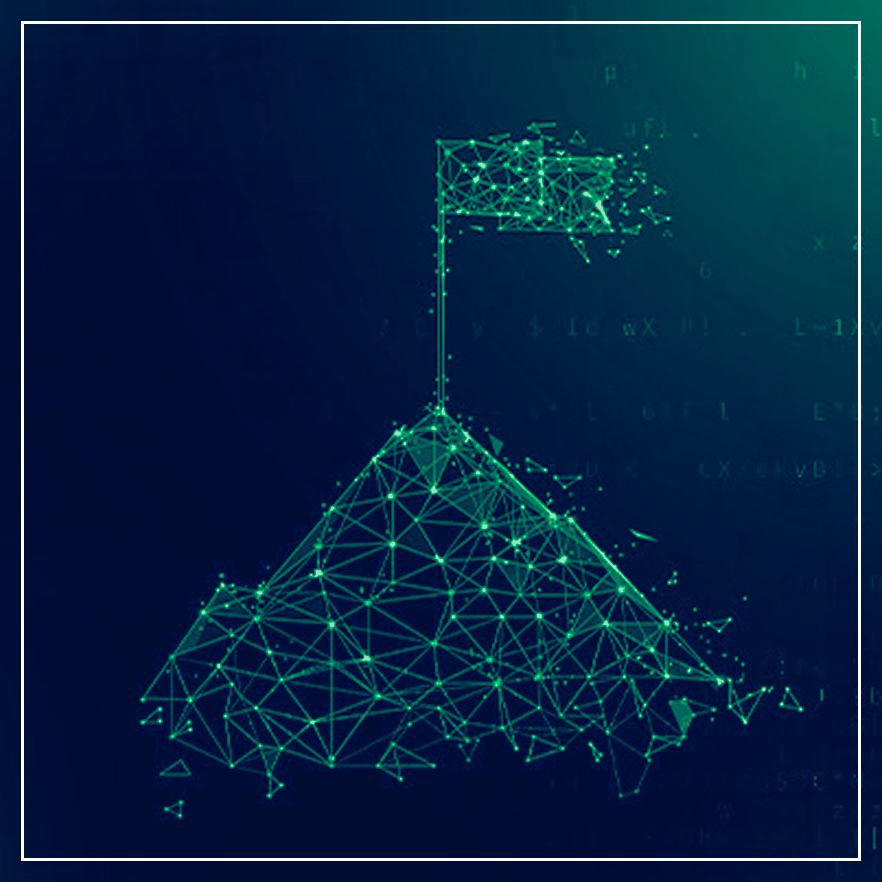
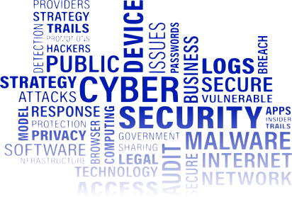

import Tooltip from "@site/src/components/Tooltip";

امنیت سایبری از آن حوزه‌هایی است که تقریباً همهٔ افراد نام آن را چه در فیلم‌های هالیوودی و چه در اخبار مربوط به هک و حملات سایبری شنیده‌اند. اما واقعیت این است که پشت صحنه‌ٔ دنیای امنیت سایبری، خیلی جدی‌تر و پیچیده‌تر از چیزی است که در فیلم‌ها می‌بینیم. کسی که می‌خواهد در این مسیر قدم بگذارد، باید شناخت عمیقی از سیستم‌های کامپیوتری، شبکه‌ها، نرم‌افزارها و حتی سخت‌افزارها داشته باشد. امنیت سایبری به هک کردن محدود نمی‌شود؛ بلکه هدف اصلی آن محافظت از اطلاعات و سیستم‌های حیاتی است. خلاقیت و صبر از ارکان اصلی امنیت سایبری هستند، یک هکر دانش و ابزارهای ناشناخته‌ای ندارد، بلکه می‌تواند از ابزارهای خود به‌نحوی استفاده کند که بقیه افراد نمی‌توانند به آن شکل از ابزارها و دانش خود استفاده کنند. همچنین هکرها صبر زیادی دارند، همان‌طور که عکاس‌ها که برای خلق یک صحنه ماه‌ها و سال‌ها تلاش می‌کنند، هکرها نیز برای انجام فعالیت‌های خود ممکن است ماه‌ها و سال‌ها منتظر بمانند.

## حوزه‌های مختلف امنیت سایبری

در راستای مطالعه و بررسی دقیق‌تر، به شکل‌های مختلفی می‌توان امنیت سایبری را دسته‌بندی کرد؛ در ادامه، دسته‌بندی بر اساس حوزه‌های اصلی امنیت سایبری آورده شده است:

- **امنیت شبکه:** جلوگیری از دسترسی غیرمجاز و محافظت از ارتباطات.
- **رمزنگاری و امنیت اطلاعات:** حفاظت
  از داده‌ها با الگوریتم‌های
  رمزنگاری و پروتکل‌های امن.
- **امنیت وب و برنامه‌ها:**
  پیدا کردن و رفع
  نقص‌های امنیتی در
  اپلیکیشن‌های وب.
- **امنیت فضای ابری:** حفاظت از داده‌های موجود در سرویس‌های ابری.
- **امنیت سیستم‌عامل و <Tooltip tip="Firmware">ثابت‌افزار</Tooltip>:** محافظت از سیستم‌عامل و لایه‌های پایین‌تر مانند ثابت‌افزار.
- **امنیت مدل‌های هوش‌مصنوعی:** محافظت از مدل‌های هوش‌مصنوعی در مقابل تهدیدات موجود.

## آخرین پژوهش‌ها

یکی از موضوعات داغ پژوهش‌های سال‌های اخیر، استفاده از هوش مصنوعی برای تشخیص خودکار آسیب‌پذیری‌هاست. مدل‌های یادگیری ماشین می‌توانند کد منبع و یا ترافیک شبکه را بررسی کنند و الگوهای مشکوک را زودتر از انسان‌ها شناسایی کنند. این کار سرعت و دقت بالایی دارد، اما خودش هم چالش‌های جالبی دارد؛ برای مثال خود مدل‌ها ممکن است در برابر حملات فریب‌پذیر باشند.

یکی دیگر از موضوعات جالب مورد بررسی در امنیت سایبری، حمله‌های <Tooltip tip="Covert Channel">کانال پنهان</Tooltip> است. در این حملات، مهاجم سعی می‌کند تا بدون استفاده از روش‌های معمول انتقال اطلاعات مانند اینترنت، حافظۀ جانبی و… اطلاعات را به سیستم‌های دیگر منتقل کند. برای مثال، در یکی از پژوهش‌ها، محقق موفق شده است که با کد کردن 0 و 1 در قالب کاهش و افزایش جریان برق، اطلاعات را به خارج از سیستم کامپیوتر انتقال دهد. چنین حملاتی معمولاً به‌منظور استخراج اطلاعات طبقه‌بندی‌شده در محیط‌های بسیار حفاظت‌شده که دسترسی به اینترنت و حافظه‌های جانبی وجود ندارد، رخ می‌دهند.

  

 

## مسابقات <Tooltip tip="Capture The Flag (CTF)">فتح پرچم</Tooltip>، تجربه‌ٔ واقعی دنیای امنیت

یکی از بهترین راه‌های ورود عملی به دنیای امنیت، شرکت در مسابقات فتح پرچم است. در این مسابقه‌ها، شرکت‌کنندگان در قالب تیم‌های چندنفره روی چالش‌هایی در دسته‌های مختلف مانند وب، رمزنگاری، مهندسی معکوس و… کار می‌کنند. هر چالش به‌گونه‌ای طراحی شده‌است که در صورت حل درست، نظیر نفوذ به سیستم، شکستن رمز و … یک عبارت پنهان به‌دست می‌آید که با وارد کردن آن عبارت در سامانهٔ مسابقه، تیم‌ها امتیاز کسب می‌کنند. بعضی، این مسابقه‌ها را مثل یک سرگرمی می‌بینند و برای برخی دیگر نیز این مسابقات دروازهٔ ورود جدی به دنیای امنیت بوده‌است. بسیاری از مسابقات فتح پرچم در سطح بین‌المللی برگزار می‌شوند که می‌توانید با شرکت در آن‌ها، هم تجربهٔ رقابت با افراد خارجی داشته باشید و هم رزومهٔ حرفه‌ای خود را قوی‌تر کنید. لازم به ‌‌‌‌‌‌‌‌‌‌‌‌‌‌‌‌‌‌‌‌‌‌‌‌‌‌‌‌‌‌‌‌‌‌‌‌‌‌‌‌‌‌‌‌‌‌‌‌‌‌‌‌‌‌‌‌‌‌‌‌‌‌‌‌‌‌‌‌‌‌‌‌‌‌‌‌‌‌‌‌‌‌‌‌‌‌‌‌‌‌‌‌‌‌‌‌‌‌‌‌‌‌‌‌‌‌‌‌‌‌‌‌‌‌‌‌‌‌‌‌‌‌‌‌‌‌‌‌‌‌‌‌‌‌‌‌‌‌‌‌‌‌‌‌‌‌‌‌‌‌‌‌‌‌‌‌‌‌‌‌‌‌‌‌‌‌‌‌‌‌‌‌‌‌‌‌‌‌‌‌‌‌‌‌‌‌‌‌‌‌‌‌‌‌‌‌‌‌‌‌‌‌‌‌‌‌‌‌‌‌‌‌‌‌‌‌‌‌‌‌‌‌‌‌‌‌‌‌‌‌‌‌‌‌‌‌‌‌‌‌‌‌‌‌‌‌‌‌‌‌‌‌‌‌‌‌‌‌‌‌‌‌‌‌‌‌‌‌‌‌‌‌‌‌‌‌‌‌‌‌‌‌‌‌‌‌‌‌‌‌‌‌‌‌‌‌‌‌‌‌‌‌‌‌‌‌‌‌‌‌‌‌‌‌‌‌‌‌‌‌‌‌‌‌‌‌‌‌‌‌‌‌‌‌‌‌‌‌‌‌‌‌‌‌‌‌‌‌‌‌‌‌‌‌‌‌‌ذکر است که بیشتر این‌ها به‌صورت ‌‌‌‌‌‌‌‌‌‌‌‌‌‌‌‌‌‌‌‌‌‌‌‌‌‌‌‌‌‌‌‌‌‌‌‌‌‌‌‌‌‌‌‌‌‌‌‌‌‌‌‌‌‌‌‌‌‌‌‌‌‌‌‌‌‌‌‌‌‌‌‌‌‌‌‌‌‌‌‌‌‌‌‌‌‌‌‌‌‌‌‌‌‌‌‌‌‌‌‌‌‌‌‌‌‌‌‌‌‌‌‌‌‌‌‌‌‌‌‌‌‌‌‌‌‌‌‌‌‌‌‌‌‌‌‌‌‌‌‌‌‌‌‌‌‌‌‌‌‌‌‌‌‌‌‌‌‌‌‌‌‌‌‌‌‌‌‌‌‌‌‌‌‌‌‌‌‌‌‌‌‌‌‌‌‌‌‌‌‌‌‌‌‌‌‌‌‌‌‌‌‌‌‌‌‌‌‌‌‌‌‌‌‌‌‌‌‌‌‌‌‌‌‌‌‌‌‌‌‌‌‌‌‌‌‌‌‌‌‌‌‌‌‌‌‌‌‌‌‌‌‌‌‌‌‌‌‌‌‌‌‌‌‌‌‌‌‌‌‌‌‌‌‌‌‌‌‌‌‌‌‌‌‌‌‌‌‌‌‌‌‌‌‌‌‌‌‌‌‌‌‌‌‌‌‌‌‌‌‌‌‌‌‌‌‌‌‌‌‌‌‌‌‌‌‌‌‌‌‌‌‌‌‌‌‌‌‌‌‌‌‌‌‌‌‌‌‌‌‌‌‌‌‌‌‌‌‌‌‌‌‌‌‌‌‌‌‌‌‌‌‌‌‌‌‌‌‌‌‌‌‌‌‌‌‌‌‌‌‌‌‌‌‌‌‌‌‌‌‌‌‌‌‌‌‌‌‌‌‌‌‌‌‌‌‌‌‌‌‌‌‌‌‌‌‌‌‌‌‌‌‌‌‌‌‌‌‌‌‌‌‌‌‌‌‌‌‌‌‌‌‌‌‌‌‌‌‌‌‌‌‌‌‌‌‌‌‌‌‌‌‌‌‌‌‌‌‌مسابقه آنلاین و رایگان برگزار ‌‌‌‌‌‌‌‌‌‌‌‌‌‌‌‌‌‌‌‌‌‌‌‌‌‌‌‌‌‌‌‌‌‌‌‌‌‌‌‌‌‌‌‌‌‌‌‌‌‌‌‌‌‌‌‌‌‌‌‌‌‌‌‌‌‌‌‌‌‌‌‌‌‌‌‌‌‌‌‌‌‌‌‌‌‌‌‌‌‌‌‌‌‌‌‌‌‌‌‌‌‌‌‌‌‌‌‌‌‌‌‌‌‌‌‌‌‌‌‌‌‌‌‌‌‌‌‌‌‌‌‌‌‌‌‌‌‌‌‌‌‌‌‌‌‌‌‌‌‌‌‌‌‌‌‌‌‌‌‌‌‌‌‌‌‌‌‌‌‌‌‌‌‌‌‌‌‌‌‌‌‌‌‌‌‌‌‌‌‌‌‌‌‌‌‌‌‌‌‌‌‌‌‌‌‌‌‌‌‌‌‌‌‌‌‌‌‌‌‌‌‌‌‌‌‌‌‌‌‌‌‌‌‌‌‌‌‌‌‌‌‌‌‌‌‌‌‌‌‌‌‌‌‌‌‌‌‌‌‌‌‌‌‌‌‌‌‌‌‌‌‌‌‌‌‌‌‌‌‌‌‌‌‌‌‌‌‌‌‌‌‌‌‌‌‌‌‌‌‌‌‌‌‌‌‌‌‌‌‌‌‌‌‌‌‌‌‌‌‌‌‌‌‌‌‌‌‌‌‌‌‌‌‌‌‌‌‌‌‌‌‌‌‌‌‌‌‌‌‌‌‌‌‌‌‌‌‌‌‌‌‌‌‌‌‌‌‌‌‌‌‌‌‌‌‌‌‌‌‌‌‌‌‌‌‌‌‌‌‌‌‌‌‌‌‌‌‌‌‌‌‌‌‌‌‌‌‌‌‌‌‌‌‌‌‌‌‌‌‌‌‌‌‌‌‌‌‌‌‌‌‌‌‌‌‌‌‌‌‌‌‌‌‌‌‌‌‌‌‌‌‌‌‌‌‌‌‌‌‌‌‌‌‌‌‌‌‌‌‌‌‌‌‌‌‌‌‌‌‌‌‌‌‌‌‌‌‌‌‌‌‌‌‌‌‌‌‌‌‌‌‌‌‌‌‌‌‌‌‌‌‌‌‌‌‌‌‌‌‌‌‌‌‌‌‌‌‌‌‌‌‌‌‌‌‌‌‌‌‌‌‌‌‌‌می‌شوند و هیچ پیچیدگی خاصی
برای شرکت در آن‌ وجود ندارد.

  

 

برای کسب آمادگی جهت شرکت در مسابقات فتح پرچم می‌توانید از منابع زیر استفاده کنید:

- [cryptohack.org](https://cryptohack.org/):
  از این منبع می‌توانید جهت آموزش و تمرین رمزنگاری و حمله‌های مرتبط با آن استفاده کنید.
- [pwn.college](https://pwn.college/):
  از منبع فوق می‌توانید برای آموزش برنامه‌نویسی سطح پایین و اکسپلویت‌نویسی (Exploit Developing) استفاده کنید.
- [pwnable.kr](https://pwnable.kr/):
  از این منبع می‌توانید برای تمرین مباحث هک فایل‌های باینری استفاده کنید.
- [crackmes.one](https://crackmes.one/):
  در این سایت می‌توانید چالش‌های مربوط به مهندسی معکوس را دریافت کنید و با آن‌ها تمرین کنید. همچنین در این سامانه قابلیت انتخاب سطح سختی و سیستم‌عامل هدف (برای مهندسی معکوس) وجود دارد.
- [hacker101.com](https://www.hacker101.com/) و [portswigger.net](https://portswigger.net/):
  در سامانه‌های فوق نیز می‌توانید با آسیب‌پذیری‌ها و حمله‌های وب آشنا شوید.
- [ctftime.org](https://ctftime.org/):
  در این سایت می‌توانید لیست زمان‌بندی مسابقات فتح پرچم بین‌المللی را مشاهده کنید.

## امنیت سایبری در دانشکده‌ٔ کامپیوتر

در مقطع کارشناسی، درس اصلی مرتبط با این حوزه، امنیت داده و شبکه است. در این درس، با مفاهیمی مثل امنیت داده‌ها، امنیت وب و روش‌های مختلف حفاظت از سیستم‌ها آشنا می‌شوید. همچنین در این درس می‌توانید به صورت عملی به فایل‌های اجرایی و یا صفحات وب حمله کنید و تجربه‌ای مشابه هکرهای واقعی کسب کنید. علاوه‌بر آن، گذراندن درس‌هـای شـبکه‌های کامپیوتری، سیستم‌عامل، ساختار و زبان کامپیوتر و حتی مباحثی مانند یادگیری مــاشین می‌تواند مسیر شما را در این حوزه خیلی هموارتر کند، زیرا همان‌طور که گفته شد هکرهای ماهر، جدا از مهارت‌های امنیت سایبری خود، درک عمیقی از ساختار سامانه‌ها و طرز عملکردشان دارند.

از اساتید فعال در این حوزه در دانشکدهٔ کامپیوتر، می‌توان به دکتر مرتضی امینی، دکتر مهدی خرازی، دکتر رسول جلیلی و دکتر امیرمهدی صادق‌زاده اشاره کرد.

در کنار فرصت‌های مختلف برای پژوهش و گذراندن درس‌های مرتبط با امنیت سایبری، رویدادهایی نیز در دانشکدهٔ کامپیوتر برگزار می‌شوند که شرکت کردن در آن‌ها خالی از لطف نیست.

یکی از این رویدادها، رویداد AsmMasters است. این رویداد که از دو فاز تشکیل شده‌است، با هدف آشنایی دانشجویان ترم سومی با مهندسی معکوس و برنامه‌نویسی اسمبلی برگزار می‌شود. در فاز اول دانشجویان با نوشتن برنامه‌هایی با زبان اسمبلی x86 و یا IBM به رقابت با یکدیگر می‌پردازند و در فاز دوم به مهندسی معکوس و کرک کردن فایل‌هایی که در اختیار آن‌ها قرار داده می‌شوند، مشغول می‌شوند. جرقهٔ شکل گرفتن این رویداد، مواجههٔ دبیر اولین دورهٔ آن با سایت [crackmes.one](https://crackmes.one/) بوده‌است.

دومین رویدادی که می‌توان آن را مرتبط با امنیت سایبری تلقی کرد، رویداد هاردوار است که تا کنون هفت دوره از آن برگزار شده‌است. تمرکز اصلی این رویداد بر مباحث معماری کامپیوتر است اما با شرکت کردن در آن، می‌توانید با بعضی از حمله‌های سخت‌افزاری آشنا شوید و یا به ساختن ابزارهای هکری خود یک قدم نزدیک‌تر شوید.

## فرصت‌های شغلی

فرصت‌های شغلی گوناگونی برای متخصصان حوزهٔ امنیت وجود دارد. در این‌جا به برخی از آن‌ها اشاره می‌کنیم.

- **تست نفوذ:** متخصصان تست نفوذ، به بررسی آسیب‌پذیری‌ها و نقاط ضعف موجود در سامانه‌ها می‌پردازند و برای مشکلات موجود راه‌حل ارائه می‌دهند.
- **تیم قرمز:** افراد در تیم قرمز، حملات نسبتاً واقعی را روی سازمان انجام می‌دهند تا آسیب‌پذیری آن‌ها در برابر نفوذ را محک بزنند. در حملات تیم قرمز برخلاف تست نفوذ، تمرکز تنها روی آسیب‌پذیری‌های فنی نیست و مهاجمین از هر روشی برای نفوذ به سازمان‌ها استفاده می‌کنند. برای مثال، متخصصان تیم قرمز در صورت لزوم از فیشینگ و گول زدن افراد درون سازمان برای انجام حملات خود استفاده می‌کنند.
- **تیم آبی:** افراد در تیم آبی وظیفهٔ حفاظت سایبری از سازمان را دارند و در صورت بروز حملات، می‌بایست نسبت به حمله واکنش نشان دهند.
- **کارشناس مرکز عملیات امنیتی (<Tooltip tip="Security Operations Center">SOC</Tooltip>):** کارشناسی SOC وظیفهٔ نظارت دائمی بر رویدادهای امنیتی (مانند ترافیک شبکه، دستورات اجراشده در سیستم‌ها و…) را دارد و در صورت بروز هشدار توسط سامانه‌های خودکار می‌بایست به تحلیل هشدار ایجادشده بپردازد.
- **<Tooltip tip="Forensics">جرم‌شناسی رایانه‌ای</Tooltip>:** یکی از مشکلات همیشگی دنیای امنیت سایبری، حمله‌هایی است که به‌صورت غیرمجاز انجام می‌شوند. در صورت بروز و تشخیص چنین حملاتی، متخصصان جرم‌شناسی رایانه‌ای، به تحلیل حمله و آسیب‌های آن می‌پردازند و با توجه به ردپاهای باقی‌مانده و شواهد موجود، مبدأ حمله را مشخص می‌کنند.

## جمع‌بندی

امنیت سایبری ترکیبی از جذابیت، چالش و کاربرد واقعی در دنیای امروز است. چه بخواهید پژوهشگر شوید، چه متخصص حرفه‌ای در بازار کار، این مسیر پر از فرصت‌های تازه است. توصیه می‌کنیم اگر به این حوزه علاقه دارید، علاوه‌بر درس‌های دانشگاهی، حتماً در مسابقات CTF شرکت کنید، پروژه‌های کوچک انجام دهید و با ابزارهای امنیتی کار کنید و در نهایت اگر به دنیای امنیت سایبری علاقه‌مند بودید، قدم در آن بگذارید.

  

