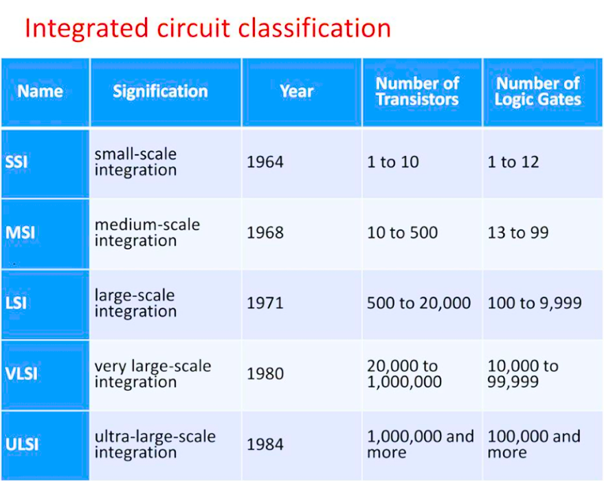
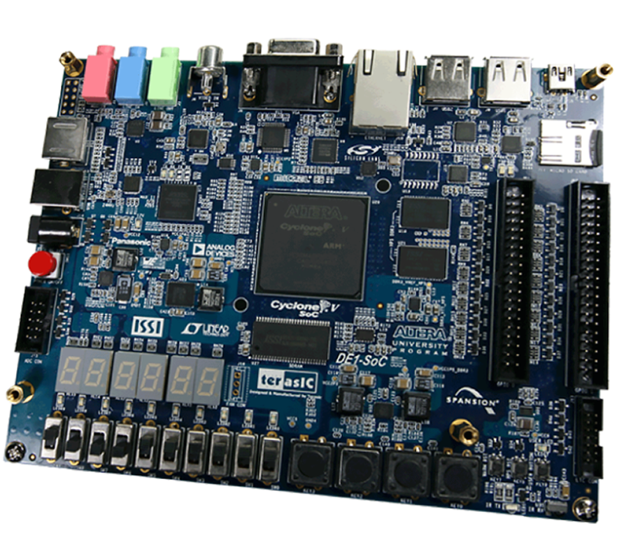
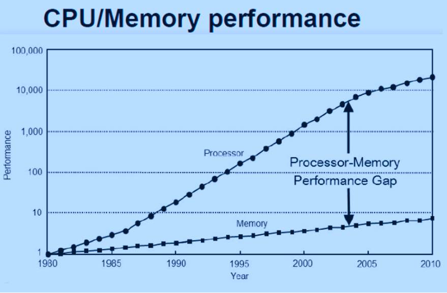

import Tooltip from "@site/src/components/Tooltip";

وقتی از رشتهٔ مهندسی کامپیوتر صحبت می‌کنیم، ذهن بسیاری به‌سرعت به سمت برنامه‌نویسی، نرم‌افزار و هوش مصنوعی -که امروزه تبدیل به یکی از مهم‌ترین ترند‌های جوامع علمی شده‌است- می‌رود. اما در پشت این صحنهٔ جذاب و پرفناوری، بسترهایی وجود دارند که امکان اجرا و توسعهٔ نرم‌افزار و هوش مصنوعی را برای مهندسان و توسعه‌دهندگان فراهم کرده‌اند. سخت‌افزار، همان بستری است که این امکان را برای برنامه‌نویسان فراهم کرده که کدهای خود را روی آن اجرا کنند. سخت‌افزار در حقیقت بُعد فیزیکی کامپیوتر است؛ از تراشه‌ها و ریز‌پردازنده‌ها گرفته تا حافظه و معماری داخلی پردازنده‌ها و سامانه‌های نهفته‌ای که در دل سامانه‌های هوشمند بزرگ پنهان شده‌اند.

در گذشته‌های نه چندان دور، رشتهٔ مهندسی کامپیوتر برای عوام به‌طور کلی به دو بخش نرم‌افزار و سخت‌افزار تقسیم می‌شد. هرگاه سخن از سخت‌افزار به میان می‌آمد، احتمالاً «سیم‌کشی، بردهای الکترونیکی، برق!» و امثال آن‌ها بیان می‌شدند.

در این متن قصد دارم به‌طور کلی، شما را با سخت‌افزار و گرایش‌ها و شاخه‌های پژوهشی آن در مهندسی کامپیوتر آشنا کنم.

## معرفی خوشه‌ها

در ابتدا باید یاد شود که سخت‌افزار، تنها همان سیم‌کشی و بردهای الکترونیکی نیست. از طراحی مدارها و سیستم‌های دیجیتال گرفته تا معماری کامپیوتر و پردازنده‌‌ها و اجزای درونی یک سامانهٔ کامپیوتری، شبکه‌های کامپیوتری و ارتباطات میان سامانه‌ها، طراحی سیستم‌های نهفته و بی‌درنگ و رباتیک، همه و همه بخش‌های سخت‌افزاری مربوط به خود را دارند.

## <Tooltip tip="Circuits and Digital System Design">طراحی مدارها و سیستم‌های دیجیتال</Tooltip>

یکی از پایه‌ای‌ترین و مهم‌ترین شاخه‌های سخت‌افزار، طراحی مدار‌ها و سیستم‌های دیجیتال است. در این حوزه، مهندسان تلاش می‌کنند که منطق ریاضی و الگوریتم‌های پردازشی را به زبان مدار‌ها و تراشه‌ها ترجمه و توصیف کنند.

## برنامه‌نویسی در سخت‌افزار؟ <Tooltip tip="Hardware Description Language">زبان توصیف سخت‌افزار</Tooltip>

مدارهای دیجیتال را بر اساس تعداد گیت‌های منطقی به‌کار‌رفته در آن‌ها، می‌توان به چند دستهٔ اصلی تقسیم کرد. این دسته‌بندی‌ که بیشتر در درس‌های طراحی سیستم‌های دیجیتال یا طراحی VLSI مطرح می‌شود، مدارها را به پنج دسته تقسیم می‌کند که در جدول زیر مشاهده می‌کنید.

  

 

همان‌طور که واضح است، طراحی یک مدار منطقی با صدهزار گیت، با قرار دادن گیت‌ها کنار هم به‌صورت دستی و طراحی گرافیکی مدار برای مغز و توانمندی انسان غیرممکن است! بنابراین باید روشی بهینه و کارا برای طراحی این‌گونه مدارها (که پردازنده‌های امروزی شامل آن هستند) باشد. زبان‌های توصیف سخت‌افزار، ابزارهایی هستند که در این شرایط به کمک ما می‌آیند. این زبان‌ها که برای توصیف و طراحی سخت‌افزارها ایجاد شده‌اند، به طراحان سخت‌افزار این قابلیت را می‌دهند که با استفاده از آن‌ها، مدار مورد نظر خود را توصیف کرده و ابزاری تحت عنوان ابزار سنتز، این کدها را تبدیل به مدار می‌کند!

  بله؛ کدها مدار می‌شوند!

زبان‌های HDL، برای «توصیف سخت‌افزار» به‌کار می‌رود؛ یعنی شما ساختار و همزمانی مدار را می‌نویسید. برخلاف برنامه‌نویسی به زبان‌های C یا Python که برنامۀ ترتیبی تولید می‌کنند، HDL مدارهایی می‌سازد که همزمان کار می‌کنند. از جمله زبان‌های رایج <Tooltip tip="Hardware Description">توصیف سخت‌افزار</Tooltip>، زبان‌های VHDL و Verilog هستند که در درس طراحی سیستم‌های دیجیتال بیشتر با آن‌ها آشنا خواهید شد.

## <Tooltip tip="FPGA">Filed Programmable Gate Array</Tooltip>

تراشۀ FPGA تراشه‌ای از‌پیش‌سیم‌کشی‌نشده است که طراح می‌تواند بعد از تولید، رفتار و ساختار داخلی‌اش را با <Tooltip tip="Netlist">فایل پیکربندی</Tooltip> تولید‌شده از سنتز کد توصیف سخت افزار، پیکربندی کند. بنابراین کد توصیف سخت‌افزار می‌تواند در FPGA ها، اتصالات بین گیت‌ها را به‌گونه‌ای تغییر دهد که توصیف انجام‌شده در کد را اجرا کند. در درس آزمایشگاه طراحی سیستم‌های دیجیتال بیشتر با این موضوع آشنا خواهید شد.

  

 

## <Tooltip tip="Computer Architecture">معماری کامپیوتر</Tooltip>

معماری کامپیوتر به ساختار و سازمان اجزای داخلی سیستم رایانه‌ای اشاره دارد؛ یعنی این‌که <Tooltip tip="CPU">پردازنده</Tooltip>، حافظه، ورودی/خروجی و <Tooltip tip="Bus">گذرگاه</Tooltip>ها چگونه طراحی شده و با هم در ارتباط هستند. در واقع، معماری کامپیوتر نقشۀ ذهنی و مهندسی‌شده‌ای است که مشخص می‌کند یک رایانه چگونه دستورها را پردازش کرده و داده‌ها را جابه‌جا کند. در ادامه به برخی از موضوعات محبوب برای پژوهش در زمینهٔ معماری کامپیوتر اشاره می‌کنم. (در یکی از شماره‌های قبلی بایت -شمارهٔ ۵- دربارهٔ یکی از موضوعات نوشته‌ام، توصیه می‌کنم که آن را مطالعه کنید.)

## معماری‌های <Tooltip tip="AI Accelerator">شتاب‌دهندۀ هوش مصنوعی</Tooltip>

شتاب‌دهنده‌های هوش مصنوعی، تراشه‌ها یا معماری‌های سخت‌افزاری خاصی هستند که برای اجرای بهینۀ الگوریتم‌های هوش مصنوعی طراحی می‌شوند. این تراشه‌ها معمولاً مبتنی بر موازی‌سازی وسیع و واحدهای محاسبهٔ ماتریس هستند. از جمله نمونه‌های آن‌ها می‌توان به

  - <Tooltip tip="GPU">Graphic Processing Unit</Tooltip>-{" "}
  <Tooltip tip="TPU">Tensor Processing Unit</Tooltip>-{" "}
  <Tooltip tip="NPU">Neural Processing Unit</Tooltip>

و همچنین FPGA و ASIC های سفارشی اشاره کرد. از آن‌جا که هوش مصنوعی به‌صورت روزافزون در حال رشد و گسترش است، نیاز به طراحی سخت‌افزارهای مناسب برای اجرای الگوریتم‌های هوش مصنوعی ضروری به نظر می‌رسد.

## کارت‌های گرافیک

اگر یک Gamer باشید، احتمالاً تا کنون با کارت‌های گرافیک و برندهای رایج آن مانند NVIDIA و AMD آشنا شده‌اید. GPU در ابتدا برای پردازش موازی داده‌های گرافیکی و نمایش تصاویر سه‌بعدی روی نمایشگرها طراحی شد. اما به‌دلیل معماری موازی قدرتمندش، امروزه به یکی از مهم‌ترین ابزارها در محاسبات علمی، شبیه‌سازی‌ها و هوش مصنوعی تبدیل شده‌است. به‌طوری که بسیاری از مدل‌های هوش مصنوعی و یادگیری ماشین را روی GPU ها پیاده‌سازی می‌کنند. به این سبک استفادهٔ جدید از کارت‌های گرافیک، اصطلاحاً <Tooltip tip="GPGPU">General Purpose GPU</Tooltip> می‌گویند.

## برنامه‌نویسی برای GPU؟

پلتفرم <Tooltip tip="Compute Unified Device Architecture">CUDA</Tooltip> یک پلتفرم و مدل برنامه‌نویسی موازی است که توسط شرکت NVIDIA ارائه شده‌است. هدف آن این است که توسعه‌دهندگان بتوانند از توان پردازشی عظیم کارت‌های گرافیک نه فقط برای رندر گرافیک، بلکه برای محاسبات عمومی هم استفاده کنند.

## حافظه‌ها (Cache و <Tooltip tip="Solid State Drive">SSD</Tooltip>)

شاید تاکنون راجع‌به حافظهٔ پنهان یا Cache شنیده باشید و در انتخاب سیستم‌های کامپیوتری خود، به آن توجه کرده باشید. حافظهٔ پنهان یا Cache، یک حافظهٔ بسیار سریع و کوچک است که بین پردازنده و <Tooltip tip="RAM">حافظۀ اصلی</Tooltip> قرار می‌گیرد. وظیفه‌اش این است که داده‌ها و دستورهایی را که پردازنده به‌طور مکرر به آن‌ها نیاز دارد، به‌صورت موقت نگهداری کند تا پردازنده مجبور نباشد هر بار به RAM که دسترسی به آن کندتر است، مراجعه کند.

بخش دیگر از حافظه های سیستم های رایانه ای، حافظه های ثانویه هستند که امروزه بیشتر به شکل SSD استفاده می شوند تا HDD. حافظه های ثانویه نیز از جمله مباحث پژوهشی پرطرفدار هستند. اهمیت بررسی و پژوهش در زمینهٔ حافظه‌ها آن‌جا مطرح می‌شود که متوجه می‌شویم که گلوگاه امروزی سیستم‌های عمومی، قدرت پردازشی نیست، بلکه حافظه‌ها هستند.

  

 

نمودار بالا، که از یکی از منابع معتبر درسی دانشکده برداشته شده‌است، <Tooltip tip="Moore's Law">قانون مور</Tooltip> را نشان می‌دهد. این قانون بیان می‌کند که <Tooltip tip="Performance">کارایی</Tooltip> پردازنده‌ها هر یک سال و نیم، دو برابر می‌شود، اما کارایی حافظه‌ها هر ده سال، دو برابر می‌شود. این <Tooltip tip="Gap">فاصله</Tooltip> در رشد کارایی پردازنده‌ها و حافظه‌ها منجر می‌شود که اهمیت پژوهش روی آن‌ها بیشتر شود. زیرا هر چقدر قدرت پردازشی پردازنده بیشتر شود،‌ اما حافظه‌ای متناسب با آن قدرت وجود نداشته باشد، کارایی بهبود چندانی پیدا نمی‌کند.

## سیستم‌های نهفته و بی‌درنگ

اگر روزانه به اطراف خود نگاه کنید، سیستم‌های رایانه‌ای کوچکی می‌بیند که در سرتاسر محیط اطراف‌تان پخش شده‌اند. از ساعت هوشمندی که به دست دارید، تا تلفن همراه، تلویزیون هوشمند، یخچال‌های هوشمند و حتی لامپ‌های هوشمند تایمردار که بعد از مدتی و گذر نکردن شخصی، خاموش می‌شوند. همهٔ این‌ها نمونه‌هایی از سیستم‌های نهفته هستند. <Tooltip tip="Embedded System">سیستم نهفته</Tooltip>، سامانه‌ای است که یک واحد محاسباتی (معمولاً میکروکنترلر یا پردازندهٔ کوچک) را درون خود جای داده و به‌صورت اختصاصی برای انجام یک وظیفه یا مجموعه‌ای محدود از وظایف طراحی می‌شود. برخلاف رایانه‌های عمومی که چندمنظوره‌اند، سیستم‌های نهفته معمولاً کاربردمحور هستند، یعنی هدف خاصی را دنبال می‌کنند. <Tooltip tip="Real-Time System">سیستم بی‌درنگ</Tooltip> زیرمجموعه‌ای از سیستم‌های نهفته است که در آن‌ها اجرای وظایف باید در یک زمان مشخص و محدود انجام شود. در این سیستم‌ها، زمان پاسخ‌دهی به اندازهٔ صحت پاسخ اهمیت دارد، بنابراین برای وظایف، یک <Tooltip tip="Deadline">موعد زمانی</Tooltip> تعریف می‌شود که سیستم باید ضمانت کند که این موعدها با احتمال خوبی رعایت می‌شوند. در کنار سیستم‌های بی‌درنگ، دو ویژگی دیگر نیز در این سیستم‌ها حائز اهمیت است، توان و انرژی مصرفی سیستم‌ها و قابلیت اطمینان آن‌ها. بین این سه ویژگی تقابلی برقرار است، به این معنی که تکنیک‌های معرفی‌شده برای این سیستم‌ها همواره در حال فدا کردن یک ویژگی برای دیگری هستند. این سه زمینه از سیستم‌های نهفته محل اصلی فعالیت محققان این زمینه هستند. بنابر آمارها، گفته می‌شود که حدود ۹۸ درصد <Tooltip tip="Microprocessors">ریزپردازنده‌ها</Tooltip> برای سیستم‌های نهفته استفاده می‌شوند. امروزه با رشد روز افزون استفاده از سیستم‌های نهفته مانند خودروهای هوشمند، خانه‌های هوشمند، سیستم‌های کنترلی کارخانه‌ها و ...، این حوزه به یک موضوع پژوهشی محبوب تبدیل شده است.
