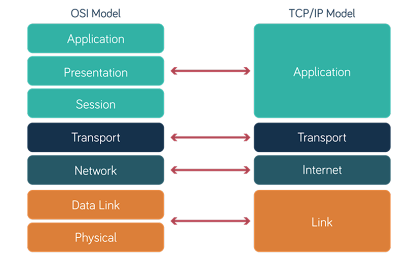
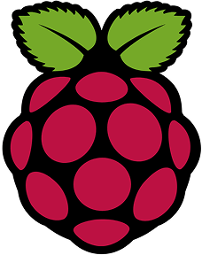
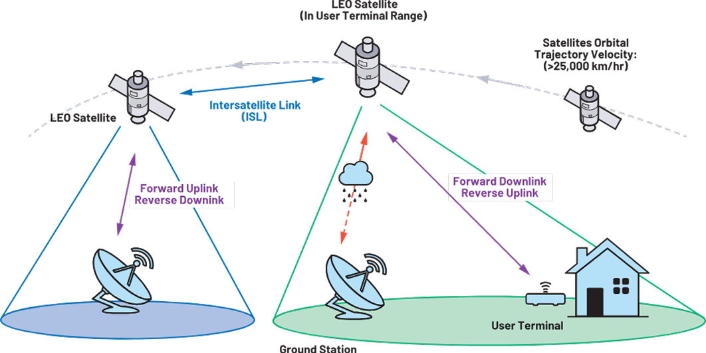

import Tooltip from "@site/src/components/Tooltip";

احتمالاً اولین تصویری که پس از شنیدن اسم «شبکه» در ذهن‌تان شکل می‌گیرد، تعدادی کامپیوتر است که با استفاده از تعدادی کابل به یکدیگر متصل شده‌اند. همچنین ممکن است به یاد «اینترنت» بیفتید و وضعیتی از میلیون‌ها سیستم متصل به آن را در ذهن‌تان تصور کنید. هر دوی این‌ها مثال‌هایی از «شبکه‌های کامپیوتری» هستند. البته باید دقت داشت که مفهوم کلی کلمهٔ «شبکه» فراتر از شبکه‌های کامپیوتری است و در علوم ریاضی و نیز مدارهای الکتریکی و… مفهوم شبکه تعاریف خاص خود را دارد.

یک شبکۀ کامپیوتری، متشکل از مجموعه‌ای از دو یا چند کامپیوتر و دستگاه متصل به هم است که می‌توانند منابع و اطلاعات را با یکدیگر به اشتراک بگذارند. این شبکه می‌تواند بسیار کوچک باشد، مانند یک شبکۀ خانگی که کامپیوتر و گوشی شما را به چاپگر متصل می‌کند (که به آن <Tooltip tip="Local Area Network (LAN)">شبکۀ محلی</Tooltip> می‌گویند)؛ یا می‌تواند بسیار بزرگ باشد و همۀ دفاتر یک شرکت در شهرهای مختلف را به هم مرتبط سازد (که به آن <Tooltip tip="Wide Area Network (WAN)">شبکۀ گسترده</Tooltip> می‌گویند).

برخی ممکن است مفاهیم «اینترنت» و «شبکه» را با هم اشتباه بگیرند. در واقع، هر شبکه‌ای اینترنت محسوب نمی‌شود. اینترنت در واقع یک «شبکه‌ای از شبکه‌ها» است و بزرگ‌ترین نمونه از یک شبکۀ گسترده به‌شمار می‌رود که میلیون‌ها شبکهٔ کوچک‌تر (شبکه‌های خانگی، دانشگاهی، دولتی و تجاری) را از سراسر جهان به یکدیگر متصل می‌کند.

## معماری اینترنت: چرا همه چیز کار می‌کند؟

شاید برایتان جالب باشد که چگونه در دنیای امروز، این حجم از ارتباطات و استفاده از خدمات آنلاین به‌راحتی امکان‌پذیر است؛ یا حتی با نگاهی دقیق‌تر، توسعهٔ آن‌ها نیز به‌دلیل وجود لایه‌ها و شیوه‌نامه‌ها یا <Tooltip tip="Protocols">پروتکل‌ها</Tooltip> بسیار راحت و لذت‌بخش است.

برای مثال، شما به‌راحتی می‌توانید از طریق پیام‌رسان با دوستان‌تان در ارتباط باشید و در همین حین، تغییرات زیادی در مسیر ارتباطی فیزیکی شما با سرور خدمات صورت گیرد؛ یا از طریق شبکهٔ متفاوتی به اینترنت متصل شوید؛ ولی تغییری در تجربهٔ شما ایجاد نشود. این اثر اعجاب‌آور <Tooltip tip="Layered Architecture">معماری لایه‌ای</Tooltip> شبکه است. این معماری ایجاب می‌کند که هر لایه، پروتکل‌های مختص به خود را داشته باشد و تنها با لایه‌های بالا و پایین خود در تعامل باشد و در عین حال، هر لایه، نظیر به نظیر با لایهٔ متناظر در سیستم مقصد در در ارتباط باشد. برای مثال، تمام تعامل ما در بستر اینترنت از طریق <Tooltip tip="Application Layer">لایهٔ کاربرد</Tooltip> صورت می‌گیرد؛ از باز کردن صفحات وب تا تماشای ویدیو و غیره. یا مثلاً <Tooltip tip="Link Layer">لایهٔ ارتباط</Tooltip> و <Tooltip tip="Physical Layer">لایهٔ فیزیکی</Tooltip>، وظیفه دارند که دادهٔ <Tooltip tip="Packets">بسته‌ها</Tooltip>ی شبکه را از طریق پروتکل‌های کابلی (مثل LAN)، یا رادیویی (مثل Wi-Fi) یا موارد دیگر منتقل کنند. وظیفهٔ <Tooltip tip="Network Layer">لایهٔ شبکه</Tooltip> نیز مسیریابی بسته‌های آماده‌شده توسط لایهٔ بالاتر (<Tooltip tip="Transport Layer">انتقال</Tooltip>) است و درگیر جزئیات چگونگی انتقال فیزیکی پیام نمی‌شود. (چون این کار لایهٔ فیزیکی است!)

    

 

این یک ایدۀ کلیدی و شاید متناقض در طراحی اینترنت است که به آن «<Tooltip tip="End-to-End Principle">اصل انتها به انتها</Tooltip>» می‌گویند. این اصل می‌گوید هستهٔ اصلی شبکه باید تا حد ممکن ساده و احمق باشد. وظیفهٔ اصلی آن نباید چیزی جز تلاش برای رساندن بسته‌ها از مبدأ به مقصد باشد. اگر هستهٔ شبکه هوشمند بود و برای کار خاصی (مثلاً انتقال فایل) بهینه می‌شد، جلوی نوآوری را می‌گرفت. یک شبکهٔ ساده و احمق، اهمیتی نمی‌دهد که بسته‌ها حاوی ایمیل، ویدیو، استریم یا داده‌ٔ بازی آنلاین هستند؛ فقط آن‌ها را منتقل می‌کند.

این سادگی به توسعه‌دهندگان در «<Tooltip tip="Network Endpoints">انتهای شبکه</Tooltip>» (یعنی رایانهٔ شما و سرورها) اجازه می‌دهد تا هر نوع سرویس جدیدی را بدون نیاز به تغییر معماری شبکه، ابداع کنند. این انعطاف‌پذیری، دلیل اصلی رشد انفجاری شبکه‌ها و در اصل «اینترنت» است.

اگر همیشه مانند من، شبکه‌های مکان‌های مختلف مثل خانه، محل تحصیل یا مکان‌های عمومی برایتان جذاب بوده و از کنکاش و طراحی در این زمینه لذت می‌برید، احتمالاً حوزهٔ شبکه برایتان جالب خواهد بود. برای موفقیت در این مسیر، صرفاً دانستن مفاهیم پایه کافی نیست؛ بلکه نیاز به درک عمیقی از سیستم‌عامل، معماری کامپیوتر و الگوریتم‌ها دارید.

همان‌طور که در معرفی گرایش امنیت اشاره شده‌است، شبکه پیش‌نیاز اساسی بسیاری از حوزه‌های دیگر از جمله رایانش ابری و امنیت سایبری است.

شروع کنکاش با چند ابزار ساده:

- **مسیریاب خانگی:** با زدن آدرس http://192.168.1.1 وارد پنل تنظیمات مودم/مسیریاب خانهٔ خود شوید. دیدن دستگاه‌های متصل و بازی با تنظیمات مختلف، اولین قدم عملی برای درک مفاهیم شبکه است.

    

 

- **نرم‌افزار Wireshark:** این ابزار یک «میکروسکوپ» برای شبکه است. با آن می‌توانید بسته‌های شبکه را به‌صورت زنده مشاهده و تحلیل کنید و ببینید در پشت صحنه چه می‌گذرد.

    

 

- **برد Raspberry Pi:** این برد رایانهٔ ارزان‌قیمت به شما اجازه می‌دهد پروژه‌های جذابی مثل ساخت یک فایروال، سرور خانگی یا حتی یک مسیریاب بی‌سیم را پیاده‌سازی کنید.

    

 

 

## چند مورد از موارد داغ پژوهشی در حوزهٔ شبکه

**<Tooltip tip="AI-Driven Self-Driving Networks">شبکه‌های مبتنی بر هوش مصنوعی</Tooltip>**: تصور کنید به‌جای تنظیم دستی هزاران روتر و سوئیچ، فقط هدف نهایی خود را به شبکه اعلام کنید؛ مثلاً «کیفیت تماس‌های ویدیویی را برای همهٔ کاربران تضمین کن».

در این <Tooltip tip="Paradigm">الگو</Tooltip> که به آن Intent-Based Networking می‌گویند، الگوریتم‌های هوش مصنوعی و یادگیری ماشین به‌طور خودکار بهترین پیکربندی را برای رسیدن به آن هدف پیدا کرده و شبکه را به‌صورت پویا تنظیم می‌کنند. این فناوری به شبکه اجازه می‌دهد خودش را در برابر خطاها ترمیم کرده و عملکرد خود را بهینه کند.

**<Tooltip tip="LEO Satellite Networks">شبکه‌های ماهواره‌ای مدارپایین</Tooltip>**: پروژه‌هایی مانند Starlink در  حال  ساخت  منظومه‌ای از هزاران ماهواره در مدار نزدیک زمین برای ارائهٔ اینترنت پرسرعت جهانی هستند. چالش‌های شبکه‌ای در این‌جا بسیار منحصربه‌فرد است: چگونه می‌توان ترافیک را بین ماهواره‌هایی که با سرعت ۲۷۰۰۰ کیلومتر بر ساعت در حال حرکت هستند، به‌صورت بهینه مسیریابی کرد؟ طراحی پروتکل‌هایی که بتوانند با این پویایی و مقیاس عظیم کار کنند، یکی از جذاب‌ترین مسائل روز دنیای شبکه است.

    

 

## برخی از شاخه‌های شبکه

**<Tooltip tip="Cloud & Data Centers">شبکه‌های ابری و مراکز داده</Tooltip>:** شما در این حوزه، معمار زیرساخت خواهید بود. چالش اصلی، طراحی شبکه‌هایی با سرعت و پایداری فوق‌العاده بالاست که بتوانند به میلیون‌ها کاربر به‌طور همزمان سرویس دهند.

**<Tooltip tip="Wireless & Mobile">شبکه‌های بی‌سیم و موبایل</Tooltip>:** متخصصان این حوزه روی نسل‌های آیندهٔ اینترنت همراه (5G و 6G) و استانداردهای جدید Wi-Fi کار می‌کنند تا ارتباطات سریع‌تر و با تأخیر کمتری را برای همۀ دستگاه‌ها، از گوشی‌های هوشمند گرفته تا خودروهای خودران، فراهم کنند.

**<Tooltip tip="Internet of Things (IoT)">اینترنت اشیاء</Tooltip>:** این حوزه به اتصال میلیاردها دستگاه هوشمند (سنسورها، لوازم خانگی و تجهیزات صنعتی) به اینترنت می‌پردازد. چالش در این‌جا، ساخت شبکه‌هایی با مصرف انرژی بسیار پایین و امنیت بسیار بالاست.

**<Tooltip tip="Software Defined Networking (SDN) & Automation">شبکه‌های نرم‌افزارمحور و اتوماسیون</Tooltip>:** در این نمونۀ مدرن، شبکه‌ها به‌جای تنظیمات دستی، با استفاده از کدنویسی مدیریت می‌شوند. این کار باعث افزایش چشم‌گیر سرعت، انعطاف‌پذیری و کاهش خطای انسانی می‌شود.

    

 

## درس‌های مرتبط با حوزهٔ شبکه

در مقطع کارشناسی، مسیر شما با درس شبکه‌های کامپیوتری آغاز می‌شود. این درس دروازهٔ ورود شما به این دنیاست و در آن با مفاهیم بنیادی مانند معماری لایه‌ای اینترنت، پروتکل‌های کلیدی (مثل TCP/IP) و نحوهٔ کارکرد سرویس‌های اساسی شبکه آشنا می‌شوید.

درک عمیق، به دانش دروس کلیدی دیگر نیاز دارد:

- در درس سیستم‌های عامل می‌آموزید که یک سرور چگونه هزاران اتصال همزمان را مدیریت می‌کند.
- درس طراحی الگوریتم هستهٔ اصلی چالش‌هایی مانند <Tooltip tip="Routing">مسیریابی</Tooltip> (پیدا کردن بهترین مسیر) است.
- درس معماری کامپیوتر به شما شهود می‌دهد تا سخت‌افزار برای پردازش بسته‌های داده با سرعت بالا باید چگونه طراحی شود.

همچنین، در صورت انتخاب این گرایش در کارشناسی ارشد، می‌توانید با دروس تخصصی‌تر، مسیر خود را مشخص کنید:

دروس اصلی:
- شبکه‌های کامپیوتری پیشرفته
- شبکه‌های بی‌سیم
- امنیت شبکۀ پیشرفته
- ارزیابی کارایی کامپیوترها

دروس اختیاری:
- مخابرات سیار
- شبکه‌های پویای پیچیده
- شبکه‌های اینترنت اشیاء

## حوزهٔ شبکه در دانشکدهٔ مهندسی کامپیوتر

در دانشکده، مسئولیت ارائهٔ دروس این حوزه بر عهدهٔ گروه آموزشی امنیت و شبکه (فناوری اطلاعات سابق) است. اساتید اصلی این حوزه شامل دکتر صفائی (متمرکز بر اینترنت اشیاء در آزمایشگاه رادیان) و همچنین دکتر دولتی (فعال در زمینهٔ شبکه‌های کامپیوتری) هستند.

    

 

این حوزه با دیگر گرایش‌ها نیز اشتراکات پژوهشی دارد؛ به‌طوری که اساتیدی چون دکتر بیات‌سرمدی از گروه معماری و دکتر خرازی و دکتر امینی از حوزهٔ امنیت نیز در زمینه‌های مرتبط فعالیت می‌کنند.
