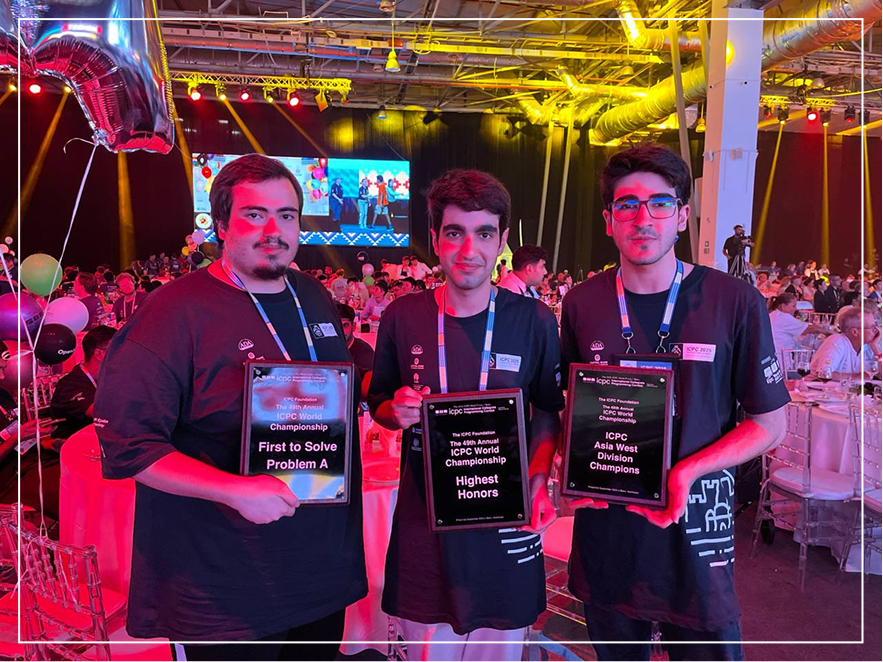
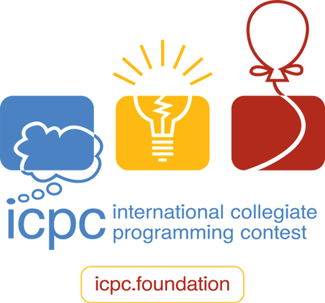
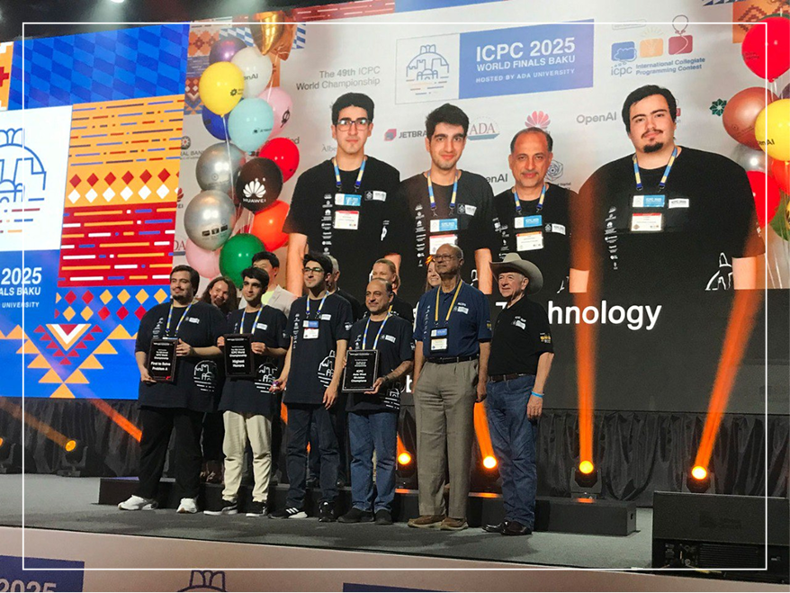

import Tooltip from "@site/src/components/Tooltip";

در مبانی برنامه‌سازی و برنامه‌سازی پیشرفته یاد می‌گیرید چگونه ایده‌ها را به کد تبدیل کنید و برنامه‌های جدی بسازید. اما از جایی به بعد، در ساختمان‌های داده و طراحی الگوریتم‌ها می‌بینید اصل ماجرا فقط «کد زدن» نیست؛ مسئله این است که برنامه چقدر زمان می‌برد و چقدر حافظه می‌خواهد. الگوریتم دقیقاً همین‌جا معنا پیدا می‌کند: روشی مرحله‌به‌مرحله که با یک فکر هوشمندانه می‌تواند همان کار را خیلی تندتر و کم‌هزینه‌تر انجام دهد. مثال روشن: اپ‌های مسیریابی باید بین دو نقطه، کوتاه‌ترین مسیر را پیدا کنند. یک راه ساده این است که همهٔ مسیرهای ممکن را بررسی کنیم -که عملاً ناممکن است-. راه بهتر، استفاده از الگوریتم‌های طراحی‌شده برای همین کار است؛ روش‌هایی که با نگاه کردن به «بهترین انتخاب بعدی» و استفاده از ساختار شبکه، مسیر مناسب را خیلی سریع پیدا می‌کنند. خلاصه این‌که الگوریتم‌ها پشت موفقیت همان برنامه‌هایی هستند که هر روز استفاده می‌کنیم.

فعالیت‌های این حوزه معمولاً به دو شاخه تقسیم می‌شوند: کاربردی و <Tooltip tip="Theoretical Computer Science">تئوری</Tooltip>.

## شاخهٔ کاربردی

 این‌جا با همان کاربردهای روزمره سروکار داریم؛ جایی که سرعت و مقیاس مهم هستند و میلیون‌ها کاربر منتظر نتیجه‌اند. الگوریتم‌ها قلب سیستم‌های بزرگ هستند و تیم‌های زیادی در شرکت‌ها روی طراحی و بهبودشان کار می‌کنند. چند نمونهٔ ملموس:

- **جست‌وجو و پیشنهاددهی:** پیدا کردن نتایج مرتبط و پیشنهاد فیلم، موسیقی و کالا در لحظه.
  - جایگاه شغلی: Search و Recommendations Engineer.
- **مسیریابی و لجستیک:** چیدن مسیر بهینه برای پیک‌ها، زمان‌بندی تحویل، و دور زدن ترافیک.
  - جایگاه شغلی: Routing و Operations Research Engineer.
- **زیرساخت و پردازش دادهٔ عظیم:** مرتب‌سازی و تجمیع در مقیاس دیتاسنتر، زمان‌بندی کارها روی هزاران سرور.
  - جایگاه شغلی: Distributed Systems و Data Infrastructure Engineer.

در این شاخه، هر میلی‌ثانیه و هر مگابایت مهم است؛ الگوریتم خوب یعنی تجربهٔ بهتر کاربر و هزینهٔ کمتر سیستم.

## شاخهٔ تئوری

این‌جا می‌پرسیم «بهترینِ ممکن چیست؟» و مرزهای محاسبه را دقیق‌تر می‌شناسیم. یک مثال کلاسیک: فرض کنید دوست‌تان عددی بین 1 تا 100 انتخاب کرده‌است. شما هر بار یک عدد حدس می‌زنید و فقط می‌شنوید «بیشتر» یا «کمتر». بهترین روش این است که همیشه نقطهٔ میانی بازه را حدس بزنید: اول 50، بعد وسط نیمهٔ مناسب و همین‌طور جلو. با این روش، تعداد سؤال‌ها در حد لگاریتم اندازهٔ بازه است (تقریباً log(n)). می‌توان نشان داد هیچ روشی نمی‌تواند در بدترین حالت، بهتر از این تضمین بدهد؛ این روش از نظر تعداد سؤال‌ها بهینه است.

نمونۀ مهم دیگر «کوتاه‌ترین مسیر» در شبکه‌ها (گراف‌ها) است. اگر گراف n رأس و m یال داشته باشد و هر یال وزنی داشته باشد، الگوریتم <Tooltip tip="Dijkstra's Algorithm">دایکسترا</Tooltip> می‌تواند از یک رأس مبدأ، کوتاه‌ترین مسیرها را با زمانی در حدود m.log(n) به‌دست آورد. جالب این‌که در سال‌های اخیر (از جمله ۲۰۲۵) هم ایده‌های تازه‌ای برای بهبود این مسئله در سناریوهای خاص معرفی شده‌اند؛ یعنی حتی الگوریتم‌های قدیمی هم هنوز الهام‌بخش پیشرفت هستند.

برخلاف تصوری که بعضی‌ها دارند، این شاخه «تمام» نشده‌است؛ هنوز هم مقاله‌های زیادی هر سال منتشر می‌شوند و الگوریتم‌ها در حال پیشرفت هستند. موضوعات داغ شامل داده‌های پویا (وقتی ورودی مدام عوض می‌شود)، جریان داده و الگوریتم‌های زیرخطی (وقتی فقط یک‌بار فرصت دیدن داده داریم)، الگوریتم‌های تقریبی و تصادفی (برای جواب‌های سریع و نزدیک به بهترین) و محاسبات توزیع‌شده در مقیاس دیتاسنتر است. حتی تطبیق الگوریتم‌های کلاسیک با سخت‌افزارهای جدید مثل TPU ،GPU و حافظه‌های نو هم خودش میدان فعالی از پژوهش است.

نکتۀ دل‌گرم‌کننده این‌که تیم‌های زیادی در دانشگاه‌ها، پژوهشگاه‌ها و حتی شرکت‌های صنعتی روی پرسش‌های الگوریتمی کار می‌کنند و خیلی از اعضای این تیم‌ها دانشجوی کارشناسی‌اند. مسیر ورود هم معمولاً از همین درس‌های پایه، حل مسئله، شرکت در مسابقات دانشجویی و سپس پیوستن به گروه‌های تحقیقاتی می‌گذرد. اگر اهل ایده‌های تازه و آزمودن آن‌ها هستید، تئوری جایی است که می‌توانید خیلی زود پای یک پرسش باز بایستید و برایش راه‌حل پیشنهاد کنید.

## الگوریتم در چارت درسی

در دورهٔ کارشناسی معمولاً این مسیر را می‌بینید:

- **مبانی برنامه‌سازی:** فکر مرحله به مرحله را به کد تبدیل می‌کنید.
- **ساختمان داده‌ها:** ابزارهای سرعت‌دادن به برنامه -لیست‌ها، صف و پشته، درخت‌ها، صف اولویت.
- **طراحی الگوریتم‌ها:** روش‌های معمول مثل تقسیم و حل، حریصانه و برنامه‌نویسی پویا.
- **نظریهٔ زبان‌ها و نظریهٔ محاسبات:** مدل‌های محاسبه و مرز توانایی‌ها.
- **دروس اختیاری:**
  - الگوریتم‌های گراف
  - تقریب و تصادفی
  - بهینه‌سازی
  - نظریهٔ بازی‌ها

## معرفی اساتید دانشکده

در دانشکده گروهی از اساتید با مقام‌های کشوری و جهانی در این حوزه فعالیت دارند:

- دکتر آبام: معاون آموزشی دانشکده و رئیس کمیتهٔ المپیاد کامپیوتر؛ تمرکز بر طراحی و تحلیل الگوریتم‌ها.
- دکتر ضرابی‌زاده: رئیس دانشکده؛ فعالیت‌ها در پیوند الگوریتم و بهینه‌سازی و مدیریت رویدادهای دانشکده.
- دکتر صدیقین: درس نظریهٔ بازی‌ها؛ پرطرفدار و پیونددهندهٔ نگاه الگوریتمی و تصمیم‌گیری جمعی.
- دکتر ایزدی و دکتر دولتی: از مدرسان اصلی نظریهٔ زبان‌ها و نظریهٔ محاسبات در چارت دانشکده.

## <Tooltip tip="International Collegiate Programming Contest">ICPC</Tooltip>؛ تمرین جدی و هیجان‌انگیز

هر سال، مسابقات جهانی ICPC برگزار می‌شود و بهترین تیم‌های دانشجویی دنیا در آن شرکت می‌کنند. نمایندهٔ دانشکده در دو سال گذشته تیم Ballmer Peak (اعضا: علی صفری، علیرضا کشاورز، امیرمحمد شاهرضایی) بود: در 2024 رتبهٔ 23 و در 2025 رتبهٔ 16 را کسب کردند. انتخابی امسال اوایل زمستان در سایت دانشکده برگزار می‌شود و مدیریت آن با دکتر ضرابی‌زاده است؛ این رویداد که هر سال فقط یک‌بار برگزار می‌شود، از مهم‌ترین برنامه‌های دانشکده به‌شمار می‌آید و با حضور پرشور دانشجویان، فضایی رقابتی و الهام‌بخش ایجاد می‌کند.

  

 

روند برگزاری به‌صورت دو مرحله‌ای است: ابتدا مسابقهٔ آنلاین برگزار می‌شود تا تیم‌ها از سراسر کشور در شرایط برابر سنجیده شوند و با قالب سؤالات و سامانهٔ داوری آشنا شوند، سپس برترین‌ها به مرحلهٔ انتخابی حضوری دعوت می‌شوند؛ از هر دانشگاه چهار تیم برتر مجوز حضور می‌گیرند. مرحلهٔ حضوری در سایت دانشکدهٔ کامپیوتر برگزار می‌شود و تیم‌های سه‌نفره در مدت معمولاً ۵ ساعت با یک کامپیوتر مشترک روی مجموعه‌ای از مسائل کاملاً الگوریتمی کار می‌کنند، راه‌حل‌ها را به سامانهٔ داوری خودکار می‌فرستند و بازخورد «قبول/رد» را به‌صورت لحظه‌ای دریافت می‌کنند.

  

 

امتیازدهی بر اساس تعداد مسائل حل‌شده و زمانِ جریمه است؛ تابلوی امتیازات به‌طور زنده به‌روزرسانی می‌شود و در دقایق پایانی معمولاً فریز می‌شود تا هیجان لحظۀ اعلام نتایج حفظ شود. در این فضا، سرعت عمل، تقسیم کار هوشمندانه، مدیریت زمان و پیاده‌سازی تمیز، برگ برندهٔ تیم‌هاست و شرکت در آن فرصتی عالی برای تقویت تفکر الگوریتمی، یادگیری کار تیمی و تجربهٔ فشردهٔ رقابت حرفه‌ای را فراهم می‌ این اشــــاره کنم،کند.

  

 
