import Tooltip from "@site/src/components/Tooltip";

در این شماره از بایت گفتیم بد نیست سری به خود دانشجوها بزنیم و با یک نظرسنجی ساده ببینیم در بعضی از موضوعات عمومی، اوضاع در دانشکده چطور است. سؤالات این نظرسنجی خیلی پیچیده نبودند، اما سعی کردیم در طراحی و جمع‌آوری داده‌ها دقت کنیم تا نتیجه‌ها تا حدی قابل‌اعتماد باشند. هدف اصلی‌مان این بود که تصویری کلی و واقعی از فضای فکری و سلیقهٔ دانشجوها به دست بیاوریم.

### از انتخاب‌مان راضی هستیم؟

در گام نخست، میزان رضایت دانشجویان از انتخاب رشتهٔ خود را بررسی کردیم. نتایج نشان می‌دهند که 80 درصد از دانشجویان اگر به عقب برگردند، باز هم حوزهٔ کامپیوتر را انتخاب می‌کنند؛ آماری که بار دیگر این باور را تأیید می‌کند که دانشجویان کامپیوتر بیش از بسیاری از رشته‌های دیگر از انتخاب خود خشنودند و آمار به‌نسبت کم دورشته‌ای‌ها و ماینورها نیز می‌تواند نمودی از جامعیت این رشته باشد.

جالب‌تر این‌که درصد قابل‌توجهی از همین دانشجویان قصد دارند در همین رشته ادامهٔ تحصیل دهند. این موضوع نشان می‌دهد حتی کسانی که شاید در آینده مسیر خود را تغییر دهند، همچنان معتقدند که مهندسی کامپیوتر انتخاب اشتباهی نبوده؛ بلکه برعکس، مسیری بوده که دید و جهت تازه‌ای به آن‌ها داده‌است.

    
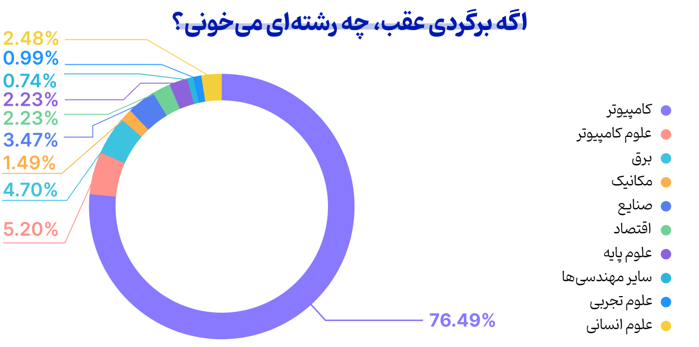

    
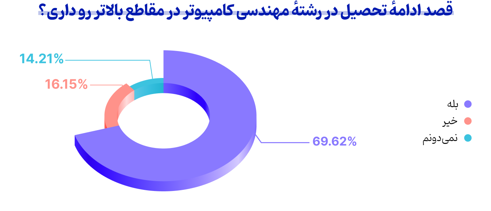

    
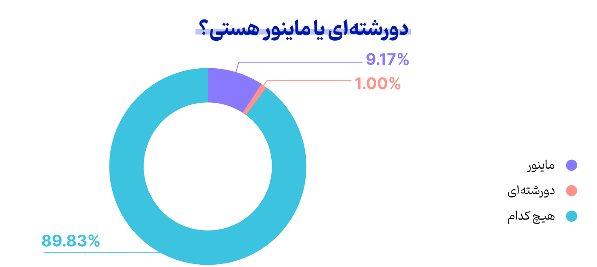

 

### ترند یا علاقه؟ هر فیلد چقدر مشتری دارد؟

شاید بهترین برداشتی که بتوان از انتخاب فیلد دانشجویان داشت، شناخت حدودی ترندهای روز در حوزهٔ کامپیوتر است. همان‌طور که انتظار می‌رفت، فیلد هوش و فیلدهای مشابه بیشترین طرفداران را دارند و نرم‌افزار هم گویا بیشتر به‌دلیل شروع به کار بچه‌های کامپیوتر در شرکت‌های نرم‌افزاری  و بازار خوبی که دارد، توانسته توجه خیلی‌ها را جلب کند؛ اما یک‌بار دیگر خوب است تأکید کنیم که به‌دنبال علایق خود بروید، نه ترند روز!

    
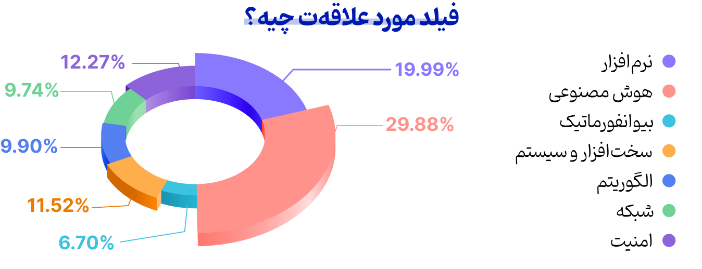

 

اکثر دانشجویان در سال‌های میانی علایق خود را پیدا کرده‌اند که می‌تواند نشان دهد تجربیات عملی و دروس میانی نقش پررنگی در شکل‌گیری علاقه دارند و از طرفی در دوره‌های جدیدتر، افراد علاقهٔ خود را زودتر پیدا کرده‌اند که باز هم می‌تواند تحت‌تأثیر ترندهای روز این حوزه باشد.

رضایت بالاتر دوره‌های کم‌جمعیت‌تر از دروس دانشکده نیز نمودی دیگر از چالش بزرگ دانشکده، یعنی کمبود درس و استاد است. افزایش تعداد ورودی بدون ایجاد زیرساخت، بازدهی مفید را تا حدی کاهش داده، اما رضایت نسبی و مشابه از دروس در دوره‌های مختلف نشان می‌دهد وجود تی‌ای ها تا حدی توانسته خلأهای آموزشی دانشکده را پر کند.

    
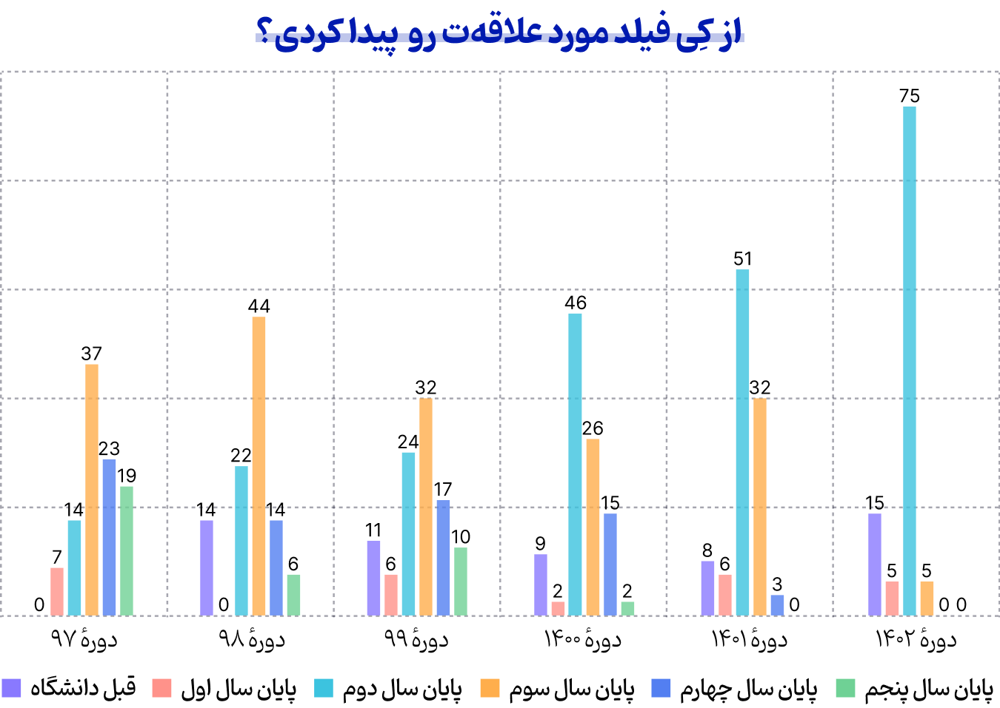

    
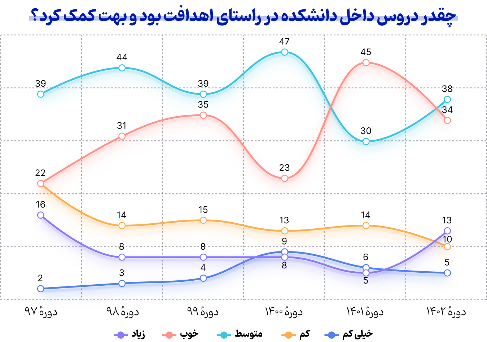

 

شاید مهم‌ترین نکته در آمار کار کردن بچه‌ها، کاهش تعداد افرادی که کار می‌کنند در چند سال گذشته باشد. آماری که ‌باقی‌ماندهٔ آن به سمت ریسرچ و تحقیقات نرفته و به‌طور دقیق نمی‌توان گفت به کجا سرریز شده‌است.

آمار کوآپ نیز نسبت به توقعی که دانشگاه از استقبال دانشجویان داشت، به‌مراتب پایین‌تر است و نشان می‌دهد تعداد زیادی از بچه‌ها کار کردن و درس خواندن همزمان را با وجود طولانی شدن تحصیل و سنوات انتخاب می‌کنند و به نظر می‌رسد یک بازطراحی جدی در کوآپ نیاز است تا اقبال بچه‌ها به آن بیشتر شود.

با بررسی این آمارها و موارد پیشین، نتایج زیادی می‌توان برداشت کرد که اگر فرصتی بود، در نظرسنجی‌های بعدی آن‌ها را تکمیل خواهیم کرد.

    
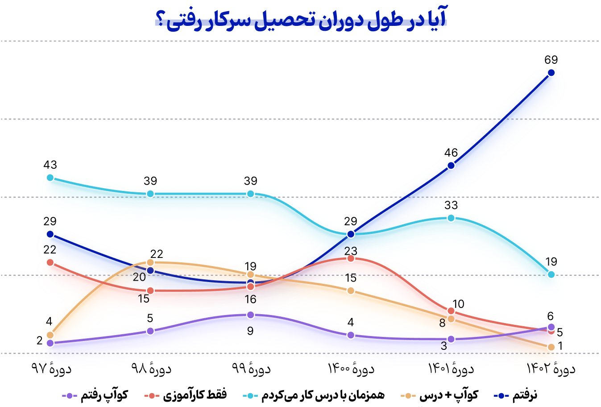

    
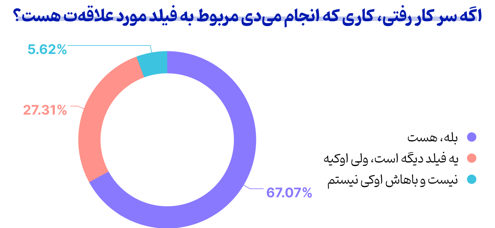

    
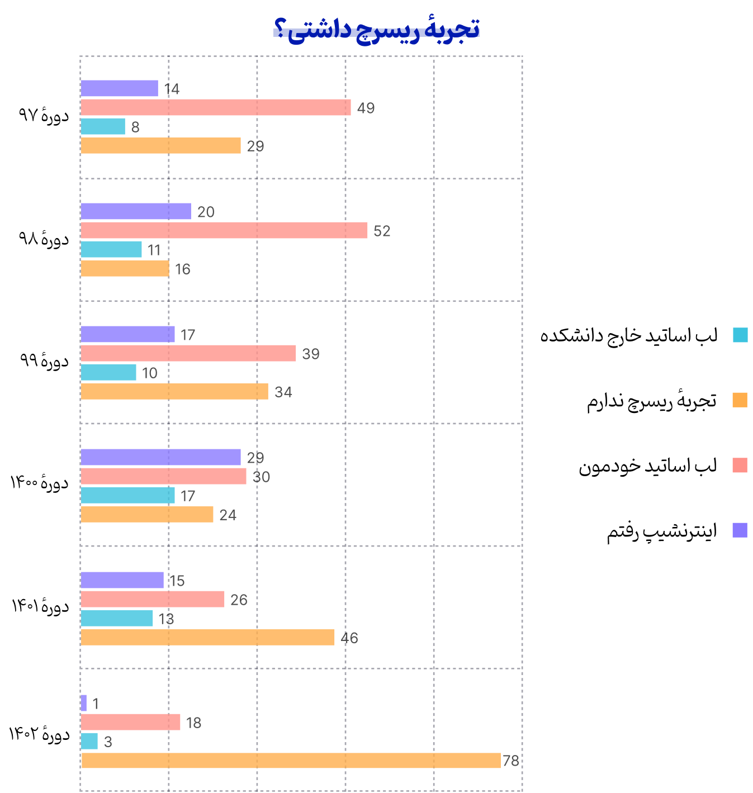

    
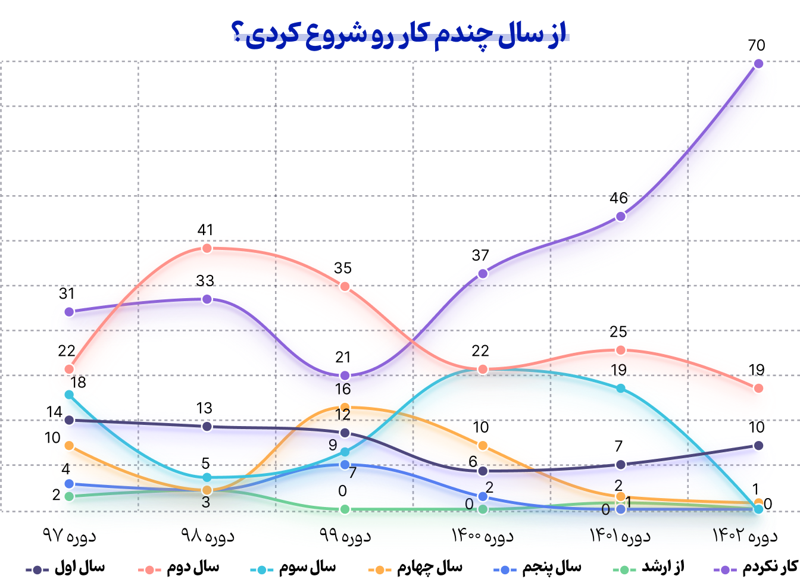

 

### کاش انتخاب بود، نه اجبار!

در دوره‌ای که برخی در توهمِ بودن روی قله‌ها به سر می‌برند، آمار و اعداد داستان دیگری را روایت می‌کنند.
**تنها ۲۸ درصد از دانشجویان مهندسی کامپیوتر شریف تصمیم به ماندن در ایران دارند!**
این آمار بازتاب‌دهندهٔ عمق بحران‌هایی است که جوانان این سرزمین با آن مواجه هستند.

دلایل مهاجرت دانشجویان متعدد است: سطح و امکانات علمی بالاتر، رفاه و آرامش در کشوری بدون جنگ و تحریم و آزادی‌های فردی و اجتماعی. اما آن‌چه واقعاً قابل‌توجه است، اراده‌ای است که دانشجویان برای فرار از این سیستم معیوب نشان می‌دهند. آن‌ها حاضرند تمام سختی‌های اپلای از جمله هزینه‌های گزاف مهاجرت، ریجکتی‌ها، ترک خانواده و زندگی در فرهنگی بیگانه و شهروند درجه دو بودن را بپذیرند، اما در کشور خودشان نمانند!

این حقیقت تلخ نشان می‌دهد در حالی‌که برخی با ملتی خیالی در قله‌های متوهمانهٔ خود سرمستند، ملتی در عمق دره‌های ناامیدی به‌دنبال راهی برای رهایی هستند.

    
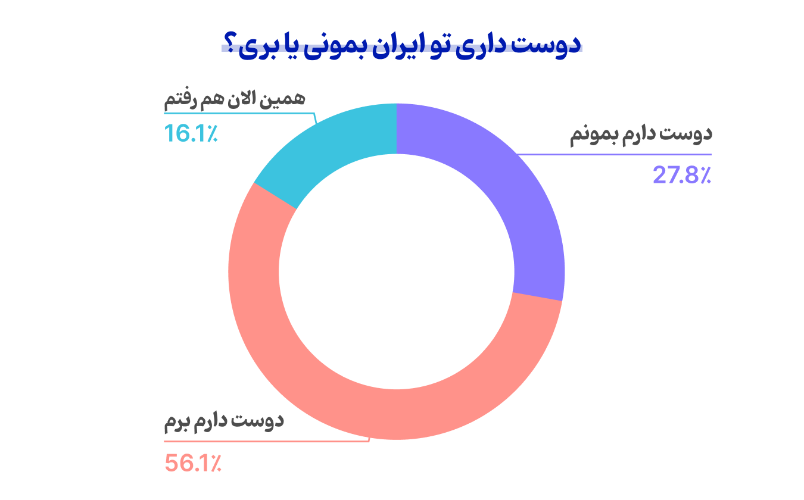

    
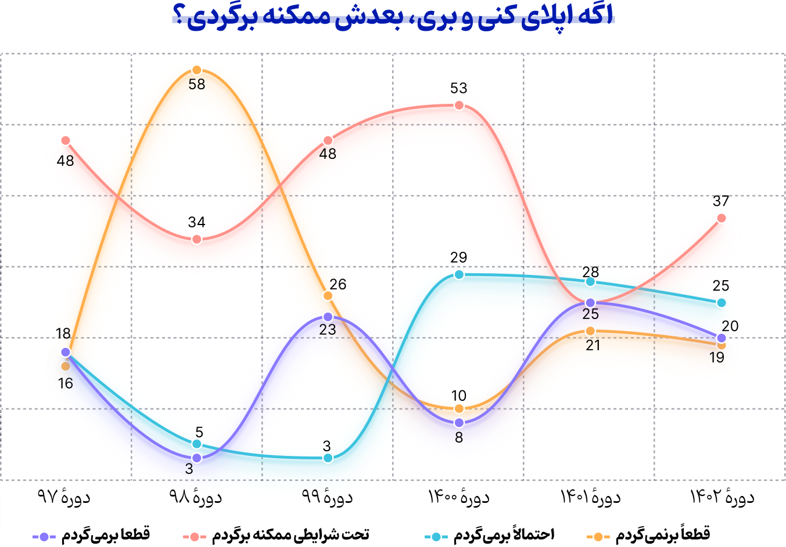

 