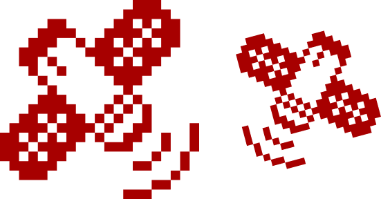

import Tooltip from "@site/src/components/Tooltip";

در روزهای اخیر به دلیل قطع بی‌سابقۀ همۀ راه‌های ارتباطی و اینترنت در کشور، احتمالاً همگی نام استارلینک را شنیده‌ایم؛ شرکت و سامانۀ ارائۀ اینترنت ماهواره‌ای زیرمجموعۀ شرکت SpaceX ایلان ماسک که بخش بسیار گسترده‌ای از کرۀ زمین از جمله ایران را پوشش داده و سرعت انتقال بسیار خوبی را هم فراهم می‌کند. در این مقاله می‌خواهیم نگاهی دقیق‌تر و فنی به نحوۀ کارکرد آن و توانایی ایجاد اختلال و شناسایی آن بیندازیم.

## نبرد با Ping

در ابتدا باید توجه کنید که اینترنت ماهواره‌ای مقولۀ جدیدی نیست که ابداع‌کنندۀ آن شرکت SpaceX باشد. پیش از این هم شرکت‌هایی وجود داشتند که اقدام به ارائۀ اینترنت ماهواره‌ای می‌کردند.
با این حال نوآوری اصلی شرکت SpaceX که نیازمند تلاش‌های مهندسی و علمی بسیار زیادی بوده، ارائۀ اینترنت در مدار <Tooltip tip="Low Earth Orbit">LEO</Tooltip> بوده‌است. اکثر ارائه‌دهندگان پیشین اینترنت، ماهواره‌ها را در <Tooltip tip="Geostationary">مدار زمین‌ثابت</Tooltip> و در فاصلۀ ۳۵٬۷۸۶ کیلومتری سطح زمین مستقر می‌کردند.
ویژگی خاص این فاصله این است که سرعت چرخش ماهواره‌ای که در این مدار قرار بگیرد به‌صورتی خواهد بود که عملاً همواره در بالای یک نقطۀ مشخص در زمین قرار دارد و لذا با مستقر کردن دریافت‌کننده‌ها در جهت ثابت، می‌توان به آن دسترسی پیدا کرد. ماهواره‌های مخابراتی نیز عموماً از این نوع هستند.
با این حال مدارهای زمین‌ثابت در زمینۀ ارائۀ اینترنت یک مشکل اساسی دارند و آن هم این است که انتقال داده‌ها صرفاً از ماهواره تا زمین و برگشت آن نیازمند زمان رفت و برگشتی حدود ۵۰۰ میلی‌ثانیه‌ای است. یعنی حتی با صرف‌نظر از تأخیرهای موجود در دستگاه‌ها، امکان دسترسی به تأخیر بهتر از ۵۰۰ میلی‌ثانیه به لحاظ قوانین فیزیک و سرعت نور وجود نخواهد داشت. از طرف دیگر، مدارهای Low Earth Orbit یا به اختصار LEO، به مدار ماهواره‌هایی با فاصلۀ کمتر از ۲۰۰۰ کیلومتر از سطح زمین گفته می‌شود و واضح است که سرعت انتقال اطلاعات در این حالت بیش‌تر خواهد بود. به‌طور خاص ماهواره‌های استارلینک عموماً در فاصلۀ ۵۵۰ کیلومتری سطح زمین قرار دارند و برنامه‌هایی برای ارسال بعضی ماهواره‌ها به مدار ۳۴۰ کیلومتری هم وجود دارد. این مدار امکان این‌که به تأخیری بین ۲۵ تا ۵۰ میلی‌ثانیه دست یابد را فراهم کرده که بسیار بهتر از اینترنت‌های قدیمی ماهواره‌ای است.

  

## چالش‌های اینترنت ماهواره‌ای

با این حال چالش بزرگی که به وجود می‌آید، این است که دیگر ماهواره‌ها به لحاظ سرعت چرخش با سرعت چرخش زمین به دور خودش هماهنگ نخواهند بود و سرعت چرخش بسیار بیش‌تری خواهند داشت. هم‌چنین به دلیل نزدیک‌تر بودن به زمین، میدان دید کمتری هم دارند. لذا هر ماهواره نهایتاً می‌تواند زمانی بین ۳ تا ۱۵ دقیقه به یک کاربر ثابت روی زمین اینترنت‌رسانی کند. علاوه‌بر این، اگر تنها به کمک یک ماهواره بخواهیم ارتباط را برقرار کنیم، میدان دید ماهواره هم باید شامل کاربر و هم شامل سرورهای زمینی که با آن ارتباط برقرار کرده و دسترسی به اینترنت را فراهم می‌کنند باشد که با توجه به فواصل این سرورها و همچنین سرعت چرخش بالای ماهواره در اکثر اوقات امکان‌ناپذیر است.
راه‌حل استارلینک برای این موضوع، ارسال تعداد بسیار زیادی ماهواره به فضاست. طبیعتاً این راهکار هزینۀ اجرایی و عملیاتی بسیار بالایی دارد و امکان‌پذیر بودن آن از آن‌جا ناشی می‌شود که شرکت SpaceX عملاً خود به‌تنهایی امکان این‌که ارسال‌کنندۀ ماهواره‌ها هم باشد را داشته است و با استفاده از موشک‌های Falcon 9، می‌تواند هر بار تعداد زیادی ماهواره را به فضا منتقل کند. در نتیجۀ این موضوع، تا به حال بیش از ۱۰ هزار ماهوارۀ استارلینک به فضا ارسال شده‌اند و بخش بسیار گسترده‌ای از کرۀ زمین را در پوشش خود قرار داده‌اند.

اما بعد از ارسال هم چالش‌های بسیار زیادی برای این ماهواره‌ها وجود دارد. از یک سو هماهنگی کاملی بین مانورهای مداری این ماهواره‌ها باید وجود داشته باشد و از سوی دیگر سامانه‌هایی گسترده برای مشخص کردن موقعیت آن‌ها برای سایر شرکت‌های فضایی و دولت‌ها باید تعیین بشود تا در پرتاب‌های خود، موقعیت این ماهواره‌ها را در نظر بگیرند. موضوعی که به‌خصوص با توجه به تعداد بالای آن‌ها در مداری با فاصلۀ کم از زمین، از اهمیت ویژه‌ای برخوردار است.
علاوه‌بر آن، ماهواره‌هایی که در این ارتفاع قرار داشته باشند، در نهایت به‌دلیل مقاومت هوا حداکثر ۵ سال قابل‌استفاده هستند و بعد از آن در فرایندهای سقوط از پیش‌تعیین‌شده، وارد جو شده و منهدم می‌شوند. به‌طور خاص ماهواره‌های استارلینک از موادی ساخته شده‌اند که در هنگام ورود به جو زمین به‌طور کامل بسوزند و امکان برخورد بقایایی که امکان آسیب زدن به سازه‌ای در زمین را داشته باشد، بسیار کم بشود. ضمناً توجه کنید که هر چند در آن ارتفاع، فشار هوا بسیار کم‌تر است، اما هم‌چنان به شدت بیش‌تر از فشار هوا در ارتفاع ماهواره‌های زمین‌ثابت است.
حضور این ماهواره‌ها با این تعداد بالا در مدار نزدیک زمین، مشکلاتی را برای رصدخانه‌های زمینی نیز ایجاد می‌کند. به‌طور کلی ماهواره‌ها می‌توانند نور خورشید را بازتاب دهند و حتی هنگام شب در تصاویری که توسط تلسکوپ‌ها گرفته می‌شوند، اختلال ایجاد کنند. خصوصاً این‌که این ماهواره‌ها حتی در بسیاری از اوقات با چشم غیرمسلح هم از روی سطح زمین به‌صورت نقاط نورانی در آسمان قابل‌مشاهده هستند. برای رفع این مشکل، استارلینک تحقیقات گسترده‌ای برای ساخت ماهواره از موادی با میزان انعکاس کم‌تر انجام داده و همچنین سامانه‌ها و API‌هایی برای اطلاع از موقعیت دقیق ماهواره‌ها ایجاد کرده‌است تا به رصدخانه‌ها در کاهش اثرات انعکاسی این ماهواره کمک کند، هر چند که همچنان انتقادات زیادی از سوی جوامع علمی نجومی نسبت به تأثیرات سوء تعداد زیاد ماهواره بر پروژه‌های رصدی وجود دارد.

## ارتباط با زمین و مسیریابی

قسمت دیگر چالش‌ها، مسائل مربوط به علوم مخابرات و همچنین مهندسی و علوم کامپیوتر است.
با توجه به این‌که در فواصل زمانی چند دقیقه‌ای باید ارتباط با یک ماهوارۀ جدید برقرار شود و ردیابی آن‌ها به‌صورت فیزیکی توسط گیرنده‌های زمینی کار دشوار و نیازمند انرژی زیادی است، در ترمینال‌های زمینی استارلینک که توسط کاربر استفاده می‌شود، از روشی موسوم به آرایه‌های اسکن فعال الکترونیکی (<Tooltip tip="Active Electronically Scanned Array">AESA</Tooltip>) استفاده می‌شود که با استفاده از آرایه‌های فازی و به شکل الکترونیکی، می‌توانند جهت دریافت و ارسال امواج رادیویی را بدون نیاز به تغییر موقعیت فیزیکی، مداوم جهت‌دهی کنند.
خود ماهواره هم از سه محدودۀ فرکانسی موسوم به Ka-Band، Ku-Band و E-Band استفاده می‌کند که Ku-Band مختص به ارتباط با کاربر بوده و دو محدودۀ دیگر که فرکانس بالاتری هم دارند برای ایجاد ارتباط با پهنای باند بالا با سرورها و Gatewayهای زمینی که اتصال با اینترنت را برقرار می‌کنند، استفاده می‌شود.
ساختار استفاده‌شده در ترمینال‌های کاربران (یا به عبارت رایج‌تر دیش استارلینک) هم متشکل از فناوری‌های پیشرفتۀ مخابراتی و همچنین پردازش سیگنال است.
ترمینال استارلینک یک برد مدار چاپی با قطر ۵۰ سانتی‌متر دارد که از شبکه‌ای از آنتن‌های شش‌ضلعی تشکیل شده‌است.
۶۳۲ میکروچیپ هر کدام با دو آنتن ارتباط داشته و توسط ۷۹ آرایۀ مشبک توپی (<Tooltip tip="Ball Grid Array">BGA</Tooltip>) که محافظ‌های قوی دفع گرمایی دارند، کنترل می‌شوند. کل سامانه هم در نهایت توسط یک SoC مرکزی با سیستم‌های پیشرفتۀ پردازش سیگنال کنترل می‌شود که براساس <Tooltip tip="Global Positioning System">GPS</Tooltip> داخلی دستگاه، می‌تواند به شکل مداوم محاسبات مربوط به ارتباط با ماهواره‌ها را انجام بدهد.
نکتۀ مهم دیگر مسئلۀ مسیریابی در شبکه است. پروتکل‌های رایج شبکه نظیر <Tooltip tip="Border Gateway Protocol">BGP</Tooltip> و جداول مسیریابی ثابت، اساساً برای شبکه‌های فیزیکی رایجی که به‌ندرت به لحاظ فیزیکی تغییر مکان می‌دهند، طراحی شده‌اند. این موضوع برای ماهواره‌ای که با سرعت ۷٫۵ کیلومتر در ثانیه (۲۷٬۰۰۰ کیلومتر در ساعت) در حرکت است، صادق نیست.
بسیاری از این پروتکل‌ها بر مبنای پیدا کردن کوتاه‌ترین مسیر یا کوتاه‌ترین تأخیر طراحی شده‌اند. با این حال، اجرای چنین روشی در مورد ارتباطات ماهواره‌ای می‌تواند منجر به این شود که ناگهان یک ماهواره به‌شدت مورد ازدحام درخواست قرار بگیرد و ماهواره‌های دیگر بدون‌استفاده باقی بمانند. به همین منظور الگوریتم‌های ویژه و اختصاصی طراحی شده‌اند که تحت چارچوبی به نام SKYLINK شناخته می‌شوند.
کلید اصلی SKYLINK اولویت دادن به ارتباطات بین‌ماهواره‌ای است. ماهواره‌های استارلینک از طریق شبکۀ پیشرفته‌ای از ارتباطات نوری که نزد بسیاری با عنوان لیزر فضایی شناخته می‌شود، ارتباط برقرار کرده و می‌توانند ترافیک را به یک‌دیگر انتقال بدهند.
نکتۀ بسیار مهم این است که نور در فضا می‌تواند با سرعتی بیش از ۴۰ درصد سرعت کابل‌های فیبر نوری زمینی انتقال پیدا کند. برای همین در بسیاری موارد می‌توان انتقال اطلاعات را در فضا سریع‌تر از انتقال آن به سرورهای زمینی و جابه‌جایی در فیبرهای نوری انجام داد؛ لذا در نظر گرفتن ارتباطات بین ماهواره‌ها و انتقال اطلاعات بین آن‌ها هم به لحاظ سریع‌تر بودن نسبت به شبکه‌های زمینی و هم به جهت کاهش ازدحام و بار شبکه اهمیت بالایی دارد و الگوریتم‌های طراحی‌شده برای استارلینک همۀ این موارد را در نظر می‌گیرند و بر آن اساس بهترین ماهواره برای برقراری ارتباط را انتخاب می‌کنند.

  

 

## شناسایی استارلینک

در نهایت هم باید به روش‌هایی که می‌توانند باعث شناسایی یا ایجاد اختلال در استارلینک بشوند اشاره کرد. با توجه به این‌که مقالات آزاد زیادی در این مورد وجود ندارد، می‌توان فقط به برخی حدس و گمان‌ها و یا روش‌های تئوری که احتمال پیاده‌سازی دارند، اشاره کرد.
از جملۀ آن‌ها این است که برای شناسایی وجود ترافیک استارلینک در یک شبکه در صورتی که اتصال به یک کاربر برای مدت زیادی برقرار باشد، می‌توان به تغییرات در ping آن کاربر توجه کرد. به‌دلیل جابه‌جایی بین ماهواره‌های استارلینک در فاصله‌های چند دقیقه‌ای یا حتی بعضاً کمتر از یک دقیقه، معمولاً جهش‌های محسوسی در نرخ تأخیر در هنگام این جابه‌جایی ایجاد می‌شود که ناشی از انجام پردازش‌های تغییر به ماهوارۀ جدید و استفاده از ماهوارۀ دیگر با نرخ تأخیر متفاوت است.
این الگو در صورت رصد شدن به صورت <Tooltip tip="Sawtooth Diagram">نمودار دندانه‌ای</Tooltip> قابل‌مشاهده است. به‌علاوه در فواصل نزدیک می‌توان با اسکن کردن فرکانس‌های Wi-Fi موجود و بررسی Mac Address دستگاه‌ها تا حدی متوجه حضور روترهای استارلینک در یک محدوده شد. هر چند چنین روش‌هایی عملاً نیاز به بررسی محله به محله و خیابانی دارد و به شکل گسترده به‌راحتی قابل استفاده نیستند.
در کنار همۀ این‌ها باید توجه کرد که در صورت عدم استفاده از VPN، آی‌پی استارلینک در بازۀ مشخصی قرار دارد که به‌راحتی قابل‌تشخیص است و هر چند از طریق آن نمی‌توان به مکان روتر دست یافت، ولی می‌توان متوجه شد که فردی از طریق استارلینک از سایت یا سرویس مدنظر بازدید کرده‌است.

  

 

## اختلال در استارلینک

برای مسدودسازی استارلینک، روش‌های ایجاد نویز و جَمینگ روی فرکانس‌های مورد استفادۀ آن می‌تواند به‌عنوان یکی از روش‌ها مورد استفاده قرار بگیرد.
هر چند با توجه به این‌که استارلینک در بازۀ فرکانسی Ku-band که بین ۱۰٫۷ تا ۱۲٫۷ گیگاهرتز است فعالیت می‌کند و این بازه با بازۀ مورد استفاده در برخی سیستم‌های نظامی هوایی تداخل دارد، ایجاد نویز و جمینگ روی آن نیازمند استفاده از جمرهای نظامی قدرتمند است و نمی‌تواند به شکل گسترده مورد استفاده قرار بگیرد.
روش دیگری که می‌تواند مورد استفاده قرار بگیرد و به نظر می‌رسد در قطعی‌های اخیر هم از آن استفاده شده بود — حال یا برای ایجاد اختلال در استارلینک یا به دلایل دیگری که به شکل ثانویه روی استارلینک اثر گذاشت — ایجاد اختلال در سامانه‌های موقعیت‌یاب و GPS است.
با توجه به اتکای استارلینک به این سامانه‌ها برای شروع به کار و برقراری ارتباط اولیه، در صورتی که اختلال شدیدی در GPS وجود داشته باشد این موضوع می‌تواند باعث بروز مشکل در ایجاد ارتباط اولیه شود. هر چند که اثر این موضوع بعد از برقراری اتصال اولیه کمتر می‌شود، اما به‌طور کلی می‌تواند به‌عنوان یک روش مؤثر برای جلوگیری از اتصال استفاده شود.
