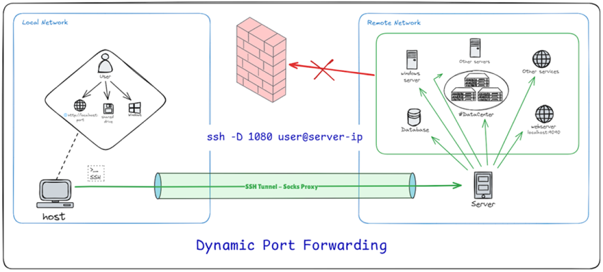
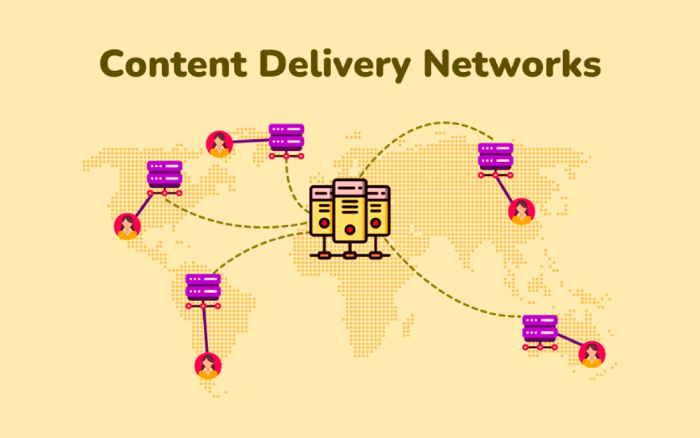
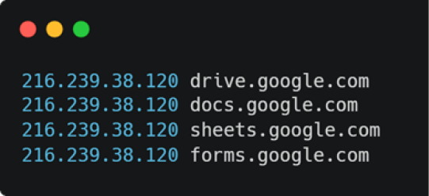

import Tooltip from "@site/src/components/Tooltip";

# هدایت ترافیک اینترنتی با تاکتیک‌های شناخته و ناشناخته

در دنیای امروز، گاهی محدودیت‌های اینترنتی باعث می‌شوند دسترسی به سرویس‌ها و اطلاعات مورد نیاز دشوار شود. در چنین شرایطی، هدایت ترافیک اینترنت از مسیرهای غیرمستقیم و امن، راهکاری مؤثر برای حفظ دسترسی و امنیت است. ابزارهایی مانند پروکسی‌ها و تونل‌های <Tooltip tip="Secure Shell"><span>SSH</span></Tooltip> یا <Tooltip tip="Virtual Private Network"><span>VPN</span></Tooltip> به داده‌ها اجازه می‌دهند بدون آن‌که مسیر و محتوای آن‌ها به‌سادگی قابل‌رهگیری باشد، ابتدا از یک نقطۀ واسط عبور کنند و سپس به مقصد نهایی برسند. به این ترتیب، کاربران می‌توانند هم از اطلاعات خود محافظت کنند و هم از محدودیت‌های شبکه عبور کنند؛ روش‌هایی که در ادامه با مثال و ترفندهای عملی به آن‌ها خواهیم پرداخت.

## تونل‌سازی با SSH؛ روشی برای عبور امن ترافیک

به قول یکی از اساتیدمان، «SSH is all you need»! یکی از روش‌های ساده و امن برای هدایت ترافیک اینترنتی از مسیرهای غیرمستقیم، استفاده از SSH است. SSH به‌طور معمول برای دسترسی به سرورها و مدیریت از راه دور استفاده می‌شود، اما افزون بر این، می‌تواند برای تونل‌سازی و هدایت داده‌ها از طریق یک مسیر امن نیز به‌کار رود. مزیت مهم SSH در نگاه ساده این است که تقریباً به‌صورت پیش‌فرض روی اکثر سرورهای مجازی و VPSها نصب و فعال است، نیاز به راه‌اندازی پیچیده یا نرم‌افزار خاصی ندارد و از رمزنگاری قوی و امتحان‌پس‌داده‌ای استفاده می‌کند. در این روش، شما از یک سرور میانه (معمولاً یک سرور قابل دسترسی از طریق SSH) برای هدایت ترافیک اینترنتی خود استفاده می‌کنید و داده‌ها به‌صورت رمزگذاری‌شده از دستگاه شما عبور می‌کنند. همین در دسترس‌بودن، سادگی و امنیت مناسب باعث شده SSH برای بسیاری از کاربران، اولین و دم‌دست‌ترین ابزار تونل‌سازی باشد.

یکی از رایج‌ترین انواع تونل‌سازی با SSH، تونل پویا (Dynamic Forwarding) است. در تونل پویا، یک پورت محلی روی سیستم شما باز می‌شود که به‌طور خودکار داده‌ها را از طریق سرور SSH به مقصد نهایی هدایت می‌کند. برای مثال، با استفاده از فرمان زیر، یک تونل پویا روی پورت 1080 ایجاد می‌کنید که از طریق آن می‌توانید از پروکسی SOCKS برای استفاده از اینترنت بهره ببرید:

```bash
ssh -D 1080 user@server
```

در این حالت، با تنظیم پروکسی در مرورگر یا برنامه‌هایی که از SOCKS پشتیبانی می‌کنند (مثل تلگرام یا فایرفاکس)، ترافیک اینترنتی شما از طریق سرور میانه هدایت می‌شود و تمام اطلاعات بین شما و سرور رمزگذاری می‌شود. این را هم بگویم که در این حالت، باید آدرس سرور را برابر با localhost قرار دهید، از پورت 1080 استفاده کنید و نام کاربری و گذرواژه را نیز خالی بگذارید. افزون بر فلگ `-D` که برای تونل پویا استفاده می‌شود، چند فلگ رایج دیگر هم در SSH وجود دارد؛ به‌عنوان مثال، `-L` برای Local Port Forwarding است و یک پورت روی دستگاه شما را به یک مقصد مشخص در سمت سرور یا شبکۀ پشت آن متصل می‌کند (مثلاً دسترسی به پایگاه دادۀ داخلی). `-R` برای Remote Port Forwarding یا همان تونل معکوس است و یک پورت روی سرور باز می‌کند تا به سیستم محلی شما وصل شود (مناسب وقتی که پشت NAT هستید). `-J` یا Jump Host برای اتصال زنجیره‌ای از طریق یک یا چند سرور واسط استفاده می‌شود تا بدون ورود جداگانه، به مقصد نهایی برسید. همچنین فلگ‌هایی مثل `-N` (اجرا نشدن پوسته — shell — و فقط ایجاد تونل)، `-f` (ارسال SSH به پس‌زمینه) و `-p` (تعیین پورت اتصال به سرور SSH) هم در سناریوهای تونل‌سازی بسیار کاربردی هستند.

اگر هم رابطۀ خوبی با ترمینال ندارید، می‌توانید از نرم‌افزارهایی مانند NetMod برای ویندوز یا Nekobox برای اندروید استفاده کنید و مشخصات سرورتان را به‌صورت دستی به‌عنوان SSH اضافه کنید. حالا اگر به این روش علاقه‌مند شدید، می‌توانید دربارۀ آن بیشتر مطالعه کنید. مطالعه پیرامون روش‌های مرتبط با تونل معکوس (Reverse SSH Tunnel) را به شما پیشنهاد می‌کنم.

<div style={{ textAlign: "center" }}>
  <div style={{}}></div>
</div>
<br />

## اشتراک‌گذاری اینترنت با پروکسی در شبکۀ داخلی

گاهی اوقات ممکن است بخواهید اینترنت گوشی یا لپ‌تاپ خود را با دیگر دستگاه‌ها در شبکۀ محلی به اشتراک بگذارید. این کار زمانی می‌تواند مفید باشد که شما نیاز دارید به منابع یا سرویس‌هایی دسترسی داشته باشید که فقط از طریق یک پروکسی خاص قابل‌دسترسی هستند.
برخی نرم‌افزارها، مانند V2Ray یا NekoBox، به‌طور پیش‌فرض یک پروکسی SOCKS روی پورت‌های خاص (مثلاً 10808 برای V2Ray یا 2080 برای NekoBox) روی دستگاه شما ایجاد می‌کنند. این پروکسی‌ها برای هدایت ترافیک اینترنت به‌طور امن و رمزگذاری‌شده طراحی شده‌اند. اما نکته‌ای که می‌تواند مفید باشد این است که اکثر این برنامه‌ها داخل تنظیمات خود، گزینه‌ای به نام Allow connections from LAN دارند. اگر این گزینه را فعال کنید، دستگاه‌های دیگر در شبکۀ محلی می‌توانند از پروکسی SOCKS شما استفاده کنند. آن‌ها کافی‌ست با وارد کردن آدرس IP دستگاه شما (مثلاً IP گوشی شما یا لپ‌تاپی که پروکسی را راه‌اندازی کرده‌اید) و پورت مربوطه (مثلاً پورت 10808 یا 2080)، ترافیک خود را از طریق پروکسی شما عبور دهند.
برای کاربران اندروید، یکی دیگر از راه‌های محبوب برای اشتراک‌گذاری اینترنت، استفاده از نرم‌افزار Every Proxy است. این برنامه به شما این امکان را می‌دهد که پس از تونل کردن تمام ترافیک گوشی با نرم‌افزاری دیگر، یک پروکسی SOCKS یا HTTP محلی ایجاد کنید. با این کار، می‌توانید از گوشی خود به‌عنوان یک Gateway اینترنتی برای دیگر دستگاه‌های موجود در شبکۀ محلی استفاده کنید.

## امنیت و خطرات احتمالی

گاهی اوقات برای کاربران این پرسش به‌وجود می‌آید که آیا استفاده از کانفیگ‌های موجود در بسترهای عمومی، امنیت آن‌ها را به خطر می‌اندازد؟ در ادامه به پاسخ این پرسش می‌پردازیم. ابزارهایی مانند V2Ray به‌طور کلی امنیت بالایی دارند و با استفاده از رمزگذاری قوی، از داده‌های شما در برابر شنود محافظت می‌کنند. حتی اگر سرور را خودتان راه‌اندازی نکرده باشید، مدیر سرور ممکن است به متادیتا (مانند آدرس‌های IP و زمان‌های اتصال) دسترسی داشته باشد، اما این به معنای شنود محتوای ترافیک نیست، چون ارتباطات معمولاً به‌صورت رمزگذاری‌شده منتقل می‌شوند. علاوه‌بر این، بیشتر سایت‌هایی که ما به آن‌ها مراجعه می‌کنیم، به‌ویژه سایت‌های بانکی و خدماتی، از پروتکل HTTPS برای رمزگذاری ارتباطات استفاده می‌کنند، بنابراین حتی در صورت استفاده از این ابزارها، نگرانی جدی‌ای بابت امنیت وجود ندارد.

## وقتی شانس، درِ خانه را می‌زد

در برخی دوره‌ها، با وجود محدودیت شدید دسترسی به اینترنت، سرویس‌هایی مانند ChatGPT در دسترس قرار می‌گرفتند. در این حالت، یک راه خلاقانه نیز قابل‌استفاده می‌شود. دلیل اصلی این موضوع، استفادۀ این سرویس‌ها از زیرساخت‌هایی مانند Cloudflare بود. Cloudflare به‌عنوان یک <Tooltip tip="Content Delivery Network"><span>CDN</span></Tooltip>، به‌صورت واسطه‌ای میان کاربر و سرور اصلی عمل می‌کند و بسیاری از دامنه‌های مختلف را روی مجموعه‌ای از IPهای مشترک میزبانی می‌کند. در چنین شرایطی، برخی دامنه‌ها در لایۀ اینترنت کشور، مجاز تلقی می‌شدند و اتصال به آن‌ها مسدود نمی‌شد.
پیش از ورود به این بحث، بد نیست سه مفهوم کلیدی را خیلی خلاصه مرور کنیم. <Tooltip tip="Transport Layer Security"><span>TLS</span></Tooltip> پروتکل رمزنگاری‌ای است که ارتباط بین کاربر و سرور را امن می‌کند و همان چیزی است که پشت HTTPS قرار دارد. در ابتدای برقراری این ارتباط، بخشی به نام <Tooltip tip="Server Name Indication"><span>SNI</span></Tooltip> ارسال می‌شود که نام دامنۀ مقصد را مشخص می‌کند. از سوی دیگر، <Tooltip tip="Deep Packet Inspection"><span>DPI</span></Tooltip> روشی برای بازرسی عمیق بسته‌های شبکه توسط فایروال‌ها یا سامانه‌های فیلترینگ است که می‌تواند بر اساس اطلاعاتی مثل SNI، نوع ترافیک یا الگوهای خاص، اتصال‌ها را شناسایی و مسدود کند.

در این میان، مفهوم SNI نقش مهمی دارد. همان‌طور که گفته شد، SNI بخشی از فرآیند آغازین ارتباط TLS است که در آن نام دامنۀ مقصد پیش از رمزگذاری کامل ارسال می‌شود. برخی کاربران با تنظیم کانفیگ‌هایی مانند VLESS به‌گونه‌ای که SNI در آن برابر با دامنه‌هایی مانند ChatGPT باشد، موفق می‌شدند مرحلۀ اولیۀ اتصال را بدون انسداد پشت سر بگذارند. از آن‌جا که Cloudflare ترافیک را پس از این مرحله به‌صورت رمزگذاری‌شده عبور می‌دهد، این اتصال می‌توانست عملاً به مسیری برای دسترسی گسترده‌تر به اینترنت تبدیل شود؛ رویکردی که از نظر مفهومی به تکنیک‌هایی مانند domain fronting شباهت دارد، هرچند معمولاً موقتی است و با تغییر سیاست‌ها از کار می‌افتد.
یکی دیگر از مواردی که جالب است دربارۀ آن بدانیم، <Tooltip tip="Encrypted Client Hello"><span>ECH</span></Tooltip> است. ECH بخشی از TLS به حساب می‌آید که نام دامنۀ مقصد را در handshake اولیه رمزگذاری می‌کند و باعث می‌شود شناسایی سرویس‌ها با DPI به‌دلیل مخفی شدن SNI، دشوار شود. اگر علاقه‌مند هستید، می‌توانید جزئیات بیشتر آن را در منابع تخصصی مطالعه کنید.

<div style={{ textAlign: "center" }}>
  <div style={{}}></div>
</div>
<br />

## جست‌وجو آزاد!

در برخی مقاطع محدودسازی اینترنت، مشاهده می‌شد که سرویس جست‌وجوی گوگل همچنان در دسترس است، در حالی که سایر خدمات گوگل مانند Drive، Gmail یا Google Accounts مسدود بودند. دلیل این رفتار، تفاوت در نحوۀ ریزالو شدن نام دامنه‌ها (DNS resolution) و سیاست‌های مسدودسازی مبتنی بر دامنه بود. در این شرایط، دامنه‌هایی مانند google.com به یک یا چند IP مشخص پاسخ می‌دادند که در لایۀ فیلترینگ مسدود نشده بودند و امکان برقراری اتصال TCP به آن‌ها وجود داشت. وقتی DNS به‌صورت عادی ریزالو نمی‌شود یا پاسخ متفاوتی برمی‌گرداند، می‌توان نام دامنه‌های دیگر گوگل را به‌صورت دستی به همان IP مجاز نگاشت کرد. این کار باعث می‌شود سیستم‌عامل، بدون پرس‌وجوی DNS، مستقیماً به آن IP متصل شود؛ در نتیجه اگر مسدودسازی صرفاً در لایۀ DNS یا دامنه باشد، اتصال برقرار می‌شود.
برای این کار کافی است فایل hosts سیستم را ویرایش کنید.
در ویندوز:

```
C:\Windows\System32\drivers\etc\hosts
```

و در لینوکس و مک:

```
/etc/hosts
```

و دامنه‌های موردنظر را به IPای که برای گوگل باز است، نگاشت کنید. مثلاً در تصویر زیر، چند مورد آورده شده‌است.

<div style={{ textAlign: "center" }}>
  <div style={{}}></div>
</div>
<br />

## Chisel و GOST؛ طراحی مسیر، نه فقط ساخت تونل

گاهی مسئله فقط «داشتن پروکسی» نیست، بلکه ساختن یک مسیر هوشمند بین دو نقطه است. فرض کنید یک دستگاه دارید که به اینترنت بین‌الملل متصل است و دستگاهی دیگر که فقط به شبکۀ داخلی دسترسی دارد. هدف این است که اینترنت سیستم اول، به‌نوعی در اختیار سیستم دوم قرار بگیرد. در چنین سناریویی، ابزارهایی مانند Chisel و GOST می‌توانند نقش یک پل ارتباطی منعطف را ایفا کنند.
در یک سناریوی رایج، سیستم داخلی (که محدود است) اجازه دارد اتصال خروجی برقرار کند، اما از بیرون نمی‌توان به‌طور مستقیم به آن وصل شد. این دقیقاً همان حالتی است که تونل معکوس (Reverse Tunnel) معنا پیدا می‌کند. روی سیستم دارای اینترنت آزاد، Chisel را در حالت سرور اجرا می‌کنیم و اجازۀ ایجاد تونل معکوس می‌دهیم. سپس روی سیستم داخلی، کلاینت Chisel اجرا می‌شود و به سرور متصل می‌شود. نکتۀ مهم این‌جاست که اتصال از داخل آغاز می‌شود؛ بنابراین حتی اگر سیستم داخلی پشت <Tooltip tip="Network Address Translation"><span>NAT</span></Tooltip> یا فایروال باشد، مانعی برای برقراری تونل ایجاد نمی‌شود.
پس از اتصال، می‌توان روی سیستم داخلی یک پروکسی SOCKS محلی ایجاد کرد. در این حالت، کافی است مرورگر یا نرم‌افزارهای دیگر را روی SOCKS تنظیم کنیم تا تمام ترافیک آن‌ها از طریق تونل به سرور خارجی هدایت شود.
حالا اگر Chisel را یک تونل ساده و کارآمد بدانیم، GOST بیشتر شبیه یک جعبه‌ابزار شبکه است. سناریوی پایه همان است: یک سرور خارج از کشور با اینترنت آزاد، و یک کلاینت داخل شبکۀ محدود. اما GOST اجازه می‌دهد نوع انتقال، نحوۀ کپسوله‌سازی و حتی زنجیرۀ پروکسی‌ها را خودمان طراحی کنیم. مزیت مهم GOST این است که می‌توان این ارتباط را داخل WebSocket، TLS یا حتی چند لایۀ متوالی کپسوله کرد. برای مثال، می‌توان ترافیک را به‌صورت SOCKS داخل TLS اجرا کرد تا از دید شبکه شبیه یک ارتباط HTTPS معمولی باشد، یا حتی چند پروکسی را زنجیره‌ای کرد تا مسیر ترافیک چندمرحله‌ای شود.

## آیا ترافیک ما قابل تشخیص است؟

یکی از پرسش‌های رایج پیرامون ابزارهای تونل‌سازی این است که آیا ترافیک آن‌ها از دید شبکه یا اپراتور قابل‌تشخیص است یا نه. پاسخ کوتاه این است که بله، اغلب قابل‌تشخیص‌اند؛ اما میزان و دقت تشخیص متفاوت است. این تفاوت به نوع پروتکل، الگوی ترافیک و میزان شباهت آن به ترافیک عادی اینترنت بستگی دارد.
OpenVPN به‌طور پیش‌فرض الگوی نسبتاً مشخصی دارد. اگر روی UDP و پورت‌های غیرمعمول اجرا شود، تشخیص آن برای سیستم‌های DPI ساده‌تر است، زیرا ساختار بسته‌ها و handshake آن با ترافیک وب معمولی تفاوت دارد. اجرای OpenVPN روی TCP و پورت 443 می‌تواند تشخیص را سخت‌تر کند، اما همچنان در بسیاری از موارد، الگوی رفتاری آن (timing، packet size و renegotiation) قابل‌تمایز است. به همین دلیل، OpenVPN از نظر امنیت رمزنگاری قوی است، اما از نظر «استتار ترافیک» چندان ایده‌آل نیست.
در مقابل، پروتکل‌هایی مانند VMess و VLESS (به‌ویژه وقتی روی TLS و CDN اجرا می‌شوند) طوری طراحی شده‌اند که ترافیک آن‌ها تا حد زیادی شبیه HTTPS معمولی به نظر برسد. در این حالت، تشخیص دقیق نیازمند تحلیل‌های عمیق‌تری در لایه‌های بالاتر یا بررسی الگوهای رفتاری طولانی‌مدت است. با این حال، حتی این روش‌ها هم کاملاً نامرئی نیستند؛ استفاده از SNI خاص، الگوی اتصال مداوم یا مسیرهای غیرعادی می‌تواند نشانه‌هایی برای تشخیص ایجاد کند. تفاوت اصلی این‌جاست که هزینه و پیچیدگی تشخیص آن‌ها بالاتر است.
WireGuard نیز یک پروتکل VPN مدرن، سریع و از نظر رمزنگاری بسیار امن است؛ اما برخلاف تصور رایج، از دید DPI، نامرئی محسوب نمی‌شود. در عمل، WireGuard الگوی مشخصی دارد: پکت آغازین کلاینت و پاسخ اولیۀ سرور (handshake) ساختار ثابتی دارند و اگر این پکت‌ها بدون پوشش اضافی روی شبکه دیده شوند، به‌راحتی می‌توان آن‌ها را از سایر ترافیک‌ها تفکیک کرد. به همین دلیل، تشخیص WireGuard در حالت خام برای تجهیزات تحلیل ترافیک کار پیچیده‌ای نیست.
یکی از راه‌ها برای کاهش این قابلیت تشخیص، افزودن یک لایۀ پوشاننده روی WireGuard است؛ برای مثال، قرار دادن آن داخل WebSocket، TLS یا روش‌هایی مانند <Tooltip tip="Secure WireGuard Proxy"><span>SWGP</span></Tooltip>. در SWGP، پکت‌های WireGuard پیش از ارسال، داخل یک پروکسی رمزگذاری‌شده کپسوله می‌شوند و از دید شبکه، به‌جای الگوی مشخص WireGuard، ترافیکی شبیه ارتباطات عادی TLS دیده می‌شود. در چنین حالتی، DPI دیگر به handshake واقعی WireGuard دسترسی مستقیم ندارد و تشخیص به تحلیل‌های رفتاری پیچیده‌تر محدود می‌شود. در نتیجه، WireGuard ذاتاً استتارپذیر نیست، اما با ابزارهایی مانند SWGP می‌تواند از یک پروتکل قابل‌تشخیص، به ترافیکی سخت‌تحلیل تبدیل شود؛ هرچند حتی در این سناریو هم «غیرقابل‌تشخیص مطلق» وجود ندارد و فقط هزینۀ تشخیص بالا می‌رود.
تونل SSH نیز وضعیت بینابینی دارد. خود SSH رمزنگاری قوی دارد، اما handshake و الگوی ترافیکی آن برای تجهیزات شبکه آشناست. اگر SSH روی پورت 22 اجرا شود، تشخیص آن بسیار ساده است؛ حتی روی پورت‌های دیگر هم معمولاً می‌توان آن را از HTTPS واقعی تفکیک کرد. بنابراین SSH برای امنیت و سادگی عالی است، اما از نظر پنهان‌سازی ترافیک، محدودیت دارد.

## عبور از تونل‌ها و گذر از دیوارها

در نهایت، تجربۀ هدایت ترافیک اینترنتی از مسیرهای غیرمستقیم، بیان‌گر این است که اینترنت همیشه فقط «وصل یا قطع» نیست و محدودیت‌ها، چندلایه و گاهی عجیب و پیچیده‌اند. ابزارهایی مثل SSH، پروکسی‌ها و VPN هر کدام مزایا و محدودیت‌های خودشان را دارند و این‌که کدام‌یک برای شما کارآمد باشد، وابسته به نیاز، شرایط شبکه و سطح امنیت مدنظرتان است. بعضی وقت‌ها کاربران با روش‌های خلاقانه مثل استفاده از SNI، ریزالو دستی دامنه‌ها یا اشتراک‌گذاری تونل اینترنت با SSH موفق به عبور از محدودیت‌ها شده‌اند و نشان داده‌اند که شناخت زیرساخت‌ها و رفتار شبکه می‌تواند به عبور امن و راحت از محدودیت‌ها کمک کند. البته همۀ این روش‌ها معمولاً موقتی هستند.
