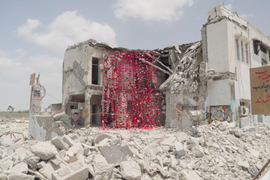
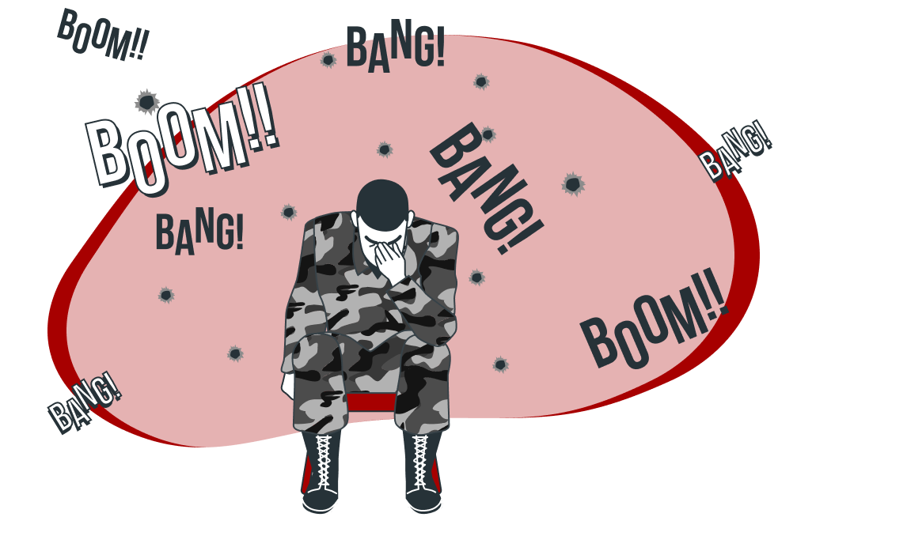

import Tooltip from "@site/src/components/Tooltip";

# پیامدهای ناخواسته راهبرد نامتقارن ایران و جنگ مبتنی بر هوش مصنوعی آمریکا بر حفاظت از غیرنظامیان

در بیست‌وچهار ساعت اول جنگ با ایران، ایالات متحده به بیش از ۱۰۰۰ هدف حمله کرد، یعنی به‌طور میانگین ۴۲ هدف در هر ساعت. تا زمان برقراری آتش‌بس، نیروهای آمریکایی بیش از ۱۳۰۰۰ هدف را منهدم کرده بودند. (اوضاع به جایی رسیده بود که برنامه‌ریزان پنتاگون عملاً لیست اهداف باارزش ایران را تقریباً خالی کرده بودند.) این سرعت بی‌سابقه در حملات، بدون به‌کارگیری یک ابزار جدید ممکن نبود: سامانه هوشمند <Tooltip tip="Maven">میون</Tooltip> که تحت نظارت شرکت <Tooltip tip="Palantir">پالانتیر</Tooltip> است و در حال حاضر از هوش مصنوعی <Tooltip tip="Claude">کلاد</Tooltip> شرکت آنتروپیک نیرو می‌گیرد. پروژه Maven پاسخی به یک مشکل پیچیده بود.

تا اواسط دهه ۲۰۱۰، پنتاگون در حجم عظیمی از داده‌های نظارتی غرق شده بود؛ داده‌هایی که از تصاویر پهپادها، رهگیری سیگنال‌ها، تلفن‌های همراه و ترافیک اینترنت جمع‌آوری می‌شدند. اما این سازمان هیچ روش کارآمدی برای پردازش این اطلاعات و تبدیل آن‌ها به اهداف عملیاتی نداشت. در جنگ‌های گذشته، مانند جنگ عراق در سال ۲۰۰۳، پنتاگون برای تولید حدود ۲۰ هزار حمله به دو هزار نفر نیاز داشت که به‌صورت شبانه‌روزی فعالیت می‌کردند. در هسته اصلی، این پلتفرم شباهت زیادی به نرم‌افزارهای رایج مدیریت پروژه در شرکت‌های تجاری دارد که برای کاربردهای نظامی بازطراحی شده‌اند. پس از آنکه در سال ۲۰۲۳ مدل Claude به این سامانه افزوده شد، Maven توانست اطلاعات حاصل از منابع اطلاعاتی مختلف را در یک محیط عملیاتی واحد ادغام کند.
در جریان جنگ ایران، این سامانه اهداف را به‌صورت بلادرنگ شناسایی و اولویت‌بندی می‌کرد، اطلاعات لازم در مورد موقعیت هدف را تولید می‌کرد و حتی مناسب‌ترین سامانه تسلیحاتی را برای هر عملیات پیشنهاد می‌داد. علاوه بر این، پلتفرم به‌طور خودکار توجیهات حقوقی و نظامی لازم برای هر حمله را نیز تهیه می‌کرد. پس از تکمیل بسته اطلاعاتی هر هدف، اطلاعات برای تایید نهایی و اجرای عملیات به فرماندهان ارسال می‌شد.
نتایج به‌دست‌آمده شگفت‌انگیز بودند. کاترینا میسون در کتاب Project Maven می‌نویسد:

> «ایالات متحده از توانایی حمله به کمتر از صد هدف در روز، به توانایی حمله به هزار هدف در روز رسید. با ادغام مدل‌های زبانی بزرگ در پلتفرم Maven، این ظرفیت پنج برابر دیگر افزایش یافت و به پنج هزار هدف در روز رسید.»

  

 

اولویت اصلی، افزایش کارایی بود؛ شناسایی و حمله به اهداف بیشتر، در زمانی کوتاه‌تر و با مشارکت تعداد کمتری از انسان‌ها. Maven از این نظر موفق بود، اما بهای این موفقیت بسیار سنگین بود. به بیان ساده، Maven با کاهش شدید تعداد انسان‌های درگیر در فرایند تصمیم‌گیری، زنجیره کشتار را به‌طور چشمگیری فشرده کرد. در اصل، فشرده کردن زنجیره کشتار به معنای حذف نقاط اصطکاک و موانع بروکراتیک در فرایند تصمیم‌گیری است.
برخی از این مراحل واقعاً ناکارآمد بودند؛ مانند انتقال دستی اطلاعات اهداف میان صفحات گسترده مختلف. اما برخی دیگر عمداً به‌عنوان نقاط کنترل و نظارت طراحی شده بودند؛ برای مثال الزام به دریافت تأیید رسمی پیش از ورود به مرحله بعدی هدف‌گیری.

  

 
