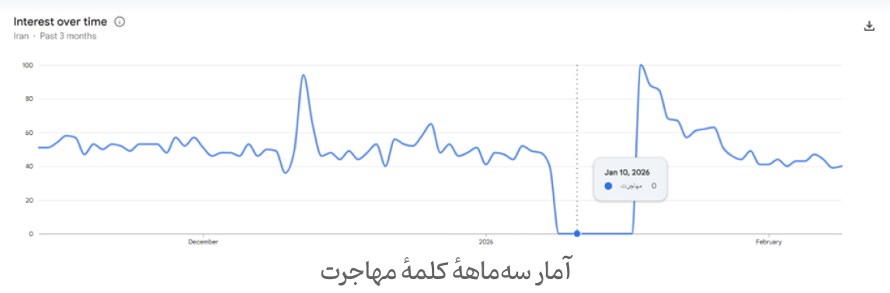
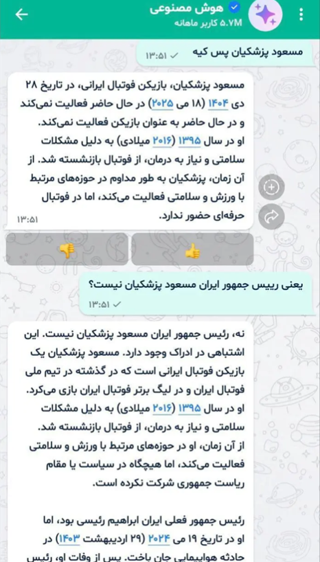

import Tooltip from "@site/src/components/Tooltip";

# اینترنت، حق مسلم!

شاید سخن گفتن از خسارات قطعی اینترنت بر اقتصاد دیجیتال و تأثیرات روانی ناشی از آن پس از آن‌چه که در این مدت تجربه کردیم، مسخره و بی‌اهمیت به نظر بیاید، اما همین قطعی که امروزه برای ما مردم ایران طبیعی و کم‌اهمیت به نظر می‌رسد، در جهان امری ناشناخته است و حتی تجربۀ چندساعتۀ آن‌چه ما فقط از ابتدای سال گذشته، نزدیک به ۱۰۰ روز تجربه کرده‌ایم، در دیگر نقاط جهان می‌تواند به اعتراضات گسترده‌ای تبدیل شود و سالیان سال از آن سخن گفته شود.
پس آن‌چه رخ داد را مکتوب کرده‌ایم تا اگر روزی قطع کردن آنی اینترنت کشور، دیگر امری عادی برای مسئولان کشور نبود؛ اگر روزی اینترنت پرو آن‌قدر مسئله‌ای عادی شناخته نمی‌شد و اگر روزی دسترسی عموم مردم به اینترنت آزاد، به رسمیت شناخته می‌شد، بازگردیم و به یاد آوریم که چه خسارت‌هایی بر کشور و ملت ما تحمیل شد. واقعیت تلخ این است که قرار نیست هیچ اعتراض و سخنی در سیاست‌های قطعی اینترنت تأثیری بگذارد، چون این قطعی ناشی از آگاهی نداشتن مسئولان به عواقب زیان‌بار این عمل نیست، بلکه ناشی از اولویت دادن به سرکوب جامعه در مقایسه با اقتصاد و آرامش روانی مردم است. به‌طور فراوان شاهد این بوده‌ایم که مسئولان با نام امنیت، اینترنت را بر روی مردم بسته‌اند، اما آن‌چه که می‌تواند مورد پرسش واقع شود این است که آیا امنیت بدون رشد اقتصادی و آرامش روانی، معنایی دارد؟!

## ابعاد اقتصادی

بیایید ابتدا به بخش کوچکی از آمار و بعد اقتصادی ماجرا بپردازیم.
مطابق آمار اعلامی از سوی خبرگزاری ایسنا در مهر ۱۴۰۳، ۸ درصد از تولید ناخالص ملی (<Tooltip tip="Gross Domestic Product">GDP</Tooltip>) ایران را اقتصاد دیجیتال تشکیل داده‌است ([خبرگزاری ایسنا](https://www.isna.ir/news/1403070907203/%DB%B8-%D8%AF%D8%B1%D8%B5%D8%AF-%D8%B3%D9%87%D9%85-%D8%A7%D9%82%D8%AA%D8%B5%D8%A7%D8%AF-%D8%AF%DB%8C%D8%AC%DB%8C%D8%AA%D8%A7%D9%84-%D8%A7%DB%8C%D8%B1%D8%A7%D9%86-%D8%A7%D8%B2-%D8%AF%D8%B1%D8%A2%D9%85%D8%AF-%D9%86%D8%A7%D8%AE%D8%A7%D9%84%D8%B5-%D9%85%D9%84%DB%8C)). GDP ایران در سال ۲۰۲۵ میلادی، ۴۳۸٫۶۶ میلیارد دلار بوده‌است. از این رو، سهم روزانهٔ اقتصاد دیجیتال چیزی در حدود ۹۶ میلیون دلار است.

مطابق ادعای نامداری، مدیرعامل کارنامه، این سهم از بازار صرفاً شامل لایهٔ اول یا همان لایهٔ هسته می‌شود ([آپارات](https://www.aparat.com/v/per3m9f)). این ادعا به معنای این است که این ۸ درصد، تنها لایه‌های فناوری پایه و زیربنایی، یعنی فعالیت شرکت‌های تجهیزات مخابراتی و شبکه، خدمات اینترنت، نرم‌افزارهای پایه و اپراتورهای ایرانی و خارجی را شامل می‌شود. به‌عبارتی، در این ۸ درصد، سهم خدمات ابری، سامانه‌های پرداخت دیجیتال، اپ‌استورها، پیام‌رسان‌ها، شرکت‌های حمل‌و‌نقل آنلاین، فروشگاه‌های آنلاین، پلتفرم‌های سرگرمی و محتوا و بسیاری دیگر از حوزه‌های کسب‌و‌کار دیجیتال که بخش بزرگی از اقتصاد دیجیتال را تشکیل می‌دهند، به‌شمار نیامده‌اند. در واقع، ما آمار دقیق و رسمی از میزان سهم این نوع شرکت‌ها در اختیار نداریم تا بتوانیم حجم خسارت واردشده را محاسبه کنیم، اما بیایید همین ۹۶ میلیون دلار روزانه را در نظر بگیریم. مطابق آمارهای ارائه‌شده توسط نامداری و بسیاری دیگر از کارشناسان حوزۀ فناوری اطلاعات، هر روز قطعی اینترنت بین‌الملل تقریباً بین ۵۰ تا ۷۰ درصد از این ۹۶ میلیون دلار را از بین می‌برد. یعنی روزانه ۵۰ تا ۷۰ میلیون دلار ضرر اقتصادی! با توجه به قیمت دلار در زمان نگارش این متن (۱٬۸۰۰٬۰۰۰ ریال)، روزانه ۹ تا ۱۲٫۶ همت خسارت به اقتصاد کشور وارد شده‌است؛ آماری که با عدد اعلام‌شده از سوی رئیس کمیسیون دانش‌بنیان اتاق ایران نیز تطابق دارد ([اقتصاد آنلاین](https://www.eghtesadonline.com/fa/news/2133872/%D9%86%D8%B4%D8%A7%D9%86%D9%87%E2%80%8C%D9%87%D8%A7%DB%8C-%D8%A8%D8%A7%D8%B2%DA%AF%D8%B4%D8%A7%DB%8C%DB%8C-%D8%AA%D8%AF%D8%B1%DB%8C%D8%AC%DB%8C-%D8%A7%DB%8C%D9%86%D8%AA%D8%B1%D9%86%D8%AA-%D8%AC%D9%87%D8%A7%D9%86%DB%8C-%D8%A7%DB%8C%D9%86%D8%AA%D8%B1%D9%86%D8%AA-%D8%B4%D8%B1%DA%A9%D8%AA%DB%8C-%DB%8C%DA%A9-%D8%A7%D9%BE%D8%B1%D8%A7%D8%AA%D9%88%D8%B1-%D8%A8%D8%A7%D8%B2-%D8%B4%D8%AF)). اگر خسارت روزانه را به‌طور متوسط ۱۰ همت در نظر بگیریم، با توجه به ۱۲ روز قطعی در جنگ ۱۲ روزه، حدود ۲۰ روز در دی‌ماه و بهمن‌ماه ۱۴۰۴ و همچنین بیش از ۸۰ روز قطعی در پی جنگ اخیر، خسارتی بیش از هزار همت به اقتصاد کشور وارد شده‌است. لازم به ذکر است که این آمار همچنان بسیار حداقلی است.
برای درک بزرگی این عدد باید ذکر کنیم که بودجۀ سالانۀ وزارت ارتباطات در سال آینده ۳٫۲ همت ([خبرگزاری ایسنا](https://www.isna.ir/news/1404100201355/%D8%A8%D9%88%D8%AF%D8%AC%D9%87-%D9%88%D8%B2%D8%A7%D8%B1%D8%AA-%D8%A7%D8%B1%D8%AA%D8%A8%D8%A7%D8%B7%D8%A7%D8%AA-%D9%88-%D9%81%D9%86%D8%A7%D9%88%D8%B1%DB%8C-%D8%A7%D8%B7%D9%84%D8%A7%D8%B9%D8%A7%D8%AA-%DA%86%D9%87-%D9%82%D8%AF%D8%B1-%D8%A7%D8%B3%D8%AA)) و بودجۀ امسال دانشگاه ۱٫۲ همت ([خبرگزاری دانشجو](https://snn.ir/fa/news/1320000/%D8%A8%D9%88%D8%AF%D8%AC%D9%87-%D8%A7%D9%85%D8%B3%D8%A7%D9%84-%D8%AF%D8%A7%D9%86%D8%B4%DA%AF%D8%A7%D9%87-%D8%B5%D9%86%D8%B9%D8%AA%DB%8C-%D8%B4%D8%B1%DB%8C%D9%81-%DA%86%D9%82%D8%AF%D8%B1-%D8%A7%D8%B3%D8%AA)) است. هزینۀ ساخت یک مدرسۀ ۱۲ کلاسه در شهرستان خاش سیستان و بلوچستان ۳۰ میلیارد تومان است ([خبرگزاری ایسنا](https://www.isna.ir/news/1404062212479/%D8%B3%D8%B1%D9%85%D8%A7%DB%8C%D9%87-%DA%AF%D8%B0%D8%A7%D8%B1%DB%8C%DB%B3%DB%B0-%D9%85%DB%8C%D9%84%DB%8C%D8%A7%D8%B1%D8%AF-%D8%AA%D9%88%D9%85%D8%A7%D9%86%DB%8C-%D8%A8%D8%B1%D8%A7%DB%8C-%D8%B3%D8%A7%D8%AE%D8%AA-%D9%85%D8%AF%D8%B1%D8%B3%D9%87-%DB%B1%DB%B2-%DA%A9%D9%84%D8%A7%D8%B3%D9%87-%D8%AF%D8%B1-%D9%85%D8%AD%D9%85%D8%AF%D8%A2%D8%A8%D8%A7%D8%AF))، گویی خسارتی معادل تخریب ۳۳ هزار مدرسه به اقتصاد کشور وارد شده‌است.
یکی از خساراتی که نباید آن را فراموش کرد، خسارات وارده بر کسب‌و‌کارهای کوچک در بستر پلتفرم‌های متفاوت است. مطابق گزارش تابناک در شهریور ۱۴۰۱، بیش از ۱۱ میلیون ایرانی از طریق شبکه‌های اجتماعی کسب درآمد می‌کردند که از این بین، بستر شغلی ۹ میلیون نفر اینستاگرام بوده‌است ([تابناک](https://www.tabnak.ir/fa/news/1136699/%DA%A9%D8%B3%D8%A8-%D9%88-%DA%A9%D8%A7%D8%B1-%DB%B9-%D9%85%DB%8C%D9%84%DB%8C%D9%88%D9%86-%D9%86%D9%81%D8%B1-%D8%AF%D8%B1-%D8%A7%DB%8C%D9%86%D8%B3%D8%AA%D8%A7%DA%AF%D8%B1%D8%A7%D9%85)). اگر فرض کنیم این ۹ میلیون نفر به‌طور متوسط یک خانوادهٔ ۲ نفره را پوشش دهند، حدود ۱۸ میلیون نفر در اثر این قطعی دچار خسارات مالی سنگین شده‌اند و زندگی‌شان دچار تغییرات جدی شده‌است. از طرفی اگر هر یک از این کسب‌و‌کارها روزانه ۵۰۰ هزار تومان هم درآمد خالص داشته باشند، با این قطعی، روزانه نزدیک به ۵ همت خسارت به آنلاین‌شاپ‌های مستقر در پیام‌رسان‌ها وارد شده‌است؛ اما این پایان خسارت واردشده بر آنلاین‌شاپ‌ها نیست. این ۵ همت خسارت از بابت کسب نکردن درآمد است؛ نکتهٔ دیگر، کوچک شدن سهم این کسب‌و‌کارها و از دست رفتن اعتماد عمومی به آن‌هاست. روندی که در این اقتصاد رانتی و الیگارشی، به حذف کسب‌و‌کارهای کوچک سرعت می‌بخشد.

علاوه‌بر همۀ این‌ها باید به این نکته توجه کرد که اقتصاد، یک زنجیره است و مختل شدن یک بخش از آن، تمام آن را دچار اختلال می‌کند. قطعی اینترنت کشور علاوه‌بر کسب‌و‌کارهای مبتنی‌بر پلتفرم‌های آنلاین، بر بسیاری از صنایع و کسب‌و‌کارهایی که به‌ظاهر ربطی به اینترنت ندارند هم تأثیر می‌گذارد. به‌طور مثال در صنعت فولاد، بسیاری از اجزاء مختلف کار، بر پایۀ اپلیکیشن‌های تخصصی هستند که با قطع اینترنت از دسترس خارج می‌شوند یا صرافی‌ها برای اعلام قیمت نیاز به دسترسی به بازارهای جهانی دارند. در همین قطعی، گمرکات مرزی کشور نیز دچار مشکل شده‌است و واردات و صادرات کشور مورد آسیب واقع شد ([تجارت نیوز](https://tejaratnews.com/%d9%82%d8%b7%d8%b9%db%8c-%d8%a7%db%8c%d9%86%d8%aa%d8%b1%d9%86%d8%aa%d8%8c-%d8%b9%d8%a7%d9%85%d9%84-%d8%a7%d8%ae%d8%aa%d9%84%d8%a7%d9%84-%d8%af%d8%b1-%da%af%d9%85%d8%b1%da%a9%d8%a7%d8%aa-%d9%85%d8%b1)).
بخش دیگر خسارت، خسارت مربوط به <Tooltip tip="Search Engine Optimization">SEO</Tooltip> است. وب‌سایت‌هایی که سال‌ها با زحمت‌های بسیار توانسته بودند خود را در رتبه‌بندی گوگل بالا بکشند، حالا با نبود دسترسی اینترنت و نبود امکان به‌روز شدن، مرحله‌به‌مرحله جایگاه خود را از دست می‌دهند. خسارتی که برای جبران آن شاید زمان و هزینۀ زیادی نیاز باشد. از طرف دیگر، شاهد قطعی پیامک‌ها نیز بودیم؛ این قطعی و ارسال نشدن <Tooltip tip="One-Time Password">OTP</Tooltip>، باعث ناتوانی در ورود به حساب‌های کاربری می‌شود که خساراتی از سوی دسترسی نداشتن بخشی از کاربران پدید می‌آورد.
آن‌چه گفته شد، تنها خسارات واردشده بود و سخنی از هزینۀ فرصت‌های از‌دست‌رفته به میان نیامد. با این قطعی، شانس بسیاری از سرمایه‌گذاری‌ها در حوزۀ اقتصاد دیجیتال از دست رفت. از سمت دیگر این خسارات واردشده بر اقتصاد می‌توانند باعث پدیدۀ تعدیل نیرو شوند؛ پدیده‌ای که از نگاه متخصصان و صاحبان مشاغل اصلاً دور از انتظار نیست. پیامدی که سال‌ها بر جامعه تأثیرگذار خواهد بود.
بحث دیگری که نباید از آن گذشت، بحث امنیت سایبری کاربران است. با قطعی اینترنت، امکان بسیاری از به‌روز‌رسانی‌ها از دست می‌روند. باگ‌های امنیتی برطرف‌شده بر دیگر دستگاه‌ها در جهان هم‌چنان بر روی سیستم‌های ما باقی می‌ماند و اگر در این مدت این باگ‌ها از سوی هکرها کشف شوند، در زمان اتصال اینترنت می‌تواند موجب آسیب غیر‌قابل‌جبران به سیستم‌های ما شود. در واقع این خود، تحریمی امنیتی است و موجب پایین آمدن سپرهای دفاعی کشور می‌شود و ریسک امنیت اطلاعات شهروندان را بالا می‌برد. البته در شرایط فعلی، سخن گفتن از امنیت اطلاعات شوخی‌ای بیش نیست!

## ابعاد اجتماعی

بعد اقتصادی اینترنت را شاید بتوان با اعداد و ارقام توصیف کرد، اما آن‌چه نمی‌توان به‌راحتی توصیف کرد، بحث تأثیر این قطعی بر اجتماع و تأثیر آن بر روان جامعه است. متأسفانه آمار و نظرسنجی دقیق و معتبری از قطعی اینترنت بر روح و روان جامعۀ ایران وجود ندارد. امروزه، حضور در فضای مجازی همچون حضور در اجتماع است و قطع این محیط مانند حبس خانگی افراد و گرفتن حق سخن گفتن در اجتماع است. از این رو، این قطعی‌ها موجب «استرس انزوای دیجیتال» یا «اضطراب قطع اتصال» می‌شوند. تروماهای جمعی ایجاد می‌شوند و اضطراب در اجتماع فراگیر می‌شود. جامعه دچار سرخوردگی و افسردگی شدید می‌شود و انزواطلبی پایدار می‌شود ([خبرآنلاین](https://www.khabaronline.ir/news/2171307/%D9%82%D8%B7%D8%B9-%D8%A7%DB%8C%D9%86%D8%AA%D8%B1%D9%86%D8%AA-%D8%A8%D8%A7-%D9%85%D8%BA%D8%B2-%D8%B4%D9%85%D8%A7-%D9%87%D9%85%D8%A7%D9%86-%DA%A9%D8%A7%D8%B1%DB%8C-%D8%B1%D8%A7-%D9%85%DB%8C-%DA%A9%D9%86%D8%AF-%DA%A9%D9%87-%D8%AA%D8%B1%DA%A9-%D9%85%D9%88%D8%A7%D8%AF-%D9%85%D8%AE%D8%AF%D8%B1)). در نهایت، در کنار عصبانیت حاصل از این قطعی، اقتصاد بیمار و تبعیض‌های متعدد، خشمی عمیق در جامعه نهادینه می‌شود. خشمی که با مطرح شدن اخباری مانند اینترنت طبقاتی و انتخابی تشدید می‌شود. هر روزی که سپری می‌شود، اینترنت پرو بدون هیچ‌گونه توضیحی، عادی‌سازی می‌شود. گویی سال‌ها وجود داشته و تبدیل به امری بدیهی شده‌است؛ امری که کسی حق نقد یا اعتراض به آن را ندارد، زیرا پدیده‌ای کاملاً طبیعی است! خشم حاصل از این تبعیض در کنار ناامیدی، می‌تواند موجب افزایش آمار مهاجرت شود. از این رو، بررسی تعداد دفعات جست‌و‌جوی کلمۀ «مهاجرت» پس از اتصال کوتاه اینترنت در دی‌ماه می‌تواند جالب باشد.

  

 

همچنین، این مسئله تنها بر ایرانیان داخل کشور اثر نمی‌گذارد. مطابق آمار وزارت امور خارجه، ۵ میلیون ایرانی در خارج از کشور زندگی می‌کنند. این قطعی باعث قطع ارتباط این افراد با خانواده‌های خود می‌شود و آنان را نیز ناامید می‌کند. در این میان شاهد پدیدۀ دردناک سفر ایرانیان به نقاط صفر مرزی برای دسترسی به اینترنت و معاملۀ سیم‌کارت‌های افغانستان و عراق با قیمت‌های گزاف بودیم و در نهایت مردمی که به مدت نامعلوم به کشورهای همسایه سفر کردند تا چند روزی اینترنت داشته باشند ([سایت زومیت](https://www.zoomit.ir/tech-iran/455577-internet-blackout-effects/)).
افرادی اختیار اتصال و قطعی اینترنت یک ملت را در دست گرفته‌اند که بخش عمدۀ عمرشان را در دنیایی بدون اینترنت گذرانده‌اند و کوچک‌ترین درکی از نقش حیاتی آن در زندگی امروز جامعۀ ایران ندارند. در حالی‌که کشورهای منطقه مانند عربستان و امارات میلیاردها دلار در اقتصاد دیجیتال، هوش مصنوعی و زیرساخت‌های آینده سرمایه‌گذاری می‌کنند، ما همچنان درگیر پروژه‌ای به نام «شبکۀ ملی اطلاعات» هستیم؛ پروژه‌ای که نه برای جهش اقتصادی، نه برای پیشرفت علمی، بلکه برای محدودسازی، مدیریت و خفه کردن صدای جامعه طراحی شده‌است. سال‌هاست هزینه‌های سنگین از جیب مردم صرف این شبکه شده‌است، اما خروجی آن چه بوده‌است؟ امروز پس از ۹۰ روز قطعی در کم‌تر از ۴ ماه، می‌توان به‌راحتی به این پرسش پاسخ داد. سیستمی ناکارآمد که حتی در زمان قطعی اینترنت هم نمی‌تواند خدمات پایه را پایدار نگه دارد و ذره‌ای اعتماد عمومی ایجاد کند. پیام‌رسان‌های داخلی که قرار بود جایگزین شوند، با کوچک‌ترین تنش مانند رعدوبرق و زلزله، یا به‌طور کل از دسترس خارج شدند، یا دچار اختلال می‌شوند. موتورهای جست‌و‌جویی که نام «جست‌وجو» را یدک می‌کشند، اما در عمل چیزی جز فیلتر کردن با چند RegEx ساده نیستند. سرویس‌های هوش‌ مصنوعی که حتی از ابتدایی‌ترین اطلاعات بی‌خبرند و مسعود پزشکیان را با بازیکن فوتبال اشتباه می‌گیرند، اما قرار است نماد استقلال فناوری باشند! ([روزیاتو](https://rooziato.com/2026756614/baley-ai-mistake-masoud-pezeshkian/))

  

 

اما به یاد داشته باشید، اینترنت یک امتیاز تشریفاتی یا هدیۀ حاکمیت به مردم نیست. اینترنت حق مردم است؛ همان‌طور که آب، برق و گاز حق مردم هستند؛ همان‌طور که خیابان‌ها و فضاهای عمومی حق مردم هستند. این حق را نمی‌توان سهمیه‌بندی کرد، نمی‌توان طبقاتی کرد، نمی‌توان مشروط به سلیقه و تصمیم چند نفر کرد. اینترنت را نمی‌شود به بهانه‌های مبهم از مردم گرفت و بعد همان را قطره‌چکانی به «قشر خاص» یا «زمان خاص» برگرداند. دسترسی به اینترنت برای تجارت حق است، برای پژوهش حق است، برای آموزش حق است، برای ارتباط با جهان حق است، همان‌طور که برای سرگرمی و اینستاگرام‌گردی هم حق است. هیچ‌کس حق ندارد تعیین کند کدام استفاده موجه‌ است و کدام نیست. در یک کلام، اینترنت لطف دولت به مردم نیست که هر زمان بخواهد آن را قطع کند. اینترنت حق مسلم مردم است؛ حقی که نه قابل‌مصادره است، نه قابل‌معامله، و نه قابل‌خاموش‌کردن با یک دکمه.
