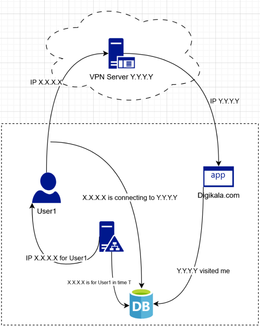
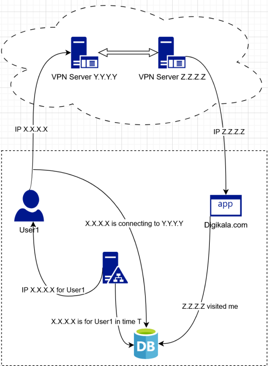

import Tooltip from "@site/src/components/Tooltip";

# چگونه در دنیای اینترنت ناشناس بمانیم؟

انسان‌ها در دنیای واقعی، به محض خروج از درب منزل، تحت نظر چشم‌ها هستند (به شرطی که لوازم الکترونیکی نقش ابزار جاسوسی را نداشته باشند و همچنین ابزار نظارتی خاصی در محیط، کارگذاری نشده باشد). این چشم‌ها می‌توانند الکترونیکی، مانند دوربین‌های مداربسته، یا انسانی، مثل مأمورهای دولتی باشند.
در دنیای دیجیتال اوضاع فرق می‌کند، تقریباً همۀ وقایع به‌صورت خودکار ثبت می‌شوند، برای مثال:

- زمان اتصال
- <Tooltip tip="Internet Protocol">IP</Tooltip> مبدأ (حتی IPهای پویا)
- IP مقصد
- پرسش <Tooltip tip="Domain Name System">DNS</Tooltip>
- الگوی ارسال بسته‌ها

دولت‌ها و اپراتورها می‌توانند با داشتن این اطلاعات فعالیت کاربران را به‌طور کامل رصد کنند و هویت آن‌ها را پیدا کنند. تفاوت عمدۀ ردپاها در دنیای دیجیتال با دنیای واقعی این است که وابسته به خصوصیات فیزیکی (مانند چهره) نیستند و با مجموعه‌ای از شناسه‌های فنی تعریف می‌شوند. با داشتن دانش کافی از معماری شبکه، می‌توان دانش دولت‌ها از کاربران را محدود کرد.
برای مثال، می‌دانیم که اپراتورها (ثابت و همراه) به کاربران IP تخصیص می‌دهند و تمامی فعالیت‌های آن IP در بازۀ تخصیصش در سطح زیرساخت ملی قابل‌ثبت و قابل‌پیگیری است. حال اگر با این IP به یک سرور خارجی متصل شویم و از IP آن سرور برای وب‌گردی استفاده کنیم، چه؟ در ظاهر، سایت مقصد فقط IP سرور خارجی را داشته و دسترسی به IP واقعی کاربر ندارد. اما در عمل، اپراتور داخلی می‌داند که شما در چه ساعتی به کدام سرور متصل شده‌اید و قسمت دیگری از دولت می‌داند که توسط یک IP، یک درخواست به داخل کشور آمده‌است. احتمالاً دولت می‌تواند حدس بزند این همان کاربری است که چندی پیش با IP داخلی خودش به آن سرور بسته می‌فرستاد.
مسئلۀ دوم که حتی مهم‌تر است، <Tooltip tip="Session">سشن</Tooltip> و <Tooltip tip="Cookie">کوکی</Tooltip> است. فرض کنید از طریق یک IP کاملاً متفاوت و ناشناس (مانند چند لایۀ <Tooltip tip="Virtual Private Network">VPN</Tooltip>، شبکۀ <Tooltip tip="The Onion Router">TOR</Tooltip>، استارلینک و…) وارد سایتی مانند دیجی‌کالا شوید. اگر با حساب کاربری شخصی خود لاگین کنید، سرور با استفاده از Session ID و کوکی ذخیره‌شده در مرورگر، هویت شما را تشخیص می‌دهد. در این حالت، IP جدید هیچ اهمیتی ندارد، چون شما خودتان هویت‌تان را اعلام کرده‌اید. به جز نام‌کاربری، کاربران اثرانگشت‌های دیگری مانند فونت‌ها، رزولوشن مرورگر، Canvas و WebGL دارند که با کنار هم قرار دادن چنین اطلاعاتی می‌توان هویت کاربر را از پشت یک IP کاملاً ناشناس کشف کرد.

  

 

حال اگر دو سرور خارجی داشته باشیم، چه؟ به‌عنوان نمونه، کاربر ابتدا به Server A متصل شود، سپس از داخل آن به Server B تونل بزند و خروجی اینترنت از Server B انجام شود. در این سناریو، سرور دوم IP واقعی کاربر را نمی‌بیند و فقط IP سرور اول را می‌شناسد. اپراتور داخلی نیز فقط اتصال به Server A را مشاهده می‌کند. این معماری زنجیرۀ تحلیل را پیچیده‌تر می‌کند و وابستگی به یک نقطۀ واحد را کاهش می‌دهد. با این حال، اگر کاربر از همان محیط مرورگر قبلی با کوکی‌های قدیمی یا حساب‌های شخصی استفاده کند، این لایه‌بندی فنی نیز بی‌فایده خواهد شد.
در مورد شبکۀ Tor نیز وضعیت مشابه است. Tor ترافیک را از ۳ گره ورودی، میانی و خروجی عبور می‌دهد تا مبدأ و مقصد از یک‌دیگر جدا باشند. گره ورودی IP اصلی کاربر را می‌بیند، ولی مقصد را نمی‌داند و گره خروجی نیز مقصد را می‌بیند، ولی IP واقعی را نمی‌داند. این طراحی برای کاهش امکان ردیابی مستقیم است. با این حال، ورود به حساب‌های شخصی از طریق Tor، 
نصب افزونه‌های اضافی، تغییر تنظیمات مرورگر یا باز کردن فایل‌های دانلودی خارج از محیط ایمن می‌تواند IP واقعی را افشا کند. منظور از محیط ایمن، Sandbox و یک <Tooltip tip="Virtual Machine">ماشین مجازی</Tooltip> بدون اینترنت است.

  

 

در مورد VPNها و کانفیگ‌های رایگان، بهتر است ابتدا یک پیش‌فرض ساده را بپذیریم: در اینترنت «خدمت رایگان بدون درآمد» تقریباً وجود ندارد. وقتی سرویسی هزینۀ زیرساخت، سرور و پهنای باند را پرداخت می‌کند، اما از کاربر پولی دریافت نمی‌کند، باید پرسید این هزینه از چه طریقی جبران می‌شود. در بسیاری از موارد، پاسخ در جمع‌آوری داده، فروش اطلاعات و یا بهره‌برداری‌های دیگر نهفته است. برخی افراد یا حتی مجموعه‌ها با اهداف مشخص، اشتراک‌های رایگان VPN را از طریق کانال‌های واسط، گروه‌های پیام‌رسان یا نرم‌افزارهایی با ظاهر عادی منتشر می‌کنند. کاربر تصور می‌کند صرفاً در حال تغییر IP است، در حالی‌که ممکن است تمام ترافیک او از زیرساختی عبور کند که به‌طور کامل تحت نظارت است. داده‌های تحت نظارت می‌توانند شامل IP واقعی، زمان اتصال، دامنه‌های بازدیدشده و در صورت نبود رمزنگاری سرتاسری، حتی محتوای کامل تبادل داده باشند.
ریسک دیگر، خود نرم‌افزار است. برخی اپلیکیشن‌های VPN رایگان علاوه‌بر ایجاد تونل، دسترسی‌های غیرضروری به دستگاه درخواست می‌کنند یا حاوی کدهای تبلیغاتی و حتی ماژول‌های مخرب هستند. در چنین حالتی، کاربر نه‌تنها ناشناس نشده، بلکه یک نقطۀ دسترسی مستقیم به دستگاه خود اضافه کرده‌است. تا زمانی که از صحت چرخۀ کامل یک VPN — شامل مالکیت سرورها، سیاست نگهداری لاگ‌ها، کد نرم‌افزار و غیره — اطلاع دقیق ندارید، استفاده از آن خطر قابل‌توجهی دارد. چنان‌چه به واسطۀ داشتن ژن خوب، دسترسی به IPهایی دارید که از طریق آن می‌توانید بدون مواجهه با دیوار آتش ملی به تمامی خدمات بین‌الملل دسترسی داشته باشید، توصیه می‌کنیم حتماً از VPN یا پروکسی استفاده کنید تا سرویس‌های بین‌المللی از هویت و ژن خوب مطلع نشوند تا مبادا حساب‌های کاربری شما بسته و یا محدود شود. کارهایی مانند جداسازی هویت‌های دیجیتال (داشتن چند ایمیل، حساب کاربری، مرورگر و…)، استفاده از محیط‌های مجزا (مثلاً ماشین مجازی یا سیستم‌عامل‌های موقت)، حذف منظم کوکی‌ها، کنترل نشت DNS و WebRTC و پرهیز از ترکیب هویت واقعی با زیرساخت ناشناس‌سازی از اصول پایه هستند. هر اشتباه کوچک، مانند یک لاگین ساده، می‌تواند تمام زنجیرۀ فنی را بی‌اثر کند. اینترنت فراموش نمی‌کند، بلکه ذخیره می‌کند.
