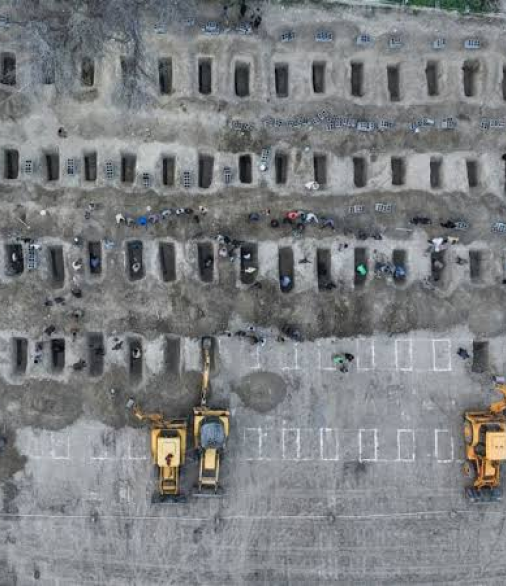

import Tooltip from "@site/src/components/Tooltip";

# پیامدهای ناخواسته راهبرد نامتقارن ایران و جنگ مبتنی بر هوش مصنوعی آمریکا بر حفاظت از غیرنظامیان

حذف این موانع از سوی پنتاگون نه‌تنها کنترل‌های فرایندی را از میان برد، بلکه زمان اختصاص‌یافته برای تحلیل اطلاعات ورودی را نیز به‌شدت کاهش داد. وقتی سامانه تنها هفتاد ثانیه به افسران فرصت می‌دهد تا درباره ارسال یک بسته هدف‌گیری تصمیم بگیرند، طراحی سیستم به‌طور ذاتی آنان را به سمت تأیید حمله سوق می‌دهد، حتی زمانی که میزان اطمینان نسبت به اطلاعات پایین باشد.
نتیجه چنین رویکردی روشن است: اشتباهات بیشتر و آسیب گسترده‌تر به غیرنظامیان.

  

 

دلایل موجهی برای نگرانی از تاثیرات استفاده از هوش مصنوعی نظامی وجود دارد.
برای نمونه، ارتش اسرائیل سامانه هوش مصنوعی‌ای به نام Lavender توسعه داده است که نقش محوری در هدایت موشک‌ها و بمب‌ها در جنگ غزه ایفا کرده است.
هدف این سامانه، شناسایی اعضای مشکوک حماس و جهاد اسلامی به‌عنوان اهداف بالقوه بود. تنها در هفته‌های نخست جنگ، Lavender حدود ۳۷ هزار فلسطینی را به‌عنوان گزینه‌های احتمالی حملات هوایی شناسایی کرد.
اما نیروهای ارتش اسرائیل زمان بسیار اندکی برای تأیید تصمیمات این سامانه در اختیار داشتند؛ در برخی موارد تنها ۲۰ ثانیه برای هر بسته هدف‌گیری. نگران‌کننده‌تر آنکه این سامانه در حدود ۱۰ درصد موارد دچار خطا می‌شد و افرادی را به‌عنوان هدف معرفی می‌کرد که تنها ارتباطی بسیار ضعیف، یا حتی هیچ ارتباطی، با گروه‌های مسلح نداشتند.
با توجه به حجم بالای حملاتی که بر اساس پیشنهادهای Lavender انجام شد، نرخ خطای ۱۰ درصدی احتمالاً به این معناست که هزاران غیرنظامی به اشتباه زخمی یا کشته شده‌اند.

در مورد جنگ ایران نیز گزارش‌ها نشان می‌دهد که حملات آمریکا خسارات سنگینی به غیرنظامیان و زیرساخت‌های غیرنظامی وارد کرده است.
گزارش روزنامه نیویورک تایمز آسیب واردشده به دست‌کم ۲۲ مدرسه و ۱۷ مرکز درمانی را تأیید کرده است؛ از جمله مدرسه‌ای در شهر میناب که در یکی از حملات آمریکا بیش از ۱۵۰ کودک جان خود را از دست دادند.

(همان گزارش تأکید می‌کند که ابعاد واقعی خسارات احتمالاً بسیار گسترده‌تر بوده است؛ زیرا جمعیت هلال احمر ایران، به‌عنوان اصلی‌ترین سازمان امدادرسان کشور، آسیب دیدن دست‌کم ۷۶۳ مدرسه و ۳۱۶ مرکز درمانی را در طول جنگ ثبت کرده است.)
این میزان حیرت‌آور خسارت، پرسش‌های جدی و فوری درباره دقت عملکرد Maven و همچنین میزان نظارت واقعی پنتاگون بر فرایند هدف‌گیری ایجاد می‌کند.
زمانی که زنجیره کشتار تا آن اندازه فشرده شود که نظارت معنادار انسانی عملاً به امری نمادین تبدیل گردد، تعادل میان سرعت و دقت بیش از حد به سمت سرعت متمایل شده است؛ در چنین شرایطی، کاهش سرعت فرایندهای مبتنی بر هوش مصنوعی ضرورتی اجتناب‌ناپذیر خواهد بود.
حداقل می‌توان گفت که سابقه نه‌چندان قابل اعتماد هوش مصنوعی نظامی، ادعاهایی را که می‌گویند استفاده از مدل‌های زبانی بزرگ در فرایند هدف‌گیری باعث افزایش دقت یا تشخیص بهتر غیرنظامیان از رزمندگان می‌شود، زیر سؤال می‌برد.
نگران‌کننده‌تر از آن، همان‌گونه که یک پژوهشگر حقوقی در مقاله‌ای اشاره می‌کند، سرعت و مقیاس هدف‌گیری مبتنی بر هوش مصنوعی این خطر را ایجاد می‌کند که میزان خسارات انسانی به سطحی بسیار فراتر از آنچه پیش‌تر تصور می‌شد برسد. این روند در نهایت اصل بنیادین خویشتن‌داری در <Tooltip tip="International Humanitarian Law (IHL)">حقوق بین‌الملل بشردوستانه</Tooltip> را تضعیف می‌کند؛ اصلی که بر این ایده استوار است که نیروهای نظامی باید در شیوه جنگیدن خود محدودیت‌هایی را رعایت کنند تا از تحمیل رنج و آسیب غیرضروری جلوگیری شود ([Carnegie Endowment](https://carnegieendowment.org/research/2026/05/the-unintended-consequences-of-irans-asymmetric-strategy-and-americas-ai-war)).
