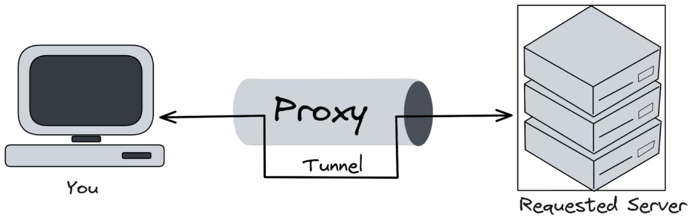

import Tooltip from "@site/src/components/Tooltip";

# مهندسی مقاومت در برابر سانسور

هنگام استفاده از کانفیگ‌های V2ray، باید واژگانی نظیر VMess، VLESS و Trojan را دیده باشید. کانفیگ‌هایی که برای اتصال به پلتفرم‌های فیلترشده یا تحریم‌شده نظیر تلگرام، اینستاگرام، فیس‌بوک، یوتیوب و X استفاده می‌کنیم، بخشی از زندگی روزمرۀ ما را تشکیل می‌دهند. این روزها اتصال پایدار به اینترنت به یکی از دغدغه‌های جدی هر شخص در ایران، به‌ویژه کسانی که به هر طریقی گذران زندگی روزمره‌شان به اینترنت وابسته است، تبدیل شده‌است. بنابراین شاید آشنایی با نحوۀ کارکرد برنامه‌هایی مانند NekoRay، V2RayN و به‌طور مشخص‌تر هستۀ آن‌ها مانند Xray، sing-box و V2Ray خالی از لطف نباشد.

## اجزای اکوسیستم اتصال: Client، Core و Protocol

برای داشتن یک دید منسجم‌تر، بهتر است در ابتدا مفاهیمی را تعریف کنیم. به ابزارهایی مانند Xray، sing-box و V2Ray که نقش محوری و اصلی دارند؛ یعنی پردازش ترافیک، پیاده‌سازی پروتکل‌ها و اجرای سیاست‌های مسیریابی و <Tooltip tip="Domain Name System">DNS</Tooltip> را انجام می‌دهند، هسته یا موتور می‌گوییم. در مقابل، به برنامه‌هایی نظیر NekoBox، V2RayNG، V2RayN و Nekoray که نقش یک رابط کاربری را ایفا می‌کنند و مدیریت پروتکل‌ها و کنترل یک هسته را ساده می‌کنند، کلاینت گفته می‌شود. نقش اصلی این کلاینت‌ها، ایجاد رابطی گرافیکی و ساده‌تر برای ارتباط با هسته است. در نهایت، همۀ این اسامی معروفی که تا به امروز با آن‌ها سر‌و‌کار داشتید، یعنی Shadowsocks، SOCKS5، VMESS، VLESS و Trojan نام پروتکل‌هایی هستند که تعیین می‌کنند <Tooltip tip="Authentication">احراز هویت</Tooltip>، <Tooltip tip="Encryption">رمزنگاری</Tooltip> و قالب پیام‌ها چگونه باشد و در نهایت لایۀ چهارم شبکه، یعنی <Tooltip tip="Transport Layer">لایۀ انتقال</Tooltip> است که مشخص می‌کند ترافیک روی چه حامل شبکه‌ای (<Tooltip tip="Transmission Control Protocol">TCP</Tooltip>، <Tooltip tip="User Datagram Protocol">UDP</Tooltip> یا <Tooltip tip="Quick UDP Internet Connections">QUIC</Tooltip>) حرکت کند.

## پروکسی، تونل زدن و کانفیگ

  

 

پروکسی یک واسطه است که بین کاربر و مقصد می‌ایستد و به‌جای این‌که سیستم، به‌طور مستقیم به سرور مقصد متصل شود، درخواست‌ها را به پروکسی می‌فرستد و پروکسی آن‌ها را به مقصد منتقل می‌کند. پروکسی معمولاً در لایۀ هفتم شبکه، یعنی <Tooltip tip="Application Layer">لایۀ کاربرد</Tooltip> عمل می‌کند.
از جمله اهداف رایج پروکسی زدن می‌توان به مخفی کردن IP کاربر، کنترل دسترسی، اعمال سیاست (مثلاً سیاست مسیریابی)، <Tooltip tip="Cache">کش</Tooltip> و در بسیاری از سامانه‌ها، اضافه کردن لایه‌های امنیتی و رمزنگاری اشاره کرد. دقت شود که پروکسی لزوماً <Tooltip tip="Virtual Private Network">VPN</Tooltip> نیست.
تونل زدن یعنی یک پروتکل یا جریان ترافیکی را داخل یک کانال دیگر کپسوله کنیم. گویی که داخل یک راهرو، یک راه دیگر بسازیم. تونل زدن عموماً برای ایجاد یک کانال امن با رمزنگاری و امنیت، عبور از محدودیت‌های شبکه، پایداری و کارایی ناشی از مدیریت بهتر Lossها استفاده می‌شود.
و در نهایت به کانفیگ می‌رسیم. کانفیگ‌ها فقط آدرس‌های سرورها نیستند، بلکه یک سند کامل سیاست و اتصال هستند که مشخص می‌کنند:

۱. به کجا وصل شویم؟ (شناسه‌های نقطۀ پایانی چیست؟)
۲. با چه روشی وصل شویم؟ (پروتکل‌هایی مانند VMess، VLESS و…)
۳. روی چه حامل شبکه‌ای اتصال را برقرار کنیم؟ (مانند پروتکل‌های لایۀ انتقال شامل TCP، UDP و…)
۴. چه چیز‌هایی کجا بروند؟ (قواعد مسیریابی، مستقیم یا از طریق تونل؟)
۵. مشکلات اتصال و دریافت پاسخ از DNS چگونه حل شوند؟ (استراتژی DNS و جلوگیری از نشت)
۶. و چطور اتصال، پایدار و بهینه باشد؟

بنابراین کانفیگ یک پشتۀ پروتکل-سیاست است که در ابزارهای اتصال، هم مسیر و قوانین را مشخص می‌کند و هم سیاست‌ها را تعیین می‌کند.

## پروتکل‌ها، ابزار سیاست و اتصال

در ادامه قصد دارم به برخی از رایج‌ترین پروتکل‌های کانفیگ‌ها اشاره کنم. برای هر پروتکل سعی شده که مطالب از مستند اصلی آن پروتکل استخراج شده باشد.

### VMess

پروتکل VMess پروتکل بومی V2Ray برای ارتباط بین کلاینت و سرور است و در مستندات رسمی به‌عنوان یک پروتکل stateless توصیف می‌شود؛ یعنی کلاینت و سرور می‌توانند داده را بدون یک handshake جداگانه منتقل کنند و هر تبادل داده، وابستگی مستقیمی به تبادل‌های قبل و بعد ندارد.
در مدل ارتباطی VMess، کلاینت آغازگر درخواست است و سرور در ابتدا تلاش می‌کند تشخیص دهد آیا درخواست از یک کلاینت معتبر آمده یا نه؛ اگر این اعتبارسنجی موفق باشد، درخواست به مقصد نهایی forward می‌شود و پاسخ دریافت‌شده دوباره به کلاینت بازگردانده می‌شود. این توصیف، VMess را در دستۀ پروتکل‌های پروکسی احراز هویت‌دار قرار می‌دهد که در آن مرحلۀ تشخیص هویت/اعتبار، بخشی از خود پروتکل است.
VMess یک پروتکل وابسته به زمان است و برای کارکرد درست، ساعت کلاینت و سرور باید با هم هم‌گام باشند، یعنی هر دو با UTC هم‌گام باشند. این ویژگی، هم یک فرض طراحی است و هم می‌تواند در برخی سناریوها منبع خطا یا سطح حمله باشد.
این پروتکل، یک پروتکل TCP-based است، یعنی در لایۀ انتقال از TCP استفاده می‌کند.
در نسخۀ مستند کانفیگ VMess در V2Fly نیز اشاره می‌شود که ترافیک VMess با رمزنگاری به شکل جریان‌های تصادفی دیده می‌شود (نوعی مبهم‌سازی از طریق رمزگذاری). این گزاره معمولاً در بحث <Tooltip tip="Deep Packet Inspection">DPI</Tooltip> به‌عنوان رویکرد look-like-nothing مطرح می‌شود؛ یعنی ترافیک سعی می‌کند شبیه محتوای قابل‌تشخیص نباشد، هرچند پژوهش‌های امنیت شبکه نشان داده‌اند که حتی این سبک هم ممکن است با روش‌های تشخیص آماری/رفتاری، هدف قرار بگیرد.

### VLESS

در مستند رسمی، VLESS به‌صورت صریح یک پروتکل stateless و lightweight معرفی می‌شود و به‌عنوان یک پل بین کلاینت و سرور Xray عمل می‌کند.
در همین منبع تأکید شده که برخلاف VMess، VLESS به زمان سیستم وابسته نیست و روش احراز هویت آن نیز <Tooltip tip="Universally Unique Identifier">UUID</Tooltip> است. این توصیف، از نظر مهندسی یعنی هویت کاربر یا کلاینت با یک شناسۀ پایدار (UUID) معرفی می‌شود، اما طراحی پروتکل به‌جای تکیه بر اعتبار زمانی پیام‌ها، تلاش می‌کند سبک‌تر و با حساسیت کم‌تری نسبت به همگام بودن ساعت باشد، نقطه‌ای که در برخی از محیط‌ها می‌تواند منبع خطا یا پیچیدگی باشد.
از منظر مدل لایه‌ای، VLESS بیشتر نقش پروتکل شناسایی و کنترل و حمل سبک را بازی می‌کند و معمولاً در یک پشته کنار لایه‌های دیگر معنا پیدا می‌کند. VLESS خودش به‌تنهایی رمزنگاری ارائه نمی‌کند و برای کارکرد صحیح، فرضش این است که در یک اتصال <Tooltip tip="Transport Layer Security">TLS</Tooltip> با پیکربندی درست به‌کار گرفته شود. VLESS در مستند V2Fly (شاخۀ v5) صراحتاً منسوخ‌شده اعلام شده و در معرض حذف توصیف می‌شود؛ یعنی از منظر نگهداری پروژه، ممکن است در آینده از این توزیع حذف شود. منسوخ بودن یک پروتکل معمولاً به معنی این است که توسعه‌دهندگان آن شاخه، تعهدی برای توسعه، رفع باگ و سازگاری آینده روی آن ندارند و به کاربران پیشنهاد می‌کنند به گزینه‌های دیگر مهاجرت کنند.

### Trojan

Trojan یک پروتکل و ساز‌و‌کار پروکسی مبتنی بر TLS است که ایدۀ محوری آن شبیه‌سازی ترافیک HTTPS است. در مستندات رسمی Trojan آمده که این پروژه به‌جای اتکا به مبهم‌سازی تصادفی، تلاش می‌کند رفتار خود را تا حد ممکن مشابه HTTPS نگه دارد. همچنین طراحی پروتکل طوری است که اتصال‌هایی که ساختار درست یا گذرواژۀ معتبر ندارند به یک endpoint از‌پیش‌تعیین‌شده هدایت می‌شوند تا سرور در برابر <Tooltip tip="Probing">کاوش‌گری</Tooltip> مشکوک، رفتاری شبیه یک سرویس عادی (مثلاً HTTP) داشته باشد. این ویژگی‌ها Trojan را به نمونه‌ای جالب از رویکرد استتار در قالب سرویس‌های رایج در بحث DPI و سانسور شبکه تبدیل می‌کند.
پروتکل Trojan را می‌توان در یک زنجیرۀ ساده خلاصه کرد: کلاینت ابتدا یک TLS handshake کاملاً معمولی با سرور (معمولاً روی پورت ۴۴۳) برقرار می‌کند؛ دقیقاً شبیه زمانی که یک وب‌سایت HTTPS باز می‌شود. پس از احراز هویت، ترافیک پروکسی تونل‌شده در همان کانال TLS جریان پیدا می‌کند و نیازی به ایجاد تونل جداگانه با الگوی شروع متفاوت نیست. نتیجه این است که از دید <Tooltip tip="Internet Service Provider">ISP</Tooltip> و فایروال، بسته‌ها عموماً شبیه ترافیک عادی مرور وب دیده می‌شوند و امضاء یا هدر اختصاصی واضحی برای علامت‌گذاری وجود ندارد. علاوه‌بر این، اگر تلاش برای کاوش یا درخواست غیر‌مجاز رخ دهد، سرور به‌جای خطای غیرعادی، یک پاسخ وب معتبر برمی‌گرداند؛ همین رفتار fail-safe شانس شناسایی خودکار را کاهش می‌دهد.

### Shadowsocks

Shadowsocks یک پروکسی رمز‌شده است که برای عبور دادن ترافیک TCP و UDP از طریق یک سرور واسط طراحی شده‌است؛ یعنی کلاینت به‌جای اتصال مستقیم به مقصد، داده را به سرور Shadowsocks می‌فرستد و سرور آن را به مقصد نهایی forward می‌کند. نسخه‌های مدرن Shadowsocks (به‌خصوص ۲۰۲۲) بر پایۀ <Tooltip tip="Authenticated Encryption with Associated Data">AEAD</Tooltip> ساخته شده‌اند؛ یعنی هم‌زمان محرمانگی و تمامیت داده را تضمین می‌کنند. Spec 2022 می‌گوید پروتکل از AEAD با یک کلید متقارن اشتراک‌گذاری‌شده از پیش (<Tooltip tip="Pre-Shared Key">PSK</Tooltip>) برای حفاظت از داده استفاده می‌کند. این یعنی مدل اعتماد Shadowsocks ساده است: «هر کس کلید را دارد، مجاز است».

### SOCKS5

پروتکل SOCKS (معمولاً SOCKS5) یک پروتکل پروکسی لایۀ کاربرد است که به کلاینت اجازه می‌دهد اتصال‌های TCP (و همچنین UDP در SOCKS5) را از طریق یک سرور واسط برقرار کند. در <Tooltip tip="Request for Comments">RFC</Tooltip> رسمی SOCKS5 آمده که این پروتکل برای application-layer traversal of IP network firewalls طراحی شده؛ یعنی راهی استاندارد برای عبور دادن ارتباط‌های برنامه‌ها از یک واسطه یا فایروال. نکتۀ کلیدی این است که SOCKS به‌تنهایی VPN یا تونل امن نیست؛ این پروتکل بیشتر نقش یک کانال‌دهنده را دارد: برنامه می‌گوید «به این مقصد وصل شو»، و سرور SOCKS اتصال را از طرف او برقرار می‌کند و داده را بین دو طرف رد و بدل می‌کند. در همان RFC تأکید شده که سطح امنیت بسیار وابسته به روش‌های احراز هویت و کپسوله‌سازی انتخاب‌شده در مذاکره وابسته است؛ یعنی خود SOCKS امنیت را تضمین نمی‌کند و این موضوع به انتخاب‌های جانبی بستگی دارد.
بنابراین، SOCKS یک استاندارد عمومی برای پروکسی کردن ترافیک است، اما Shadowsocks یک پروتکل پروکسی رمز‌شده با طراحی امنیتی مشخص؛ در نتیجه Shadowsocks اغلب کانال امن را خودش تعریف می‌کند، در حالی که SOCKS معمولاً به امنیت لایه‌های دیگر متکی است.

### Hysteria1 و Hysteria2

Hysteria (نسخۀ ۱) را می‌توان یک پروکسی مبتنی بر QUIC دانست که هدفش عملکرد خوب روی شبکه‌های ناپایدار و همچنین عبورپذیری در محیط‌های محدود‌شده است. در مستندات رسمی v1 صراحتاً گفته می‌شود پروتکل برای یک روش سریع، امن و قابل‌اعتماد جهت عبور از فایروال و سانسور طراحی شده و قابلیت استفاده روی TCP و همچنین UDP را دارد.
Hysteria2 (نسخۀ ۲) همین ایده را با یک تأکید پررنگ‌تر روی <Tooltip tip="Masquerading">نقاب زدن</Tooltip> HTTP/3 و مشخصات رسمی‌تر ادامه می‌دهد: در v2 آمده که برای یک شخص ثالث بدون اعتبارنامه (از جمله مرد میانی یا کاوش‌گر فعال)، سرور Hysteria2 باید مثل یک وب‌سرور استاندارد HTTP/3 رفتار کند و همچنین ترافیک رمز‌شده بین کلاینت و سرور در ظاهر شبیه ترافیک عادی HTTP/3 دیده شود. علاوه‌بر این، مستند v2 تأکید می‌کند که پروتکل باید بر پایۀ QUIC استاندارد (RFC 9000) پیاده‌سازی شود؛ یعنی حمل‌ونقل زیرین آن QUIC است و همین باعث می‌شود ویژگی‌های QUIC (مثل Multiplexing و رفتار مناسب‌تر روی مسیرهای ناپایدار) نقش پررنگی در کارکرد پروتکل داشته باشند.

## WireGuard و OpenVPN

WireGuard و OpenVPN، برخلاف پروکسی‌های قبلی که مطرح شدند، هر دو در خانوادۀ VPN/Tunnel قرار می‌گیرند، اما فلسفۀ طراحی‌شان متفاوت است. WireGuard یک تونل شبکۀ مدرن با طراحی مینیمال است که طبق مستندات رسمی از Noise_IK handshake استفاده می‌کند و تمام بسته‌ها را روی UDP می‌فرستد؛ همچنین در مقالۀ رسمی WireGuard روی ایدۀ نگاشت سادۀ «کلید عمومی همتا ⟷ هویت تونل» و یک تبادل کلید <Tooltip tip="Single Round-Trip">یک‌رفت‌وبرگشتی</Tooltip> تأکید می‌شود.
در مقابل، OpenVPN یک VPN قدیمی‌تر و بسیار رایج است که طبق مستندات رسمی می‌تواند هم در حالت کلید ایستا و هم در حالت SSL/TLS (با گواهی‌های کلاینت یا سرور) کار کند و بر پایۀ رابط‌های مجازی TUN/TAP ساخته شده‌است. داک رسمی OpenVPN همچنین توضیح می‌دهد که بعد از این‌که نشست TLS برقرار و احراز شد، از همان کانال TLS برای تبادل موارد کلیدی استفاده می‌شود تا کلیدهای رمزنگاری یا تمامیت کانال داده ساخته شوند؛ ضمن این‌که OpenVPN می‌تواند روی UDP و همچنین TCP اجرا شود.

## از پروتکل تا پروفایل؛ Npv چیست؟

شاید شما هم به تازگی با فایل‌های با فرمت `.npv` آشنا شده باشید و از تونل Npv برای اتصال به اینترنت استفاده کرده باشید. اما این فایل‌ها دقیقاً چه هستند و حاوی چه اطلاعاتی هستند؟
تونل Npv (که گاهی با نام NapsternetV هم شناخته می‌شود) را می‌توان یک کلاینت چندپروتکلی دانست که هدفش ساده کردن استفاده از چند خانوادۀ اتصال در یک برنامۀ واحد است. در توضیحات رسمی منتشر‌شده برای این برنامه اشاره می‌شود که از چند نوع روش و پروتکل رایج پشتیبانی می‌کند (از جمله خانوادۀ V2Ray مانند VLESS یا VMess و نیز گزینه‌هایی مثل Shadowsocks، Trojan و SOCKS). همین چندپروتکلی بودن باعث می‌شود تونل Npv بیش‌تر از آن‌که یک کلاینت ساده باشد، نقش یک مدیر اتصال را بازی کند؛ جایی که کاربر پروفایل‌ها را نگه می‌دارد، بین آن‌ها جابه‌جا می‌شود و تجربه‌ای یکپارچه از چند فناوری متفاوت می‌گیرد.
در کنار خود برنامه، پسوند `.npv` معمولاً به‌عنوان یک فایل پیکربندی و پروفایل برای همین ابزار مطرح می‌شود. نکتۀ مهم این است که `.npv` را نباید هم‌ردیف VMess یا VLESS دانست. `.npv` پروتکل شبکه نیست، بلکه یک بسته‌بندی برای پروفایل‌ها و تنظیمات است که فرایند <Tooltip tip="Import/Export">وارد/خارج کردن</Tooltip> کانفیگ را ساده می‌کند. منابعی که پسوند فایل را معرفی می‌کنند هم `.npv` را به‌عنوان فایل مرتبط با NapsternetV/Npv و در نقش فایل تنظیمات یا پروفایل دسته‌بندی می‌کنند.
اهمیت چنین فایل‌هایی از زاویۀ مهندسی این‌جاست که آن‌ها یک لایۀ کم‌تر دیده‌شده در اکوسیستم اتصال را نمایندگی می‌کنند: لایۀ حمل‌ونقل دانش عملیاتی. یعنی علاوه‌بر این‌که خود پروتکل‌ها مشخص می‌کنند داده روی سیم چگونه رد و بدل می‌شود، این فایل‌ها مشخص می‌کنند کاربر چگونه آن دانش را ذخیره، منتقل و بازتولید می‌کند. یک فایل `.npv` می‌تواند مجموعه‌ای از پروفایل‌ها و ترجیحات را یک‌جا جابه‌جا کند و به همین دلیل در فضای اشتراک‌گذاری کانفیگ‌ها محبوب می‌شود. چون تبدیل تنظیمات پیچیده به چیزی قابل‌حمل را ممکن می‌کند.

## کلاینت‌ها، همراه همیشگی!

کلاینت‌ها در این اکوسیستم معمولاً نقش ظاهری یا مدیریتی دارند: یعنی به‌جای این‌که خودشان همه‌چیز را از صفر پیاده‌سازی کنند، کارشان مدیریت پروفایل‌ها، وارد یا خارج کردن کانفیگ‌ها، سوئیچ بین سرورها و کنترل یک هسته در پشت‌صحنه (مثل Xray یا sing-box) است. از این منظر، ابزارهایی مثل NekoRay (عموماً دسکتاپ) و V2rayNG (اندروید) و Happ (همۀ سیستم‌ها) بین کاربران محبوب هستند، چون تجربۀ کاربری ساده، مدیریت چند پروفایل و سازگاری با طیف وسیعی از پروتکل‌ها را فراهم می‌کنند. برخی کلاینت‌ها علاوه‌بر حالت پروکسی سیستم، گزینه‌هایی مثل TUN/VPN-mode هم ارائه می‌دهند تا ترافیک برنامه‌های بیشتری را پوشش دهند.
در کنار این‌ها، بعضی نام‌ها مثل V2Ray بیشتر به خود هسته اشاره دارند تا یک کلاینت رابط کاربری؛ اما در عمل کاربران با ابزارهایی سر‌و‌کار دارند که یا مستقیماً V2Ray/Xray/sing-box را اجرا می‌کنند یا خروجی‌های استاندارد (مثل SOCKS/HTTP proxy) می‌دهند تا برنامه‌های دیگر از آن استفاده کنند. حتی Happ نیز، معمولاً در همین دسته قرار می‌گیرد، یک ابزار مدیریت اتصال که چند پروتکل را زیر یک رابط واحد جمع می‌کند. جمع‌بندی ساده این است: کلاینت خوب آن است که پشت‌صحنۀ هسته را درست و پایدار مدیریت کند، وارد یا خارج کردن مطمئن داشته باشد و بدون پیچیده کردن تجربۀ کاربر، پروفایل‌ها و سیاست‌های اتصال را قابل‌کنترل کند.
