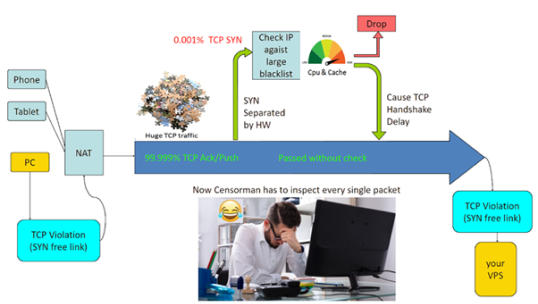
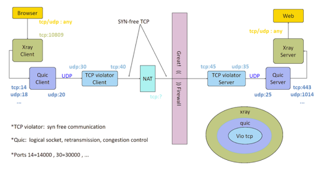

import Tooltip from "@site/src/components/Tooltip";

# شورش در لایهٔ چهارم

## چکیده

در این مقاله به بررسی فنی دو پروژهٔ ساختارشکن GFW-Knocker و paqet می‌پردازیم که با رویکردی کاملاً متفاوت از ابزارهای رایج، سامانه‌های فیلترینگ را دور می‌زنند. این پروتکل‌ها به‌جای تلاش برای مخفی شدن در <Tooltip tip="Application Layer"><span>لایهٔ کاربرد</span></Tooltip>، با نقض عمدی استانداردهای TCP و حذف مرحلهٔ <Tooltip tip="Three-way Handshake"><span>دست‌تکانی سه‌مرحله‌ای</span></Tooltip> در <Tooltip tip="Transport Layer"><span>لایهٔ انتقال</span></Tooltip>، نقطهٔ ضعف و محدودیت‌های پردازشی فایروال‌های ملی را هدف قرار می‌دهند. در این مطلب خواهیم دید که چگونه برنامه‌نویسان با استفاده از <Tooltip tip="Raw Sockets"><span>سوکت‌های خام</span></Tooltip> و تزریق مستقیم داده‌ها به بسته‌های ACK، توانسته‌اند سد سانسور اینترنت را به‌جای دور زدن، به شکلی بنیادین بشکافند.

## مقدمه

در دنیای شبکه‌های کامپیوتری، همواره یک موش و گربه‌بازی جذاب بین سامانه‌های سانسور اینترنت (مانند فایروال بزرگ چین یا همان <Tooltip tip="Great Firewall"><span>GFW</span></Tooltip>) و توسعه‌دهندگان ابزارهای دور زدن فیلترینگ وجود دارد. اگر به ابزارهایی که تا امروز استفاده کرده‌ایم (مثل Trojan، V2Ray یا انواع VPNها) نگاهی بیندازید، متوجه می‌شوید که تمرکز اکثر آن‌ها روی مخفی کردن ترافیک در لایهٔ کاربرد شبکه است. این روش‌ها سعی می‌کنند داده‌های شما را شبیه به یک وب‌گردی امن و عادی جلوه دهند. اما به‌تازگی پروژه‌ای در گیت‌هاب با نام gfw_resist_tcp_proxy رویکرد کاملاً جدیدی را معرفی کرده‌است: سوراخ کردن سد فیلترینگ در لایهٔ انتقال.

## فایروال‌های ملی چگونه IPها را مسدود می‌کنند؟

قبل از بررسی راه‌حل، باید بدانیم در سطح کلان، سامانه‌های فیلترینگ چگونه کار می‌کنند. تصور کنید یک <Tooltip tip="Virtual Private Server"><span>سرور مجازی</span></Tooltip> مسدود شده‌است و فایروال باید جلوی ارتباط کاربران با آن IP خاص را بگیرد.
در حالت استاندارد هر ارتباط TCP با سازوکاری به نام دست‌تکانی سه‌مرحله‌ای آغاز می‌شود:

1. کلاینت یک بستهٔ SYN برای سرور می‌فرستد (درخواست ارتباط).
2. سرور با یک بستهٔ SYN-ACK پاسخ می‌دهد (تأیید درخواست).
3. کلاینت یک بستهٔ ACK می‌فرستد و سپس ارسال داده‌ها آغاز می‌شود.

فایروال‌های ملی در درگاه‌های ورودی و خروجی کشور با حجم عظیمی از ترافیک (چندین ترابایت بر ثانیه) روبه‌رو هستند. بررسی تک‌تک بسته‌های عبوری برای پیدا کردن IPهای لیست سیاه، نیازمند سخت‌افزارهای فوق‌العاده گران‌قیمت (میلیون‌ها دلار سرمایه‌گذاری) است و عملاً با نرم‌افزارهای معمولی قابل‌انجام نیست. بنابراین، فایروال‌ها یک میان‌بر پردازشی می‌زنند: آن‌ها فقط بسته‌های اولیه یعنی SYN را بررسی می‌کنند. اگر IP مقصد بستهٔ SYN در لیست سیاه باشد، آن بسته اصطلاحاً Drop می‌شود (یا با ارسال یک بستهٔ جعلی TCP-RST، ارتباط قطع می‌شود) و ارتباط هرگز شکل نمی‌گیرد.

### ایدهٔ اصلی پروتکل: نقض قوانین TCP

اگر فایروال فقط بسته‌های SYN را مسدود می‌کند، چرا ما اصلاً برای شروع ارتباط بستهٔ SYN بفرستیم؟! این پروتکل پیشنهاد می‌کند که مرحلهٔ دست‌تکانی سه‌مرحله‌ای را به‌طور کامل دور بزنیم. در این روش، کلاینت ارتباط را بدون ارسال بستهٔ SYN و مستقیماً با فرستادن بسته‌های ACK یا PUSH آغاز می‌کند! بسته‌های ACK معمولاً حاوی داده‌های اصلی در میانهٔ یک ارتباط هستند و تعداد آن‌ها در شبکه، صدها هزار بار بیشتر از بسته‌های SYN است.
فایروال‌های ملی معمولاً در برخورد با این بسته‌ها به‌صورت Stateless عمل می‌کنند؛ یعنی چون نمی‌توانند وضعیت میلیون‌ها ارتباط همزمان را در حافظهٔ RAM خود نگه دارند، فرض را بر این می‌گذارند که این بستهٔ ACK متعلق به ارتباطی است که قبلاً با موفقیت برقرار شده، پس به آن اجازهٔ عبور می‌دهند! تلاش برای مسدود کردن تمام بسته‌های ACK، باعث افت شدید سرعت روترهای مرکزی و از هم پاشیدن کل شبکهٔ اینترنت می‌شود. در نتیجه، داده‌های ما در قالب بسته‌های ACK به‌راحتی از فایروال عبور کرده و به سرور مسدود‌شده می‌رسند.

<div style={{ textAlign: "center" }}>
  <div style={{}}></div>
</div>

<div style={{ textAlign: "center", fontSize: "0.9em", opacity: 0.85 }}>
  تصویر ۱ (معماری کلاسیک مسدودسازی): کلاینت در تلاش است با استاندارد TCP به سرور متصل شود. تجهیزات فیلترینگ (مثل GFW) پورت و IP را شنود کرده و به محض رؤیت پرچم SYN، بسته را معدوم کرده و مانع از رسیدن آن به مقصد می‌شوند.
</div>
<br />

## تغییر پارادایم: از مخفی شدن تا شکافتن سد

اکثر روش‌های ضدسانسور فعلی، سعی در مخفی شدن دارند. اما این پروتکل پارادایم فیلترینگ را تغییر می‌دهد. ما در این روش نیازی به مخفی شدن نداریم؛ بلکه با صدای بلند به همان IP مسدودشده متصل می‌شویم، اما از مسیری استفاده می‌کنیم که فایروال به‌دلیل محدودیت‌های سخت‌افزاری خود، توان پردازشی لازم برای مسدود کردن آن را ندارد. این یعنی شکافتن سد فیلترینگ به‌جای دور زدن آن. فرقی نمی‌کند لایه‌های بالایی از چه پروتکلی استفاده کنند، این روش در پایین‌ترین سطح ممکن، هر پورتی را سوراخ می‌کند.

### چالش‌های فنی و نحوهٔ پیاده‌سازی

طبیعتاً سیستم‌عامل‌های ما به برنامه‌ها اجازه نمی‌دهند که بدون ارسال SYN، ارتباط شبکه‌ای برقرار کنند. برای دور زدن این محدودیت، پروتکل از تکنیک سوکت‌های خام استفاده می‌کند و بسته‌های شبکه را بایت‌به‌بایت به‌صورت دستی می‌سازد (Packet Crafting).

<div style={{ textAlign: "center" }}>
  <div style={{}}></div>
</div>

<div style={{ textAlign: "center", fontSize: "0.9em", opacity: 0.85 }}>
  تصویر ۲ (معماری دور زدن با نقض قوانین TCP): کلاینت با حذف پرچم SYN، داده را مستقیماً کپسوله می‌کند. فایروال این ترافیک را بی‌خطر تشخیص داده و عبور می‌دهد و سرور نیز برای دریافت و رمزگشایی این بسته‌های غیرمتعارف آماده است.
</div>
<br />

### محدودیت بزرگ این روش

این پروتکل با وجود ایدهٔ نبوغ‌آمیزش، روی برخی شبکه‌های موبایل (مثل اپراتورهای 4G و TD-LTE) به مشکل می‌خورد. دلیل آن، وجود دستگاه‌های NAT پیشرفته (CGNAT) در شبکه‌های موبایل است. این روترها برای عبور ترافیک بین IP داخلی گوشی شما و اینترنت، باید جدول پورت‌ها را به‌روز کنند. اگر روتر NAT اپراتور موبایل، بستهٔ SYN شما را نبیند، اصلاً پورت را باز نمی‌کند و به بسته‌های ACK ساختگی شما اجازهٔ خروج نمی‌دهد. همچنین نیاز به دسترسی Root باعث می‌شود اجرای این روش روی گوشی‌های موبایل هوشمند برای کاربران عادی بسیار دشوار باشد.

## تکامل ایده: از مفهوم اولیه تا پروژهٔ paqet (نسخهٔ Go)

همان‌طور که اشاره شد، مخزن gfw_resist_tcp_proxy، بیشتر نقش یک <Tooltip tip="Proof of Concept"><span>اثبات مفهوم</span></Tooltip> را ایفا می‌کند تا نشان دهد این روش ساختارشکنانه امکان‌پذیر است. اما دنیای متن‌باز به‌سرعت این ایدهٔ خام را پرورش داد. نتیجهٔ این تکامل، تولد پروژهٔ دیگری به نام paqet است که دقیقاً از همین سازوکار (یعنی نقض استانداردهای TCP و دور زدن دست‌تکانی سه‌مرحله‌ای) استفاده می‌کند، اما با معماری بسیار بهینه و با زبان Go توسعه یافته‌است. ورود زبان Go و بازنویسی این پروتکل در مخزن paqet، دو مزیت حیاتی به همراه داشته‌است:

**سرعت و مدیریت <Tooltip tip="Concurrency"><span>همزمانی</span></Tooltip>:** زبان Go ذاتاً برای پردازش‌های سنگین شبکه‌ای طراحی شده‌است. به همین دلیل، paqet می‌تواند هزاران اتصال همزمان را بدون افت عملکرد و با مصرف بهینهٔ منابع سرور (RAM و CPU) مدیریت کند.

**تلفیق با پروتکل KCP:** توسعه‌دهندگان paqet به‌جای اتکای صرف به بسته‌های خام، پروتکل KCP را روی این بسته‌های دستکاری‌شدهٔ TCP پیاده‌سازی کرده‌اند. پروتکل KCP برای شبکه‌هایی با <Tooltip tip="Packet Loss"><span>افت بسته</span></Tooltip> بالا بهینه‌سازی شده‌است. این یعنی حتی در اینترنت‌های پر از اختلال، خطاهای شبکه با سرعت جبران شده و ارتباط با پایداری خیره‌کننده‌ای برقرار می‌ماند. پروژهٔ paqet با بهره‌گیری از کتابخانه‌هایی مثل pcap (برای شنود بسته‌ها) و gopacket (برای ساخت دستی بسته‌ها)، مستقیماً با لایه‌های پایین سیستم‌عامل تعامل کرده و پشتهٔ استاندارد TCP/IP سیستم‌عامل را به کل دور می‌زند. این مخزن اثبات می‌کند که ایدهٔ سوراخ کردن فایروال از یک تئوری دانشگاهی فراتر رفته و در حال تبدیل شدن به ابزاری قدرتمند، پایدار و عملیاتی در لایهٔ انتقال شبکه است.

### دست‌به‌کد شویم

کالبدشکافی یک پکت دست‌ساز در زبان Go در پروتکل‌هایی مثل paqet، برنامه‌نویس نمی‌تواند از توابع استاندارد شبکه در سیستم‌عامل (مانند `net.Dial` در زبان Go) استفاده کند؛ چرا که سیستم‌عامل به‌صورت خودکار یک بستهٔ SYN را برای شروع ارتباط ارسال می‌کند که برخلاف هدف ماست.
برای دور زدن این رفتار، توسعه‌دهندگان از کتابخانه‌هایی مانند gopacket استفاده می‌کنند تا بسته‌ها را بایت‌به‌بایت، به‌صورت دستی طراحی کنند (عملی که به آن Packet Crafting می‌گویند).
در قطعهٔ کد ساده‌شدهٔ زیر می‌بینیم که چگونه یک بستهٔ TCP با پرچم‌های دستکاری‌شده ساخته می‌شود.
چه اتفاقی در این کد افتاد؟ در بخش دوم کد، ما صراحتاً پرچم ACK و PSH را true قرار داده‌ایم و هیچ پرچم SYNای مقداردهی نشده‌است. سپس با استفاده از SerializeLayers، این لایه‌های نرم‌افزاری را به همراه پیام اصلی خود به یک رشتهٔ خام از بایت‌ها تبدیل می‌کنیم. حالا این بستهٔ غیرمتعارف، از طریق سوکت‌های خام مستقیماً به کارت شبکه فرستاده می‌شود. فایروال با دیدن پرچم ACK تصور می‌کند این بسته متعلق به یک ارتباط از پیش‌تأییدشده است و اجازهٔ عبور آن را صادر می‌کند!

```go
package main

import (
	"net"
	"github.com/google/gopacket"
	"github.com/google/gopacket/layers"
)

func main() {
	// 1. Creating Network Layer (IP)
	ipLayer := &layers.IPv4{
		SrcIP:    net.ParseIP("192.168.1.10"), // Client IP
		DstIP:    net.ParseIP("203.0.113.50"), // Filtered Server IP
		Version:  4,
		Protocol: layers.IPProtocolTCP,
	}

	// 2. Creating Transport Layer (TCP) - Magic is here!
	tcpLayer := &layers.TCP{
		SrcPort: layers.TCPPort(43210),
		DstPort: layers.TCPPort(443),
		ACK:     true, // Activating ACK (Without SYN!)
		PSH:     true, // PSH Flag for sending data immediately
		Window:  1500,
	}

	// Calculating checksum to avoid packets from being dropped by routers
	tcpLayer.SetNetworkLayerForChecksum(ipLayer)

	// 3. Capsulate and convert layers to bytes (Serialization)
	buf := gopacket.NewSerializeBuffer()
	opts := gopacket.SerializeOptions{ComputeChecksums: true, FixLengths: true}

	// Mix IP and TCP layers (Payload)
	gopacket.SerializeLayers(buf, opts, ipLayer, tcpLayer,
		gopacket.Payload([]byte("Secret Data Request!")))

	// Ready to inject to network card
	packetBytes := buf.Bytes()
	_ = packetBytes
}
```

### نتیجه‌گیری

پروژهٔ نقض قوانین TCP یک نمونهٔ بی‌نظیر برای درک عمیق مدل OSI و رفتار پروتکل‌های شبکه است. این پروژه نشان می‌دهد که چگونه شناخت دقیق نقاط ضعف سیستم‌های کلان (مانند گلوگاه‌های پردازشی فایروال‌ها) می‌تواند منجر به خلق راهکارهایی شود که پیشرفته‌ترین فایروال‌های جهان را فلج کند.
