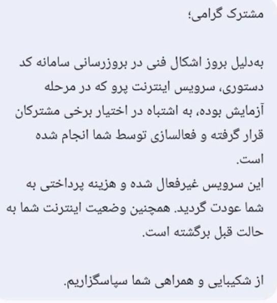

import Tooltip from "@site/src/components/Tooltip";

# ما ماندیم و اینترنت پرو!

در دی‌ماه سال گذشته که متن‌های «قطعی بزرگ» و «اینترنت، حق مسلم» را می‌نوشتم، نقل‌قول‌ها و نشانه‌هایی از اینترنت پرو و طبقاتی را با تعجب ذکر می‌کردم و آن را برای جامعه خطرناک می‌دانستم؛ اما اگر بخواهم واقعیت را بگویم، هیچ‌گاه تصور نمی‌کردم که به این زودی جامۀ عمل به خود بپوشد و عملیاتی شود، هیچ‌گاه فکرش را هم نمی‌کردم که به این زودی دوباره دست‌به‌قلم شوم تا متنی چنین دردناک از بار مسئولیتی به این حد سنگین که بر دوش ما نهاده شده، به تحریر در بیاورم. آن زمان که حتی ۱۰۰ روز هم از آن نمی‌گذرد، تصور می‌کردیم که بزرگ‌ترین قطعی اینترنت تاریخ را تجربه کرده‌ایم و سال‌ها قرار نیست مانند آن را ببینیم؛ اما پیش از آن‌که متن‌ها به مرحلۀ چاپ برسند، قطعی به‌مراتب بزرگ‌تر را تجربه کردیم؛ قطعی‌ای که دیگر فقط قطعی نبود، بلکه اتصالی هولناک برای عده‌ای خاص به نام «اینترنت پرو» را به‌همراه داشت.

اما اکنون که اینترنت پرو به میان آمده و گاهی در بازار سیاه معامله می‌شود، و ابزارهای خاص اتصال مانند <Tooltip tip="Virtual Private Network">VPN</Tooltip> شریف نیز گاهی در دسترس قرار می‌گیرند، شاید یک پرسش بیش از پیش خودنمایی کند: «وظیفۀ ما چیست؟». آیا ما اعضای جامعه نیز، مسئولیتی در قبال استفاده از این اینترنت طبقاتی ناعادلانه داریم یا باید تمام مسئولیت ناشی از این پدیده را متوجه دولت و نهادهای تصمیم‌گیر بدانیم و خود، به‌راحتی از آن استفاده کنیم و به آن مشروعیت ببخشیم؟ یا آن‌که نسخه‌ای برای همۀ جامعه بپیچیم که نباید از این اینترنت استفاده کنید، ولو اگر خسارات سنگینی متحمل شوید؟

بیایید ابتدا کمی به این مقولۀ ناخوشایند، یعنی پیدایش اینترنت پرو بپردازیم. سال‌ها صحبت از پدیده‌ای به نام «سیم‌کارت سفید» در میان بود، اما هیچ‌گاه به‌طور علنی تأیید نشد و ساز‌و‌کار استفاده از آن نیز مشخص نشد. در دی‌ماه سال ۱۴۰۴، شایعاتی مبنی‌بر ایجاد سیم‌کارت‌هایی که عادی نیستند و پرو نام دارند، به میان آمد. در اوایل اسفندماه همان سال، بعضی از گروه‌های تلگرامی آگهی‌هایی از فروش آن منتشر کردند و امکان خرید آن برای عده‌ای فراهم شد ([سایت زومیت](https://www.zoomit.ir/report/457331-pro-simcard-special-internet/)). پس از شروع جنگ، در روز ۱۲ اسفند، یک کد دستوری منتشر شد که با شماره‌گیری آن و پرداخت ۴۰ هزار تومان به‌ازای هر گیگابایت، استفاده از اینترنت با محدودیت کمتر از حد معمول ممکن می‌شد — با آن‌که تمامی پلتفرم‌ها هنوز رفع فیلتر نشده بودند، اما بسیاری از آن‌ها مانند تلگرام، اینستاگرام، توییتر و یوتیوب بدون محدودیت اجرا می‌شدند. اما این سرویس بعد از چند ساعت از دسترس خارج شد و اپراتورهای مربوطه بیان کردند که به‌دلیل بروز اشکال فنی در به‌روزرسانی سامانۀ کد دستوری، سرویس اینترنت پرو به‌اشتباه در اختیار کاربران قرار گرفته‌است.

اشتباهی که نشان از عزم آنان، جهت ساخت مسیری برای تبعیض آشکار در اتصال بود. پس از آن، هر روز اخبار جدیدی از فعال شدن اینترنت پرو برای عده‌ای به گوش می‌رسید و این اینترنت طبقاتی مشروعیت بیشتری به خود می‌بخشید؛ تا آن‌جا که در نهایت با تأیید مسئولین دولتی همراه شد؛ تا جایی که در ۲۲ اردیبهشت، مهاجرانی — سخنگوی دولتی که با وعدۀ برخورد با اینترنت طبقاتی که آن زمان اینترنت سفید نام داشت، به روی کار آمد — در پاسخ به پرسش‌های خبرنگاران در خصوص اینترنت پرو می‌گوید که اینترنت پرو، مصوبۀ شورای عالی امنیت ملی را دارد که آقای رئیس جمهور، رئیس آن شورا هستند. در ادامه نیز ذکر می‌کند که این اینترنت، مخصوص کسب‌و‌کارهاست. مشخص نیست هنگامی که عموم مردم دسترسی به اینترنت ندارند، صاحبان کسب‌و‌کار چگونه می‌توانند محصولات یا خدمات خود را به مردم معرفی کنند. در ادامه خانم مهاجرانی می‌گویند که کشور در شرایط جنگی است و این اقتضاء شرایط جنگی است که امنیت مردم در اولویت نسبت به همه‌چیز قرار بگیرد ([سایت انتخاب](https://www.entekhab.ir/fa/news/921016/%D8%A8%D8%A8%DB%8C%D9%86%DB%8C%D8%AF-%D8%A8%DA%AF%D9%88%D9%85%DA%AF%D9%88%DB%8C-%D8%AE%D8%A8%D8%B1%D9%86%DA%AF%D8%A7%D8%B1%D8%A7%D9%86-%D9%88-%D8%B3%D8%AE%D9%86%DA%AF%D9%88%DB%8C-%D8%AF%D9%88%D9%84%D8%AA-%D8%A8%D8%B1-%D8%B3%D8%B1-%D8%A7%DB%8C%D9%86%D8%AA%D8%B1%D9%86%D8%AA)). اما در این هنگام باید به یک پرسش بنیادین و سخت پاسخ داده شود: اتصال اینترنت زندگی مردم را در خطر بزرگ‌تری قرار می‌دهد یا قطعی آن؟

با تمامی این کشمکش‌ها، هم‌چنان اتصال عموم مردم قطع است و طرح اینترنت پرو استوار است؛ طرحی که باعث ایجاد بازار سیاهی آشکار شده و به‌راحتی در دسترس بسیاری قرار گرفته‌است. پرسش دیگری که باید مطرح شود این است که آیا اتصال تا این اندازه گسترده، باعث در خطر افتادن امنیتی که خودشان می‌گویند، نمی‌شود؟! آیا غیر از این است که امکان اتصال برای افرادی که از تمکن مالی بالاتری برخوردار بودند، فراهم شده‌است و به‌صورت آشکار یک نظام طبقاتی ساخته‌است که در آن افراد ثروتمند حق دسترسی بیشتری نسبت به باقی جامعه به اینترنت دارند؟! آیا نباید از اپراتورهای مربوطه بپرسیم که در حال ارائۀ چه خدمت اضافه‌ای هستند که آن‌قدر اختلاف قیمت نسبت به اینترنت در دسترس عموم وجود دارد؟!

  

 

هرچه که هست، گوشی به سخنان ما بدهکار نیست. قرار نیست که گفته‌های ما موجب اتصال اینترنت عموم و از میان برداشته شدن طرح اینترنت پرو شود، همان‌طور که ایجاد آن به خواستۀ ما نبوده‌است. در این‌جا به پرسش اصلی این متن برمی‌گردیم. آیا این اختیار نداشتن ما، نشانه‌ای از سلب مسئولیت ما در برابر ایجاد این نظام طبقاتی است که ثروتمند را ارجح بر نیازمند، دانشجو را مقدم بر آحاد جامعه و پزشک را برتر از بیمارانش بر می‌شمارد؟!

بی‌شک، شانه خالی کردن است اگر فقط بگوییم که هیچ مسئولیتی نداریم. ما هم مسئولیم. هر گیگابایت اینترنتی که خریداری می‌شود و یا هر VPNای که به سبب دانشجو بودن‌مان به ما اختصاص داده می‌شود، در واقع مهر تأییدی است بر این رانت. همان‌طور که وقتی عده‌ای خاص به سبب ارتباطات‌شان می‌توانند خودروها را با قیمت بسیار پایین‌تر از قیمت بازار از کارخانه خریداری کنند، در ذهن ما تصویری از ناعدالتی نقش می‌بندد؛ اگر اتصال به اینترنت حق است، داشتن خودرویی به قیمت تمام‌شدۀ کارخانه هم حق است. اگر این‌گونه استدلال کنیم که اتصال به اینترنت یک امر ضروری است، اما خودروی ارزان نه، باید از خود بپرسیم که آیا واقعاً این‌طور است؟ آیا ما حقوقی داریم که یکی بر دیگری ضرورت دارد؟ آیا می‌توان از حق خودرو چشم پوشید و از اتصال اینترنت برای خودمان، نه؟

آیا اتصال ما دانشجویان یا پزشکان و یا صاحبان کسب‌و‌کارها مهم‌تر از دیگر اعضای جامعه است؟ چون این اقشار جامعه فعالیتی به‌ظاهر مهم‌تر از دیگران انجام می‌دهند، صلاحیت بیشتری دارند؟

حال اگر فردی نیاز مبرم به اتصال برای دسترسی به فعالیت‌های به‌ظاهر کم‌اهمیت‌تر، مانند وقت‌گذرانی در اینستاگرام، دیدن ویدیو از یوتیوب و بسیاری از امور به‌ظاهر کوچک دیگر که آرامش ذهنی او را فراهم می‌کند، داشته باشد و به‌دلیل قطعی دچار مشکل حاد روانی شود، بخشی از مسئولیتش با مایی که آسوده با این عنوان که حق بیشتری داریم، نیست؟!

آیا اتصال من کم‌خطرتر از اتصال پدربزرگم است، که به من این حق داده شده‌است، اما به او نه؟

لازم است ذکر کنم که دسترسی به اینترنت برای عموم مردم، طبق منشور سازمان ملل، یکی از حقوق اولیۀ بشری شناخته می‌شود، مانند آب! در نظر داشته باشید که یک «اما» مطرح است؛ «اما»یی بنیادین و اساسی.

چه کسی به ما حق قضاوت دیگران را داده‌است؟ چه کسی به ما این حق را داده‌است که برای جامعه‌ای به این بزرگی یک نسخهٔ واحد بپیچیم و بدون در نظر گرفتن شرایط هر فرد به او بگوییم «تو حق استفاده از این مقوله را نداری»؟ اگر زندگی فردی با این اینترنت گره خورده بود، آن‌وقت چه؟

اما آیا فقط در این حالت حق استفاده از اینترنت را به افراد می‌دهیم؟ مرز استفاده از این نوع اینترنت کجاست؟ آیا ما می‌توانیم تعیین کنیم؟ <Tooltip tip="Milan Kundera">میلان کوندرا</Tooltip> در کتاب «بار هستی»، وقتی دوراهی‌های مهم زندگی را ترسیم می‌کند، انتخاب را با «ضروری است!» موجه می‌سازد. حال ما نیز در یک دوراهی قرار داریم و وقت آن است که با خود بیندیشیم که آیا این اتصال یک «ضروری است!» هست یا نیست؟ اگر هست، آیا «ضروری است!» دیگری وجود دارد که در مقابل آن باشد؟ آن‌گاه کدام یک را باید برگزید؟
حقیقت این است که هر یک از ما یک بار زیسته‌ایم و این بدین معناست که به واقع نزیسته‌ایم، پس هیچ‌کس نمی‌تواند بگوید که چه درست است و چه غلط. کدام انتخاب ما اثر مثبت‌تری خواهد داشت.

آری، پرسش ما همان پرسشی است که <Tooltip tip="پارمنیدس (Parmenides) فیلسوف یونانی که در حدود سال‌های ۵۴۰ تا ۴۵۰ پیش از میلاد مسیح می‌زیست.">پارمنیدس</Tooltip> از خود پرسید. سنگینی یا سبکی؟ سنگینی بار مسئولیت و تعهد ناشی از قبول این نوع اتصال، یا سبکی حاصل از رد آن؟ شاید این سبکی و سنگینی با یک‌دیگر متضاد باشند، اما به‌واقع بسیار به هم شبیه‌ هستند.

هر دو به‌گونه‌ای تحمل‌ناپذیر هستند و هیچ‌یک بر دیگری برتر نیست. هر کدام از ما باید در خود بنگریم و این را از خود بپرسیم: «سبکی رد این اتصال، یا سنگینی پذیرش آن؟»
