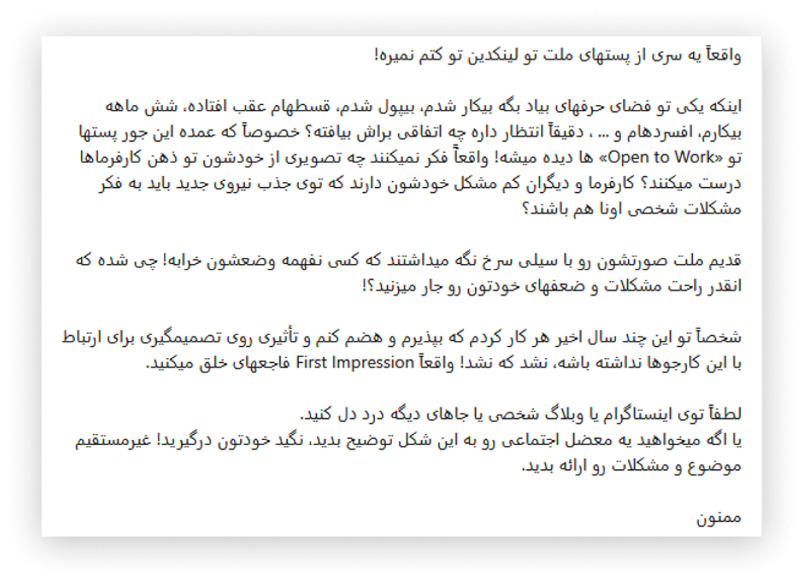

# کاسبان قطعی اینترنت، خوش‌حالید؟

در روزگاری که کشور پیاپی درگیر اعتراضات، تنش‌های نظامی و تورم افسارگسیخته است و بازار کار به بحرانی‌ترین وضعیت خود در سال‌های اخیر رسیده، آمار قطعی و محدودیت‌های اینترنت هر روز رکوردهای جدیدی بر جای می‌گذارد و روبان‌های سبزرنگ Open to Work در پلتفرم لینکدین بیش از هر زمان دیگری خودنمایی می‌کنند. با این حال، در میان این بحران، افرادی حضور دارند که در حوزۀ قطعی سازمان‌یافته و حاکمیتی اینترنت، در لبه‌های علم و فناوری فعالیت می‌کنند!

شایسته است به بهانۀ نابودی کسب‌وکار میلیون‌ها انسان که به‌طور مستقیم یا غیرمستقیم از طریق اینترنت امرار معاش می‌کردند، نگاهی به ماهیت تجاری و گردش مالی «کاسبان قطعی اینترنت» بیندازیم.

حکایت این کاسبان، حکایت یک‌دستی نیست. گاهی این ناجیان از جنس خودمان‌اند؛ رهگذرانی خسته که می‌بینند خانه‌مان در آتش بی‌تدبیری دیگران می‌سوزد و با سطلی آب به یاری می‌آیند تا از این مهلکه جان سالم به در ببریم. اما تراژدی تاریک‌تر آن‌جاست که گاهی همین ناجی، دقیقاً همان کسی است که نیمه‌شب با دبۀ بنزین به جان خانه‌مان افتاده و حالا در روشنایی روز، با لباسی سفید و چهره‌ای حق‌به‌جانب، کپسول اطفای حریق را به قیمت تمام دارایی‌مان به ما می‌فروشد.

به‌طور کلی، این افراد به چهار دستۀ اصلی تقسیم می‌شوند.

## ۱. تأمین‌کنندگان سرویس‌های قطع و محدودسازی اینترنت

این گروه، قانونی‌ترین فعالیت ضد حقوق بشری را در ایران اجرا می‌کنند — هرچند که به‌دلیل تحریم‌های بین‌المللی، ردپای خود را در کشورهای دیگر پنهان می‌سازند. این دسته با فروش زیرساخت‌های فنی به نهادهای امنیتی، درآمدهای کلانی کسب می‌کنند. این دسته مستقیماً از سفرۀ مردم ارتزاق می‌کنند و گویی شب‌ها نیز با وجدانی آسوده سر بر بالین می‌گذارند.
شگفت آن‌که این افراد گاه بسیار پرادعا و خودشیفته نیز ظاهر می‌شوند. در حالی‌که با قطع اینترنت مردم، موجب کاهش ۸۰ درصدی موقعیت‌های شغلی و رکوردشکنی آمار تعدیل نیرو در شرکت‌ها شده‌اند، به شهروندانی که در سال گذشته نزدیک به ۵ ماه از دسترسی به اینترنت بین‌الملل محروم بوده‌اند و به لطف محصول بی‌نقص این گروه‌ها بی‌کار شده‌اند توصیه‌های اخلاقی نیز ارائه می‌دهند! قضاوت این دسته با خداست، اما حقا که آدم بی‌حیا، پرده‌دری خویش را خودش می‌کند.

## ۲. بازیگران بزرگ سرویس‌های دور زدن فیلترینگ

گروهی دیگر با دور زدن محدودیت‌ها، به‌صورت رسمی و ساختاریافته و با اسمی شیک‌تر کانفیگ‌فروشی می‌کنند. این افراد چنان به لایه‌های بالای قدرت متصل هستند که طرح‌هایی مانند «اینترنت پرو» و «خط سفید» را به قانون تبدیل می‌کنند. بعد هم با شعار حمایت از کسب‌وکارها و دانشجویان، اقدام به تطهیر فعالیت خود می‌کنند.
تجربۀ سالیان گذشته، به‌ویژه سال اخیر که عملاً سال قطع مداوم دسترسی‌ها بود، این حقیقت را اثبات کرده‌است که برخی از این جریان‌ها ابتدا خود زیرساخت‌های قطع اینترنت را پیاده‌سازی می‌کنند و سپس با نام‌هایی چون «اینترنت پرو» و «خط سفید»، همان اینترنت را به شکلی ارباب‌رعیتی به فروش می‌رسانند.

## ۳. ژن‌های خوب و منسوبان به قدرت

بخش دیگری از ارائه‌دهندگان سرویس‌های قطعی و محدودیت را ژن‌های خوب تشکیل می‌دهند. این منسوبانِ به قدرت، تمایل دارند خود را «کارآفرین» جلوه دهند، در کار اپراتورهای رسمی دخالت نکنند و سفرۀ اقتصادی خود را مجزا نگه دارند تا مایۀ افتخار پدران‌شان باشند. این افراد به واسطۀ نفوذ والدین خود، چنان به کانون‌های قدرت متصل هستند که زنجیره‌ای گسترده و عظیم را در صنعت اینترنت کشور ایجاد کرده‌اند.
برخی از آن‌ها تجهیزات استارلینک را به‌راحتی قاچاق کرده و با قیمت‌های چندبرابری به فروش می‌رسانند؛ برخی دیگر نیز بر بستر همان خطوط «پرو» دریافت‌شده یا اینترنت ماهواره‌ای وارداتی خود، اقدام به فروش کانفیگ و فیلترشکن می‌کنند.

  

## ۴. بازار خانگی و خرده‌فروشان کانفیگ

در این میان، بازیگران کوچک و خانگی نیز در بازار حضور دارند که می‌توان آن‌ها را به بازیگران جزء در صنعت مافیایی خودرو تشبیه کرد. اگر فرض کنیم با یک مافیای بزرگ اینترنت مواجه هستیم، طبیعی است که برای ساکت نگه‌داشتن افکار عمومی، باید سهم کوچکی از بازار را به خودِ مردم واگذار کنند. مافیاهای بزرگ اینترنت می‌دانند که بهترین ضامن بقای فساد، توزیع و همگانی کردن آن است. جوانانی که باید استعدادشان در پروژه‌های علمی و صنعتی ملی استفاده می‌شد اما اکنون بیکار هستند، باید چنین حس کنند که در سیستم شما از طریق کانفیگ‌فروشی آینده‌ای خواهند داشت!
این دسته از جوانان یا این کار را به‌عنوان شغل اصلی و فرعی ادامه می‌دهند، یا از این چرخه خارج شده و مهاجرت می‌کنند تا از دانش خود در مسیر مفیدی بهره ببرند و یا این‌که به مرور زمان به مافیاهای اینترنتی جدیدی تبدیل می‌شوند. در هر صورت، سیستم فاسد طراحی‌شده برنده است؛ شما به‌عنوان یک بازیگر بزرگ به درآمدهای دلاری خود می‌افزایید، کانفیگ با قیمت نجومی به دست مردم می‌رسد و آن بازیگر کوچک نیز با ترس و لرز فراوان، درآمد ناچیزی کسب می‌کند. مردم می‌بازند و فساد برنده می‌شود…

## بررسی گردش مالی کاسبان فیلترینگ

بررسی ابعاد مالی این حوزه، عمق فاجعه را بیشتر نمایان می‌کند. در ادامه به تفکیک گروه‌ها، به این موضوع می‌پردازیم.

### گروه اول: شرکت‌های ساختاریافته و پیمانکار

متأسفانه قراردادهای رسمی قابل‌استنادی در درگاه‌های دولتی برای این موضوعات وجود ندارد؛ چرا که شفافیت قراردادهای دولتی در کشور ما صرفاً در آستانۀ انتخابات مطرح می‌شود. پس از آن، با طرح بهانه‌های امنیتی، شرایط تحریم و این‌که شفافیت به‌مثابۀ «پاس گل به دشمن» است، این مفهوم به حاشیه رانده می‌شود و در نتیجه منبع رسمی‌ای در این خصوص در دسترس نیست.
مشخص نیست که این افراد خدمات خود را گران فروخته‌اند یا صرفاً با انگیزه‌های ایدئولوژیک فریب خورده‌اند. با این حال، امیدواریم اگر مخاطب این متن هستند (*There is an Imposter among us*) دیدگاهی برآوردی نسبت به گردش مالی آقازاده‌ها و اینترنت سفیدفروشان پیدا کنند و دست‌کم کمی از حاشیۀ سود آن‌ها بکاهند و خود را ارزان نفروشند!

### گروه دوم: فروش اینترنت پرو (اینترنت طبقاتی و آپارتاید)

در این بخش، اپراتورهای تلفن همراه، بهترین نمونه برای بررسی هستند. از آن‌جا که از میان اپراتورهای اصلی، تنها یک اپراتور در بورس تهران عرضه شده‌است، صرفاً می‌توان داده‌های همین شرکت را ارزیابی کرد.
طبق بررسی‌های صورت‌گرفته در سامانۀ کدال، این شرکت با وجود تمام چالش‌های ناشی از قطعی اینترنت در ماه‌های اخیر، روند درآمدی مطلوبی را حفظ کرده‌است. این امر با توجه به قطعی اینترنت بین‌الملل و تعرفۀ پایین‌تر ترافیک داخلی و همچنین گرایش بیشتر مردم به استفاده از خطوط اینترنت ثابت، منطقی به نظر نمی‌رسد؛ به‌ویژه در شرایطی که شرکت‌های مشابه در حوزۀ اینترنت ثابت، با افت محسوس درآمدهای خود نسبت به سال گذشته مواجه شده‌اند، تا جایی که شایعۀ ورشکستگی برخی از آن‌ها نیز مطرح شد.
به‌دلیل وجود نداشتن شفافیت لازم در صورت‌های مالی این شرکت‌ها، امکان دسته‌بندی دقیق درآمدها وجود ندارد و این بنگاه‌ها می‌توانند درآمدهای حاصل از فروش سیم‌کارت‌های «سفید» را در بخش‌هایی مانند فروش کلی اینترنت و خدمات، پنهان کنند.
از سوی دیگر، شواهد نشان می‌دهد که بساط فروش پنهانی اینترنت طبقاتی حتی پیش از تنش‌های اخیر نیز برقرار بوده‌است. سیم‌کارت‌هایی موسوم به «سفید» که به خبرنگاران، آقازادگان، چهره‌های سیاسی و نزدیکان آن‌ها اعطا شده بود و برای مدتی طولانی پنهان نگاه داشته شد. پنهان‌کاری چهره‌های سیاسی و صاحبان رانت طبیعی است، اما این‌که خبرنگاران وابسته و غیروابسته به دولت، این رانت بزرگ را مدت‌ها کتمان کرده بودند، لکۀ ننگ بزرگی بر پیشانی آنان است و بیش از پیش نشان می‌دهد که چرا افکار عمومی به خبرگزاری‌ها اعتمادی ندارند. چه تضمینی وجود دارد که این افراد قلم خود را به بهایی ناچیز نفروشند و به مردم دروغ تحویل ندهند؟
از حاشیه خارج شویم و به بحث اصلی برگردیم؛ پیش‌بینی دقیق درآمد این شرکت‌ها ممکن نیست. تنها دادۀ موجود، گزارشی از خبرگزاری تسنیم (به‌عنوان یک رسانۀ حاکمیتی) است که با تخمین ۳ میلیون مصرف‌کننده برای این طرح، درآمد یک‌سالۀ کاسبان را ۵۰۰ میلیون دلار برآورد کرده بود. این شرکت‌ها پیش از معرفی «اینترنت پرو»، از طریق فروش خطوط سفید نیز درآمدزایی می‌کردند و چه‌بسا هزینۀ خدمات به‌ظاهر باکیفیت خود را از بودجۀ عمومی و بیت‌المال تأمین کرده باشند. تنها راه دسترسی به آمار دقیق این گروه و گروه اول، افشای اسناد محرمانۀ شرکتی و دولتی است.

### گروه سوم و چهارم: فروش فیلترشکن‌های خط سفید، استارلینک و تجهیزات ماهواره‌ای

غیررسمی‌ترین بخش صنعت قطعی اینترنت در این لایه نهفته است. تخمین سرمایۀ عظیمِ در گردش در این بخش، کاری دشوار اما ممکن است؛ به‌ویژه آن‌که بازیگران بزرگی مانند آقازادگان فروشندۀ وی‌پی‌ان یا قاچاق‌چیان تجهیزات استارلینک حضور پررنگی در آن دارند؛ موضوعی که محاسبۀ درآمد این افراد را به امری پرمخاطره تبدیل می‌کند. محاسبۀ درآمدهای بازیگران خانگی نیز به‌دلیل گستردگی، دشواری‌های زیادی دارد. با این حال، آمارها و برآوردهایی از گردش مالی این بخش وجود دارند که قابل‌تأمل هستند.

- **نرخ‌های نجومی در دوران پیک قطعی:** در جریان تنش‌ها و قطعی‌های دی‌ماه و قطعی‌های اسفند تا اردیبهشت، مبالغ شگفت‌آوری برای هر گیگابایت اینترنت آزاد مطرح می‌شد. نرخ تعادلی بازار برای کانفیگ‌های استارلینک از ۲ تا ۴ میلیون تومان و برای کانفیگ‌های معمولی از ۳۰۰ تا ۷۰۰ هزار تومان متغیر بود. در زمان اوج محدودیت‌ها، تنها یکی از کیف‌پول‌های دیجیتال شناسایی‌شده در حوزۀ فروش فیلترشکن توانست رکوردی میلیون دلاری ثبت کند.
ارقام فروش کانفیگ در اواخر دورۀ محدودیت‌ها و با کاهش نسبی سخت‌گیری‌ها، حدود ۳۰ تا ۴۰ درصد افت کرد. در این وضعیت آن سوال همیشگی جذاب مطرح می‌شود: آیا از افزایش قیمت دلار از ۱۰۰ هزار تومان به ۱۷۰ هزار تومان خوشحال‌تر می‌شوی یا از کاهش آن از ۲۰۰ هزار تومان به ۱۷۰ هزار تومان؟

- **تجهیزات استارلینک:** در حوزۀ فروش تجهیزات استارلینک، با ارقام بسیار عجیبی مواجه هستیم؛ تا جایی‌که دیش‌های ۲٬۰۰۰ تا ۲٬۵۰۰ دلاری استارلینک در ایران با قیمت‌هایی فراتر از ۱۰٬۰۰۰ دلار معامله می‌شد. تعداد دیش‌های فعال در ایران در اواسط دی‌ماه توسط منابع خارجی، چند ده هزار دستگاه تخمین زده شد.

- **وضعیت کنونی بازار کانفیگ:** در حال حاضر که محدودیت‌ها کمی کاهش یافته، نرخ تعادلی بازار منطقی‌تر شده و با افزایش ۵۰ تا ۱۰۰ درصدی نسبت به پیش از قطعی‌های دی‌ماه، رشدی متناسب با تورم را ثبت کرده‌است.

- **حجم گردش مالی:** شایان ذکر است که دو سال پیش، گردش مالی سالانۀ این حوزه، ۵ همت پیش‌بینی می‌شد، اما در جدیدترین آمارها و در خوش‌بینانه‌ترین حالت، گردش مالی ماهانۀ این حوزه، ۳٫۷ هزار میلیارد تومان برآورد شده‌است؛ یعنی معادل ۵ میلیارد تومان در هر ساعت!
در مجموع، پایین‌ترین برآوردها نشان‌دهندۀ گردش مالی سالانه‌ای بین ۲۵۰ تا ۳۵۰ میلیون دلار در این بخش است و بالاترین تخمین‌ها سخن از اعدادی بین ۲ تا ۴ برابر اعداد بالا ارائه می‌دهند!

این بحران در شرایطی رخ می‌دهد که طبق آمارها، نزدیک به ۷۰ تا ۸۰ درصد مردم کشور با ابزارهای فیلترینگ درگیر هستند و این یعنی بخش بزرگی از جامعه، این هزینۀ تحمیلی را در سبد کالا و خدمات خود دارند.
امیدواریم مسئولان کشور همان‌طور که برای خودرو نظام قرعه‌کشی راه‌اندازی کرده‌اند، برای خانوارهای دارای بیش از دو فرزند و افراد دارای گوشی‌های فرسوده نیز طرحی در نظر بگیرند تا اینترنت باکیفیت، همانند خودروهای درجه‌یک ایران‌خودرو و سایپا به دست مردم برسد و این چالش نیز با تلاش شبانه‌روزی ایشان هرچه زودتر برطرف گردد! همچنین پیشنهاد می‌شود مسئولین به جهت کنترل بازار کانفیگ چند سلطان کانفیگ را به جرم احتکار کانفیگ دادگاهی کنند.

## جمع‌بندی

تخمین دقیق اعداد و ارقام در این حوزه به دلیل عدم شفافیت، بسیار دشوار و نیازمند کار کارشناسی گسترده است.
در این متن تلاش شد تصویری کلی از بازیگران کلیدی این صنعت و درآمدهای آنان ارائه شود؛ صنعتی که گردش مالی سالانۀ آن در مجموع گروه‌های مختلف و بازیگران غیرمستقیم (مثل سرویس‌هایی که مشابه خارجی‌شان فیلتر شده‌است)، می‌تواند به میلیاردها دلار و حتی فراتر نیز برسد!

در این ارزیابی، از آقازادگان دارای ژن خوب تا دانشجویان ترمک و سال دومی کامپیوتر که برای گذران زندگی با ترس و لرز فراوان کانفیگ‌فروشی می‌کنند را مورد بررسی قرار دادیم.

در نهایت به یک پرسش بنیادین و فلسفی می‌رسیم که پاسخ مطلق و روشنی برای آن نداریم؛ آیا کسی که در دوران قطعی، هر گیگابایت اینترنت آزاد را به قیمت ۲ میلیون تومان به فروش می‌رساند، رابین‌هود بود یا گرگی در لباس رابین‌هود؟

به هر حال، مسئله این نیست که چه کسی و با چه اهدافی ما را به اینترنت آزاد وصل کرد، مسئله این است که چرا از ابتدا اینترنت آزاد نداشتیم…
