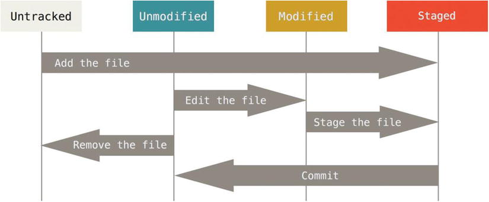

import Tooltip from "@site/src/components/Tooltip";

# مقدمه و آغاز کار با گیت

<div style={{ textAlign: "center", width: "60%", marginInline: "auto" }}>
  <div style={{}}></div>
</div>

## چرا گیت؟

### گیت چیست؟

گیت یک <Tooltip tip="Version Control System"><span>سیستم کنترل نسخه</span></Tooltip> است که به شما امکان مدیریت و ردیابی تغییرات پروژه را می‌دهد.

### مشکلات بدون گیت

- هماهنگی بین چند برنامه‌نویس سخت است
- بازگشت به نسخه‌های قبلی مشکل است
- ادغام تغییرات چند نفر دشوار است
- از دست دادن کد در صورت خطا

### راه‌حل گیت

- هر نفر یک نسخه کامل از پروژه روی سیستم خود دارد
- تمام تغییرات در تاریخچه ذخیره می‌شود
- می‌توانید به هر نسخه قبلی برگردید
- تغییرات به راحتی با دیگران هماهنگ می‌شود
- کار گروهی بدون تداخل انجام می‌شود

## نصب گیت

### دانلود و نصب

برای نصب گیت، به [صفحه رسمی نصب گیت](https://git-scm.com/install/) مراجعه کنید و نسخه مناسب سیستم‌عامل خود را دانلود کنید.

**نصب در سیستم‌عامل‌های مختلف:**

- **Windows**: فایل `exe` را از سایت رسمی دانلود و نصب کنید
- **macOS**: از Homebrew استفاده کنید: `brew install git`
- **Linux**: از package manager استفاده کنید: `sudo apt install git`

### بررسی نصب

پس از نصب، در ترمینال دستور زیر را اجرا کنید تا نسخه نصب‌شده گیت را ببینید:

```bash
git --version
```

اگر گیت به درستی نصب شده باشد، خروجی مشابه زیر را خواهید دید:

```
git version 2.52.0
```

## تنظیمات اولیه

قبل از شروع کار با گیت، باید نام کاربری و ایمیل خود را تنظیم کنید. این اطلاعات در کامیت‌ها نمایش داده می‌شوند و برای کار تیمی ضروری است.

از دستور `git config --global` برای تنظیمات سراسری استفاده می‌کنیم:

```bash
git config --global user.name "نام شما"
git config --global user.email "email@example.com"
```

:::tip
پرچم `--global` باعث می‌شود این تنظیمات برای تمام پروژه‌های شما اعمال شود.
:::

### مشاهده تنظیمات

برای مشاهده تمام تنظیمات گیت خود، از دستور زیر استفاده کنید:

```bash
git config --list
```

## فعال‌سازی کلید SSH

کلید SSH برای اتصال امن به سرورهای گیت استفاده می‌شود. در این بخش مراحل راه‌اندازی آن را یاد می‌گیرید.

### ایجاد کلید SSH

در ترمینال (یا Git Bash در ویندوز) دستور زیر را اجرا کنید و ۳ بار Enter بزنید:

```bash
ssh-keygen
```

این دستور یک کلید SSH در مسیر `~/.ssh/id_rsa` ایجاد می‌کند.

:::info
اگر از قبل کلید SSH دارید، می‌توانید از همان استفاده کنید یا یک کلید جدید با نام متفاوت ایجاد کنید.
:::

### فعال‌سازی SSH Agent

```bash
eval `ssh-agent`
```

### اضافه کردن کلید به SSH Agent

**macOS:**

```bash
ssh-add -K ~/.ssh/id_rsa
```

:::note
در صورت وجود فایل `~/.ssh/config`، این دو خط را اضافه کنید:
:::

```
Host *
UseKeychain yes
```

**Linux/Windows:**

```bash
ssh-add ~/.ssh/id_rsa
```

### تنظیم کلید در GitHub

1. به [تنظیمات SSH Keys در GitHub](https://github.com/settings/keys) بروید
2. روی "New SSH key" کلیک کنید
3. یک عنوان انتخاب کنید
4. محتوای `~/.ssh/id_rsa.pub` را در قسمت Key قرار دهید
5. "Add SSH key" را بزنید

برای تست اتصال به GitHub:

```bash
ssh -T git@github.com
```

## ریپازیتوری

### ریپازیتوری چیست؟

<Tooltip tip="Repository">
  <span>ریپازیتوری</span>
</Tooltip>
مجموعه‌ای از تاریخچه تمام کامیت‌های پروژه از ابتدا تا کنون است. هر ریپازیتوری
شامل نسخه فعلی پروژه و تمام نسخه‌های قبلی آن می‌شود.

### انواع ریپازیتوری

- <Tooltip tip="Local Repository">
    <span>ریپازیتوری محلی</span>
  </Tooltip>
  : ریپازیتوری روی کامپیوتر شما
- <Tooltip tip="Remote Repository">
    <span>ریپازیتوری راه‌دور</span>
  </Tooltip>
  : ریپازیتوری روی سرور (مثل GitHub یا Gitlab)

### نحوه کار با ریپازیتوری

در گیت، هر عضو تیم:

- یک کپی کامل از پروژه و تاریخچه آن روی سیستم خود دارد
- می‌تواند تغییرات را ایجاد و کامیت کند
- تغییرات را به سرور <Tooltip tip="push"><span>ارسال</span></Tooltip> می‌کند
- تغییرات دیگران را از سرور <Tooltip tip="pull"><span>دریافت</span></Tooltip> می‌کند

### مثال ساده

1. شما یک فایل `file.txt` می‌سازید و کامیت می‌کنید
2. کامیت را به سرور ارسال می‌کنید
3. هم‌تیمی شما تغییرات را از سرور دریافت می‌کند
4. او فایل را ویرایش می‌کند و کامیت جدید می‌سازد
5. این روند ادامه می‌یابد و پروژه پیشرفت می‌کند

:::tip
سرور همیشه نسخه رسمی و به‌روز پروژه را نگه می‌دارد.
:::

## دستورات git init و git clone

### git init

برای تبدیل یک پروژه موجود به ریپازیتوری< گیت، از دستور `git init` استفاده می‌کنیم:

```bash
git init <PATH>
```

این دستور یک ریپازیتوری خالی با فولدر `.git` ایجاد می‌کند که تاریخچه تغییرات در آن ذخیره می‌شود.

:::info
اگر در دایرکتوری فعلی باشید، دستور `git init` همان دایرکتوری را به ریپازیتوری تبدیل می‌کند.
:::

### git remote add

برای اتصال ریپازیتوری محلی به یک <Tooltip tip="Remote Repository"><span>ریپازیتوری راه‌دور</span></Tooltip> (مثل GitHub یا GitLab)، از دستور زیر استفاده می‌کنیم:

```bash
git remote add <NAME> <REPOSITORY_URL>
```

**مثال:**

```bash
git remote add origin https://github.com/Byte-Magazine/byte-site
```

:::tip
نام `origin` به طور پیش‌فرض برای ریپازیتوری اصلی استفاده می‌شود، اما می‌توانید نام دلخواه انتخاب کنید.
:::

:::warning
این دستور فقط اتصال را برقرار می‌کند و فایل‌ها را به سرور ارسال نمی‌کند. برای ارسال فایل‌ها باید از دستور `git push` استفاده کنید.
:::

### git clone

برای دریافت یک پروژه از سرور و ساخت کپی محلی از آن، از دستور `git clone` استفاده می‌کنیم:

```bash
git clone <REPOSITORY_URL>
```

**مثال:**

```bash
git clone https://github.com/Byte-Magazine/byte-site
```

یا با نام دلخواه:

```bash
git clone https://github.com/Byte-Magazine/byte-site my-test-project
```

:::info
با `clone` کردن یک پروژه، تمام کامیت‌ها و تاریخچه پروژه روی سیستم شما کپی می‌شود.
:::

## چرخه حیات وضعیت فایل‌ها

<div style={{ textAlign: "center", width: "60%", marginInline: "auto" }}>
  <div style={{}}></div>
</div>

- **Untracked**: فایل توسط گیت پیگیری نمی‌شود
- **Unmodified**: فایل شناسایی شده و تغییری ندارد
- **Modified (not staged)**: فایل تغییر کرده اما به Staging Area اضافه نشده
- **Staged**: فایل آماده کامیت است

## دستورات add و status

### git add

برای اضافه کردن فایل‌ها به Staging Area از دستور `git add` استفاده می‌کنیم:

```bash
git add <filename>
```

**مثال:**

```bash
git add file.txt
git add file1.txt file2.txt
```

برای اضافه کردن همه فایل‌ها:

```bash
git add .
```

یا

```bash
git add -A
```

:::info
فایل‌های جدید به طور پیش‌فرض Untracked هستند و باید با `git add` به گیت معرفی شوند.
:::

### git status

برای مشاهده وضعیت فایل‌ها و تغییرات، از دستور `git status` استفاده می‌کنیم:

```bash
git status
```

## دستور commit

پس از stage کردن فایل‌ها، می‌توانیم با دستور `git commit` یک کامیت ایجاد کنیم:

```bash
git commit -m "commit message"
```

:::tip
پیام کامیت باید واضح و خلاصه باشد تا در آینده بتوانید به راحتی تغییرات را متوجه شوید. در ادامه با
:::

### روش‌های مختلف کامیت

**کامیت فایل‌های خاص بدون stage کردن:**

```bash
git commit file.txt -m "change content in file.txt"
```

این دستور فایل را stage و سپس کامیت می‌کند.

**کامیت همه فایل‌های tracked:**

```bash
git commit -a -m "update all tracked files"
```

پرچم `-a` همه فایل‌های tracked را stage و کامیت می‌کند.

:::warning
فایل‌های جدید (untracked) با `-a` کامیت نمی‌شوند. باید ابتدا با `git add` اضافه شوند.
:::

### git log

برای مشاهده تاریخچه کامیت‌ها از دستور `git log` استفاده می‌کنیم:

```bash
git log
```

این دستور اطلاعات زیر را نمایش می‌دهد:

- شناسه کامیت (hash)
- کاربر و زمان کامیت
- پیام کامیت

**مشاهده تاریخچه یک فایل خاص:**

```bash
git log file.txt
```

**مشاهده تاریخچه یک دایرکتوری:**

```bash
git log dir1/
```

### هش کامیت

هر کامیت یک شناسه یکتا به نام **hash** دارد که یک رشته 40 کاراکتری (hexadecimal) است. مثال:

```
a9c30aad7f0d8b39d54ae0f68ba3c9c97a7c3b5c
```

این هش از محتوای کامیت (فایل‌ها، پیام، تاریخ و ...) محاسبه می‌شود و برای هر کامیت منحصر به فرد است.

**استفاده از hash:**

- می‌توانید از چند کاراکتر اول hash برای اشاره به کامیت استفاده کنید (معمولاً 7 کاراکتر کافی است)
- برای مشاهده جزئیات یک کامیت خاص:

```bash
git show a9c30a
```

:::info
گیت از الگوریتم SHA-1 برای تولید hash استفاده می‌کند. هر تغییر کوچک در کامیت، hash کاملاً متفاوتی ایجاد می‌کند.
:::

## دستور tag

از دستور `git tag` برای علامت‌گذاری کامیت‌های مهم استفاده می‌شود. معمولاً برای نسخه‌های منتشر شده (مثل v1.0، v2.1) از tag استفاده می‌کنیم.

### انواع Tag

**Lightweight Tag:**
یک اشاره‌گر ساده به یک کامیت است و اطلاعات اضافی ندارد:

```bash
git tag <TAG_NAME>
```

**مثال:**

```bash
git tag v1.0
```

**Annotated Tag:**
دارای اطلاعات کامل مانند تاریخ، checksum و پیام است. این نوع tag پیشنهاد می‌شود:

```bash
git tag -a <TAG_NAME> -m "<MESSAGE>"
```

**مثال:**

```bash
git tag -a v1.0 -m "Release version 1.0"
```

### مشاهده Tag‌ها

**مشاهده لیست تمام tag‌ها:**

```bash
git tag
```

**جستجو در tag‌ها با الگو:**

```bash
git tag -l "v1.*"
```

این دستور تمام tag‌هایی که با `v1.` شروع می‌شوند را نمایش می‌دهد.

### Tag کردن کامیت‌های قدیمی

برای tag کردن یک کامیت خاص، hash کامیت را در انتهای دستور اضافه کنید:

```bash
git tag -a <TAG_NAME> -m "<MESSAGE>" <COMMIT_HASH>
```

**مثال:**

```bash
git tag -a first -m "First commit tag" 615b64e
```

:::tip
می‌توانید از چند کاراکتر اول hash استفاده کنید، به شرطی که یکتا باشد.
:::

:::info
Tag‌ها در `git log` نمایش داده می‌شوند و می‌توانید با آن‌ها به راحتی به نسخه‌های خاص پروژه دسترسی داشته باشید.
:::

## فایل gitignore.

فایل `.gitignore` برای نادیده گرفتن فایل‌ها و دایرکتوری‌های خاص توسط گیت استفاده می‌شود. این فایل معمولاً در روت پروژه قرار می‌گیرد.

**موارد استفاده:**

- فایل‌های تولید شده توسط IDE (مثل VSCode)
- فایل‌های مهم پروژه (مثل `.env`)
- فایل‌های تولید شده از build پروژه

### ساخت فایل gitignore.

در روت پروژه یک فایل با نام `.gitignore` بسازید و قوانین دلخواه خود را در آن بنویسید:

```
file1.txt
/dir1

/dir2/*.cpp

*.env
```

### قوانین مهم

**آدرس‌دهی از روت:**

- `/file.txt` → فقط فایل در روت پروژه
- `file.txt` → فایل در هر جای پروژه

**Wildcards:**

- `*` → صفر یا چند کاراکتر (غیر از `/`)
- `**` → هر تعداد دایرکتوری

**مثال‌ها:**

```
*.env

/dir1/file.txt

/dir1/**/file.txt

# don't ignore this file
!/dir1/file.txt
```

### مثال‌های رایج

**برای پروژه‌های Node.js:**

```
node_modules/
.env
*.log
.DS_Store
```

**برای پروژه‌های Python:**

```
__pycache__/
*.pyc
venv/
.env
.DS_Store
```

**برای پروژه‌های Java:**

```
*.class
target/
.idea/
.DS_Store
```

:::tip
پس از ساخت یا تغییر `.gitignore`، فایل‌های قبلاً tracked شده را با `git rm --cached` حذف کنید تا قوانین جدید اعمال شوند.
:::

:::info
برای الگوهای بیشتر و پیش‌ساخته، می‌توانید از [gitignore.io](https://www.toptal.com/developers/gitignore) استفاده کنید.
:::
