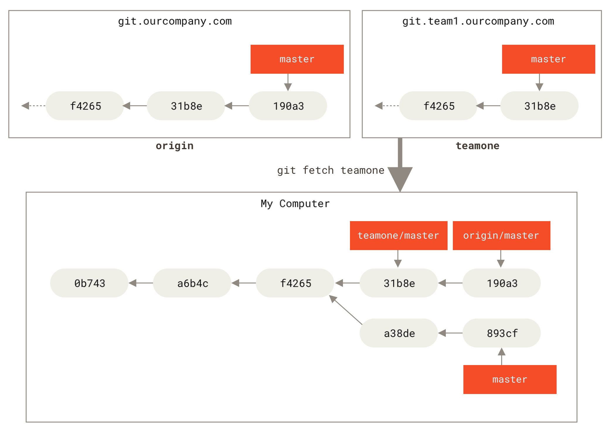
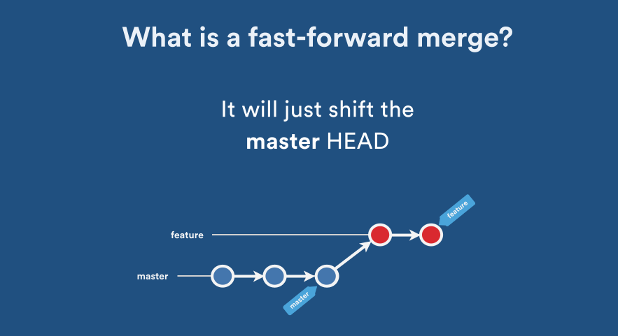
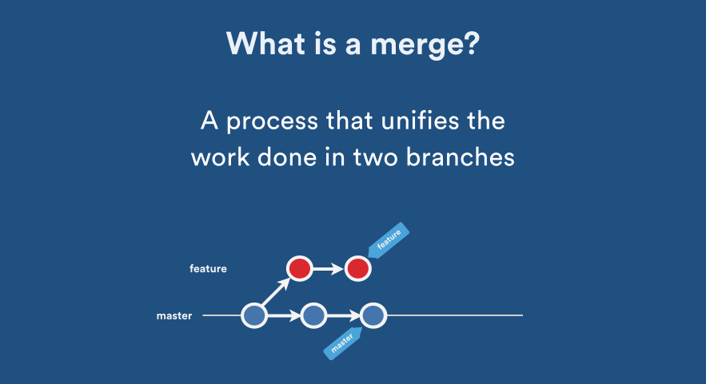
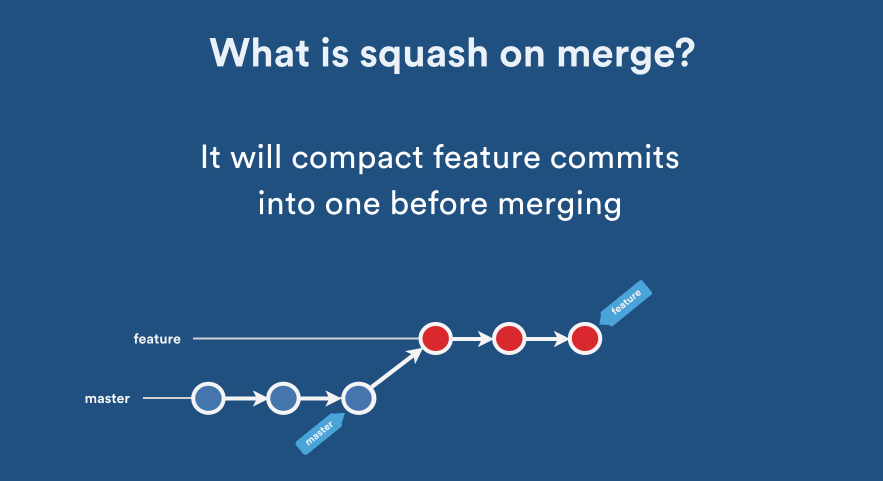
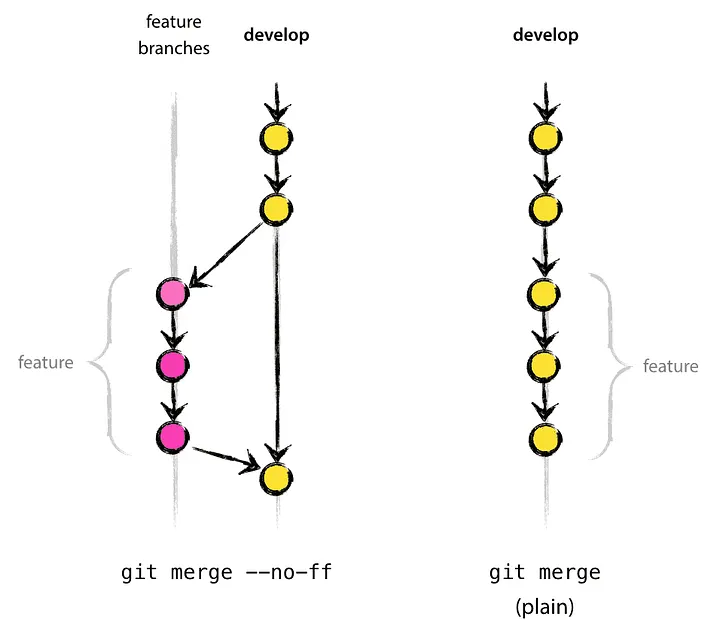
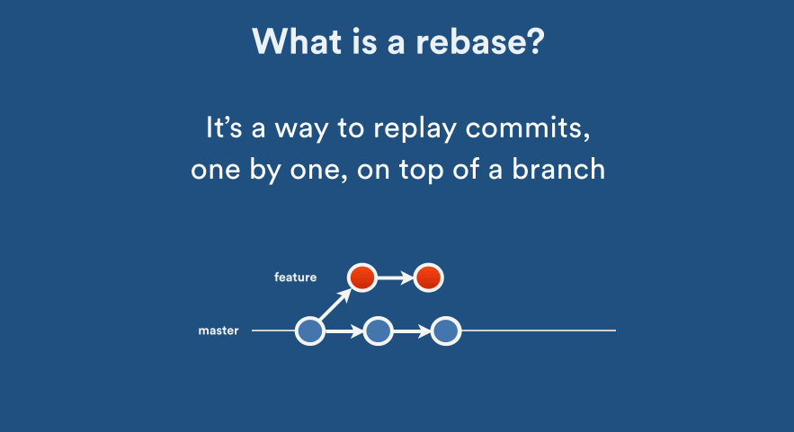
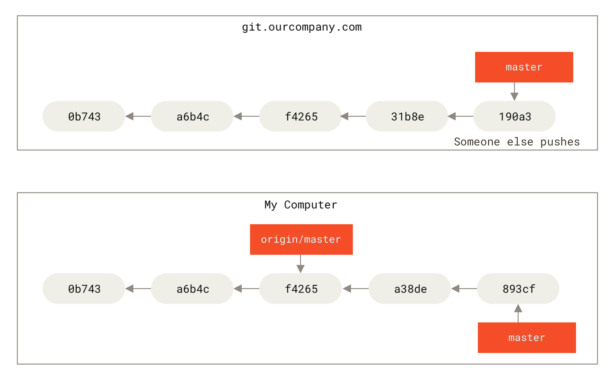

import Tooltip from "@site/src/components/Tooltip";

# انشعاب و ادغام (Branching & Merging)

<div style={{ textAlign: "center", width: "60%", marginInline: "auto" }}>
  <div style={{}}></div>
</div>

## مدل ذهنی گیت

قبل از شروع کار با دستورات، باید بدانیم گیت در پشت صحنه چگونه فکر می‌کند.

### اسنپ‌شات نه تغییرات
گیت برخلاف بسیاری از سیستم‌های قدیمی، تغییرات فایل‌ها را ذخیره نمی‌کند. بلکه در هر کامیت، یک **عکس کامل (Snapshot)** از کل پروژه می‌گیرد.

- اگر فایلی تغییر نکرده باشد، گیت نسخه جدیدی نمی‌سازد، بلکه به نسخه قبلی لینک می‌دهد.
- تاریخچه گیت یک گراف است که هر کامیت به کامیت پدر خود اشاره می‌کند.

## برنچ (Branch) چیست؟

بسیاری تصور می‌کنند برنچ یک کپی فیزیکی از پوشه پروژه است. اما در گیت:

یک <Tooltip tip="Branch"><span>برنچ</span></Tooltip> فقط یک <Tooltip tip="Pointer"><span>اشاره‌گر</span></Tooltip> متحرک و سبک (۴۱ بایت) به یک کامیت خاص است.

<div style={{ textAlign: "center", width: "60%", marginInline: "auto" }}>
  {/* <div style={{}}></div> */}
</div>

### چرا برنچ‌ها سبک هستند؟
چون گیت فایلی را کپی نمی‌کند، ساختن برنچ چه برای یک پروژه کوچک و چه برای لینوکس کرنل، **آنی (Instant)** انجام می‌شود.

### جعبه‌ابزار مدیریت برنچ‌ها

در گیت، دستورات مربوط به برنچ‌ها را می‌توان به چند دسته تقسیم کرد.

#### ۱. مدیریت برنچ‌ها (`git branch`)

| دستور | کاربرد |
| :--- | ---: |
| `git branch` | لیست کردن برنچ‌های محلی |
| `git branch -a` | لیست کردن تمام برنچ‌ها (محلی و ریموت) |
| `git branch <name>` | ساخت برنچ جدید (بدون سوییچ کردن به آن) |
| `git branch -m <old> <new>` | تغییر نام برنچ |
| `git branch -d <name>` | حذف برنچ (اگر ادغام شده باشد) |
| `git branch -D <name>` | حذف اجباری برنچ (حتی اگر ادغام نشده باشد) |

#### ۲. جابه‌جایی (`git switch` vs `git checkout`)

در نسخه‌های قدیمی گیت، دستور `checkout` هم برای جابه‌جایی بین برنچ‌ها و هم برای بازگردانی فایل‌ها استفاده می‌شد. برای رفع این ابهام، در نسخه‌های جدید (2.23+) دستور `switch` معرفی شد.

**جابه‌جایی ساده:**
```bash
git switch <branch-name>
# Or
git checkout <branch-name>
```

**ساخت و جابه‌جایی همزمان:**
```bash
git switch -c <new-branch>   # -c: create
# Or
git checkout -b <new-branch>
```

**بازگشت به برنچ قبلی:**
```bash
git switch -
```

#### ۳. بازگردانی فایل‌ها (`git restore`)
اگر می‌خواهید تغییرات یک فایل را دور بریزید (نه اینکه برنچ عوض کنید)، از `restore` استفاده کنید:

```bash
git restore <file-path>
# معادل قدیمی: git checkout -- <file-path>
```

### دیدن وضعیت برنچ‌ها (گراف)
یکی از مفیدترین دستورات برای درک وضعیت فعلی پروژه، دیدن تاریخچه به صورت گراف است:

```bash
git log --graph --oneline --all --decorate
```
این دستور یک نمای درختی از تمام برنچ‌ها و کامیت‌ها به شما می‌دهد.


### مفهوم HEAD

HEAD، پاسخ گیت به سوال "من الان کجا هستم؟" است.

* به طور معمول، HEAD به نام یک **Branch** اشاره می‌کند.
* آن Branch به یک **Commit** اشاره می‌کند.

:::warning
**وضعیت Detached HEAD:**
اگر مستقیماً به یک **هش کامیت** سوییچ کنید (`git checkout a1b2c3`)، وارد وضعیت "سرِ جدا شده" می‌شوید. در این حالت اگر کامیت کنید، تغییرات شما به هیچ برنچی وصل نیستند و ممکن است بعداً حذف شوند.
:::

## برنچ‌های ردیاب (Tracking Branches)

وقتی شما یک مخزن را `clone` می‌کنید، گیت به صورت خودکار یک برنچ محلی `main` می‌سازد که به برنچ `origin/main` در سرور متصل است. به این برنچ‌ها **Tracking Branch** می‌گویند.

<div style={{ textAlign: "center", width: "70%", marginInline: "auto" }}>
  
</div>

### مشاهده وضعیت برنچ‌ها
برای اینکه ببینید برنچ‌های شما نسبت به سرور در چه وضعیتی هستند (چقدر جلو یا عقب هستند)، از دستور زیر استفاده کنید:

```bash
git branch -vv
```

خروجی نمونه:
```text
  iss53     7e424c3 [origin/iss53: ahead 2] Add forgotten brackets
* main      1ae2a45 [origin/main] Deploy index fix
  serverfix f8674d9 [teamone/server-fix-good: ahead 3, behind 1] This should do it
```
* **ahead 2:** یعنی ۲ کامیت دارید که هنوز Push نکرده‌اید.
* **behind 1:** یعنی ۱ کامیت در سرور هست که هنوز Pull نکرده‌اید.

## ادغام (Merge)

وقتی کار توسعه در یک برنچ تمام شد، باید تغییرات را به برنچ اصلی (مثلاً main) برگردانیم.

### انواع روش‌های Merge

<div style={{ display: "flex", justifyContent: "center", gap: "20px", flexWrap: "wrap", marginBlock: "20px" }}>
  <div style={{ width: "45%", minWidth: "300px" }}>
    <div style={{ textAlign: "center", marginBottom: "10px" }}><strong>Fast-Forward (Implicit)</strong></div>
    
  </div>
  <div style={{ width: "45%", minWidth: "300px" }}>
    <div style={{ textAlign: "center", marginBottom: "10px" }}><strong>Merge Commit (Explicit)</strong></div>
    
  </div>
</div>

**1. Fast-Forward (Implicit Merge):**
اگر برنچ مقصد (مثلاً main) از زمان جدا شدن شما هیچ تغییری نکرده باشد، گیت فقط اشاره‌گر آن را جلو می‌آورد. در این حالت کامیت جدیدی ساخته نمی‌شود و تاریخچه کاملاً خطی می‌ماند.

**2. Merge Commit (Explicit / Three-Way):**
اگر هر دو برنچ تغییر کرده باشند، گیت یک **کامیت جدید** می‌سازد که حاصل ترکیب دو برنچ است. این کامیت دو والد (Parent) دارد و نشان‌دهنده نقطه اتصال دو شاخه است.

**3. Squash Merge:**
در این روش، تمام کامیت‌های برنچ فیچر در یک کامیت واحد فشرده (Squash) می‌شوند و سپس به برنچ اصلی اضافه می‌شوند. این کار باعث می‌شود تاریخچه برنچ اصلی بسیار تمیز بماند، اما جزئیات تغییرات فیچر از بین می‌رود.

<div style={{ textAlign: "center", width: "60%", marginInline: "auto" }}>
  
</div>

### دستور Merge

ابتدا باید به برنچ مقصد (جایی که می‌خواهید تغییرات وارد آن شود) بروید:

```bash
git checkout main
```

سپس دستور ادغام را بزنید:

```bash
git merge <FEATURE_BRANCH>
```

#### حفظ تاریخچه با `--no-ff`

گاهی اوقات حتی اگر امکان Fast-Forward وجود دارد، می‌خواهیم یک کامیت Merge صریح داشته باشیم تا مشخص شود که یک ویژگی (Feature) در اینجا اضافه شده است.

<div style={{ textAlign: "center", width: "60%", marginInline: "auto" }}>
  
</div>

```bash
git merge --no-ff <FEATURE_BRANCH>
```

این کار باعث می‌شود تاریخچه پروژه خواناتر شود و گروهی از کامیت‌ها که مربوط به یک ویژگی خاص هستند، با یک گره مشخص به بدنه اصلی متصل شوند.

## تضاد یا Conflict

تضاد زمانی رخ می‌دهد که گیت نتواند به صورت خودکار تغییرات را ترکیب کند. این اتفاق معمولاً وقتی می‌افتد که دو نفر **یک خط مشخص** از **یک فایل مشخص** را تغییر داده باشند.

:::tip
کانفلیکت یک خطا نیست؛ بلکه گیت از شما (انسان) درخواست می‌کند تا تصمیم بگیرید کدام کد درست است.
:::

### نمونه یک Conflict
وقتی فایلی دچار تضاد می‌شود، گیت محتوای آن را به شکل زیر تغییر می‌دهد:

```text
Here is some content that is not affected.
<<<<<<< main
This is the content in the main branch.
=======
This is the content in the feature branch.
>>>>>>> feature/login-page
```
شما باید تصمیم بگیرید کدام بخش (یا ترکیبی از هر دو) باقی بماند و خطوط `<<<<`، `====` و `>>>>` را پاک کنید.

### مراحل حل Conflict

1. دستور `git merge` با خطا مواجه می‌شود.
2. فایل‌های دارای تضاد را باز کنید (علائم `<<<<<<<` و `=======` را می‌بینید).
3. کد درست را انتخاب و علائم را پاک کنید.
4. فایل را ذخیره کنید.
5. فایل را به Staging ببرید و کامیت کنید:

```bash
git add .
git commit -m "Resolve conflict"
```

### انصراف از ادغام
اگر در میانه حل کانفلیکت پشیمان شدید یا گیج شدید، می‌توانید همه چیز را به حالت قبل برگردانید:

```bash
git merge --abort
```

## استراتژی Git Flow

در پروژه‌های تیمی، برای جلوگیری از هرج‌ومرج از مدل استاندارد Git Flow استفاده می‌شود. این مدل نقش هر برنچ و نحوه تعامل آن‌ها را مشخص می‌کند.

<div style={{ textAlign: "center", width: "80%", marginInline: "auto" }}>
  
</div>

### برنچ‌های اصلی (Main Branches)
این دو برنچ همیشه وجود دارند و حذف نمی‌شوند:

* **master (یا main):** نسخه نهایی و پایدار (Production). کد موجود در این برنچ همیشه آماده انتشار است.
* **develop:** نسخه در حال توسعه. تمام ویژگی‌های جدید و تغییرات برای انتشار بعدی اینجا جمع می‌شوند.

### برنچ‌های کمکی (Supporting Branches)
این برنچ‌ها عمر محدود دارند و پس از ادغام حذف می‌شوند:

* **Feature Branches:** برای هر قابلیت جدید یک برنچ از `develop` ساخته می‌شود و در نهایت به `develop` برمی‌گردد.
* **Release Branches:** وقتی `develop` برای انتشار آماده شد، یک برنچ ریلیز (مثلاً `release-1.2`) ساخته می‌شود. در اینجا فقط باگ‌فیکس‌های نهایی و تغییر ورژن انجام می‌شود و سپس به `master` و `develop` ادغام می‌شود.
* **Hotfix Branches:** برای باگ‌های فوری در نسخه Production. از `master` منشعب شده و سریعاً به `master` و `develop` برمی‌گردد.

### سناریوی عملی یک Feature

1. شروع کار از روی develop:

```bash
git checkout develop
git checkout -b feature/login-page
```

2. انجام تغییرات و کامیت.

3. بازگشت و ادغام (با `--no-ff` برای حفظ تاریخچه):

```bash
git checkout develop
git merge --no-ff feature/login-page
```

4. حذف برنچ فیچر و ارسال تغییرات:

```bash
git branch -d feature/login-page
git push origin develop
```

## بازنویسی تاریخچه (Rebase)

دستور <Tooltip tip="Rebase"><span>Rebase</span></Tooltip> جایگزینی برای Merge است که برای تمیز و خطی نگه داشتن تاریخچه استفاده می‌شود.

<div style={{ textAlign: "center", width: "70%", marginInline: "auto" }}>
  
</div>

```bash
git checkout feature
git rebase master
```

این دستور کامیت‌های شما را برمی‌دارد و در نوکِ برنچ main قرار می‌دهد، انگار که همین الان کار را شروع کرده‌اید.

:::danger
**قانون طلایی Rebase:**
هرگز روی برنچ‌های عمومی (Public) مثل `main` یا برنچی که همکارانتان روی آن کار می‌کنند، Rebase نکنید. این کار تاریخچه را تغییر می‌دهد و سیستم بقیه را خراب می‌کند.
:::

### تفاوت Merge و Rebase
* **Merge:** تاریخچه واقعی را حفظ می‌کند (چه زمانی شاخه جدا شد و کی ادغام شد). برای همکاری تیمی امن‌تر است.
* **Rebase:** تاریخچه را بازنویسی می‌کند تا خطی و تمیز شود. برای تمیز کردن کامیت‌های محلی قبل از ادغام عالی است.

### دستورات پیشرفته Rebase

#### 1. Interactive Rebase (`-i`)
یکی از قدرتمندترین قابلیت‌های گیت، Rebase تعاملی است که اجازه می‌دهد کامیت‌ها را ویرایش، حذف، ادغام (Squash) یا جابجا کنید.

```bash
git rebase -i HEAD~3
```
(این دستور ۳ کامیت آخر را برای ویرایش باز می‌کند)

در ادیتوری که باز می‌شود، می‌توانید کلمات اول خطوط را تغییر دهید:
* **pick:** کامیت را نگه دار (پیش‌فرض).
* **reword:** پیام کامیت را تغییر بده.
* **squash:** این کامیت را با کامیت قبلی ادغام کن (برای تمیز کردن تاریخچه).
* **drop:** این کامیت را حذف کن.

#### 2. Rebase Onto
اگر بخواهید یک برنچ را از یک پایه به پایه دیگر منتقل کنید (مثلاً فیچر شما از `develop` جدا شده ولی حالا می‌خواهید آن را روی `main` سوار کنید)، از `--onto` استفاده می‌کنیم:

```bash
git rebase --onto main develop feature
```

## چالش‌های تغییر تاریخچه (Diverged History)

وقتی از `rebase` استفاده می‌کنید، در واقع دارید تاریخچه را **بازنویسی** می‌کنید. این یعنی شناسه (Hash) کامیت‌ها تغییر می‌کند.

<div style={{ textAlign: "center", width: "70%", marginInline: "auto" }}>
  
</div>

### چرا Push خطا می‌دهد؟
اگر شما تاریخچه را تغییر دهید (مثلاً با Rebase) و بخواهید روی سرور Push کنید، گیت خطا می‌دهد چون تاریخچه محلی شما با تاریخچه سرور همخوانی ندارد (Diverged).

```text
 ! [rejected]        main -> main (non-fast-forward)
error: failed to push some refs to '...'
hint: Updates were rejected because the tip of your current branch is behind
hint: its remote counterpart.
```

### چرا `git push --force` خطرناک است؟
برای حل مشکل بالا، ممکن است وسوسه شوید از `--force` استفاده کنید:
```bash
git push --force
```
این دستور تاریخچه سرور را **پاک می‌کند** و تاریخچه شما را جایگزین آن می‌کند. اگر همکاران شما روی آن برنچ کدهایی زده باشند که شما ندارید، **کد آن‌ها برای همیشه پاک می‌شود!**

:::danger
**قانون طلایی:**
تنها زمانی `push --force` بزنید که:
1. روی برنچ شخصی خودتان هستید.
2. مطمئنید کس دیگری روی آن کار نمی‌کند.
:::

:::warning
**راه حل امن‌تر: Force with Lease**
یک جایگزین امن‌تر برای فورس پوش، استفاده از `--force-with-lease` است. این دستور چک می‌کند که آیا کسی در این فاصله کدی به سرور زده است یا نه. اگر زده باشد، پوش را متوقف می‌کند.

```bash
git push --force-with-lease
```
**توجه:** حتی با این دستور هم باید بسیار محتاط باشید، زیرا همچنان تاریخچه را بازنویسی می‌کند و راه برگشتی برای تغییرات قبلی روی سرور باقی نمی‌گذارد.
:::
